# 用大台库赢得你的同事

> 原文：<https://towardsdatascience.com/win-your-colleagues-over-with-applications-in-dataiku-8-0-19ddd9d9754f?source=collection_archive---------32----------------------->

## 使用 DSS 8.0 Apps-as-recipe 为整个企业创造价值。

由 [Unsplash](https://unsplash.com?utm_source=medium&utm_medium=referral) 上的 [krakenimages](https://unsplash.com/@krakenimages?utm_source=medium&utm_medium=referral) 拍摄的照片

对于希望保持精干并完成大量工作数据科学家和分析师团队来说，Dataiku 是一个非常棒的工具。对于像我这样的数据科学家来说，它允许我花更多的时间做我喜欢的事情，并更快地为企业创造价值。轻松访问数据、轻松实现项目自动化、轻松进行质量保证监控、快速开发……一个梦想。本文并不是对该工具的介绍，但是如果您认为值得一读，我鼓励您留下评论。现在，让我们提醒大家，它是一个数据科学平台，在*项目*中组织工作，其管道被称为*流*，用户可以通过 GUI 和通过 DSS api 以编程方式获得。你可以在下面看到一个流程，由称为*配方*(圆形)的计算片段和称为*数据集*(方形)的数据片段组成，所有这些都组织在区域中。

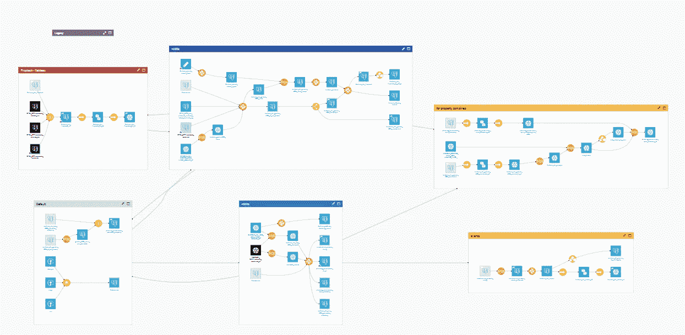

项目的典型流程，由作者提供的图像

尽管有上述所有的赞扬和管道的易读性，使用该产品的挫折感会随着时间的推移而增长。您的工作的影响经常受到向其他人提供工作的困难的限制，特别是那些无法访问平台的人，如客户、C-level 等……对于那些可以访问平台的人，即您的数据科学家和分析师同事，有太多的项目内部工作暴露在流程中，有太多的细节需要导航。 决定需要运行什么来得到想要的东西，等等。对他们来说，大部分时间这样的麻烦是不值得的，否则他们将结束一个项目纠缠的节日。 我们离使用数据和模型的简单干净的体验还很远。甚至不要让我开始讨论**关注点分离**设计原则。如果你的公司希望让这个平台在规模上可行，它将需要放置相当数量的“最佳实践”文档。

我必须赞扬他们站在这些问题的前列，但仍有许多地方需要改进。解决这个问题的能力之一是标签。你可能同意一套标签，如果你的同事和你自己坚持使用它们，你可以很快看到流程中什么是什么，什么是要消费的。我坚持把 **if** 的成分放在那里。提供的另一个功能是他们所谓的插件。插件可以让你打包一个项目，并让它作为*秘方*在平台范围内可用。不幸的是，当设计和可用性已经足够让你担心的时候，这仍然需要在插件工程上的扩展投资。这意味着你必须为它写规格，把它交给一个工程师，测试他们的解决方案，然后与他们协调来修复/更新它。就生产率而言不理想。

> 插件是有用的，但是部署起来昂贵/耗时。进入 Dataiku 8.0 和“应用程序设计器”。问题解决了。

有了这个新功能，您可以构建一个管道，添加一个自动化场景，只需点击几下鼠标，就可以让每个人都可以使用它。真是个梦！如果它有吸引力，你可以把它交给一个工程师，他会有简单的解决方案把它变成一个真正的插件！不幸的是，就像 Dataiku 经常出现的情况一样，文档非常糟糕，无法帮助您超越最基本的用法。在这篇文章的剩余部分，我将尝试提供一些内容来加速你对作为菜谱的*应用程序的学习。*

# 允许用户定义的参数

您构建了一个食谱应用程序，该应用程序拍摄上个月穿着 ShoeDirect 的下半部分顾客的照片，并生成一个细分市场、每个细分市场的推荐列表以及他们的潜在 LTV，商店的销售人员将在本月使用该应用程序。这真是太棒了。这里来了一大群快乐的顾客和提高的底线。但是从你的成功来看，经理们现在要求你根据销售人员的销售风格使推荐人的输出有所不同。您需要在应用程序中制作一个下拉菜单，让用户选择销售风格。

> 你求助于文档/教程或论坛，但是你运气不好:它没有被提及。你只能猜测。

我将向你介绍我对这个问题的了解。

## 第一步//设计你的流程

这些是基本的。拿一张纸，记下应用程序需要的所有数据输入和它将产生的输出。然后记下用户需要定义的参数。使这些项目变量(不是必需的，但很有用)。

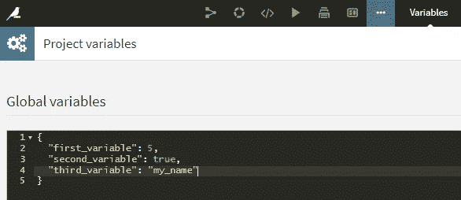

将您的应用程序变量定义为项目变量，图片由作者提供

在运行时，它们将被更改为用户定义的值。

## 第二步//建立你的流程

为所有输入和输出创建虚拟数据集，并填充它们之间的内容，就像您对任何项目所做的那样。

## 第三步//制作一个场景

然后，recipe 将在选择的输入上运行给定的场景，因此您需要准确定义您希望您的应用程序做什么，就像您在生产项目中定义场景一样。

## 步骤 4 //创建您的应用程序

现在是发光的时候了。进入应用程序设计器，选择应用程序作为配方，进入设置菜单。

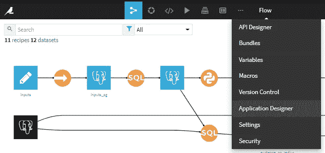

作者图片

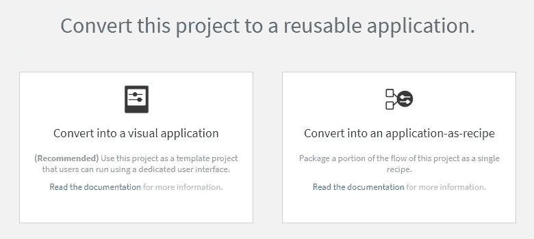

作者图片

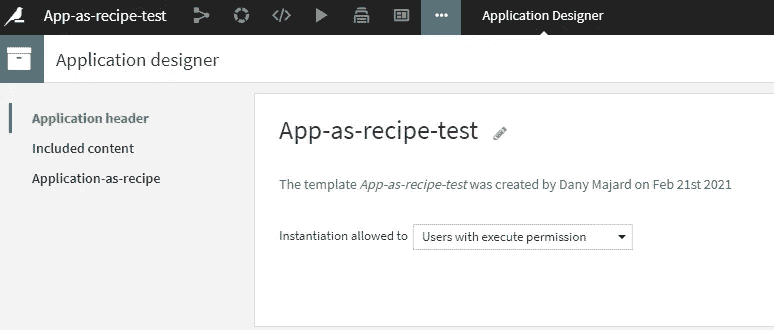

作者图片

你的申请正在路上。在运行时，它不会在这个项目中运行，但是项目的流程将被打包，同时打包的还有您需要的元素的副本以及在使用配方时要运行的场景。由于复制元素需要时间和磁盘空间，您需要指定运行应用程序绝对需要的内容，其余的内容会随着应用程序的运行而构建。这是在“包含的内容”一节中完成的，但是文档会让你对它真正的含义/作用感到枯燥。为了安全起见，我包括了“输入数据集”,尽管我认为在大多数情况下这是不必要的。

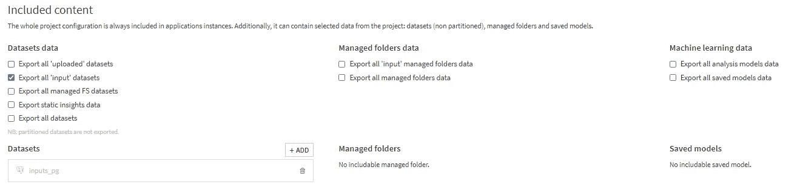

包含的内容选项，按作者分类的图像

## 步骤 5 //从 GUI 中检索变量

您的应用程序有一个默认的 GUI 设置，它由以下部分组成:

*   文本框
*   整数选择器
*   下拉菜单

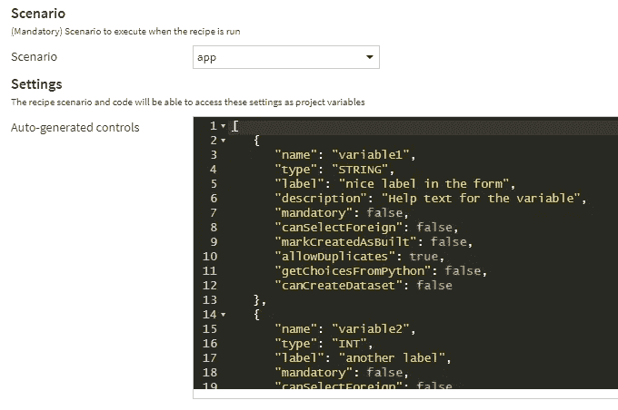

默认设置，图片由作者提供

此处给出了可用字段的完整列表[。如果您熟悉 JSON，那么您可以非常愉快地创建您的接口，并开始完成。但是，您可能会像我一样，花费数小时或数天时间，寻找从 UI 中获取这些变量的方法，以便在原始流中使用。你挖掘得越多，你就会越困惑。给插件的解决方案不起作用，在这个主题上没有任何线索，有很多地方你可以尝试一些 python 魔法来检索它们，但都不起作用。](https://doc.dataiku.com/dss/latest/plugins/reference/custom-fields.html)

> 这是大台库经常失败的地方。它把你带到了伟大的边缘，却把你抛弃在那里，更加困惑，被赋予了更差的文档和更差的 API 选择。

我很高兴地告诉你，解决方案非常简单，不需要任何工作。这些变量被自动添加到应用程序实例流的定制变量中，其名称对应于定义其 UI 元素的 JSON 的“name”字段。如果我们要重命名这些*第一变量*、*第二变量*和*第三变量*，我们在步骤 1 中设置的值将被简单地覆盖。因此，它们可以在任何地方使用，使用通常的 *${}* 或*data iku . get _ custom _ variables(typed = True)*方法，如这里的*所示。*

由 [Unsplash](https://unsplash.com?utm_source=medium&utm_medium=referral) 上的[窗口](https://unsplash.com/@windows?utm_source=medium&utm_medium=referral)拍摄

# 让它发挥作用需要知道的事情

是时候缓和你的激动情绪了。作为食谱的应用程序仍然有很多陷阱。我将回顾一下到目前为止我遇到的问题。

## 失败将没有有用的错误日志。

相反，用户将获得:

> *java.lang.Exception:场景失败*

仅此而已。在 Dataiku UI 中，没有简单的方法来诊断问题出在哪里。既不在使用该应用程序的项目中，也不在其源项目中。在应用程序实例运行并失败后，它会连同相应的日志一起被删除，至少就平台内使用而言是这样(我不知道 DSS 的管理员是否能以某种方式检索它们)。

解决方法是让用户在*保持实例*复选框打开的情况下重新运行配方。这将防止实例被删除，并且您将能够在那里进行您想要的所有故障排除。

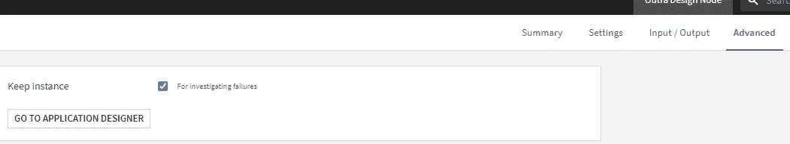

作者图片

但是要小心！不取消选中此框可能会导致大量“单一用途”项目和数据集在您的 Dataiku 框和基础架构中累积。这些实例可以在一个特殊的文件夹中找到，也可以使用 Dataiku 自动赋予它们的特殊标签找到。

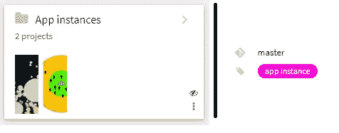

按作者查找实例、图像的方法

调试后删除这些项目时必须小心。默认情况下，确保从数据库/存储中删除该项目中使用的所有数据的复选框是未选中的。这意味着，如果您的管理员没有建立定期运行的适当清理流程，您将会在这些数据库/存储中填充 ghost 数据。

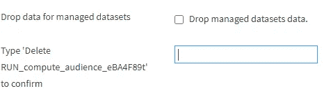

检查那个盒子！，作者图片

确保每次**都检查它**。

## 不允许版本控制

当您“部署”了一个应用程序时，您对其设置所做的任何更改都会影响到使用它的所有位置。用户没有选择，看不到更新，也无法跟踪您做出更改之前的情况。这当然是应用程序内部工作所需要的，但也适用于菜谱的字段、输入和输出！这可能会导致一些不好的意外。

## **权限处理不当**

对于运行你的应用程序的人来说，他们需要被授予对定义它的项目的写访问权限。这意味着没有办法保护它不被用户篡改。这是非常糟糕的设计，需要行为良好的用户，随着公司的发展，这成了一个负担。这又会导致一些不好的意外。

## SQL 依赖项

当使用 SQL 配方而不是可视化配方时，请确保使用链接到输入表的变量，而不是数据库中的表名。出于某种奇怪的原因，食谱不会因为原始数据集没有被设置为实例食谱的输入而失败，而是在应用程序的源项目的表上运行。

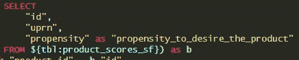

变量示例，按作者分类的图像

此外，如果在输入表上使用，替换实例中的输入表将会导致此操作失败。在使用自定义 SQL 之前，您必须将其与副本同步。python 食谱也是如此。

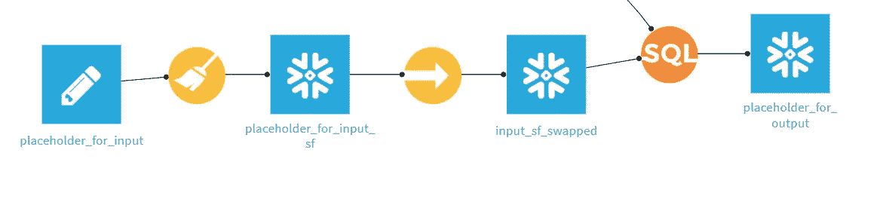

作者图片

## 等待未来

遵循 Dataiku 的设计理念，数据的来源将尽可能与用户无关，i/o 问题尽可能在技术上由平台静默管理。虽然在大多数情况下，它确实为用户提供了很好的体验，但在这里它也会带来挫败感。让我解释一下。

当在应用程序设计中选择数据集作为输入或返回输出数据集时，将复制数据。根据数据库/存储类型之间的关系，这种复制可能需要一段时间(我们公司的原生 Postgres snowflake 需要几个小时)。在此期间，用户只能看到以下消息:

> [INFO] [dku.flow.app] —再等一会儿，以便将来完成实例化

这又是一个无用的日志/消息。

## 输入/输出混乱

对于每个输入/输出表，用户可以定义无限多个表。我不确定 Dataiku 是如何处理的，但是应该允许每个输入/输出只有一个表，就像可视化菜谱中所做的那样。

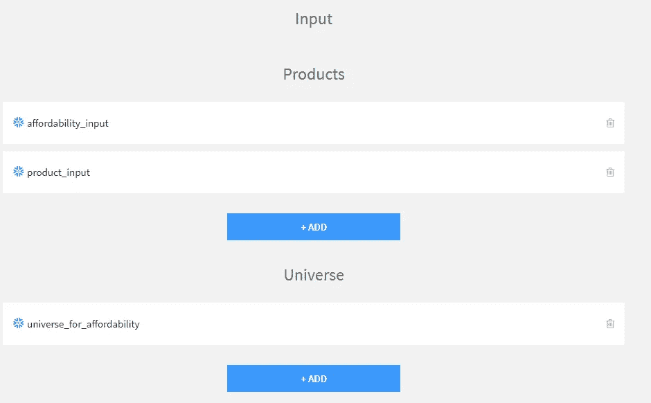

应该只有一个数据集替换产品输入，按作者排序的图像

此外，据我所知，如果输入不匹配或者至少包含所需的模式，也没有办法确保用户不能运行菜谱。这将非常有助于防止进一步令人沮丧的失败。

# 结论

有了上面提供的细节，我希望你能在让数据为你的企业中更多的人服务方面取得长足的进步，并满足你同事的需求。我们都知道，从数据驱动型企业到数据能力型企业还有很长的路要走，而像这样的工具在这条路上至关重要。

如果你相信自助式数据解决方案的力量，并且相信好的设计将对 ML 和数据改善世界大有帮助，我期待你的评论！