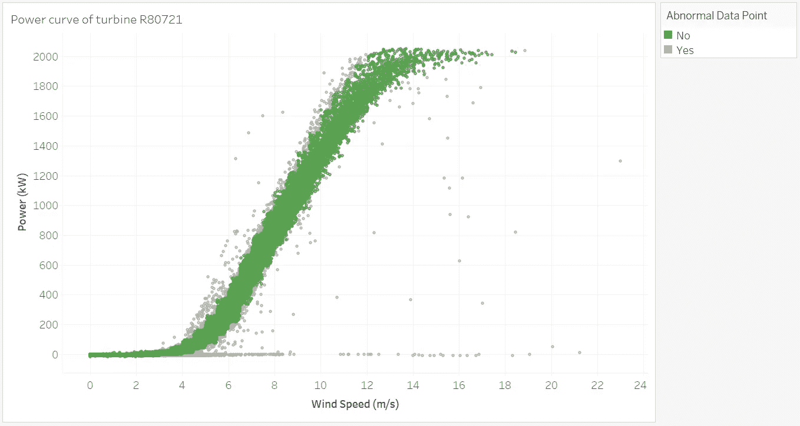

# 风能分析工具箱:迭代功率曲线滤波器

> 原文：<https://towardsdatascience.com/wind-energy-analytics-toolbox-iterative-power-curve-filter-fec258fdb997?source=collection_archive---------25----------------------->

## [行业笔记](https://towardsdatascience.com/tagged/notes-from-industry)

## 一个开源模块，用于过滤运行风力涡轮机的 SCADA 数据。


由[托马斯·雷波](https://unsplash.com/@thomasreaubourg?utm_source=medium&utm_medium=referral)在 [Unsplash](https://unsplash.com?utm_source=medium&utm_medium=referral) 上拍摄的照片

## 介绍

在本文中，我将介绍为分析运行中的风力涡轮机的数据而开发的一系列模块中的第一个——迭代功率曲线滤波器。

理论上，风力涡轮机的功率输出(WT)与风速的立方成正比。这种关系的曲线被称为功率曲线，这可能是风能分析中最重要的曲线。

原始设备制造商(OEM)提供理论功率曲线，该曲线将输入风速映射到给定理想条件下的输出功率。然而，这种关系在运行的涡轮机中很少出现，原因有很多，例如风电场地形、风速计的位置、效率问题以及由于与其他涡轮机的接近而产生的尾流效应。

因此，理解运行涡轮机的风速和功率之间的实际关系是令人感兴趣的，这被正确地命名为运行功率曲线，它可以与理论功率曲线完全不同。

运行功率曲线给出了在正常运行条件下给定涡轮机的风速和功率输出之间的关系。正常运行条件通常被定义为无停机、无故障和无事件数据点。

运行功率曲线是通过清理数百个传感器从风力发电机收集的时间序列数据创建的。记录数据的典型频率是 0.0017s^-1，即每 10 分钟一次。

WT 传感器通过阈值编程，在检测到异常运行条件时发出警报。这就是所谓的监控和数据采集(SCADA)系统。

然而，基于触发的警报简单地过滤 SCADA 数据通常不足以获得对应于正常操作条件的数据点。因此，需要进行统计过滤。

SCADA 数据过滤是许多风能分析项目的基本组成部分，包括涡轮机性能不佳分析、机组并排比较、异常检测以及使用机器学习技术的数据驱动自动化过程。

因此，开发用于预处理 SCADA 数据的现成模块将使工程师和分析师受益，显著减少通常用于数据清理的时间和精力，同时降低行业内利用高级分析的准入门槛。

## 过滤程序


功率曲线滤波程序

如果每个机组都有一个唯一的标识符，迭代功率曲线滤波器可以处理跨几个风电场的多个涡轮机。该程序包括以下两个主要步骤:

*初级过滤*

*   停机时间数据点被删除。
*   排除了可能的故障。这一步是经验性的，目的是去除中到高风速下不合理的生产数据。

*二次过滤*

*   计算来自初级过滤过程的部分过滤的功率曲线的统计参数(平均值和标准偏差)。
*   排除用户指定的+/- x 标准之外的数据点。
*   在用户选择的几个周期内重复上述两个步骤。

Abdul Mouez Khatab 的硕士论文“运行风力涡轮机的[性能分析”于 2017 年描述了相关程序。](http://www.diva-portal.org/smash/get/diva2:1150284/FULLTEXT01.pdf)

## 模块使用

托管在 [PyPi](https://pypi.org/project/scada-data-analysis/) 上的 scada 数据分析库包含过滤模块，代码实现的细节可以在 [GitHub](https://github.com/abbey2017/wind-energy-analytics) 上找到。可以通过简单的 pip 命令安装该库，如下所示。

```
# Pip install library
pip install scada-data-analysis
```

此外，GitHub repo 项目可以克隆如下:

```
# Clone github repo
git clone https://github.com/abbey2017/wind-energy-analytics.git
```

使用该库，您可以通过如下所示的 4 个步骤过滤杂乱的 SCADA 数据:

```
# Import relevant libraries
import pandas as pdfrom scada_data_analysis.modules.power_curve_preprocessing import PowerCurveFiltering

# Load turbine scada data
df = pd.read_csv('path\to\data')

# Instantiate power curve filtering class
pc_filter = PowerCurveFiltering(turbine_label='Wind_turbine_name',                                            windspeed_label='Ws_avg', power_label='P_avg', data=df, cut_in_speed=3, bin_interval=0.5, z_coeff=2.5, filter_cycle=5, return_fig=True, image_path='..\images')

# Process raw scada data
normal_df, abnormal_df = pc_filter.process()
```

## 结果

这个项目的 GitHub repo 有关于功率曲线滤波器的示例数据集和 Jupyter 实验室笔记本用法。此处显示的样本结果基于由 [Engie](https://www.engie.com/en/activities/renewable-energies/wind-energy) 运营的法国 La Haute Borne 风电场的公开 SCADA 数据。



## 对未来的展望

来自功率曲线滤波模块的结果可用作训练机器学习模型的基础事实，该模型可用于对 WT 性能或其他先进控制技术的近实时监控。

旨在使工程师和分析师能够利用高级分析的新模块将被添加到风能分析工具箱中。一些当前的想法包括用于生成模型的模块，该模型可以基于历史 SCADA 数据、故障设备检测和性能不佳分类模块来估计/预测来自 WTs 的预期功率。

我想听听你对这篇文章和风能分析工具包的反馈。欢迎模块建议，包括可能的应用。请给 windenergyanalytics@gmail.com 的项目维护者发邮件，或者在项目的 [GitHub 页面](https://github.com/abbey2017/wind-energy-analytics/issues)上提出问题。

什么更有趣？你可以通过我下面的推荐链接订阅 Medium 来获得更多我和其他作者的启发性文章，这也支持我的写作。

<https://aolaoye.medium.com/membership> 