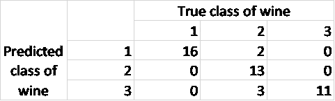
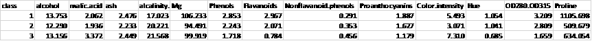
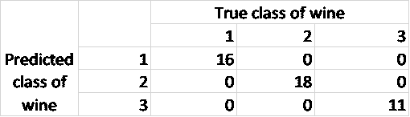
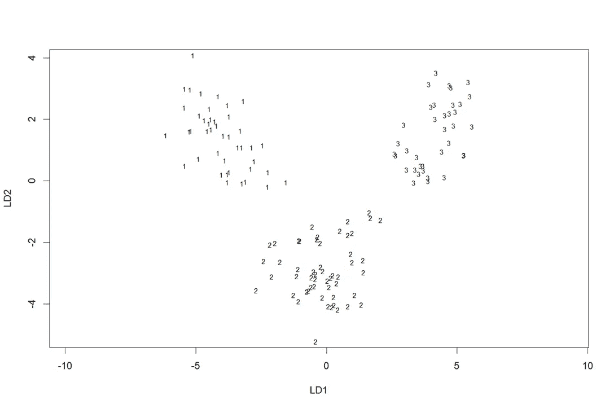
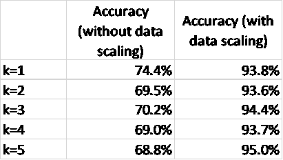
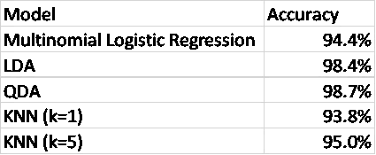
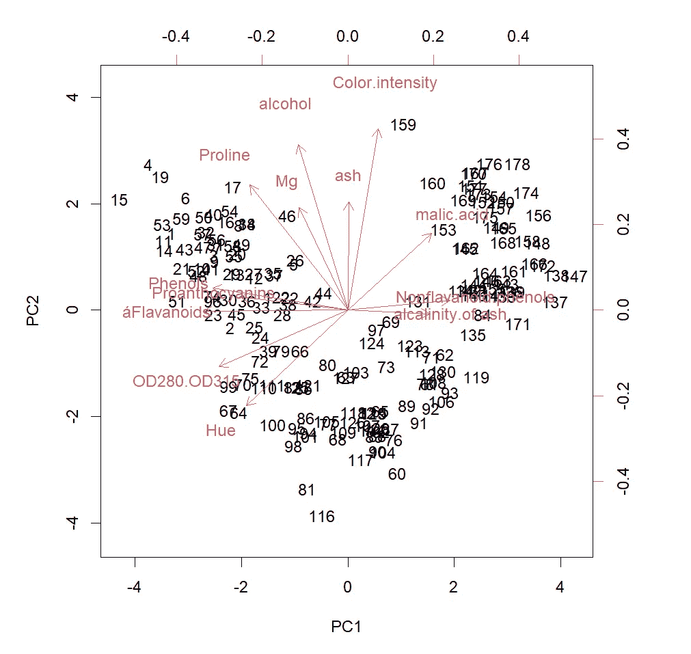
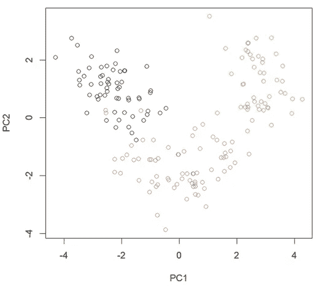
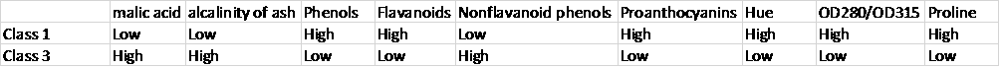
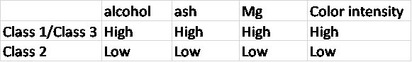

# 葡萄酒数据集:一个分类问题

> 原文：<https://towardsdatascience.com/wine-data-set-a-classification-problem-983efb3676c9?source=collection_archive---------12----------------------->

# 介绍

葡萄酒数据集由 13 个不同的葡萄酒参数组成，如酒精和灰分含量，共测量了 178 个葡萄酒样品。这些葡萄酒生长在意大利的同一地区，但来自三个不同的栽培品种；因此有三种不同等级的酒。这里的目标是找到一个模型，该模型可以在给定 13 个测量参数的情况下预测葡萄酒的类别，并找出三个不同类别之间的主要差异。这是一个分类问题，这里我将描述四个模型，并评估每个模型的准确性。此外，我将使用主成分分析来确定和探索这三类之间的差异。

**多项逻辑回归**

由于葡萄酒有三个类别，我们必须使用多项式逻辑回归，而不是有两个类别时使用的逻辑回归。为了做到这一点，我使用了 ***nnet*** 包中的 ***multinom*** 函数。

```
> dim(wine)[1] 178 14> attach(wine)> test=sample(178,45)> library(nnet)> LogReg=multinom(class~.,data=wine[-test,])> summary(LogReg)> Pre=predict(LogReg,wine[test,])> table(Pre,wine[test,]$class)
```



表 1。多项式逻辑回归模型的混淆矩阵

从表 1 可以看出，在 45 次观察中有 5 次分类错误；因此，多项式逻辑回归模型的准确率为 89%。

通过执行以下命令，我们可以多次重复上述过程，以获得对多项逻辑回归模型性能的更准确估计:

```
> Accuracy=rep(0,50)> for (i in 1:50) {+ test=sample(178,45)+ LogReg=multinom(class~.,data=wine[-test,])+ Pre=predict(LogReg,wine[test,])+ Accuracy[i]=mean(Pre==wine[test,]$class)+ }> sum(Accuracy)/50[1] 0.944
```

**线性判别分析**

当我们有两个以上的类，并且当观察数量很小时，LDA 是有用的。当预测值的分布在每一类中都是正态分布时，LDA 也更稳定。

```
> library(MASS)> lda.fit=lda(class~.,data=wine[-test,])> lda.fit
```

最后一个命令将生成关于模型的更多细节，如表 2 所示。



表二。各类葡萄酒的 13 个预测指标的平均值

然后，我们根据测试数据评估模型的性能:

```
> lda.pred=predict(lda.fit,wine[test,])> table(lda.pred$class,wine[test,]$class)
```



表 3。LDA 模型的混淆矩阵

从表 3 中我们可以看出，LDA 在预测测试数据类别方面具有 100%的准确性。

我们还可以使用下面的命令通过 LDA 可视化训练数据的分类，结果如图 1 所示:

```
> plot(lda.fit)
```



图一。通过 LDA 对训练数据进行分类(图片由作者提供)

由于数据集中有三个类，所以只需要两个线性判别式来对每个观察值进行分类。图 1 显示了 LD1 和 LD2 空间上的训练数据的图以及每个数据点的相应类别。基于 LDA 模型的系数计算 LD1 和 LD2 值。

通过执行以下命令，我们可以多次重复上述过程，以获得对 LDA 模型性能的更准确估计:

```
> for (i in 1:50) {+ test=sample(178,45)+ lda.fit=lda(class~.,data=wine[-test,])+ lda.pred=predict(lda.fit,wine[test,])+ Accuracy[i]=mean(lda.pred$class==wine[test,]$class)+ }> sum(Accuracy)/50[1] 0.9844444
```

**二次判别分析(QDA)**

另一个分类器是 QDA 模型，其语法与 r 中的 LDA 相似。我们可以多次运行该过程，以获得对 QDA 模型性能的更准确估计，如下所示:

```
> qda.fit=qda(class~.,data=wine[-test,])> qda.pred=predict(qda.fit,wine[test,])> table(qda.pred$class,wine[test,]$class)> for (i in 1:50) {+ test=sample(178,45)+ qda.fit=qda(class~.,data=wine[-test,])+ qda.pred=predict(qda.fit,wine[test,])+ Accuracy[i]=mean(qda.pred$class==wine[test,]$class)+ }> sum(Accuracy)/50[1] 0.9866667
```

**K-最近邻(KNN)**

KNN 是一种非参数方法，其中基于其 K-最近邻的类别对观测值进行分类。当决策边界是非线性时，这是一个有用的模型，但它不会告诉我们哪些预测是重要的。

```
> library(class)> knn.pred=knn(wine[-test,2:14],wine[test,2:14],wine[-test,]$class,k=1)> table(knn.pred,wine[test,]$class)> mean(knn.pred==wine[test,]$class)[1] 0.7777778
```

通过执行以下命令，我们可以多次重复上述过程，以获得对 KNN 模型性能的更准确估计:

```
> for (i in 1:50){+ test=sample(178,45)+ knn.pred=knn(wine[-test,2:14],wine[test,2:14],wine[-test,]$class,k=1)+ Accuracy[i]=mean(knn.pred==wine[test,]$class)+ }> sum(Accuracy)/50[1] 0.7435556
```

我们可以对 k=2 到 5 重复相同的过程，结果显示在表 4 的中间栏中。

从表 4 的中间一栏我们可以看出，KNN 模型的结果并不令人印象深刻。这是因为 KNN 模型使用欧几里德距离来测量两点之间的距离，如果要素具有不同的比例，它会影响模型。由于 13 个要素中的每一个都具有不同的比例，因此对数据进行归一化处理以使所有要素都具有相同的值范围非常重要。我们可以在缩放数据后重新运行 KNN 模型，如下所示:

```
> for (i in 1:50){+ test=sample(178,45)+ knn.pred=knn(scale(wine[-test,2:14]),scale(wine[test,2:14]),wine[-test,]$class,k=1)+ Accuracy[i]=mean(knn.pred==wine[test,]$class)+ }> sum(Accuracy)/50[1] 0.9382222
```

表 4 总结了 KNN 模型的结果，我们可以看到缩放数据极大地提高了模型的性能。



表 4。有无数据缩放的 KNN 模型的准确性

## **总结**

表 5 总结了不同分类模型对葡萄酒数据集的准确性。LDA 和 QDA 的精确度最高，其次是 KNN (k=5)模型。



表 5。不同分类模型的准确性

**主成分分析**

上面描述的模型可以基于 13 个测量的预测值来预测葡萄酒的类别。然而，我们也有兴趣知道这三个类别之间的主要区别是什么，以及什么预测是重要的。为了做到这一点，我们可以执行主成分分析，这是一个探索性数据分析的有用工具。

```
> pr.out=prcomp(wine[,-1],scale=TRUE)> pr.out$rotation> biplot(pr.out,scale=0)> plot(pr.out$x[,1:2],col=wine$class)
```

前两个 PC 分数和相应的加载向量如图 2 所示。



图二。葡萄酒数据集在前两台电脑上的投影。每个箭头表示顶部和右侧轴上的前两个 PCs 的加载向量。图上的每个数字代表该特定数据点的 PC1 和 PC2 得分(图片由作者提供)



图 3。葡萄酒数据集的前两个 PC 分数。黑色代表 1 级，红色代表 2 级，绿色代表 3 级酒。(图片由作者提供)

图 2 和图 3 显示数据点被分成三个不同的组，对应于三种葡萄酒。1 班和 3 班的 PC2 分数相对相同，但 PC1 分数相差很大。另一方面，类 2 具有介于类 1 和类 3 之间的 PC1 分数，并且其 PC2 分数低于其他两个类。我们可以通过查看 PC 负载向量(图 2 中的箭头)来进一步检查每个类之间的差异。例如,“火山灰碱性”的方向是朝向 PC1 和 3 类数据点的高值。因此，我们可以预计，等级 3 具有较高的“灰分碱度”值，其次是等级 2 和等级 1。我们可以对其他 13 个预测因子进行类似的研究。这种调查的结果总结在表 6 和表 7 中，表 6 和表 7 显示了三种葡萄酒之间的主要差异。这些发现与表 2 所示的 LDA 结果一致。



表 6。总结了 1 级和 3 级葡萄酒的主要区别。对于上述参数，等级 2 的值介于等级 1 和等级 3 之间。



表 7。2 级和 1/3 级葡萄酒的主要区别

# **结论**

使用四种分类方法来评估每个模型在预测葡萄酒类别中的准确性。QDA 和 LDA 的精确度最高，其次是 KNN 和多项逻辑回归。在应用 KNN 模型进行准确分类之前，对数据进行归一化是非常重要的。主成分分析用于识别三类葡萄酒之间的主要差异。

# **消息来源**

[UCI 机器学习知识库:葡萄酒数据集](http://archive.ics.uci.edu/ml/datasets/Wine)。[知识共享署名 4.0 国际](https://creativecommons.org/licenses/by/4.0/legalcode) (CC BY 4.0)许可”。

[统计学习导论(statlearning.com)](https://www.statlearning.com/)