# 赢得 Kaggle 谷歌大脑——呼吸机压力预测

> 原文：<https://towardsdatascience.com/winning-the-kaggle-google-brain-ventilator-pressure-prediction-2d4c90d831ec?source=collection_archive---------4----------------------->

## [实践教程](https://towardsdatascience.com/tagged/hands-on-tutorials)

## 在 LSTMs、变压器和 PID 控制器上…

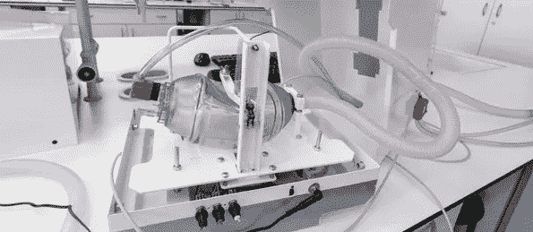

一个人工机械肺([来自维基媒体](https://commons.wikimedia.org/wiki/File:Q-vent.jpg)

11 月 4 日，在 Kaggle 上组织的谷歌大脑——呼吸机压力预测中，我们成功地从 2650 个团队中脱颖而出。在这篇博文中，我想带你经历一次让我们赢得胜利的旅程。在 [Kaggle 论坛](https://www.kaggle.com/c/ventilator-pressure-prediction/discussion/285256)上可以找到这篇文章的更概括的版本，我们已经公布了我们的 [LSTM + CNN 变压器模型](https://www.kaggle.com/shujun717/1-solution-lstm-cnn-transformer-1-fold)和 [PID 匹配](https://www.kaggle.com/group16/1-solution-pid-controller-matching-v1)的代码。

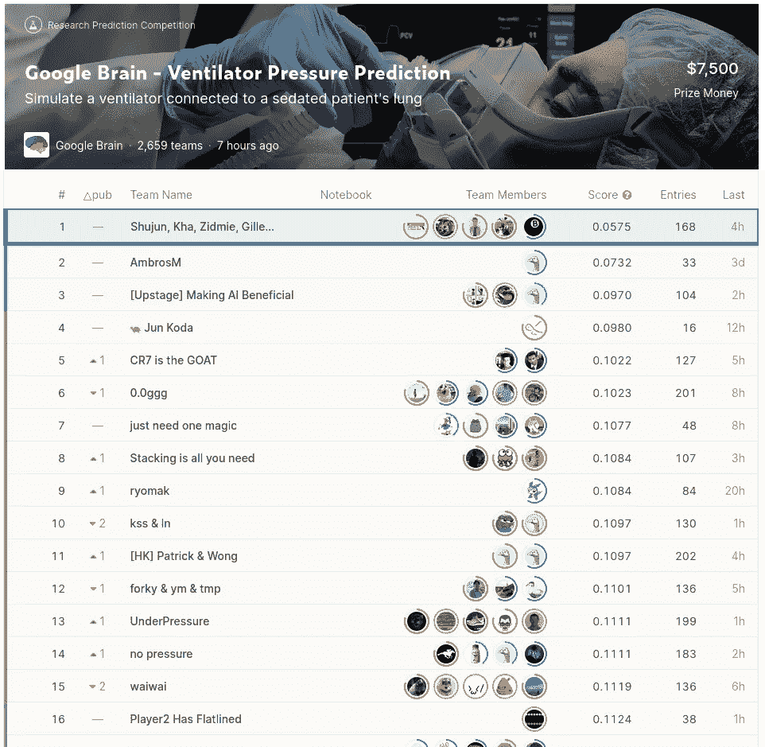

赢得永恒的荣耀和 2500 美元！作者截图

# 来自 Kha 的邮件…

在完成我的博士学位和一段不愉快但短暂的工作经历后，我有一点被烧毁了。结果，我在 2021 年离开了 Kaggle 一段时间，你可以从我的活动日志中看到。我参加了一点“石头、剪子、布大赛”，并尝试了“室内定位和导航挑战”。

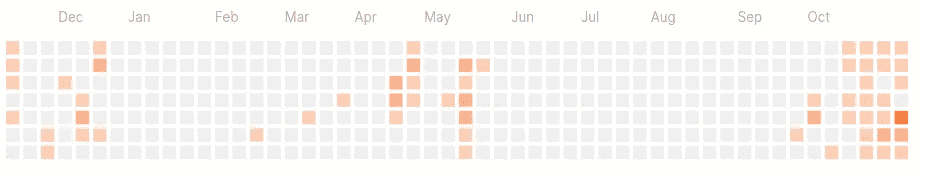

作者截图

9 月 23 日， [Yves](https://www.kaggle.com/zidmie) 和我收到了 [Kha](https://www.kaggle.com/khahuras) 发来的邮件。他在 Kaggle 上发现了一个有趣的时间序列比赛，这个比赛只持续了 1 个月。这个比赛吸引了我，因为我非常熟悉时间序列数据，也是短期比赛的忠实粉丝。此外，我知道当 Kha、Yves 和我合作时，好事往往随之而来！我回复 Kha 说我会有兴趣加入，但是在我真正投入之前，先要处理一些现实生活中的事情。[其中一件必须做的事情是准备&介绍 Kha、Yves 和我在 2020 年“利物浦离子交换”竞赛中获得的第三名解决方案。Kha 和 Yves 开始着手解决这个问题，并取得了一些进展。过了一段时间，10 月 6 日，我加入了他们。](https://github.com/GillesVandewiele/Liverpool-Ion-Switching/blob/master/DS_Ghent_Meetup_Liverpool_final.pdf)

# 简要问题陈述

该竞赛的目标是根据吸气电磁阀打开的程度，预测任何给定时间步长的机械肺内的压力(`u_in`；0 到 100 之间的值)。我们接受了大约 75000 次训练呼吸和 50000 次测试呼吸。每次呼吸由吸气阶段和呼气阶段组成，由提供的`u_out`指示。我们的提交仅在吸气阶段评分(因此`u_out`等于 0)。此外，呼吸被记录在具有不同阻力和容量属性的机械肺中，这些属性被编码在提供的`R`和`C`变量中。

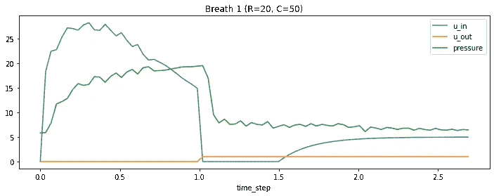

1 训练呼吸的例子。我们被提供 u_in，u_out，R & C，并被要求预测压力。作者图片

# 深度学习斗争

从本次比赛中公布的公共笔记本来看，很明显 LSTMs 或任何类型的时间深度学习模型都将占据主导地位。我们三个人都很快增加了功能或对这些管道进行了小的修改，但都无济于事……很明显，深度学习不是我们的强项。然后，我们的思维方式发生了转变:**“与其试图创建一个适合所有训练数据的模型，然后用于对所有测试数据进行预测，我们难道不能专注于单独的呼吸，看看我们是否可以对其建模以找到模式？”**

拥有物理学背景的 Yves 研究了 PID 控制器，并很快发现了一个很好的简单的后处理技巧，它能够给我们的 LB**+0.004 的提升，这是非常显著的。由于这种后处理技巧，我们能够通过稍微修改的公共笔记本爬上排行榜，使我们在黄金区之外获得一席之地。Yves 的后处理技巧解释起来相当简单(但不容易找到)，并且是基于 PID 控制器的理论。**

我们可以想出一个非常简单的公式:`pressure = kt — (u_in/kp)`。有了必须调整的算法的`kt`和`kp`参数，`u_in`是输入数据，`pressure`是我们想要预测的输出数据。[在组织者写的一篇论文中提到了搜索这些参数的网格。](https://arxiv.org/abs/2102.06779)但是，在没有纸张的情况下，仅通过对训练数据中的每一次呼吸应用线性回归，就可以容易地发现这个网格(其中我们有 u_in 和压力)。

现在的问题是，我们如何知道某一组参数对测试呼吸有多好，因为我们没有计算误差的压力。为此，我们可以利用压力的离散性。只有 950 个唯一的压力值，它们之间的距离相等。因此，如果我们填入两个候选参数`kt`和`kp`，并且计算出的压力值与这 950 个独特的压力值完全一致，我们就有了匹配。这种匹配适用于大约 2.5%的数据。

```
KP_GRID = [0.1, 0.2, 0.3, 0.4, 0.5, 0.6, 0.7, 0.8, 0.9, 1.0, 
           2.0, 3.0, 4.0, 5.0, 6.0, 7.0, 8.0, 9.0, 10.0]
KT_GRID = [10, 15, 20, 25, 30, 35]def match_breath(breath):
    u_in = breath['u_in'].values
    inspiratory_len = np.sum(1 - breath['u_out'])

    u_in = u_in[1:inspiratory_len]
    breath_mask = (u_in > 0) & (u_in < 100)

    if np.sum(breath_mask) < 2:
        return None, None, None, None

    for kt in KT_GRID:
        for kp in KP_GRID:
            preds = (kt - u_in / kp)
            preds_round = (preds-MIN_PRESSURE)/DIFF_PRESSURE
            tune_error = np.round(preds_round[breath_mask]) - preds_round[breath_mask]
            if np.sum(np.abs(tune_error)) < 1e-6:
                return preds, kt, kp, breath_mask

    return None, None, None, None
```

# 派援军来！

在发现后处理技巧后，我们无法做出任何更大的改进。我们慢慢地看到我们在 LB 的排名下降，很明显，为了在这次比赛中取得好成绩，我们需要有更深层次学习经验的人。我们给当时正好在黄金地带下方的[舒军](https://www.kaggle.com/shujun717)发了消息。我知道 Shujun 在深度学习方面非常强，因为他在我也参加的[“open vaccine—Covid mRNA”比赛](https://www.kaggle.com/c/stanford-covid-vaccine)中获得了一个具有独特和强大架构的单人金牌。男孩没有让他**或**失望。

舒骏的深度学习架构是 LSTM 细胞、1D 卷积和变形金刚的组合。LSTMs 是必要的，因为目标压力严重依赖于以前的时间点。卷积结合转换器是一个很好的组合，可以模拟全局依赖关系，同时弥补转换器无法捕捉局部交互的不足。网络相当深，我们遇到了一些梯度问题。因此，一个名为`ResidualLSTM`的新模块被创建，它增加了一个前馈网络(FFN)，并用一个剩余连接将输入连接到 LSTM，输出连接到 FFN。该模型对原始数据进行处理，此外还有一些滞后和差异特征、u_in 的累积和以及一个热编码的 R & C 特征。

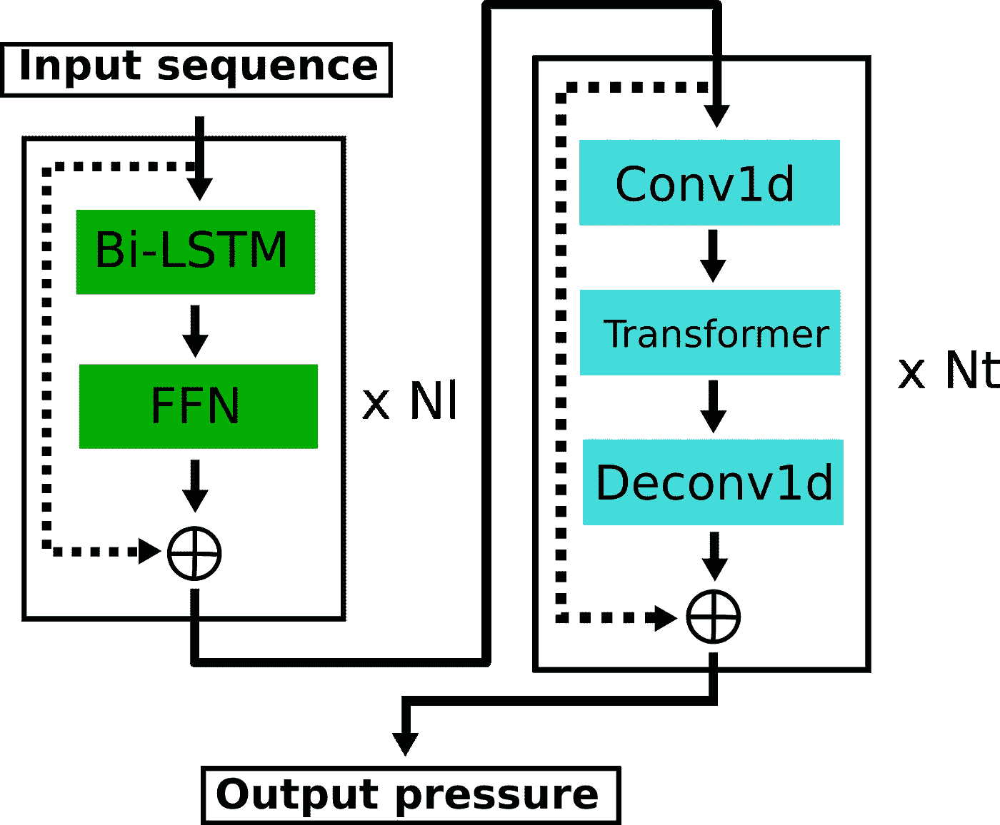

LSTM + CNN 变压器架构。合著者 Shujun 的图片。

我们将我们当前的混合物与舒军的不同运行模型混合，并应用我们的 PP 技巧。**轰**，我们中了黄金！

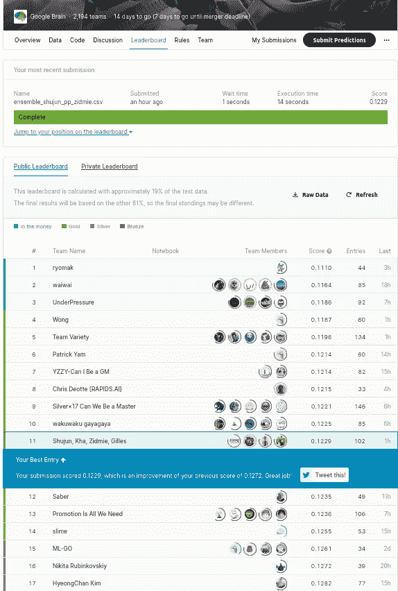

作者图片

我们尝试向 Shujun 建议一些想法，以便在他的管道中实施，还尝试添加一些功能，以便管道(因为他的管道利用了功能)。但是，我们还是没有成功。

几天后，我们觉得我们的混合需要另一个独特的深度学习管道。这就是里卡多进入故事的地方！当我们给他发信息的时候，里卡尔多只比我们低几个点。他建立并运行了一个 LSTM 架构，只集中于原始数据。没有特征工程，没有花哨的东西，只有原始数据和许多时代。诀窍是有一个好的学习进度计划。我们选择了 30 个历元的 ReduceLROnPlateau。这与公共笔记本中通常使用的快速退火调度器形成了对比，后者容易过度适应。当我们将我们的验证损失曲线与公共笔记本的验证损失曲线进行比较时，可以看出这一点，如下所示。这里的红色(赌注)曲线对应于公共笔记本，并很快超拟合。

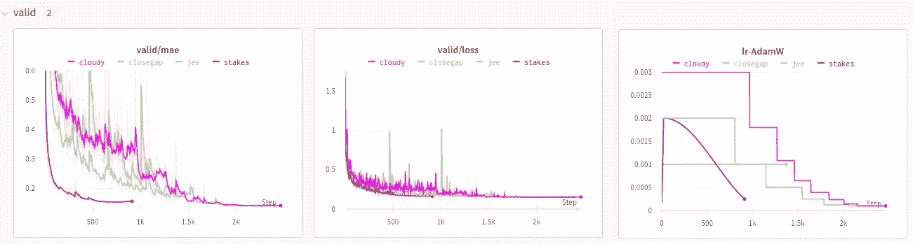

作者图片

这种方法甚至比 LSTM + 1D CNN 变压器编码器得分更高。这些渠道的结合让我们在排行榜上名列第四。**我们决定将我们的目标从金牌转变为赢得金钱。**

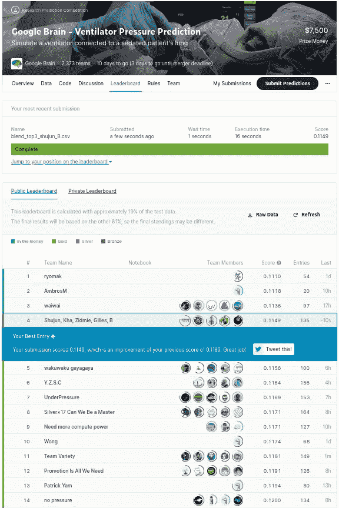

作者图片

同样，我们所有人都专注于改善我们已经启动并运行的两条管道。对两个管道进行轻微的修改，或者向 transformer 管道添加特性。只做了极其微小的改进，与我们前面的竞争对手差距太大。**当然，他们发现的数据中隐藏着一些我们还没有发现的东西……**

# 史上最好的生日礼物

10 月 26 日是我的生日，我决定学习更多关于 PID ( **P** 比例- **I** 积分- **D** 导数)控制器的知识，因为这些也是组织者论文中的核心概念。此外，我们的后处理技巧来自 Yves 对这些 PID 控制器的研究。

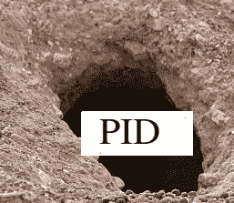

来戳这个兔子洞吧…图片作者

我在 Python 中摆弄了一下 [simple-pid](https://github.com/m-lundberg/simple-pid) 包，因为这个包已经实现了 pid 公式。我也能够用这个软件包重现我们的后处理技巧。然而，对于大多数呼吸，我无法找到匹配。直到我决定专门研究代码和积分项。有多种方法来计算 PID 控制器的积分项，该软件包只包括普通的实现。我决定插入一些其他的替代品，突然，我有了一个突破……**多好的生日礼物啊！**下面的代码片段(基于 simple-pid 包)能够为某些呼吸完美地模拟压力- > u_in:

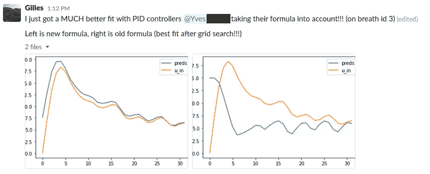

接近了，但还没有…仍然是一个巨大的突破！作者图片

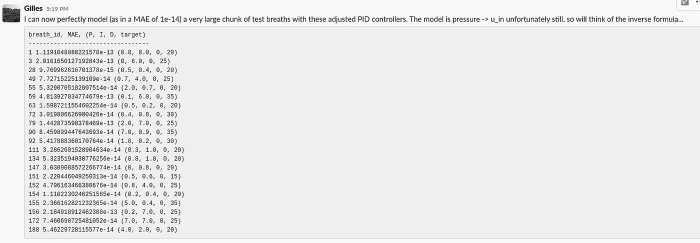

几个小时后，修复一些细节…图片由作者

以下是能够完美模拟某些呼吸的 u_in 压力的代码片段:

```
def generate_u_in(pressure, time_step, kp, ki, kt, integral=0):
    dt = np.diff(time_step, prepend=[0])
    preds = []
    for j in range(32):
        error = kt - pressure[j]
        integral += (error - integral) * (dt[j] / (dt[j] + 0.5))
        preds.append(kp * error + ki * integral)
    return preds
```

我想我们有了一个新的不错的后处理技巧，并把这个信息发给了 Yves。伊夫做了一些更大的事情。他想出了一些能够完美匹配压力的代码。


你能感受到兴奋吗？作者图片

# 完美的搭配

我们可以编写 PID 控制器的“普通”方程(对应于我提供的`generate_u_in`片段):

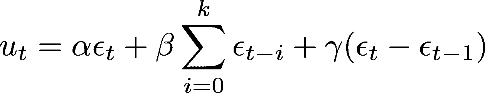

其中`epsilon`等于`target — pressure`，其中目标代表由用户设置的理想压力。现在`gamma`，也就是衍生项的权重，总是被组织者设置为零。所以我们只需要关注第一项(比例)和第二项(积分)。我们之前讨论的后处理技术实际上对应于这个等式，其中`beta`设置为 0。为了便于记记，让我们重写第二个积分项。此外，积分项通过如下重量衰减实现:

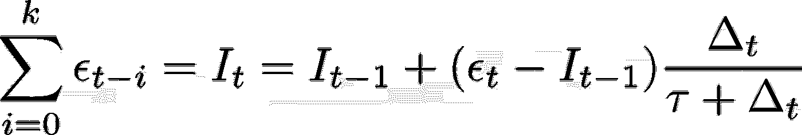

时间步长 t 和 t-1 之间的时间差τ为常数，对于该数据等于 0.5。我们可以从 PID 方程中分离出积分项，以便计算任意时间点的积分项。这避免了必须在整个信号中传播:

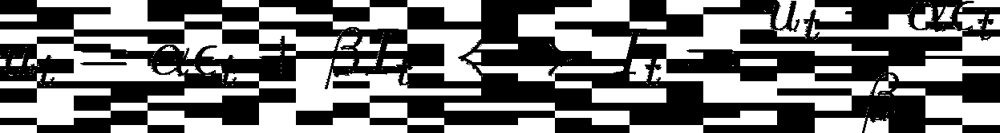

有了这些等式，我们就可以开始匹配算法了。对于给定的参数配置(target、alpha 和 beta 或在本文的剩余部分分别称为 **kt、kp 和 ki** ),我们的匹配算法在时间步长`t`填充给定呼吸的压力如下:

1.  取两个随机压力值`P0`和`P1`。有 950 种可能的压力值，因此有 950*950 种可能的组合。
2.  计算`I0 = (u_in[t - 1] - kp * (kt - P0))/ki`
3.  计算`I1 = I0 + (kt - P1 - I0) * (dt / (dt + 0.5))`
4.  如果`kp * (kt - P1) + ki * I1 == u_in[t]`我们有一个匹配，我们可以填写 P1 压力[t]

在代码中:

```
P_RANGE = np.arange(
  MIN_PRESSURE, 
  MAX_PRESSURE + DIFF_PRESSURE, 
  DIFF_PRESSURE
)
for P0 in P_RANGE:
    for P1 in P_RANGE:
        I0 = (u_in[t - 1] - kp * (kt - P0))/ki
        I1 = I0 + (kt - P1 - I0) * (dt / (dt + 0.5))
        u_in_hat = kp * (kt - P1) + ki * I1
        if abs(u_in_hat - u_in[t]) < 1e-8:
            print(P0, P1, pressure[t-1:t+1])
```

然而，这个代码**相当慢**。这是因为对于每个可能的参数组合，需要尝试 950*950 个组合。kp 和 ki 有 20 个可能的值，kt 有 6 个可能的值，因此总共有 950*950*20*20*6 个可能的组合。然而，对于固定的`P0`,我们注意到`abs(u_in_hat — u_in[t])`在 for 循环中线性增长。因此，我们可以通过两次测量来推断。如果这个外推函数与 x 轴的交集出现在一个整数处(或接近于一个整数)，那么我们的 If 条件在内部 for 循环的迭代中将被评估为 True。

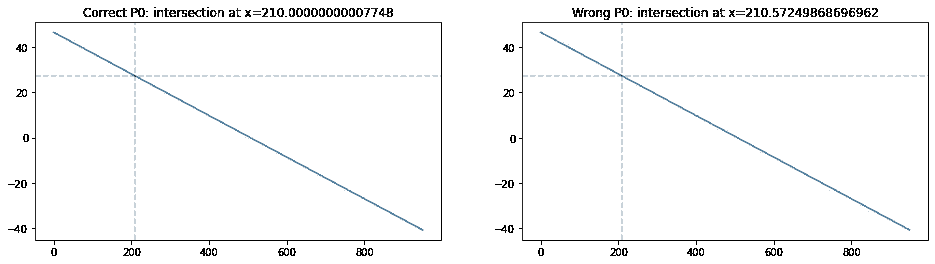

作者图片

这种观察使我们可以将代码加速 950 倍。

```
for P0 in P_RANGE:
    I0 = (u_in[t - 1] - kp * (kt - P0))/ki

    # Calculate 2 points for P1 so we can get the slope
    I11 = I0 + (kt - MIN_PRESSURE - I0) * (dt / (dt + 0.5))
    u_in_hat1 = kp * (kt - MIN_PRESSURE) + ki * I11

    I12 = I0 + (kt - MIN_PRESSURE2 - I0) * (dt / (dt + 0.5))
    u_in_hat2 = kp * (kt - MIN_PRESSURE2) + ki * I12

    slope = u_in_hat2 - u_in_hat1
    x_intersect = (u_in[t] - u_in_hat2) / slope
    if abs(np.round(x_intersect) - x_intersect) < 1e-8:
        print(P0, MIN_PRESSURE + (x_intersect + 1) * DIFF_PRESSURE)
```

# 开大声点！带来噪音！

有了上面的代码，我们能够匹配很多压力。但他们中的许多人仍然无法匹敌。在组织者的论文中，有人解释说 u_in 数据中加入了人为噪声。我们开始努力消除这种噪音。让我们首先看看当前版本的匹配算法对特定呼吸(训练呼吸 id 17)的输出

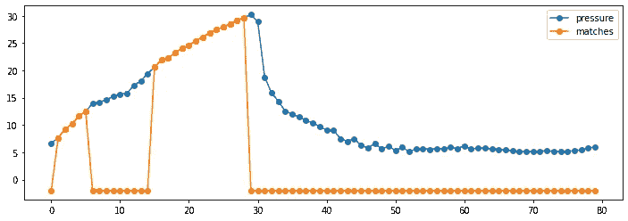

作者图片

注意，u_in 的第一个值和中间的一些值并不完全匹配。所有呼吸的第一个值都有噪声，不可匹配，但中间的点应该是可匹配的…让我们从索引 5 开始，根据提供的压力调用我们的 generate_u_in 代码，以生成“理想 u_in 值”,并从提供给我们的 u_in 中减去这个值。

```
kp, ki, kt = 1., 3., 30
I5 = (u_in[4] - kp * (kt - pressure[4]))/ki
u_in_hat = generate_u_in(pressure[5:], timestep[4:], kp, ki, kt, integral=I5)
noise = u_in[5:32] - u_in_hat[:-5]
plt.plot(timestep[5:32], noise, '-o')
plt.title('noise')
plt.show()
```

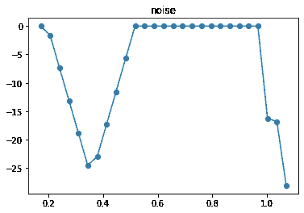

作者图片

理想 u_in 值和提供的 u_in 值之间的差值形成一个漂亮的三角形，除了在三角形的转折点/峰值上。关键是这个噪声的斜率(`(np.diff(noise) / np.diff(timestep[5:32]))`)对于这个三角形上的连续点是相等的。我们也可以重新编写积分计算向后工作。

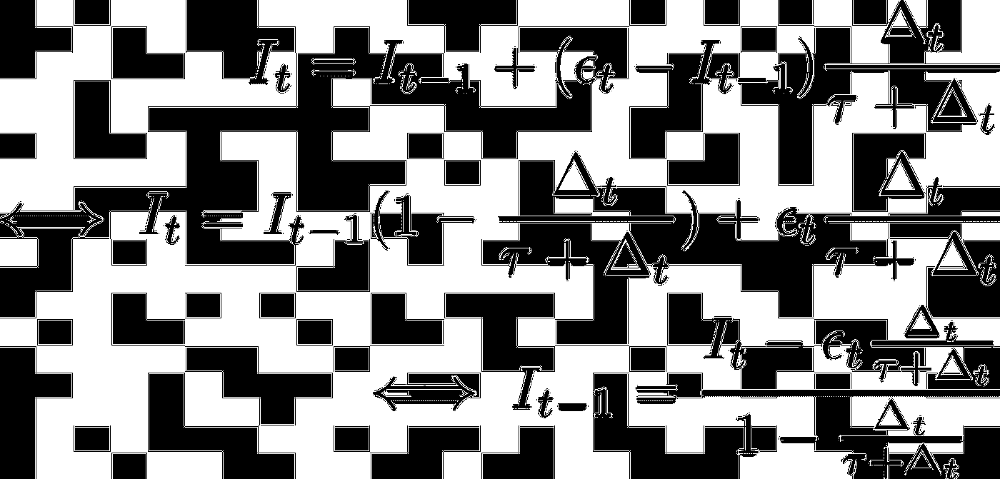

有了这两种见解，我们能够匹配更多的数据:

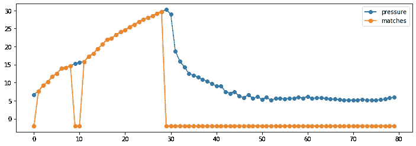

作者图片

# 把它放在一起

给定我们的 DL 模型和匹配算法，我们的方法相当简单:

1.  用我们的两个 DL 模型生成预测。训练他们在多个种子进行 10 重交叉验证。这为我们提供了多个略有不同的模型。将这些模型的(加权)中值作为一种集成技术，因为当 MAE 是度量标准时，这通常优于平均值。
2.  根据这些预测，应用我们的匹配算法。如果我们找到匹配，用匹配器替换 DL 算法的预测。如果不匹配，则保留 DL 预测。

总的来说，我们能够大致匹配 66%的数据，这给了我们**在排行榜上巨大的**提升。

# 结束营业的时间

这是我在卡格尔的第一次胜利。虽然我承认 PID 控制器匹配有点厚脸皮，但我仍然对我们的结果感到非常自豪，因为 2650 个团队中只有 2 个能够找到这个漏洞。此外，我们是唯一能够在 u_in 数据中匹配噪声的团队。我要感谢我的队友们[兹德米](https://www.kaggle.com/zidmie)、[卡](https://www.kaggle.com/khahuras)、[舒军](https://www.kaggle.com/shujun717)和 [B](https://www.kaggle.com/callmeb) ，没有他们，这个结果是不可能的！

如果你有任何问题或不清楚的地方，随时留下一些评论或通过其他媒介与我联系(双关语)。

# 参考

1.  [主办方论文](https://arxiv.org/abs/2102.06779)
2.  [Kaggle 论坛报道](https://www.kaggle.com/c/ventilator-pressure-prediction/discussion/285256)
3.  [PID 匹配代码+解释](https://www.kaggle.com/group16/1-solution-pid-controller-matching-v1) (Kaggle)
4.  [PID 匹配代码+解释(Github)](https://github.com/GillesVandewiele/google-brain-ventilator)
5.  [LSTM + CNN 变压器代码(Kaggle)](https://www.kaggle.com/shujun717/1-solution-lstm-cnn-transformer-1-fold)
6.  [LSTM + CNN 变压器代码(Github)](https://github.com/Shujun-He/Google-Brain-Ventilator)
7.  [LSTM 原始数据代码(Github)](https://github.com/whoknowsB/google-brain-ventilator-pressure-prediction)