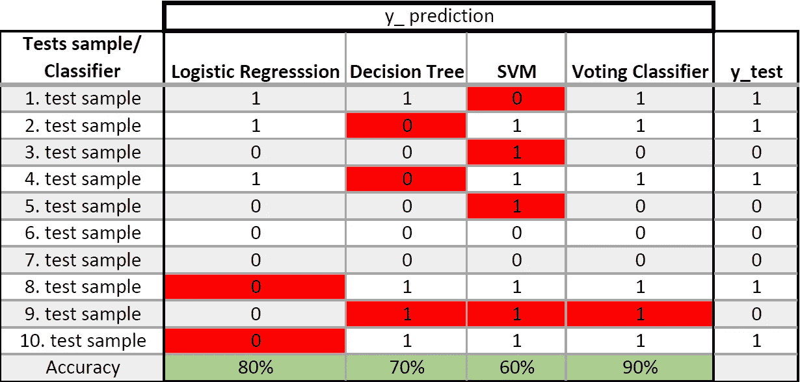

# 群体的智慧——投票分类器，装袋粘贴，随机森林和额外的树

> 原文：<https://towardsdatascience.com/wisdom-of-the-crowd-voting-classifier-bagging-pasting-random-forest-and-extra-trees-289ef991e723?source=collection_archive---------20----------------------->

## 使用多种算法，集成学习，用 python 实现

```
***Table of Contents*****1\. Introduction
2\. Voting Classifier
3\. Bagging and Pasting
3.1\. Out of Bag Evolution
3.2\. Random patches and Random Subspaces
4\. Random Forest
5\. Extremely Randomized Trees**
```


在 [Unsplash](https://unsplash.com?utm_source=medium&utm_medium=referral) 上 [Cliff Johnson](https://unsplash.com/@cliff_77?utm_source=medium&utm_medium=referral) 拍摄的照片

# 1.介绍

在大多数问题上，人们在做决定之前都会咨询别人的意见。在决定一个集体环境时，通常是多数人说了算。虽然即使在个人层面上也是如此，但一些公司在全球层面上调查许多事情。由一群人而不是一个专家做出的决定被称为**【群体的智慧】**亚里士多德在他的著作《政治学》中首次使用了这一论点。这种方法集成到机器学习中的部分是集成学习。最简单的形式是训练多个模型并比较它们的结果来解决复杂的问题。目的是通过考虑泛化来提高监视下的准确率，并获得更成功的结果。本文通过最小化方法以及如何在 python 中实现方法来涉及决策机制。

# 2.投票分类器

投票分类器，顾名思义，是一种‘投票’——基于民主的分类。用一句话来解释，可以定义为多数表决。让我们假设我们用三种不同的算法来训练我们的分类问题——SVM、逻辑回归、决策树——我们在每一种算法中获得了不同的成功率。另一方面，投票分类器具体评估每个测试数据的结果，并决定支持投票占多数的一方。训练数据的测试结果如图 1 所示，不正确的预测与 *y_test* 进行比较，并以红色显示。从准确性结果来看，可以看出巨大的差异。当然，没有预料到真实数据集会有这样的差异，但是图 1。演示了投票分类器的工作原理。由于有 3 个分类器，投票分类器决定了其中至少有 2 个是相同的。这种基于民主多数投票的分类被称为**硬投票分类器**。



图一。投票分类器是如何工作的？，作者图片

**软投票分类器**采用更加灵活的策略。就像在硬投票中，评估每个分类器的结果，但后退一步就会出现，也就是说，在进行预测时，它会观察分类器的概率值。例如，让我们考虑测试结果为

*   SVM[0 级=0.9，1 级=0.1]，
*   决策树分类器[class-0 =0.4，class-1=0.6]，
*   逻辑回归[0 类=0.35，1 类=0.65]

如果我们用**硬投票分类器**对其进行评估，因为有 2 个 1 类，而只有 1 个 0 类，硬投票分类器会判定为 1 类。如果用**软投票分类器**来评价:

*   0 类的概率:0.33 * 0.9+0.33 * 0.4+0.33 * 0.35 = 0.5445
*   第一类的概率:0.33 * 0.1+0.33 * 0.6+0.33 * 0.65 = 0.4455

可以看出，与硬投票不同，软投票分类器的偏好将是 0 类。

现在，让我们用 python 实现上面提到的乳腺癌数据集:

```
**OUT
LogisticRegression() 0.9525539512498058
DecisionTreeClassifier() 0.9227293898462972
SVC(probability=True) 0.9437820214252446
KNeighborsClassifier() 0.9455519329296692
VotingClassifier(estimators=[('lr', LogisticRegression()),
                             ('dt', DecisionTreeClassifier()),
                             ('svc', SVC(probability=True)),
                             ('knn', KNeighborsClassifier())]) 0.9490451793199813
VotingClassifier(estimators=[('lr', LogisticRegression()),
                             ('dt', DecisionTreeClassifier()),
                             ('svc', SVC(probability=True)),
                             ('knn', KNeighborsClassifier())],
voting='soft') 0.9455364073901569**
```

SVC 中*‘概率’*的默认值为假。对于添加`predict_proba()`方法，该值被定义为真。这是必要的。在投票分类器中，所有模型都用相同的数据集进行训练和测试。如图所示，软和硬的区别由*“投票”*决定。

# 3.装袋和粘贴

另一种方法 bagging 及其衍生方法根据训练数据从投票分类器中分离出来。训练数据集被分成子集，分类器用这些子集来训练。在培训后的测试过程中，民主发挥作用，通过硬投票做出决定。如果随机选择行的子集进行替换，这称为**引导聚合(Bagging)** 。为了解释表达式*“with replacement”*，对应于一个分类器中用于训练的特定数据被另一个分类器使用的表达式是 with replacement。这个事件被称为**引导**。背后的想法是基于统计的，它用于估计数量。通过将数据集随机划分为子样本来评估数据集。在该划分期间，在多个子集中具有相同数据的事件用上述 with replacement 解释，并在 sklearn 中用`bootstrap=True`定义。

另一方面，如果随机选择行的子集而不替换，这被称为**粘贴**。任何分类器在粘贴过程中使用的数据都不允许被另一个分类器使用。

由于在这些过程中使用了多个分类器，虽然**偏差**变化不大，但它降低了模型的**方差**，保护了模型不至于过拟合，模型的稳定性增加，变得更加通用。现在让我们用 python 实现这些提到的方法:

```
**OUT
bagging results [0.89473684 0.97368421 0.95767196]
average of bagging: 0.9420310034345123
********************************************
pasting results [0.89473684 0.97368421 0.96296296]
average of pasting: 0.9437946718648473
**********************************************
```

可以看出，装袋和粘贴的区别是由 bootstrap 决定的。如果拾取数据时有替换，即引导，则称为**引导聚集(bagging)** ，如果拾取数据时没有替换，即没有引导，则称为**粘贴**。

到目前为止，一直使用分类，但它也可以用于回归:

```
**OUT
numeric_cols Index(['wheelbase', 'carlength', 'carwidth', 'carheight', 'curbweight','enginesize', 'boreratio', 'stroke', 'compressionratio', 'horsepower','peakrpm', 'citympg','highwaympg'],
dtype='object')
categorical_cols Index(['fueltype', 'aspiration', 'drivewheel', 'enginetype', 'cylindernumber','fuelsystem'],dtype='object')
bagging results [0.88065606 0.84712127 0.7973921  0.72010695]
average of bagging: 0.8113190957164755
**********************************************
```

使用汽车价格数据集。分类列用`OneHotEncoder`编码，大多数数字列用`StandardScaler`标准化，一些数字列用宁滨分组。然后，我们获得的新数据集包含了`max_features=0.4`，即 40%的特征和`max_sampeles=0.8`，即 80%的数据。

## 3.1.出袋进化

**理论:**如果数据集足够大，bootstrap=True，36.79%的数据根本不会被选择。

**证明:**提到了一些数据被选择并用于一个以上的带有装袋的分类器。没有被任何分类器使用的选择数据的概率是(1–1/m ),其中 m 是样本数。

让我们概括一下:不拾取任何分类器都不使用的数据的概率是(1–1/m)ᵐ.当“m”足够大时，统计上它相当于(1–1/e)= 0.6321。

这意味着 63.21%的训练样本被每个分类器提取，36.79%的训练样本未被采样。这 36.79%的样本被称为**。由于在训练期间没有“oob”数据，这些数据可用于评估( *test_data* )。我们可以在 Scikit 学习库中实现它，如下所示:**

```
**OUT
bagging oob results: [0.88811189 0.97183099 0.95774648 0.97183099]
average of oob: 0.9473800847040283**
```

**这只能通过设置 oob_score=True 来实现。**

## **3.2.随机补丁和随机子空间**

**装袋的超参数:**

*   **`max_features:`决定选择多少/多少特征。Float 表示百分比，integer 表示数字。**
*   **`max_samples:`决定采样多少数据。Float 表示百分比，integer 表示数字。**
*   **`bootstrap:`布尔，真意味着有替换；假的意思是没有替换。**
*   **`bootstrap_features:`布尔，True 表示特征是用替换绘制的；False 表示绘制的要素没有替换。**

**所有训练实例(`bootstrap=False`，`max_samples`为高(默认值=1))，但采样特征(`bootstrap_features=True`)被称为**随机子空间**。**

```
**OUT
randomsub 0.929824561403508**
```

**训练和特征都被采样，称为**随机面片**。**

```
**OUT
patch 0.9649122807017544**
```

**这些主要用于高维数据集，如图像数据集。图像中有大量的特征，成百上千的像素，通过使用这些方法可以获得更可靠的结果。**

# **4.随机森林**

**Bagging 已经用分类器方法的相同数据集的不同训练子集训练了多次。如果要选择分类器 *DecisionTreeClassifier* ，决策树的更优化版本 *RandomForestClassifier* 也可以作为 bagging 的替代方案。**

```
**OUT
random forest results: [0.92105263 0.97368421 0.95767196]
average of rf: 0.9508029332590736
********************************************
 bagging random forest results: [0.91578947 0.97368421 0.96296296]
average of bagging rf: 0.9508122157244964
**********************************************
```

# **5.额外的树**

**全名是**极度随机树**，它建造多棵树以及随机森林。与其他不同，自举不提供随机性，而是在每个节点随机分裂节点。因为在每个节点上都提供了随机分割，所以方差非常低。**

```
**OUT
extra tree results: [0.91052632 0.98421053 0.96296296]
average of extra tree: 0.9525666016894087**
```

> **比较树间方差，说的是决策树方差>随机森林方差>极度随机化树方差。**

## **回到指引点击[这里](https://ibrahimkovan.medium.com/machine-learning-guideline-959da5c6f73d)。**

**[](https://ibrahimkovan.medium.com/machine-learning-guideline-959da5c6f73d) [## 机器学习指南

### 本文旨在准备一个机器学习数据库，以便在一个视图中显示所有的机器学习标题。这个…

ibrahimkovan.medium.com](https://ibrahimkovan.medium.com/machine-learning-guideline-959da5c6f73d)**