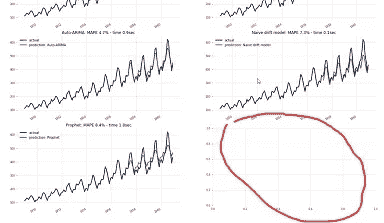
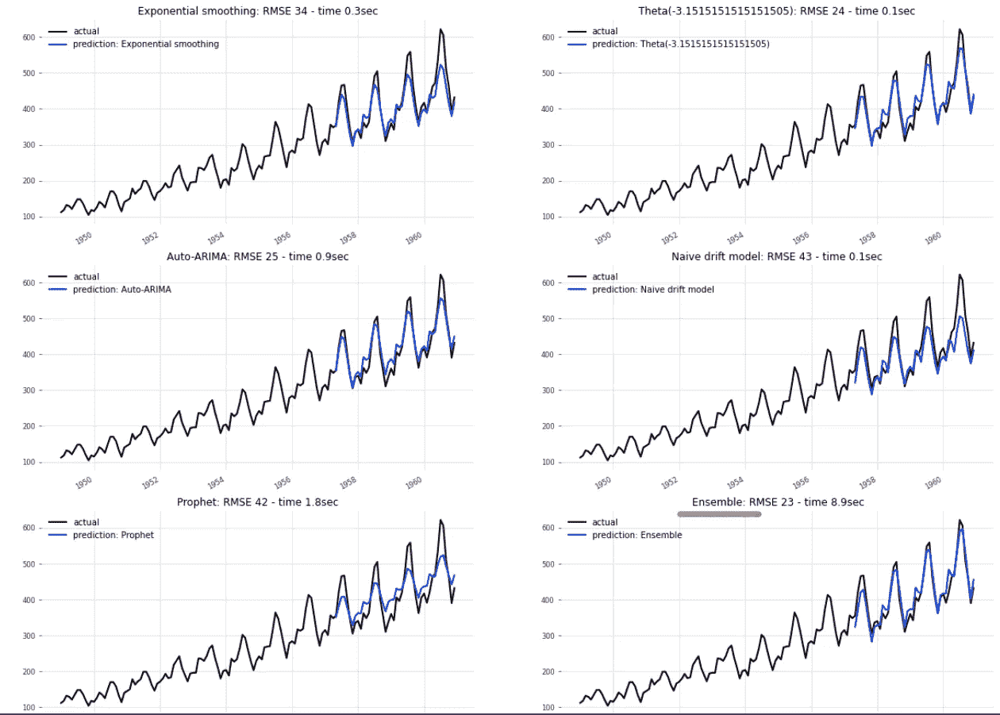
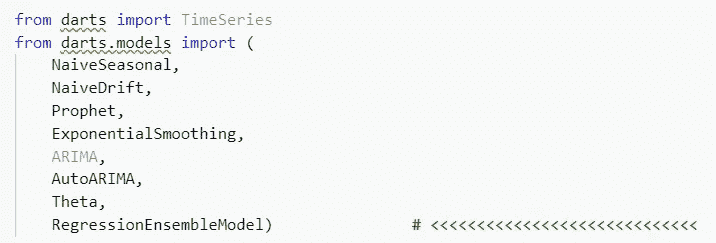
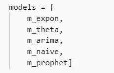
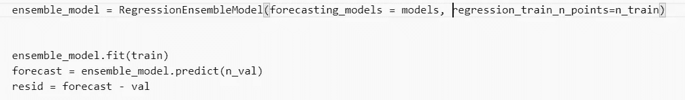
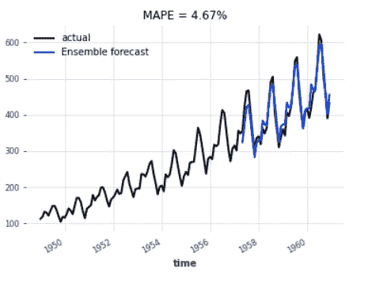
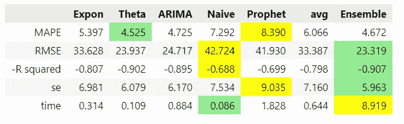
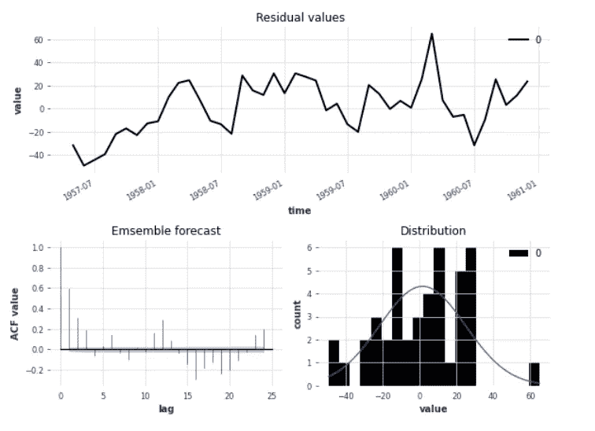
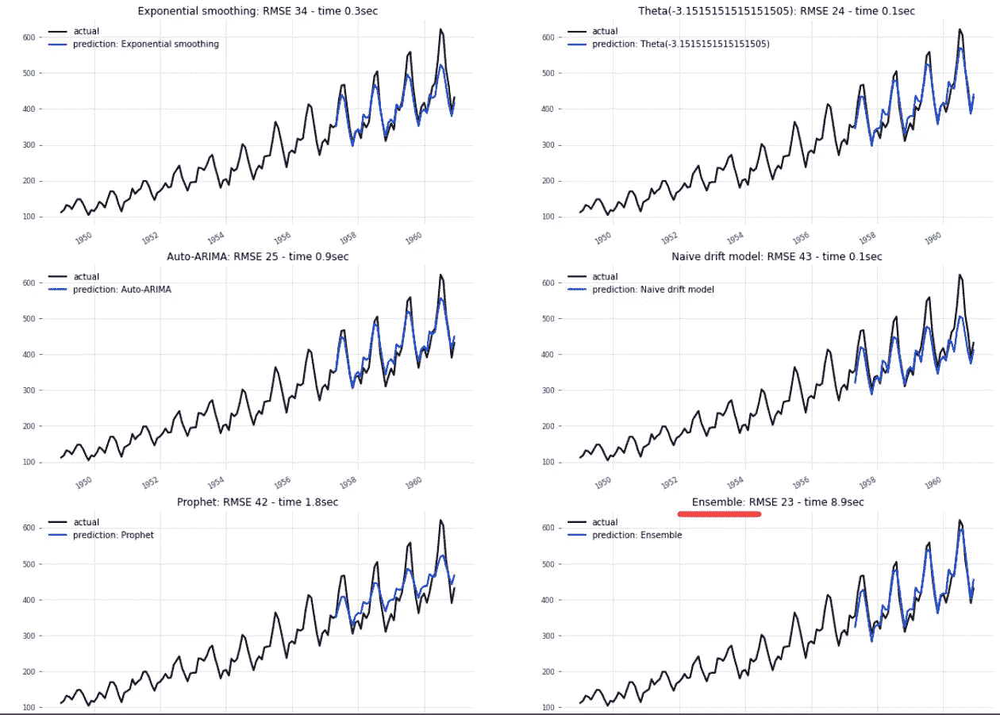
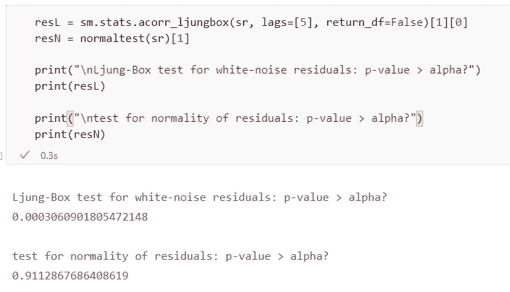

# 预测人群的智慧

> 原文：<https://towardsdatascience.com/wisdom-of-the-forecaster-crowd-f70b398f190b?source=collection_archive---------11----------------------->

## 用 Python 语言实现时间序列的集合预测

Chuotanhls / Chu Viet Don，[黑人群体 Pixabay 上的免费照片](https://pixabay.com/photos/black-group-crowd-dancing-crew-4906807/)

在昨天的文章中，我们讨论了*飞镖*多方法包以及如何在给定的时间序列上运行预测锦标赛。我们审查了五个选择的模型——指数平滑、Theta、SARIMA、nave forecast 和 Facebook Prophet——中的哪一个会更好地拟合源数据，即 Box & Jenkins 的经典航空公司乘客人数。[时间序列预测的飞镖瑞士刀| 2021 年 10 月|走向数据科学](/darts-swiss-knife-for-time-series-forecasting-in-python-f37bb74c126)

如果你读了这篇文章，你可能记得预测图的网格已经离开了右下角的第六个单元格，明显是空的。

作者图片

让我们通过比昨天更进一步来填补这一空白:

我们将创建一个**集合预报**，它结合了五种方法，不超过一行代码。

集合方案会显示出单独的方法都无法提供的预报质量吗？

作者图片

# 1.创建集合预报

在我们讨论集合预报背后的概念之前，让我们生成一个集合预报，然后将它的结果与单个模型进行比较，看看它能提供什么见解(如果有的话)。

我们拿起昨天的多方法预测教程中使用的 Jupyter 笔记本，在 dependencies 单元格中添加一行:我们导入 *Darts 的**RegressionEnsembleModel。*

作者图片

为了连接我们在变量*模型*中列出的各个方法，

作者图片

我们添加一行代码来处理集合预报:RegressionEnsembleModel 采用

*   *型号*列表作为其第一个参数；
*   以及我们想要训练集合的周期数。

接下来的三行与他们对单个预测者的描述相同:

*   训练模型
*   计算预测
*   计算残差

我们将*RegressionEnsembleModel*插入到一个*集合评价*函数中，该函数与昨天多方法笔记本中的*模型评价*函数具有相同的结构。在评估功能中，我们还计算准确性指标并绘制预测图。

作者图片

我们调用评估函数，其中包含我们希望它联系在一起的模型列表。

作者图片

作者图片

我修改了多方法 Jupyter 笔记本的准确性指标。由于我们需要不止一次地访问度量标准的公式——首先是单个方法，然后是整体——我将它们包装在一个函数中，我们可以用一行代码调用它，而不是在脚本中重复所有的代码行。

作者图片

我们调用度量函数，收集集合的准确性度量，并将它们与单个方法的准确性度量组合在一个数据框架中。

作者图片

集合预报返回与任何单独方法相同的输出:我们可以绘制的预报值；残差；和预测准确性度量。

作者图片

# 2.合奏贡献了什么？

集合提供了我们从其他方法中无法获得的洞察力吗？

作者图片

我们回顾了这些指标，以发现集成是否比其他方法有所改进。

请注意，我还添加了一个“avg”列，它是每个指标的 5 个其他方法的简单平均值。当然，总体指标不等于平均栏中的值，这是没有意义的。平均值不会对所有单个方法的改进有所贡献，因为它位于最好和最坏情况之间的 T2。

相比之下，回归集成模型*能够*做出比最好的个体方法更准确的预测。不能保证这种改善。您可以在度量表中看到，集合模型在三个度量方面领先于该领域:就 RMSE、R 平方和预测的标准误差而言，与 Theta 方法相比，差距较小。但在 MAPE 一行，θ以同样小的幅度领先。

RMSE 对预测误差进行平方，对较大误差的惩罚力度比 MAPE 更大。当残差的分布是左偏或右偏时，就会出现偏差。平均值将高于或低于中间值。最小化 RMSE 的预测将显示出较小的偏差。但是对于具有许多异常值的源数据，对异常值的敏感性可能不是优选的。在文献和评论部分，你可以找到关于 RMSE 和 MAPE 的相对优势和劣势的热烈讨论，以及许多其他指标的利弊。因此，我们不能通过一个简单的判断，一劳永逸地说，MAPE 或 RMSE 在决定模式之间的赛马方面更胜一筹。

这个集合的 R 平方要高半个百分点，所以它解释了实际观测中运动的额外部分。

预报的标准误差 *se* (也就是预报误差的估计标准偏差)，对于集合预报来说要小一点。[简单回归数学(duke.edu)](https://people.duke.edu/~rnau/mathreg.htm)

根据我们的指标，投票结果是 3 比 1 支持集合模型。但这种“投票”并不是宣布方法之间竞赛获胜者的硬性标准。对于其他时间序列，集合预报肯定可以获得更好的预报质量，并显示更明显的指标差异。因为创建集成只花费了我们三行代码，所以当我们在我们的源数据上运行方法比赛并发现它是否能比其他方法增加改进时，将集成添加到单独的模型中是值得的。

在这里，我们刚刚证实了 Theta 方法非常接近整个预测者群体的智慧，如此接近，以至于两者几乎可以互换。

# 3.使用集合结果

我们可以像处理任何单独方法的结果一样处理集合预报值。合奏只是另一个*飞镖*模型，一个我们在飞行中创建的模型，一个为具体的时间序列量身定制的模型，而不是像西塔或 ARIMA 那样带有公共名称标签的理论方法。

我们可以在系综上运行 *Darts 的 plot_residuals_analysis()* 函数。

作者图片

我们将合奏添加到右下角先前空着的第六个子剧情中。

作者图片

*统计模型*的永盒测试和*统计模型*的正态性测试也可以应用于总体的残差。

作者图片

# 3.集合预报背后的概念是什么？

集合预报的目标是获得一个更稳健的模型，并且可以更好地推广到新的数据点或其他时间序列。组合预测器的目的是减少预测的标准误差。

在处理具体的时间序列、识别和处理异常值或处理其趋势或季节性变化时，个别方法可能会表现出一些弱点。如果我们简单地用一种不同的方法代替一种方法，我们就有可能在某个时候被第二种方法的某些弱点绊倒。通过组合几种方法，预测者群体的智慧可以——在许多情况下，但不一定在所有情况下——消除单一方法模型的弱点。

用户选择 Darts 作为整体构建模块的方法。然后 *RegressionEnsembleModel* (如果我们没有指定额外的参数)将运行一个线性回归模型，将预测者作为其回归变量。回归计算所选预测器的线性组合，使预测值与实际观测值最接近。因此，回归模型研究每种方法在集合中的整合(加权)程度，以最小化与实际观测值的偏差。回归变量是复杂预测方法本身的结果，而不仅仅是简单的来源数据。回归目标，即系综，形成加权平均预测值。

RegressionEnsembleModel 接受比简单线性回归更复杂的集成函数，前提是这些函数通过实现 fit()和 predict()方法遵守 scikit-learn 模式。

Jupyter 笔记本可以在 GitHub 上下载:[h3ik0th/Darts _ ensembleFC:Python 时间序列用 Darts 进行集合预报(github.com)](https://github.com/h3ik0th/Darts_ensembleFC)