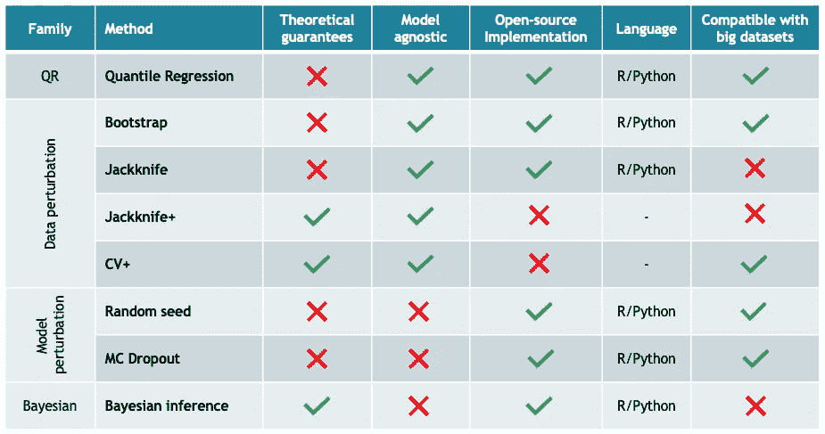
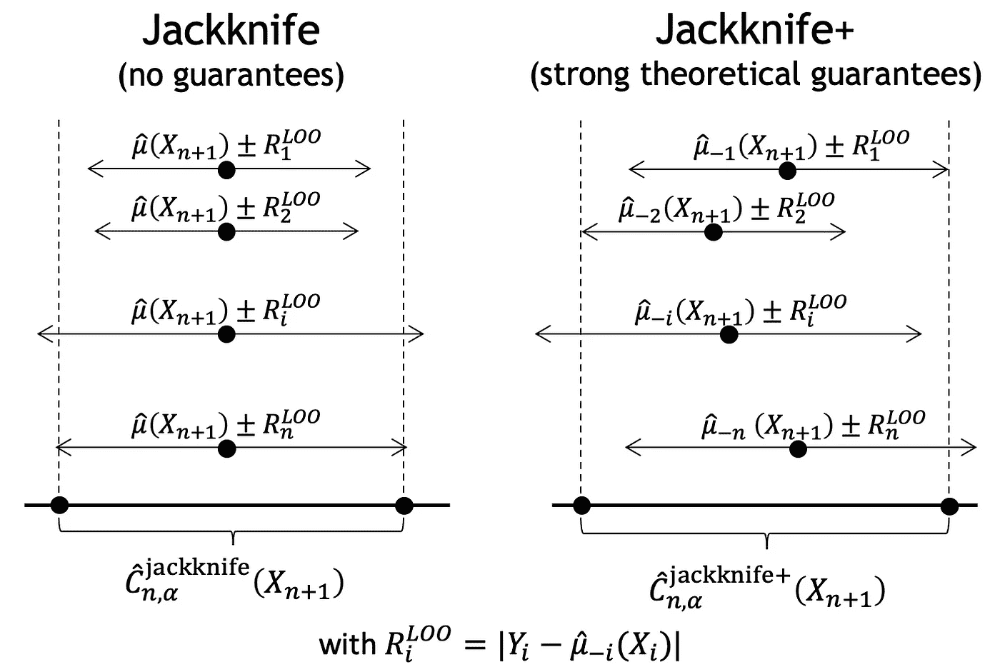
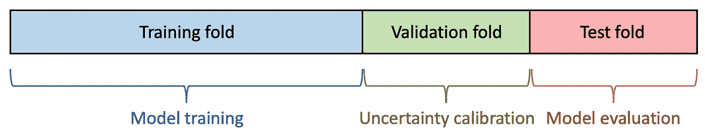
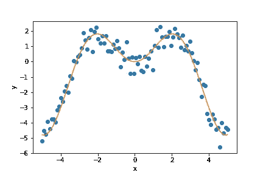
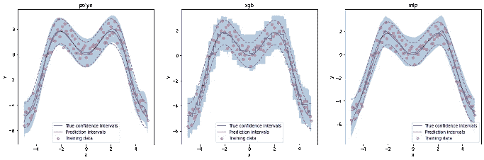

# 有了 MAPIE，不确定性又回到了机器学习中

> 原文：<https://towardsdatascience.com/with-mapie-uncertainties-are-back-in-machine-learning-882d5c17fdc3?source=collection_archive---------10----------------------->

**展示 MAPIE，这是 Quantmetry 开发的 scikit-learn 兼容包，可让您轻松估计与您最喜爱的 ML 模型相关的不确定性**

由[达米安·西奥德萨克](https://unsplash.com/@donio3d)在 [Unsplash](https://unsplash.com/?utm_source=medium&utm_medium=referral) 上拍摄的照片

在 25 年的成功故事之后，现代机器学习(ML)仍然与不确定性的概念不一致。置信区间并不流行，在致力于机器学习的顶级开源库中几乎不存在。然而，从商业角度来看，不确定性的概念深深植根于风险管理中，是任何可靠的人工智能(AI)在生产中的必备条件。在这篇文章中，我们介绍了 MAPIE，这是一个开源包，由 Quantmetry 作为 Quantlab R&D 项目开发，重新引入了人工智能中的不确定性概念，由模型无关和用户友好的开源实现提供支持。

# 人工智能预测总是不确定的

机器学习模型使用历史数据来进行预测。本质上，机器学习模型的预测总是不确定的，因为数据在*质量*和*数量*方面都是不完美的。因此，与人工智能模型预测相关的不确定性可分解为两种主要类型:分别因数据质量和数据数量而异的*随机*和*认知*不确定性。

**任意的不确定性。**第一，历史数据总是有噪音的。例如，噪声可能是由于用于测量工业机器的物理尺寸的捕捉器的有限精度造成的。这也可能是由于人类在图像标记过程中不可避免的错误造成的，这对于像医学图像这样的敏感领域来说可能是复杂的。

**认知的不确定性。**其次，用于训练我们的模型的采集数据总是有限的，并且不能完美地捕捉生活中发现的整体和复杂的真实分布。不完整的分布将导致模型参数的不确定性，这些不确定性将传播到模型预测中。例如，假设您想根据过去一周温度计上显示的温度来预测明天花园的每小时温度。然而，当你睡觉的时候，你不能读出午夜到早上 8 点之间的温度。因此，你的人工智能模型估计的预测将捕捉这种不确定性:它在夜间比在白天更不确定，仅仅是因为夜间缺乏数据！

# 人工智能对不确定性的需求

人工智能模型需要将不确定性与其预测关联起来，主要有三个原因。首先，让公众对人工智能算法做出的决定放心。第二，更好地确定公司部署的人工智能模型在生产中的限制。第三，为企业的决策和风险管理提供强有力的有用指标。

在自动驾驶或医学成像等敏感领域，估计与人工智能预测相关的不确定性已经是强制性的，在这些领域，人工智能做出的或基于人工智能做出的决定会对人类生活产生直接影响。量化不确定性在其他领域也将很快成为强制性的，因为模型准确性和稳健性的概念在欧洲议会和理事会关于人工智能监管的提案中起着核心作用[此处](https://eur-lex.europa.eu/legal-content/EN/TXT/?qid=1623335154975&uri=CELEX%3A52021PC0206)。例如，我们可以引用该提案的第 3.3 节:“这些要求将涉及数据、文档和可追溯性、信息和透明度的提供、人工监督以及稳健性和准确性，并将是高风险人工智能系统的强制性要求。”。因此，评估人工智能模型的不确定性正成为所有处理高风险人工智能系统的公司的监管问题，无论他们的业务线是什么。除了高风险部门，所有认可机构都可以通过建立信任和支持变革管理来利用不确定性量化。

# 我们开发 MAPIE 的原因

在过去的几十年中，已经开发了各种旨在量化不确定性的方法。我们可以将它们主要分为四类:分位数回归、数据扰动、模型扰动和贝叶斯推断。

回归分析中主要不确定性量化方法的比较。

上表列出了一些方法的主要特点，强调了它们的优缺点。首先，像分位数回归这样的简单方法可以很容易地用来估计任何类型的模型的不确定性，但没有理论上的保证。另一方面，贝叶斯推理等复杂技术使得捕捉不同类型的不确定性成为可能，并得到强大的数学框架的支持，但通常是特定于模型的，计算量大，需要对方法进行深入分析和理解。

允许数据科学家容易地估计与任何类型的 ML 模型的预测相关联的不确定性的健壮包在数据科学界仍然缺乏。例如，scikit-learn 库没有提供量化不确定性的可靠和标准方法，只有少数模型提供了不确定性量化方法(如 50 年代由来已久的刀切法)。

这就是我们开发 MAPIE 的原因，MAPIE 代表模型不可知预测区间估计器。MAPIE 允许您通过一个简单的用户友好的 API，使用您最喜欢的 scikit-learn 兼容 ML 模型轻松估计不确定性。该软件包基于最先进的不确定性量化方法，具有强大的理论保证。目前，MAPIE 只能用于回归问题，但它在分类和其他设置方面的扩展正在积极开发中。

# “和梅皮在一起，我确定我的不确定性”

MAPIE 基于 R. Foygel-Barber 等人(2021) [1]在一篇最新研究论文中介绍的重采样方法，用于估计回归设置中的预测区间，并提供了强有力的保证。MAPIE 实现了本文中至少 8 种不同的方法，特别是 Jackknife+和 CV+。

所谓刀切+方法是基于一组*留一模型*的构建:每一个被扰动的模型都是在去掉一个点的整个训练数据上进行训练的。然后根据这些扰动模型估计的*留一残差*的分布来估计区间预测。这种优雅方法的新颖之处在于，对新测试样本的预测不再像标准刀切法那样以基础模型估计的预测为中心，而是以每个扰动模型的预测为中心。这个看似微小的变化引发了一个重要的结果:估计的预测区间总是稳定的，并且在理论上是有保证的！

标准重叠和新重叠+策略的比较。

在实践中，当你的目标是 90%的置信区间时，这意味着你希望 90%地确信你的新观察的真实值在你的预测区间内。像标准自助法或刀切法这样的历史方法并不能给你任何保证，而且会有很大的不稳定性。利用这种方法，Foygel-Barber 等人描述的定理保证这种机会总是高于 80%,并且在实践中大多数时候非常接近 90%。换句话说，这意味着大约 90%的新测试样本的目标值将位于用刀切+方法估计的预测区间内。

但是，标准的 Jackknife+方法计算量很大，因为它需要计算与训练样本数量一样多的模型，因此可以采用一种更简单的交叉验证方法，称为 CV+。CV+方法充当标准交叉验证:在去除了每个折叠的整个训练集上训练 *K* 个扰动模型，其中 *K* 的范围通常从 5 到 10，并且计算相应的残差。对于 Jackknife+，预测间隔以每个*折叠*模型执行的预测为中心。因此，该理论保证了相同的稳定性，尽管预测区间通常稍宽，因为每个扰动模型是在较少数量的样本上训练的。

在交叉验证的成本过高的情况下，例如由于模型非常庞大或数据集非常庞大，仍然可以估计预测区间。你只需要把你的训练集分成一个训练文件夹和一个验证文件夹。训练折叠用于训练基础模型，而验证折叠用于通过残差估计来校准预测区间。下图描述了这一过程。

用于训练模型、校准不确定性和评估模型的数据集拆分。

# 从最先进的研究到最先进的包装

我们在 SimAI R&D 项目的框架内开发了 MAPIE。这个项目是位于巴黎的人工智能咨询公司 Quantmetry 和 ENS Paris-Saclay 在法兰西岛地区的财政支持下合作完成的。这个项目的关键点是开发一个 Python 包，允许数据科学家使用任何类型的 scikit-learn 兼容模型作为基本估计器来轻松估计不确定性。因此，这个包是用最先进的开发标准编写的:100%覆盖率的单元测试，在几个环境中与 Github actions 的持续集成，readthedocs 上的完整文档，以及 PyPi 和 conda 上的包发布。

# 实践中的 MAPIE

现在，我们以一个简单的`x*sin(x)`函数生成的一维数据集为例，说明如何利用 MAPIE 轻松估算不确定性，该函数具有正常的同方差(即，其与 x 保持恒定)噪声。数据如下图所示。

我们示例中使用的一维合成数据。

如前所述，MAPIE 可以与任何种类的 sklearn 兼容回归器一起使用。这里，我们使用三种模型比较 CV+方法估计的预测区间:

*   用 scikit-learn 定义的简单多项式函数。

*   一个`XGBRegressor`模型，基于著名的并行树提升算法，附带一个 scikit-learn API。

*   一个简单的神经网络，这里是一个具有三个密集层的多层感知器，用 Tensorflow-Keras 定义，并使用`KerasRegressor`包装器兼容。

现在让我们使用 MAPIE 来估计使用 CV+方法的预测区间，并比较它们的预测区间。为此，`MapieRegressor`对象可以像任何 scikit-learn 回归器一样使用标准的`fit`和`predict`顺序过程。我们只需要定义基本模型、方法和在初始化对象时估计残差的折叠次数。然后，我们在训练数据上拟合回归量，并在测试集上估计预测和预测区间。这里，我们将 alpha 值设置为 0.05，以便为我们的预测区间实现 95%的置信度。预测间隔的下限和上限保存在单独的 numpy 数组中。

下图比较了 MAPIE 估计的预测区间(由蓝色区域给出)和用于生成数据噪声的真实置信区间(由虚线给出)。

MAPIE 使用三种基本模型估计的预测区间:多项式函数(左)、XGBoost 回归器(中)和多层感知器(右)。

可以看出，用 MAPIE 估计的预测区间确实非常接近真实的置信区间。事实上，*有效*覆盖分数，即真实值位于预测区间内的测试样本的数量，对于 95%的目标覆盖分数是 97%。

这个例子说明了 MAPIE 在一个非常简单的案例中的使用。当然，我们可以将 MAPIE 应用于更复杂的回归任务，如果您想探索其他问题，我们邀请您查看 [MAPIE 文档](https://mapie.readthedocs.io/en/latest/)的图库示例。

# 关键里程碑和要点

我们已经开始开发 MAPIE，这是一个用 Python 编写的开源包，允许您估计与机器学习模型预测相关的不确定性，具有双重目标。首先，MAPIE 与 scikit-learn 完全兼容，因此可以应用于任何具有 scikit-learn API 的模型。其次，MAPIE 使用最先进的重采样不确定性量化方法，使您能够为预测区间获得强有力的理论保证。

MAPIE 可以通过 pip 或 conda 轻松安装，现在作为 scikit-learn-contrib 项目成为 scikit-learn 生态系统的一部分。我们在 ICML 的一个研讨会上展示了 MAPIE，该研讨会聚焦于[无分布不确定性量化](https://sites.google.com/berkeley.edu/dfuq21/)。

目前，MAPIE 只能用于单输出回归问题。但是 MAPIE 才刚刚开始它的旅程！我们正在积极地将 MAPIE 扩展到其他设置，如时间序列、多输出回归、多类分类或图像分割。欢迎在 github MAPIE 网页上提交问题或建议适合 MAPIE 的新项目。

# 加入

我在量子力学公司工作。Quantmetry 自 2011 年成立以来一直是先驱和独立的公司，是法国领先的纯人工智能咨询公司。在提供卓越的数据治理和最先进的人工智能解决方案的愿望的驱动下，Quantmetry 的 120 名员工和研究顾问将他们的热情投入到为所有行业的公司提供高业务成果的服务中。

# 参考

[1] Rina Foygel Barber，Emmanuel J. Candès，Aaditya Ramdas 和 Ryan J. Tibshirani，[用折叠刀+](https://www.stat.uchicago.edu/~rina/jackknife.html) 进行预测推理(2021)。安。统计学家。, 49(1):486–507.