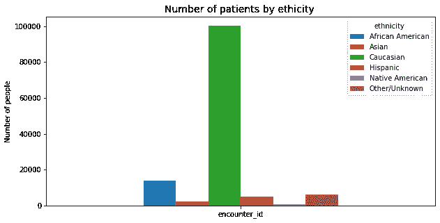
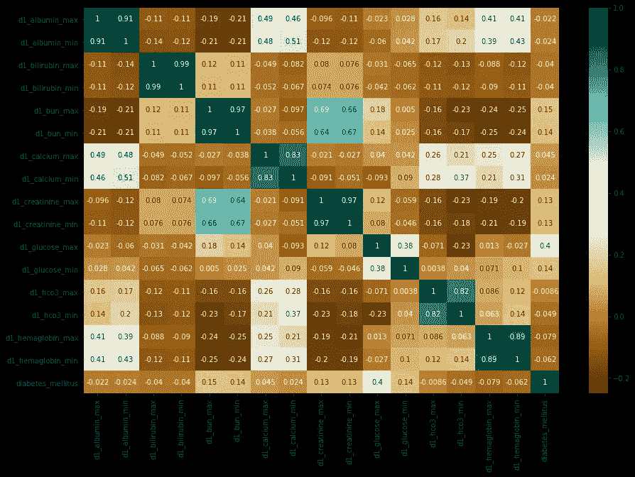
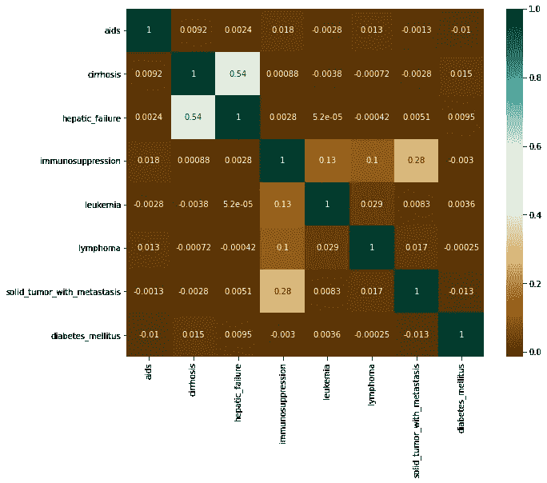
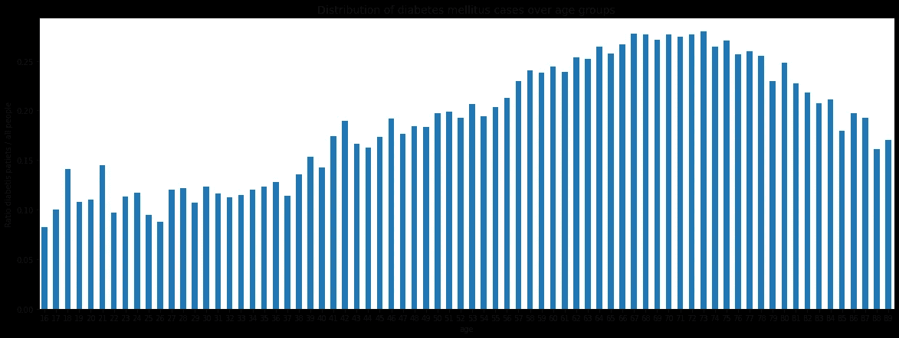
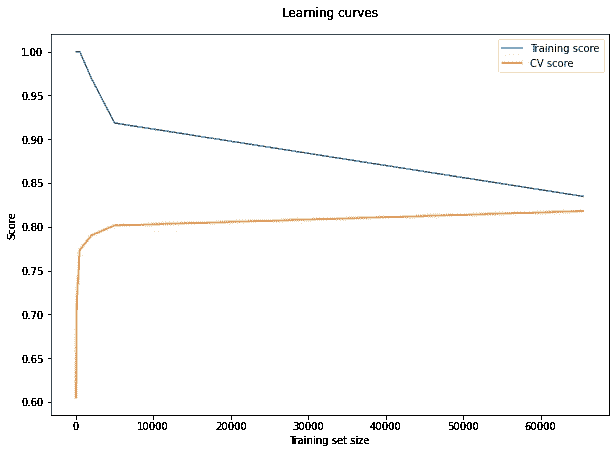
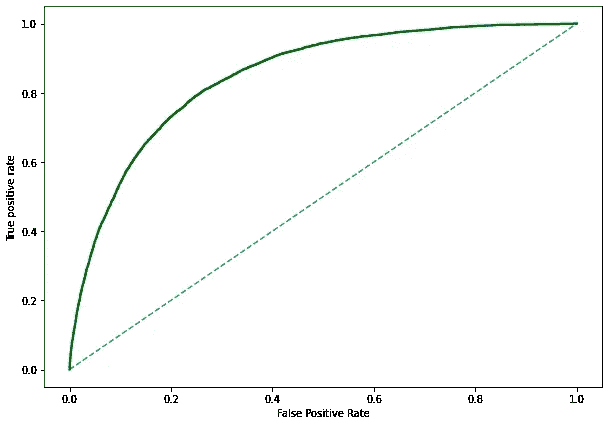

# 数据科学中的女性(WiDS)ka ggle 上的 Datathon

> 原文：<https://towardsdatascience.com/women-in-data-science-wids-datathon-on-kaggle-a3cda3085a7a?source=collection_archive---------40----------------------->

## 我参与 WiDS 的经验和预测糖尿病的有希望的尝试


克里斯蒂娜@ wocintechchat.com 在 [Unsplash](https://unsplash.com?utm_source=medium&utm_medium=referral) 上的照片

第四届年度 WiDS Datathon 关注社会影响，即患者健康，重点关注糖尿病的慢性疾病。

该比赛由 WiDS 全球团队在斯坦福、[西部大数据创新中心](https://westbigdatahub.org)、 [WiDS 数据大会委员会](https://www.widsconference.org/committee-2021.html)组织，并于 [Kaggle](https://www.kaggle.com/c/widsdatathon2021/overview) 发起。

比赛的数据集由麻省理工学院的 GOSSIS(全球开源疾病严重程度评分)倡议提供。

此外，[在线会议](https://www.widsconference.org/conference.html)将于 2021 年 3 月 8 日举行。顶级数据科学女性之声将亲临现场，就各种主题发表见解。

# 只是为了达成共识

**APACHE** —急性生理、年龄和慢性健康评估，美国开发的严重性评分和死亡率估计工具。
**ICU** —重症监护病房，医院或医疗保健机构中提供重症监护药物的特殊部门。
**身体质量指数**——身体质量指数，一种基于身高和体重的身体脂肪测量方法。

# 问题描述

比赛的目标是确定入住 ICU 的患者之前是否被诊断患有糖尿病(一种特殊类型的糖尿病)。

> 您应该使用在患者重症监护的前 24 小时内收集的数据，建立糖尿病预测模型。

你很可能不是医学背景，所以我会推荐你在这里(美国糖尿病协会)阅读一篇简短的疾病概述[。](https://www.diabetes.org/diabetes)

# 数据探索

我从*datadictionarywids 2021 . CSV*文件开始数据探索，详细描述了所有特性。

共有 181 项功能，分为几个类别:

*   人口统计数据
*   阿帕奇协变量
*   阿帕奇共病
*   重要器官
*   实验室
*   实验室血液气体
*   糖尿病标志—目标变量

每个类别提供了每个特性的详细信息，即测量单位、描述、示例等。

在*人口统计*功能组中，我决定看一看每一个功能，并决定它是否对模型构建有用。

*   **Age** 功能会很有用，但是我们需要在功能工程阶段进一步改造它。
*   **IBM** 的功能对我们来说也很有趣，因为根据美国糖尿病协会的规定，任何体重指数高于 25 的人，无论年龄大小，都应该接受糖尿病筛查。
*   **种族**应该不会影响糖尿病，而且看起来大多数情况下它只包含一个种族，所以这个不会被进一步使用。



按种族分列的患者人数

*   **性别**可能有用，但需要使用编码进行转换，因为初始数据集仅包含“F”和“M”值。
*   **身高和体重**已经包含在 IBM 的计算中，因此不再需要。
*   除了 **ICU id** 和**医院入院来源**之外，我不会使用任何与**医院或 ICU 类型**、**、相关的功能。**

*APACHE 协变量、生命体征、实验室和实验室血气组*与各种医学测试的结果相关，因此包含许多内部特征。我决定检查它们和目标变量之间的相关性，而不是使用相关矩阵逐个检查。

对于模型训练，我将使用相关性大于 0.1 阈值的特征。在大多数情况下，选择的特征与葡萄糖浓度和血压有关。



实验室功能组中某些功能的相关矩阵

*阿帕奇共病组*从一些问卷中获取关于患者是否有某些诊断或病症的信息。该组中没有特征被选择，因为与糖尿病没有线性相关性。



APACHE 共病特征组的相关矩阵

探索数据集中有多少 NA 值也很重要。总的来说，大约有。130k 观测值，使用超过 50k NAs 的特性毫无意义。为它们处理缺失值是没有意义的，因为这会用相同的值创建 50k 个观察值，并使模型更加有偏差。

> 数据集是半空的。

深入到这个主题，7 个具有显著相关性的特性每个都有超过 70k 的 NAs，因此我们将放弃它们。作为参考，它们是

*   h1_bun_min 和*_max，
*   h1 _ 肌酐 _ 最小值和* _ 最大值，
*   h1 _ 葡萄糖 _ 最小值和* _ 最大值，
*   h1_diasbp_invasive_min。

也有四个或更多特征缺失的观测值。在缺失值处理过程中，您将获得只是其他观察的副本的观察。我们有 ca。我删除了 19k 个这样的观察值，以保持数据集中的原始分布。

性别特征缺失值替换为模式。其他 NAs 将被替换为中间值。

> 应在训练/测试分割后处理缺失值，因为训练数据集可能会影响测试数据集。

# 特征工程

我使用常识、与目标变量的相关性和 NAs 阈值选择了最终的特征集。他们是

*   年龄，
*   bmi，
*   icu_id，
*   医院 _ 入院 _ 来源，
*   性别，
*   d1_bun_min 和*_max，
*   d1 _ 肌酐 _ 最小值和* _ 最大值，
*   d1 _ 葡萄糖 _ 最小值和* _ 最大值，
*   h1 _ 葡萄糖 _ 最小值和* _ 最大值，
*   arf_*、bun_*、葡萄糖 _*和肌酐 _apache。

如图所示，年龄和诊断为糖尿病的人的百分比之间存在相关性。



年龄特征也可以被分组到箱中。然而，不清楚应该创建多少个箱，以及选择哪一个——固定宽度宁滨还是自适应宁滨。所以你需要试验一下，找到最合适的形式。我添加了年龄特性，没有做任何转换。

所有分类特征都应该使用编码进行转换。例如，具有“F”和“M”值的年龄特征应该转换为具有 0 和 1 值的特征。这可以通过使用 [scikit-learn 编码器](https://scikit-learn.org/stable/modules/preprocessing.html#preprocessing-categorical-features)之一来实现。

# 模特培训

为了找到最佳参数，我使用了带有两个评分标准的 [GridSearch](https://scikit-learn.org/stable/modules/generated/sklearn.model_selection.GridSearchCV.html) ，并优化了以下参数:n_estimators、max_depth、learning_rate 和 alpha。GridSearch 也使用交叉验证，所以我把折叠数设为 3 (cv=3)。这非常有用，因为这样你就不需要单独运行交叉验证了。

```
scor = {'AUC': 'roc_auc', 
        'Accuracy': metrics.make_scorer(metrics.accuracy_score)}
grid_param = {"colsample_bytree": [1],
              "learning_rate": [0.01, 0.1, 0.5],
              "n_estimators": [250, 300, 500],
              "alpha": [0.1, 0.5, 1],
              "max_depth": [2, 4, 5, 10]}
model = xgb.XGBClassifier(learning_rate = 0.1, alpha = 0.1)
grid_mse = GridSearchCV(estimator=model, param_grid=grid_param,
                        scoring=scor, cv=3, verbose=1, refit='AUC')
grid_mse.fit(x_train, y_train)
print("Best parameters found: ", grid_mse.best_params_)
```

有时参数的最佳值可能是我的网格值的最大值或最小值。所以我用这个参数的不同值再次运行 GridSearch。此外，您可以指定几个评分标准来进行更全面的评估。

也有像 GridSearch 这样的其他选择，例如[随机搜索](https://scikit-learn.org/stable/modules/generated/sklearn.model_selection.RandomizedSearchCV.html#sklearn.model_selection.RandomizedSearchCV)或任何其他方法。

# 模型评估

看一下学习曲线，很明显曲线之间的差距很小。它表明了我们模型的低方差。训练集中的误差并不是很高，因为该模型的精度约为 0.85。尽管如此，我们希望它变得更好。

在这种情况下，添加更多的观察值对我们没有帮助，因为模型的方差很低。看起来，增加模型的复杂性应该可以改善它，即增加新的功能或使用更复杂的算法。

> 如果学习曲线与您想要的准确度更高之间有很小的差距，额外的复杂性会有所帮助。



中华民国 UAC 证实了通过探索学习曲线得出的结论。曲线下面积为 0.85，这是一个很好的结果，但还可以改进。



尽管这是一个很好的起点，但模型本身肯定不能给我们所期望的精确度。它可以用作集成模型中的分类器之一。

# 摘要

总的来说，参与 WiDS 竞赛和研讨会让您有机会学习新方法、提出问题并与志同道合的专业人士讨论解决方案。

> 竞争。学习。成长。

不管你是数据科学的新手还是老手，你都可以从 WiDS Datathon 委员会找到一些教程来帮助你入门。