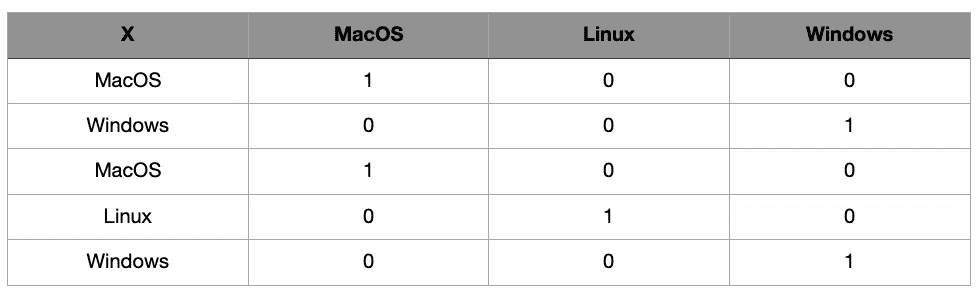
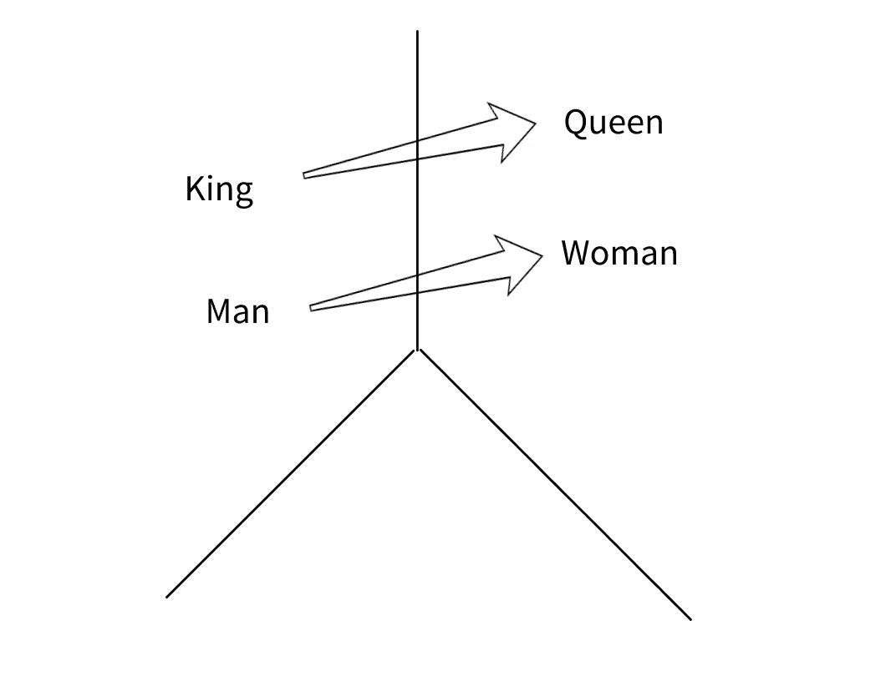
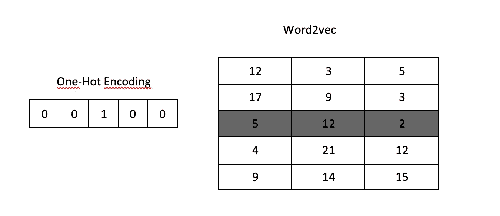
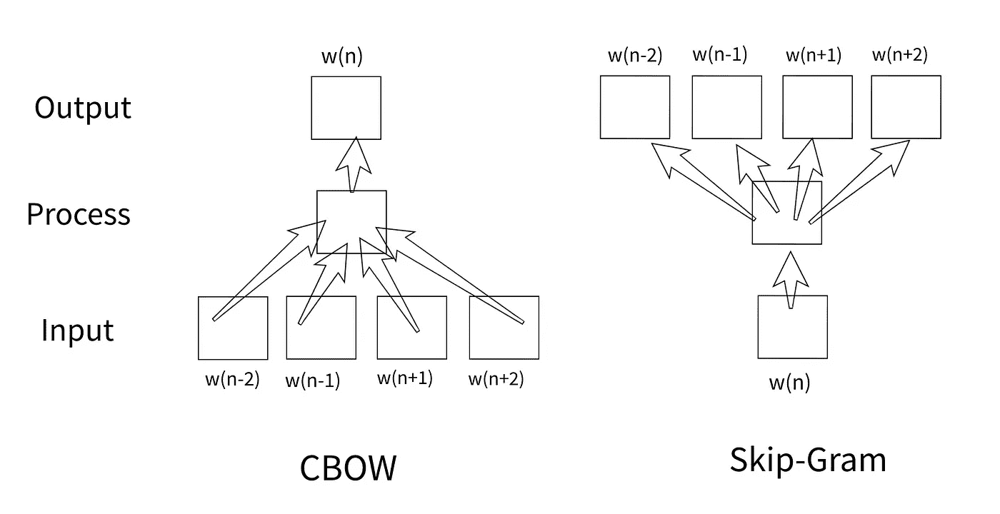

# 单词嵌入技术:Word2Vec 和 TF-IDF 讲解

> 原文：<https://towardsdatascience.com/word-embedding-techniques-word2vec-and-tf-idf-explained-c5d02e34d08?source=collection_archive---------1----------------------->

*需要让这些词对机器学习或深度学习算法有意义。因此，它们必须用数字来表示。诸如 One Hot Encoding、TF-IDF、Word2Vec、FastText 之类的算法使单词能够以数学方式表示为用于解决此类问题的单词嵌入技术。*


Camille Orgel 在 [Unsplash](https://unsplash.com/photos/SKcTKYNRvHY) 上拍摄的照片

# 单词嵌入

单词嵌入技术用于以数学方式表示单词。One Hot Encoding、TF-IDF、Word2Vec、FastText 是常用的单词嵌入方法。根据数据处理的状态、大小和目的，这些技术中的一种(在某些情况下是几种)是首选的。

## *一个热编码

用数字表示数据的最基本的技术之一是热编码技术[1]。在这种方法中，按照唯一单词总数的大小创建一个向量。向量的值被分配，使得属于其索引的每个单词的值是 1，而其他的是 0。作为一个例子，可以研究图 1。



图一。一个热编码的样本

在图 1 中，名为“X”的列由 3 个不同的单词组成。当对该列应用一个热编码时，创建了表示每个表达式的 3 个不同的列(换句话说，为每行创建了 3 个单位向量)。对应于每行中单词的列用值 1 填充，其他的用 0 填充。因此，这些表达被数字化了。它通常用于没有太多语言数据多样性的情况，并且不需要表示数据之间的语义和统计关系。

## * TF-IDF

TF-IDF 是一种统计方法，用于确定文档中单词的数学意义[2]。矢量化过程类似于热编码。或者，对应于该单词的值被赋予 TF-IDF 值而不是 1。TF-IDF 值通过将 TF 和 IDF 值相乘获得。作为一个例子，让我们找到由 1 个句子组成的 3 个文档的 TF-IDF 值。

> [他是沃尔特]，
> 
> [他是威廉]，
> 
> [他不是彼得或九月]

在上面的例子中，“他”在所有 3 个文档中使用，“是”在 2 个文档中使用，“或”只在一个文档中使用。根据这些，我们分别求出 TF，然后求出 IDF 值。

*   ***TF(词频)***

用最简单的术语来说，术语频率是文档中目标术语的数量与文档中术语总数的比率。如果根据上面的例子计算 TF 值，它将是

[0.33, 0.33, 0.33],

[0.33, 0.33, 0.33],

[0.20, 0.20, 0.20, 0.20, 0.20]

*   ***IDF (* 逆文档频率 *)***

IDF 值是文档总数与目标术语出现的文档数之比的对数。在这个阶段，这个术语在文档中出现多少次并不重要。确定是否通过就足够了。在这个例子中，要取的对数的底值被确定为 10。但是，使用不同的值没有问题。

“他”:Log(3/3)= 0，

“是”:Log(3/2):0.1761，

“或者，彼得，.”:对数(3/1) : 0.4771

因此，获得了 TF 和 IDF 值。如果使用这些值创建矢量化，首先会为每个文档创建一个向量，该向量由等于所有文档中唯一单词数量的元素组成(在本例中，有 8 个术语)。在这个阶段，有一个问题需要解决。如术语“he”所示，由于 IDF 值为 0，因此 TF-IDF 值也将为零。但是，在矢量化过程中没有包含在文档中的单词(例如，第一句中没有包含短语“Peter”)将被赋值为 0。为了避免混淆，对 TF-IDF 值进行平滑处理以进行矢量化。最常见的方法是在获得的值上加 1。根据目的，可以在以后对这些值应用规范化。如果矢量化过程是根据上述内容创建的；

[1\. , 1.1761 , 1.4771 , 0\. , 0\. , 0\. , 0\. , 0.],

[1\. , 1.1761 , 0\. , 1.4771 , 0\. , 0\. , 0\. , 0.],

[1\. , 0\. , 0\. , 0\. , 1.4771 , 1.4771, 1.4771 , 1.4771],

## * Word2Vec

Word2vec 是另一种常用的单词嵌入技术。扫描整个语料库，并通过确定目标单词更经常出现的单词来执行向量创建过程[3]。这样，单词之间的语义接近度也就显现出来了。例如，让序列中的每个字母..x y A z w..,..x y B z k..和..x l C d m…代表一个单词。在这种情况下，word_A 会比 word_C 更接近 word_B，当在向量构成中考虑到这种情况时，单词之间的语义接近程度就用数学来表示了。



图二。单词相似度

图 2 显示了 Word2Vec 中最常用的图像之一。这些单词之间的语义接近度是向量值彼此之间的数学接近度。经常举的一个例子是“国王-男人+女人=王后”这个等式。这里发生的情况是，作为向量彼此相减和相加的结果而获得的向量值等于对应于“queen”表达式的向量。可以理解，单词“king”和“queen”彼此非常相似，但向量差异仅因其性别而产生。

在 Word2Vec 方法中，与 One Hot Encoding 和 TF-IDF 方法不同，执行无监督学习过程。通过人工神经网络对未标记的数据进行训练，以创建生成单词向量的 Word2Vec 模型。与其他方法不同，向量大小不像语料库中唯一单词的数量那么多。向量的大小可以根据语料库的大小和项目的类型来选择。这对于非常大的数据尤其有益。例如，如果我们假设在大型语料库中有 300 000 个唯一单词，当用一个热编码执行向量创建时，为每个单词创建 300 000 大小的向量，其中只有一个元素的值为 1，其他元素的值为 0。然而，通过在 Word2Vec 侧选择向量大小 300(它可以根据用户的选择或多或少)，避免了不必要的大尺寸向量操作。



图 3。Word2Vec 模型中单词的矢量化

“Royal”的矢量化可以在图 3 中看到。如果用一个热编码将五个单词句子中的单词“Royal”矢量化，则获得第一个向量表达式(输入向量)。可以看出，这个向量的大小和句子中的总字数一样多。但是，如果矢量化过程是用 Word2Vec 完成的，这一次将创建一个包含三个单位[5，12，2]的向量。

ka ggle([https://www.kaggle.com/anu0012/hotel-review](https://www.kaggle.com/anu0012/hotel-review))中的酒店评论数据集用于应用 Word2Vec 模型训练。作为例子给出的所有代码都可以在[这里](https://github.com/ademakdogan/word2vec_generator)找到。

因为区分大小写，所以所有单词都转换成小写。然后，清除特殊字符和停用词。nltk 库用于无效单词。如果需要，这些单词也可以完全手动确定。执行这些操作之前的一个例句如下。

*“我丈夫和我在这家酒店住过几次。虽然不是最高档的酒店，但我们喜欢这样的事实，我们可以步行大约英里到芬威。它很干净，工作人员也很通融。我唯一的抱怨是浴室里的风扇很吵，而且当你开灯的时候它会自动运转，我们也尽可能地让灯保持关闭。我们住过收费较高的酒店，包括网络和早餐。会再次留在那里。”*

数据预处理后会出现的新情况如下。

*“丈夫住过的酒店时代虽然最华丽的酒店爱事实步行英里芬威清洁员工住宿投诉范浴室噪音去自动关灯试着保持轻多可能我们住过的酒店收费较高互联网早餐包括住宿”*

这些过程完成后，进行 Word2Vec 训练。培训期间使用的参数:

**min_count :** 目标词在语料库中出现的最小次数。特别是对于非常大的复合病毒，保持这个限制较高会增加更多的成功率。但是，对于小型数据集，保持较小的大小会更准确。

**窗口:**直接影响目标表达式向量计算的是相邻词的数量。比如“他是一个很好的人。”对于 window =1，单词“a”和“good”在“very”单词向量的形成中是有效的。当 window = 2 时，单词“是”、“一个”、“好”和“人”在创建“非常”单词向量时是有效的。

**size :** 它是为每个元素创建的向量的大小。

**alpha :** 初始学习率

**min_alpha :** 是训练时学习率会线性下降的最小值。

**sg :** 指定训练算法将如何工作。如果 sg 的值为 1，则使用 skip-gram 算法，否则使用 CBOW 算法。



图 4。Skip-gram vs CBOW

CBOW(连续单词包)和 Skip-gram 算法之间的区别可以在图 4 中看到。在使用 CBOW 算法的训练中，与目标单词相邻的单词作为输入给出，而目标单词本身作为输出获得。在 skip-gram 算法中，目标单词本身作为输入给出，相邻单词作为输出获得。

**工作人员:**培训可以并行进行。用于此目的的内核数量可以通过 workers 参数来确定。

如果您想通过使用作为训练结果获得的模型来查看单词“great”的向量；

```
w2v_model["great"]
>>>array([ 3.03658217e-01, -1.56424701e-01, -8.23674500e-01,
.
.
.-1.36196673e-01,  8.55127215e-01, -7.31807232e-01,  1.36362463e-01],
      dtype=float32)print(w2v_model["great"].shape)
>>>(300,)
```

最接近“伟大”、“可怕”、“波士顿”、“代客”的 10 个词如下。

```
w2v_model.wv.most_similar(positive=["great"])
>>>[('excellent', 0.8094755411148071),
 ('fantastic', 0.7735758423805237),
 ('perfect', 0.7473931312561035),
 ('wonderful', 0.7063912153244019),
 ('good', 0.7039040327072144),
 ('amazing', 0.6384587287902832),
 ('loved', 0.6266685724258423),
 ('nice', 0.6253951787948608),
 ('awesome', 0.6186609268188477),
 ('enjoyed', 0.5889394283294678)]
---------------------------------
w2v_model.wv.most_similar(positive=["terrible"])
>>>[('bad', 0.5275813341140747),
 ('poor', 0.504431962966919),
 ('horrible', 0.4722219705581665),
 ('awful', 0.42389577627182007),
 ('worst', 0.40153956413269043),
 ('dirty', 0.3467090427875519),
 ('disgusting', 0.32588857412338257),
 ('horrendous', 0.3157917261123657),
 ('lousy', 0.30114778876304626),
 ('uncomfortable', 0.3005620837211609)]
---------------------------------
w2v_model.wv.most_similar(positive=["boston"])
>>>[('chicago', 0.519180417060852),
 ('seattle', 0.5126588940620422),
 ('dc', 0.4830571711063385),
 ('bostons', 0.4459514617919922),
 ('copley', 0.4455355107784271),
 ('city', 0.44090309739112854),
 ('newbury', 0.4349810481071472),
 ('fenway', 0.4237935543060303),
 ('philadelphia', 0.40892332792282104),
 ('denver', 0.39840811491012573)]
---------------------------------
w2v_model.wv.most_similar(positive=["valet"])
>>>[('parking', 0.7374086380004883),
 ('car', 0.6263512969017029),
 ('garage', 0.6224508285522461),
 ('retrieving', 0.5173929929733276),
 ('self', 0.5013973712921143),
 ('inandout', 0.4847780168056488),
 ('selfpark', 0.47603434324264526),
 ('fee', 0.47458043694496155),
 ('per', 0.4741314947605133),
 ('parked', 0.4707031846046448)]
```

## *快速文本

FastText 算法的工作逻辑类似于 Word2Vec，但最大的不同是它在训练时也使用了 N 元词[4]。虽然这增加了模型的大小和处理时间，但它也赋予了模型预测单词的不同变化的能力。例如，假设单词“Windows”在训练数据集中，我们希望在训练结束后获得单词“Wndows”的向量。如果将 Word2Vec 模型用于这些操作，将会给出一个错误，即字典中不存在单词“Wndows ”,并且不会返回任何向量。但是，如果 FastText 模型用于此过程，则 vector 将返回，单词“Windows”将是最接近的单词之一。如上所述，训练中不仅包括单词本身，还包括 N-gram 变体(例如单词“Windows”-> Win、ind、ndo、dow、ows 的 3-gram 表达式)。尽管 FastText 模型目前在许多不同的领域中使用，但它经常是首选，尤其是在 OCR 工作中需要单词嵌入技术时。特别是与其他不能容忍最轻微 OCR 错误的技术相比，FastText 在获取不直接在其自身词汇表中的偶数单词的向量方面提供了很大的优势。正因如此，在可能出现用词错误的问题上，它比其他备选方案领先一步。

上述矢量化方法是当今最常用的技术。每一种都有不同的用途。在需要进行单词矢量化的研究中，应该首先确定问题，然后根据这个问题优先选择矢量化技术。事实上，每种技术都有不同的优势。

除此之外，还有语境表征，如 ELMO 和伯特[5]。这些问题将在下一篇文章中讨论。

## 开源代码库

所有代码都可以在[https://github.com/ademakdogan/word2vec_generator](https://github.com/ademakdogan/word2vec_generator)找到。在这个项目中，word2vec 训练可以根据任何所需 csv 文件中确定的列自动完成。将作为操作结果创建的 word2vec 模型保存在“model”文件夹下。下面是用法示例。这个项目也可以在 docker 上运行。src/training.py 中的参数可以根据数据大小进行优化。

```
python3 src/w2vec.py -c </Users/.../data.csv> -t <target_column_name>
```

**Github:**【https://github.com/ademakdogan】T4

**领英:**[https://www.linkedin.com/in/adem-akdo%C4%9Fan-948334177/](https://www.linkedin.com/in/adem-akdo%C4%9Fan-948334177/)

# 参照符号

[1]史蒂文斯，S. S. (1946)。《论测量的尺度》。*科学，新系列*，103.2684，677–680。

[2]会泽明子(2003)。“TF-IDF 测量的信息论观点”。*信息处理与管理*。 **39** (1)，45–65。[doi](https://en.wikipedia.org/wiki/Doi_(identifier)):[10.1016/s 0306–4573(02)00021–3](https://doi.org/10.1016%2FS0306-4573%2802%2900021-3)

[3]托马斯·米科洛夫等人(2013 年)。“向量空间中单词表示的有效估计”。[arXiv](https://en.wikipedia.org/wiki/ArXiv_(identifier)):[1301.3781](https://arxiv.org/abs/1301.3781)

[4]阿曼德·朱林，爱德华·格雷夫，皮奥特·博亚诺斯基，托马斯·米科洛夫，(2017)。“有效文本分类的锦囊妙计”，会议:计算语言学协会欧洲分会第 15 届会议论文集:第 2 卷。

[5]德夫林·雅各布，常明伟，李·肯顿，图塔诺娃·克里斯蒂娜，(2018)。“BERT:用于语言理解的深度双向转换器的预训练”