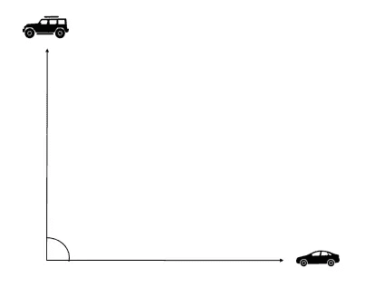
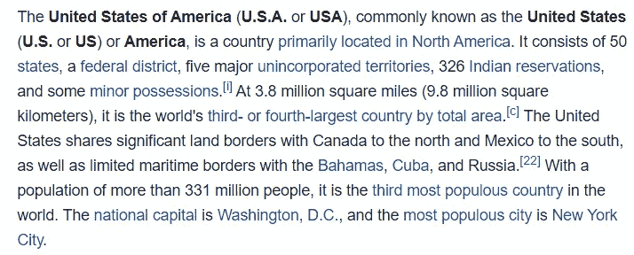
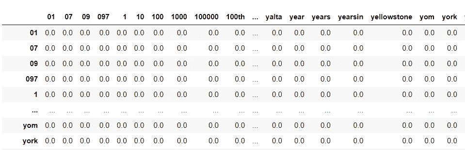
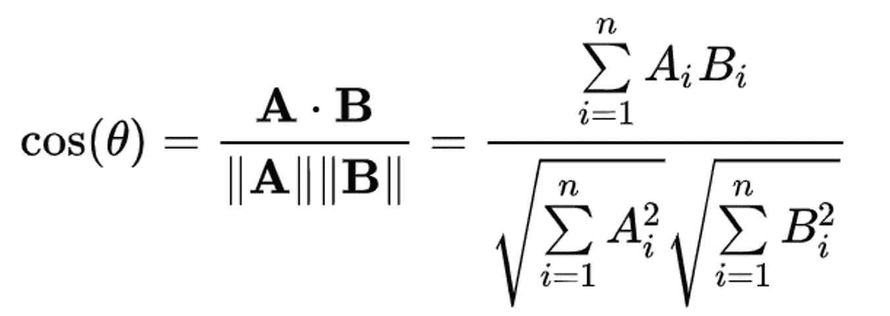
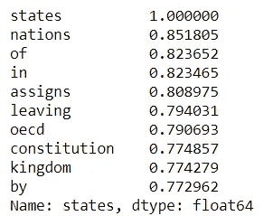
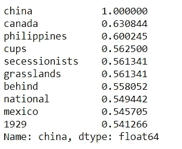

# 词向量直觉和共现矩阵

> 原文：<https://towardsdatascience.com/word-vectors-intuition-and-co-occurence-matrixes-a7f67cae16cd?source=collection_archive---------8----------------------->


照片由[@拉斐尔摄影](https://unsplash.com/@raphaelphotoch)—Unsplash.com 拍摄

如果你对自然语言处理做过一些研究，你可能会偶然发现单词向量的概念。虽然这个概念似乎很直观，但如果你没有数据科学或机器学习方面的知识，可能会有点难以理解。

在这篇文章中，我们将检查构建单词向量背后的一些直觉，并了解当我们谈到几个 NLP 应用程序时，为什么它们是相关的。我们将使用一个简单的共现概念来解释为什么一键向量不是将单词表示为数字的最佳方法。

让我们先用两个词来举例——*车*和*吉普。*对于人类来说，这两个词可能有某种程度的相似性，因为我们知道*吉普车*和*汽车*有相似的特征——它们都是有发动机的四轮车辆，用于运输或休闲目的。我们可以用这样的短语:

*   吉普车是汽车的一种。
*   我的*车*是一辆*吉普。*
*   *吉普车*类似于其他*汽车*
*   *吉普*类似于*车，*但不是*车。*


一辆吉普车与其他汽车有一些共同的特征(照片由[@ neon brand](https://unsplash.com/@neonbrand)—Unsplash.com 拍摄)

**一个有意思的事情是*车*和*吉普*都可能在一句话里做替身:**

*   我正骑着我的*车*去海滩；
*   我正骑着我的吉普车去海滩；

这两个词都被描绘成主体用来走向海滩的物体。这两个词也可以属于*车辆的范畴:* **通常有轮子和发动机的机器，用于运送人或货物，尤指在陆地上。**

我们人类有能力以一种非常简单的方式理解这两个词之间的相似性，因为当我们阅读这两个词时，我们可以在脑海中创建一辆汽车或一辆吉普车的图像。但是计算机怎么能像你我一样理解这两个词之间的这些概念呢？

让我们先做一些基本的实验——在排序单词时，我们能想到的第一个方法是按字母顺序排序。我们现在把字母表看成是某种固有的顺序，所以，让我们天真地假设这可能会把相似的单词组合在一起。

*   *汽车*以 *c* 启动
*   *吉普*始于 *j*

我们可以想出一大堆介于字母表中的*车*和*吉普*之间的单词——比如*爸爸*、*欧洲*、*决赛*、*痒*。所有这些单词都有完全不同的意思，所以我们可以排除这个想法。

如果我们比较单词的字母呢？有些词表达了相似的意思，有相似的字母，例如:

*   *创建*和*创建*
*   *书*和*书架*

不幸的是，英语并没有那么简单。*吉普*和*轿车，*为例，不共用任何字母。而*鹿*和*深*呢？他们共享四个字母中的三个，他们的意思不可能不同。

似乎使用单词中包含的字母是一个微不足道的练习。我们还可以根据上下文，在单词和相似单词之间建立一个巨大的查找表。但是想象一下，为了跟踪特定语言的自然进化而更新那个表会有多混乱。

让我们尝试另一种方法——用更“数学”的方式来看待我们的单词。

# 一个热点向量方法

直接看我们的信看起来像是一个不会给我们带来任何结果的练习。很自然，随之而来的是某种想法，将我们的文字表示为数字。

将一个单词表示为单个数字会导致我们得到与按字母顺序比较单词相同的结果——我们必须附加一个单词的单个数字。这个数字旁边的单词在某种程度上会被认为是相似的单词，我们仍然会有正确排序的问题。

所以，一个可行的方法是，我们可以用多维数字的方式来表示我们的单词。我们可以使用的一种数据结构是**数组(或向量)——例如**:

```
[1, 0, 0, 0, 0]
```

上面的数组是一个**独热向量**的例子——一个向量在单个值中包含 1，在其他值中包含 0。这些热点向量可以用来表示我们称之为词汇表的一组单词中的特定单词。

回到我们的例子，让我们想象我们的词汇将由以下单词组成:

*   自行车
*   步行
*   吉普车
*   汽车
*   卡车
*   自行车

看着这些单词，我们可以建立几个心理“集群”:

*   所有这些单词都与一个人从一个地方移动到另一个地方的方法有关。
*   看起来最“关”的词是*走*这个词
*   人们可以把两轮车(自行车和三轮车)与四轮或四轮以上的车(卡车、轿车和吉普车)区分开来。

我们能否重建数组，以某种方式传达这些单词的细节？

让我们先来整理一下我们的词汇:

```
bike, bicycle, car, jeep, truck, walk
```

现在，用我们的单词代替 0，将上面的元素转换成数组格式:

```
[0, 0, 0, 0, 0, 0]
```

我们现在可以用一个热点向量来表示我们的单词，例如:

*   自行车用[1，0，0，0，0，0]来表示
*   行走由[0，0，0，0，0，1]表示

这些词向量的主要问题是它们是**正交的。**我在这里就不跟你讲数学了，但是，这意味着这些向量的点积大约为 0——如果我们以二维方式可视化*汽车*和*吉普车*的向量:



一个热点向量的二维表示——由平面图标表示的图标

这些向量之间的角度约为 90 度。这将引起一些麻烦，因为代表*汽车*和*吉普车*的向量之间的相似性将与*汽车*和*步行*或*汽车*和*自行车之间的相似性完全相同。*

**我们如何以向量反映相似性的方式来表示这些向量？**

# 共现表示

同现表示帮助你建立单词的上下文。没有什么比语言学家约翰·弗斯的话更能阐明这个概念了:

> *“从一个人交的朋友就可以知道他说的一句话”*

事实上，一个词是由其上下文反映出来的。让我们想象一些简单的句子来反映这一点:

*   我正开车去海滩。
*   我开着我的吉普车去海滩。
*   我的汽车是一辆吉普车。
*   我的吉普车是一辆小汽车。
*   我昨天吃了一根香蕉。
*   我昨天吃了一个桃子。

正如你可能意识到的，意思完全不同的单词在同一上下文中同时出现的可能性极小。**让我们称之为单词的上下文，即围绕在特定单词两边的两个单词**——例如在句子*中，我昨天吃了一个桃子，*桃子这个单词被以下单词所包围:

*   昨天吃了一个

在这些单词中，你找到不同于食物的东西的可能性很小。你不会发现下面这句话的可能性:

> 我昨天吃了一辆吉普车

或者

> 我昨天吃了一辆自行车

这就是共现表征背后的主要原理——彼此相似的单词往往会一起共现。最常见的共现表示是单个单词的单词表示。让我们检查一下！

# 共生矩阵

为了构建共现矩阵，我们必须从特定语料库中的完整词汇开始，就像我们在 one-hot vector 部分中所做的那样——让我们看看上面示例中这组句子的词汇，考虑单个 gram:

```
a, ate, banana, beach, car, in, is, I’m, jeep, my, riding, to, the, yesterday
```

在上面所有的句子中，我们的词汇由一组不同的单词组成。与 one-hot vectors 类似，我们的向量将由大小为 *k、*的向量组成，其中 *k* 是不同单词的数量——让我为单词 *car* 初始化一个示例向量:

```
[0, 0, 0, 0, 0, 0, 0, 0, 0, 0, 0, 0, 0, 0]
```

在我们的句子中，单词 *car* 出现在三个句子中:

> 我正骑着我的车**去**海滩**。**
> 
> 我的车**是一辆**吉普。
> 
> **我的**吉普**是一辆**车。

**我已经标出了句子中所有与单词 *car* 同时出现的单词。**如果我们将 **1** 加到每个共现的元素上，返回的单词向量会是多少？—更新单词 *car* 的向量:

```
a, ate, banana, beach, car, in, is, I’m, jeep, my, riding, to, the, [2,   0,     0,     0,   0,  1,  2,   0,    0,  2,      0,  1,   1, yesterday
0]
```

这个共现向量现在将表示单词 car。

如果我们为单词 *jeep* 建立相同的向量会怎么样？查看我们的示例:

> 我的车是一辆吉普车。
> 
> 我正骑着我的吉普车去海滩。
> 
> 我的车**是一辆**吉普。

产生的共现向量将是:

```
a, ate, banana, beach, car, in, is, I’m, jeep, my, riding, to, the, [2,   0,     0,     0,   0,  1,  2,   0,    0,  2,      0,  1,   1, yesterday
0]
```

如果你注意到了，这个向量和我们对单词 *car 的向量完全一样。发生这种情况是因为，在我们的句子中，这些单词往往与相同的单词同时出现。这似乎是一个有前途的方法！*

如果我们检查单词 banana 的向量，共现向量完全不同:

> 我**昨天吃了一根**香蕉**。**

```
a, ate, banana, beach, car, in, is, I’m, jeep, my, riding, to, the, [1,   1,     0,     0,   0,  0,  0,   0,    0,  0,      0,  0,   0, yesterday
1]
```

****我们为单词 banana 生成的向量与为 Jeep 和 Car 生成的向量完全不同。****

**我几乎能听到你在想——“*等一下……**这些例子似乎都是为了符合解释*”而吹毛求疵。**

**这倒是真的！为了检查这在更大的文本中是否有意义，让我们在维基百科的一篇文章上做一个快速实现。**

**之后我们将学习如何量化向量之间的关系(提示:**相似性度量！**)**

# **大文章单词共现**

**让我们直接进入 Python 实现，在这里我们将提取维基百科*美利坚合众国*文章中所有单词的共现向量— **首先，让我们检索数据并将其标记化**(不要担心代码，我们最后会有一个要点！):**

```
def retrieve_page(page_name: str) -> list:
    '''
    Retrieves page data from wikipedia
    and stores words in lower case format in
    a list - tokenized format.
    '''
    usa_article = wikipedia.page(page_name)
    # Strip puncuation from page
    usa_article = (
        usa_article.content.translate(str.maketrans('', '', string.punctuation))
    )
    # Lower text case
    usa_article = usa_article.lower()
    # Tokenize using NLTK word tokenizer
    usa_article_token = word_tokenize(usa_article)
    return usa_article_tokenusa_article_token = retrieve_page('United States of America')
```

****我们的 *usa_article_token* 以标记化的格式包含了整个维基百科文章**——让我们看看文章的第一段:**

****

**美国维基百科文章的第一段**

**从文章中提取所有句子后，我们能够理解每个单词的上下文——在上面的文本中，单词*平方*(第四行)具有以下上下文，去掉标点符号: **3.8，百万，英里，9.8****

**鉴于此，我们现在可以为文本中的每个单词构建共现向量，让我们编码吧！**

**从构建我们的词汇开始，词汇将由我们的共现向量的大小组成:**

```
def build_vocabulary(page:list) -> list:
    '''
    Builds vocabulary with all the words
    present in the list page.
    '''
    vocab = list(set(page))
    vocab.sort()

    vocab_dict = {}
    for index, word in enumerate(vocab):
        vocab_dict[word] = index
    return vocab_dictvocab_dict = build_vocabulary(usa_article_token)
```

**警告:由于维基百科文章的更新，当您运行这段代码时，词汇表的大小可能会有所不同。**

**我们的词汇表中有大约 3.640 个单词——我们的 *vocab_dict* 对象包含单词和索引之间的映射——这个索引将使我们能够更快地填充共现向量。**

**将我们的同现矩阵初始化为 0-我将使用熊猫数据框来简化可视化:**

```
co_ocurrence_vectors = pd.DataFrame(
    np.zeros([len(vocab_dict), len(vocab_dict)]),
    index = vocab_dict.keys(),
    columns = vocab_dict.keys()
)
```

**这是我们初始化的共现矩阵的大致外观——行由单词 *i* 的索引组成，列由单词 *j* 与单词 *i.* 共现 *n 次组成***

****

**现在，根据上下文，每当我们在我们在行中看到的单词的上下文中看到特定的单词时，我将添加 **1** 。**例如，在本文中，单词*表示*应该与单词 *United* 以及可能的 *America* 同时出现。****

**使用 Python 更新矩阵:**

```
def build_context(
    page:str, 
    co_ocurrence_vectors: pd.DataFrame
) -> pd.DataFrame:
    '''
    Updates co-ocurrence vectors based on
    text read from the page.
    '''
    for index, element in enumerate(page):
        # Build start and finish of context
        start = 0 if index-2 < 0 else index-2
        finish = len(page) if index+2 > len(page) else index+3 # Retrieve Context for word
        context = page[start:index]+page[index+1:finish]
        for word in context:
            # Update Co-Occurrence Matrix 
            co_ocurrence_vectors.loc[element, word] = (
                co_ocurrence_vectors.loc[element, word]+1
            )

    return co_ocurrence_vectorsco_ocurrence_vectors = build_context(usa_article_token, co_ocurrence_vectors)
```

**现在，我们可以从我们的共现矩阵中提取与*状态*共现更多的词，例如前 10 个词:**

```
co_ocurrence_vectors.loc['states'].sort_values(ascending=False).head(10)
```

****

**与州共现的前 10 个单词**

***是与文本共现次数最多的第一个词——在我们的文本中出现了 189 次(在两个邻居的窗口中)，其次是 *united* 和 *is。*另一方面，*美国*是第九个——如果你注意到这篇文章，*美国*在整篇文章中被用作*美利坚合众国*的别名，所以，这是有道理的。***

*****爽！所以我们现在有了 3.640 个单词的多维向量。*****

***我们如何衡量它们的相似性？***

# ***余弦相似性***

***测量两个向量之间相似性的最常见方法之一是使用余弦相似性——测量任意向量*A 和向量 ***B*** 之间的相似性:****

********

****余弦相似性公式(来自维基百科)****

****在我们的例子中，我们将有 3.640 个元素****

******余弦相似性为我们提供了一种相似性度量，其范围在以下值之间:******

*   ****1 如果向量真的相似；****
*   ****如果向量没有任何关系(正交向量！);****
*   ****如果向量相反，则为-1；****

****按逻辑，相似的词会有更高的余弦相似度。如果向量完全相同，则余弦相似度将为 1。让我们看看维基百科文章中的一些例子——搜索与单词 *States —* **具有高余弦相似度的单词。首先，我们需要使用 *scikit-learn* 实现 *:*** 在文章中的每个单词之间创建余弦相似度****

```
**similarity_words = pd.DataFrame(
    cosine_similarity(co_ocurrence_vectors),
    columns = vocab_dict.keys(),
    index = vocab_dict.keys()
)**
```

****就相似性而言，检查顶部单词与单词*的状态:*****

********

****有些词看起来确实有道理——比如*国家、王国*和*宪法。*其他词有点偏— *离开，的，在—* 但是，即便如此，这些结果还是很有意思。****

****让我们检查另一个词，如*中国:*****

********

****同样，有些词似乎很有意义，比如菲律宾、加拿大和墨西哥等其他国家——但也有一些词看起来很“奇怪”,因为它们与“中国”这个词很接近。****

****当然，我们只使用了维基百科中的一篇文章，所以，我们并不期待完美。如今，共现矩阵是很好的第一手资料，可以很好地掌握单词向量背后的必要性和直觉。****

******使用共现向量有一些缺点，即:******

*   ****同现向量变得很大，很快。你的词汇量越大，你的向量就越大。****
*   ****大多数共生矩阵包含零和无信息。您可以通过使用稀疏格式来解决空间问题，但即使如此，一些罕见的单词可能具有非常糟糕的向量表示。****
*   ****共现向量无法把握对立词的概念。****

****其他技术已经被用于表示单词向量，例如包含压缩版本的 [Word2Vec](https://en.wikipedia.org/wiki/Word2vec) 和可能的*隐藏的*共现表示，后者概括得更好一些。我们将把它留给下一篇文章！****

****以下是这篇文章代码的要点:****

> ****感谢你花时间阅读这篇文章！我希望你喜欢它，并随时添加我到 LinkedIn 或者给我发消息！****

*******这个例子摘自我的*** [***NLP 课程，该课程面向 Udemy 平台上的绝对初学者***](https://www.udemy.com/course/nlp_natural_language_processing_python_beginners/?referralCode=ABA4DB815299652F2A37)***——该课程非常适合初学者和希望学习自然语言处理基础知识的数据科学家。该课程还包含 50 多个编码练习，使您能够在学习新概念的同时进行练习。*******

****[](https://ivopbernardo.medium.com/membership) [## 通过我的推荐链接加入 Medium-Ivo Bernardo

### 作为一个媒体会员，你的会员费的一部分会给你阅读的作家，你可以完全接触到每一个故事…

ivopbernardo.medium.com](https://ivopbernardo.medium.com/membership)****