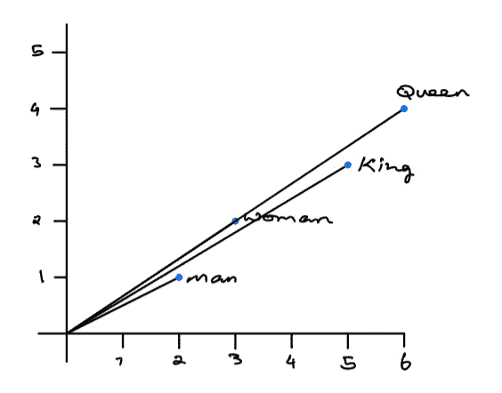
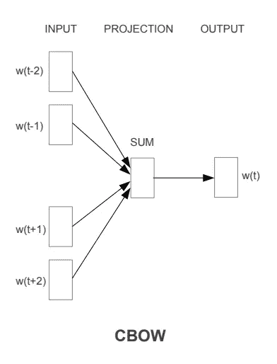
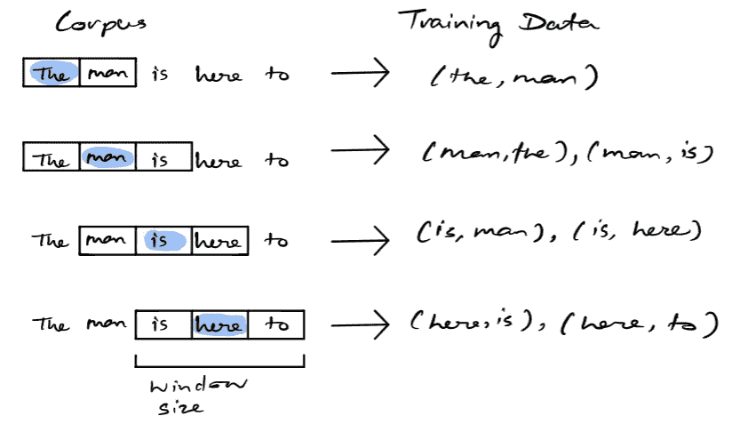
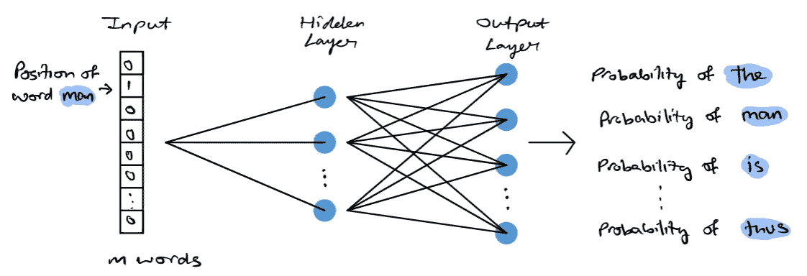
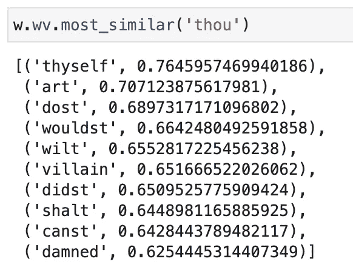
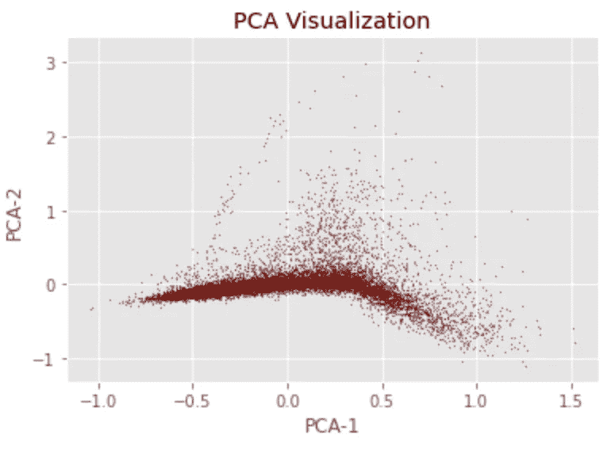

# Word2Vec 解释道

> 原文：<https://towardsdatascience.com/word2vec-explained-49c52b4ccb71?source=collection_archive---------0----------------------->

## 解释 Word2Vec 的直观性&用 Python 实现它


这张照片是由 [Unsplash](https://unsplash.com/photos/GkinCd2enIY) 的 Raphael Schaller 拍摄的

**目录**

*   介绍
*   什么是单词嵌入？
*   Word2Vec 架构
    - CBOW(连续单词包)模型
    -连续跳格模型
*   实现
    -数据
    -需求
    -导入数据
    -数据预处理
    -嵌入
    -嵌入的 PCA
*   结束语
*   资源

# 介绍

Word2Vec 是 NLP 领域的最新突破。 [Tomas Mikolov](https://en.wikipedia.org/wiki/Tomas_Mikolov) 捷克计算机科学家，目前是 CIIRC ( [捷克信息、机器人和控制论研究所](https://en.wikipedia.org/wiki/Czech_Institute_of_Informatics,_Robotics_and_Cybernetics))的研究员，是 word2vec 研究和实现的主要贡献者之一。单词嵌入是解决自然语言处理中许多问题不可缺少的一部分。它们描述了人类如何理解机器的语言。你可以把它们想象成文本的矢量表示。Word2Vec 是一种常见的生成单词嵌入的方法，具有多种应用，如文本相似性、推荐系统、情感分析等。

# 什么是单词嵌入？

在进入 word2vec 之前，让我们先了解一下什么是单词嵌入。了解这一点很重要，因为 word2vec 的整体结果和输出将是与通过算法传递的每个唯一单词相关联的嵌入。

单词嵌入是一种将单个单词转换成单词的数字表示(向量)的技术。其中每个单词被映射到一个向量，然后这个向量以类似于神经网络的方式被学习。向量试图捕捉该单词相对于整个文本的各种特征。这些特征可以包括单词的语义关系、定义、上下文等。有了这些数字表示，你可以做很多事情，比如识别单词之间的相似或相异。

显然，这些是机器学习各个方面的输入。机器不能处理原始形式的文本，因此将文本转换成嵌入将允许用户将嵌入馈送到经典的机器学习模型。最简单的嵌入是文本数据的一个热编码，其中每个向量将被映射到一个类别。

```
For example: have = [1, 0, 0, 0, 0, 0, ... 0]
a    = [0, 1, 0, 0, 0, 0, ... 0]
good = [0, 0, 1, 0, 0, 0, ... 0]
day  = [0, 0, 0, 1, 0, 0, ... 0] ...
```

然而，像这样的简单嵌入有多种限制，因为它们不能捕获单词的特征，并且它们可能非常大，这取决于语料库的大小。

# Word2Vec 架构

Word2Vec 的有效性来自于它能够将相似单词的向量组合在一起。给定一个足够大的数据集，Word2Vec 可以根据单词在文本中的出现次数对单词的含义做出强有力的估计。这些估计产生了与语料库中其他单词的单词关联。例如，像“国王”和“王后”这样的词彼此非常相似。当对单词嵌入进行代数运算时，你可以找到单词相似性的近似。例如,“国王”的 2 维嵌入向量-“男人”的 2 维嵌入向量+“女人”的 2 维嵌入向量产生了与“皇后”的嵌入向量非常接近的向量。注意，下面的值是任意选择的。

```
King    -    Man    +    Woman    =    Queen
[5,3]   -    [2,1]  +    [3, 2]   =    [6,4] 
```



你可以看到 King 和 Queen 这两个词的位置很接近。(图片由作者提供)

word2vec 的成功主要得益于两种架构。跳跃图和 CBOW 架构。

## 连续单词袋

这种架构非常类似于前馈神经网络。这种模型架构本质上试图从上下文单词列表中预测目标单词。这个模型背后的直觉非常简单:给定一个短语`"Have a great day"`，我们将选择我们的目标词为“a”，我们的上下文词为[“have”、“great”、“day”]。这个模型要做的是利用上下文单词的分布式表示来尝试和预测目标单词。



CBOW 架构。图片取自[向量空间中单词表示的有效估计](https://arxiv.org/pdf/1301.3781.pdf)

## 连续跳格模型

skip-gram 模型是一个简单的神经网络，具有一个经过训练的隐藏层，以便在输入单词出现时预测给定单词出现的概率。直觉上，你可以想象跳格模型是 CBOW 模型的对立面。在这种架构中，它将当前单词作为输入，并尝试准确预测当前单词前后的单词。该模型本质上试图学习和预测指定输入单词周围的上下文单词。基于评估该模型准确性的实验，发现在给定大范围的词向量的情况下，预测质量提高了，然而这也增加了计算复杂度。该过程可以直观地描述如下。



为 skip-gram 模型生成训练数据的示例。窗口大小为 3。图片由作者提供

如上所述，给定一些文本语料库，在一些滚动窗口上选择目标单词。训练数据由该目标单词和窗口中所有其他单词的成对组合组成。这是神经网络的最终训练数据。一旦模型被训练，我们基本上可以产生一个单词成为给定目标的上下文单词的概率。下图显示了 skip-gram 模型的神经网络体系结构。



跳格模型架构(图片由作者提供)

语料库可以表示为大小为 N 的向量，其中 N 中的每个元素对应于语料库中的一个单词。在训练过程中，我们有一对目标和上下文单词，输入数组中除目标单词外的所有元素都为 0。目标字将等于 1。隐藏层将学习每个单词的嵌入表示，产生 d 维嵌入空间。输出层是具有 softmax 激活功能的密集层。输出层基本上会产生一个与输入大小相同的向量，向量中的每个元素都由一个概率组成。这个概率指示了目标单词和语料库中的关联单词之间的相似性。

对于这两个模型的更详细的概述，我强烈推荐阅读概述这些结果的原始论文[这里](https://arxiv.org/pdf/1301.3781.pdf)。

# 履行

我将展示如何使用 word2vec 来生成单词嵌入，并通过 [PCA](https://pyshark.com/principal-component-analysis-in-python/) 使用这些嵌入来查找相似的单词和嵌入的可视化。

## **数据**

出于本教程的目的，我们将使用莎士比亚数据集。你可以在这里找到我在本教程中使用的文件，它包括了莎士比亚为他的剧本写的所有台词。

## 要求

```
nltk==3.6.1
node2vec==0.4.3
pandas==1.2.4
matplotlib==3.3.4
gensim==4.0.1
scikit-learn=0.24.1
```

**注意:**因为我们正在使用 NLTK，你可能需要下载下面的语料库来完成本教程的剩余部分。这可以通过以下命令轻松完成:

```
import nltk
nltk.download('stopwords')
nltk.download('punkt')
```

## 输入数据

**注意:**将`**PATH**`变量更改为您正在处理的数据的路径。

## 预处理数据

**停用词过滤注释**

*   请注意，从这些行中删除的停用词是现代词汇。应用程序和数据对于清理单词所需的预处理策略的类型非常重要。
*   在我们的场景中，单词“you”或“yourself”将出现在停用词中，并从行中删除，但是由于这是莎士比亚文本数据，因此不会使用这些类型的单词。相反，“你”或“你自己”可能是有用的删除。保持对这些类型的微小变化的热情，因为它们对好模型和差模型的性能产生了巨大的差异。
*   出于这个例子的目的，在识别不同世纪的停用词时，我不会涉及太多细节，但是请注意，您应该这样做。

## 把…嵌入



莎士比亚资料中与 thou 最相似的单词(图片由作者提供)

## 嵌入的主成分分析



彼此相似的单词将被放置在彼此更靠近的地方。图片由作者提供

Tensorflow 对 word2vec 模型做了非常漂亮、直观和用户友好的表示。我强烈建议您探索它，因为它允许您与 word2vec 的结果进行交互。链接在下面。

<https://projector.tensorflow.org/>  

# 结束语

词嵌入是解决自然语言处理中许多问题的重要组成部分，它描述了人类如何理解机器语言。给定一个大的文本语料库，word2vec 产生一个与语料库中的每个单词相关联的嵌入向量。这些嵌入的结构使得具有相似特征的单词彼此非常接近。CBOW(连续单词包)和 skip-gram 模型是与 word2vec 相关的两个主要架构。给定一个输入单词，skip-gram 将尝试预测输入上下文中的单词，而 CBOW 模型将采用各种单词并尝试预测缺失的单词。

我还写过 node2vec，它使用 word2vec 生成给定网络的节点嵌入。你可以在这里读到它。

</node2vec-explained-db86a319e9ab>  

# 资源

*   [https://arxiv.org/pdf/1301.3781.pdf](https://arxiv.org/pdf/1301.3781.pdf)
*   [https://www . kdnugges . com/2019/02/word-embeddings-NLP-applications . html](https://www.kdnuggets.com/2019/02/word-embeddings-nlp-applications.html)
*   【https://wiki.pathmind.com/word2vec 
*   [https://projector.tensorflow.org/](https://projector.tensorflow.org/)

如果您喜欢阅读这篇文章，请考虑关注我的后续文章，了解其他数据科学材料以及解决数据科学不同领域相关问题的材料(如 word2vec)。这里有一些我写的其他文章，我想你可能会喜欢。

</bayesian-a-b-testing-explained-344a6df88c1a> [## 贝叶斯 A/B 测试解释

towardsdatascience.com](/bayesian-a-b-testing-explained-344a6df88c1a) </recommendation-systems-explained-a42fc60591ed>  </monte-carlo-method-explained-8635edf2cf58>  </markov-chain-explained-210581d7a4a9> 