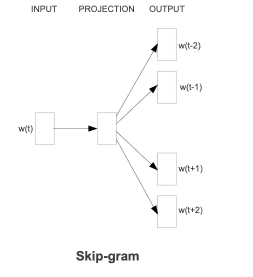

# Word2Vec 研究论文解释

> 原文：<https://towardsdatascience.com/word2vec-research-paper-explained-205cb7eecc30?source=collection_archive---------8----------------------->

*作者图片*(经过语义和句法关系训练的 Word2Vec 向量)。

## 对 word2vec 模型的直观理解和解释。

我们知道什么是 Word2Vec，以及词向量在 NLP 任务中是如何使用的，但是我们真的知道它们是如何被训练的，以及以前训练词向量的方法是什么吗？好吧，这里尝试解释一下我对 Word2Vec 研究论文【T. Mikolov 等人】的理解。你可以在这里找到研究论文。

**1。简介**

在许多 NLP 应用程序中，单词被表示为“一键编码”,这种编码不能捕捉单词之间的关系。选择独热编码的原因是

> *简单、稳健，观察到基于大量数据训练的简单模型优于基于较少数据训练的复杂系统*。[T. Mikolov 等人]

简单模型的一个例子可以是 N 元模型。这些模型是马尔可夫模型，假设在第 I 个位置的单词依赖于从第 i-(n-1)个单词直到第(i-1)个单词的单词历史。它基本上是基于频率的方法，来源于训练语料库。但是这些简单的模型需要高质量的训练数据，而这些数据通常是不可用的，并且它们不能很好地概括看不见的数据。

然而，随着机器学习领域的改进，在大得多的数据集上训练的复杂算法比简单的模型表现得更好。

Word2vec 模型捕捉单词之间的句法和语义相似性。关于训练的 word2vec 向量的向量代数的一个众所周知的例子是

> *向量(“国王”)-向量(“男人”)=向量(“女王”)-向量(“女人”)。*

## ***2。用于单词的矢量表示的先前方法***

这一部分集中于使用神经网络的单词的矢量表示的早期方法。

[2。1 神经网络语言模型(NNLM)](https://www.jmlr.org/papers/volume3/tmp/bengio03a.pdf) 【本吉奥，约舒厄等】

这是一个两步语言模型，包括用于单词嵌入的线性投影层和非线性隐藏层，后面是输出层。在 NNLM 中同时训练单词向量和语言模型。

NNLM 建筑模型。图片来自 NNLM 研究论文。[ [来源](https://www.jmlr.org/papers/volume3/tmp/bengio03a.pdf)

NNLM 模型由输入层、投影层、隐含层和输出层组成。超参数 N 决定在下一个单词预测中应该考虑多少来自当前单词的历史单词。在输入层，单词被编码为一个词汇大小为 v 的热编码。矩阵 C 被共享[维数为 N × D 的投影矩阵](https://stackoverflow.com/questions/37889914/what-is-a-projection-layer-in-the-context-of-neural-networks)，其中 D 是嵌入大小。隐藏层紧密地连接到投影层，这导致从投影到隐藏层的 N×D×H 的权重矩阵，其中 H 是隐藏层大小。生成隐藏向量后，输出层的权重为(H×V ),后跟一个 softmax 层。因此，NNLM 涉及的总权重为(N×D+N×D×H+H×V)。使用[分层 soft max](http://citeseerx.ist.psu.edu/viewdoc/download?doi=10.1.1.221.8829&rep=rep1&type=pdf#page=255)【f . Morin】可以将 Term (H×V)简化为 H×log2(V)，其中词汇表示为二叉树。当 N×D > V 时，大部分复杂性来自于(N×D×H)项，这在 word2vec 模型中通过在模型中不使用隐藏层而得以避免。当训练 NNLM 模型时，投影矩阵被用作训练的词向量的查找表。

2.2 [递归神经网络语言模型(rnn lm)](https://www.isca-speech.org/archive/archive_papers/interspeech_2010/i10_1045.pdf)【t . miko lov 等】

在这个模型中，不需要像 NNLM 模型那样指定 N。RNN 对隐藏状态中所有单词的过去历史进行编码。隐藏状态 S(T)用当前输入 X(T)和 S(T-1)处的隐藏向量来更新。

RNNLM 模型架构。图片来自 RNNLM 研究论文。[ [来源](https://www.isca-speech.org/archive/archive_papers/interspeech_2010/i10_1045.pdf)

简单 Elman 网络被用作 RNNLM 中的 RNN 模型，其中输入是 X(T)和 S(T-1)的简单级联，X(T)是 T 处的输入令牌，S(T-1)表示(T-1)处的隐藏/上下文向量。该网络中仅涉及时间维度中的递归权重和对输出层隐藏的权重，导致模型的整体复杂度为(H×H+H×V)。注意，与 NNLM 模型相比，模型复杂性中没有 N 项。使用分层 softmax，可以将(H×V)项进一步简化为 H×log2(V)。在这个模型中，计算瓶颈项是(H×H)。

从上述两个模型中可以明显看出，“*非线性隐藏层”*是整体复杂性最大的原因。由于硬件限制，这对于不利用所有的训练数据数据施加了限制。因此，Word2vec 提出了两个更简单的模型，可以用更大的数据集进行训练，而不会影响单词向量的质量。

**3。Word2Vec 型号**

本节介绍用于训练 word2vec 的模型。

1.  *连续文字袋模型(CBOW)*

CBOW 模型是由 NNLM 模型衍生而来的，只是没有线性隐含层。CBOW 模型的目标函数是在给定过去 N/2 个历史单词和 N/2 个未来单词的情况下预测中间单词。使用 N=8 可获得最佳结果。在投影层中，简单地平均 N 个上下文单词的单词向量。在确定中间单词的单词向量时，单词的位置没有相关性，因此命名为“单词包”。术语*连续的*代表向量空间 d

CBOW 模型架构。图片取自 Word2Vec 研究论文。[【来源】](https://arxiv.org/pdf/1301.3781.pdf)

一个平均向量被传递到输出层，然后是分层 softmax，以获得 v 上的分布。CBOW 是一个简单的对数线性模型，其中模型输出的对数可以表示为模型权重的线性组合。训练 CBOW 模型所涉及的总权重是 N×D+D×log(2)V

2.*连续跳格模型*

该模型与 CBOW 模型的目标相反。给定当前单词，它预测历史和未来的邻近上下文单词。顾名思义，模型预测除当前单词之外的 N 个单词作为模型的输入，因此得名 skip-gram。N 的值被选择为 10。由于距离较远的单词与当前单词不太相关，因此在生成输出标签时，与距离较近的单词相比，对它们的采样较少。当 N=10 时，利用上述采样策略产生 1 到 10 之间的随机数 R，并且 R 个历史和未来单词被用作 skip-gram 模型的正确标签。

跳格模型体系结构。图片取自 Word2Vec 研究论文。[【来源】](https://arxiv.org/pdf/1301.3781.pdf)

该模型的总复杂度为 N×D+N×D×log2(V)。注意，N 也乘以 D×log2(V)项，因为与 CBOW 相比，它不是单个类别分类问题，而是 N 个类别分类问题。因此，skip gram 模型的总体复杂性大于 CBOW 模型。

**4。结果**

本节讨论了由 word2vec、NNLM 和 RNNLM 模型获得的结果。

*用于评估已训练单词向量质量的测试集准备:-*

早期的方法以表格形式显示了几个相似词的例子，而 word2vec 模型准备了一个全面的测试集，该测试集具有词之间的五个语义关系和九个句法关系。货币:国家，城市:州，男人:女人，首都:国家是测试集中单词之间语义关系的一些例子。单词的反义词、最高级、现在分词、过去时态和单词本身具有句法关系。问题是从测试集中单词的语义和句法关系列表中准备的。一个这样的例子——“在最大和大相似的意义上，和小相似的词是什么？”big 和 maximum，small 和 small 之间有一个最高级的句法关系。从向量代数 X =向量(“最大”)-向量(“大”)+向量(“小”)中找到上述问题的答案。使用余弦距离相似度最接近 X 的单词向量被预测为答案。预测输出只有在与输出正确匹配时才是正确匹配。在评估中，输出的同义词仍被视为不正确的匹配。在测试集上使用准确性度量。

**4.1。准确率 v/s 词向量维数和训练语料库规模**

表 1:具有不同的训练数据词汇大小和单词嵌入向量大小的测试数据集子集的准确度。

如表 1 所示，随着单词向量和训练语料库大小维度的增加，准确性在两个方向上都增加，而与训练语料库大小相比，随着嵌入大小的增加，增益减小。

培训标准:

*   数据-带有 6B 标记的谷歌新闻语料库。基于频率，词汇量限制在 1M 以内。
*   历元数:3
*   优化器:随机梯度下降
*   初始学习率:0.025，线性衰减。

**4.2。准确性 v/s 模型架构**

这里，训练数据和向量维数保持不变，并且比较不同模型架构的性能。

培训标准

*   Data - LDC 语料库，320 万单词，82K 词汇
*   向量尺寸:640

表 2:不同模型架构的测试集精度。

RNNLM 模型对于语法查询工作得更好，而对于语义查询性能较差。与 RNNLM 模型相比，NNLM 模型在语义和句法性能上有很大的提高，因为 RNNLM 模型更简单并且不能更好地泛化。CBOW 比 NNLM 模型工作得更好，用更少的训练时间在句法测试集上取得了最好的结果。与 CBOW 相比，Skip-gram 模型在语义集上取得了最好的结果，但语法性能略有下降。

**4.3。大规模平行训练**

Word2vec 模型也使用了 [DistBelief 分布式框架](https://storage.googleapis.com/pub-tools-public-publication-data/pdf/40565.pdf)【Jeffrey Dean】进行模型的大规模并行训练。由于 word2vec 模型的复杂性较低，因此使用 dist faith 分布式训练在巨大的语料库上训练模型，这加快了训练过程。NNLM、CBOW 和 Skip-gram 模型分别在具有 100、1000 和 1000 个词向量维度的 6B 标记的 Google 新闻语料库上进行训练。训练时间取决于模型的复杂程度。由于 NNLM 模型具有很高的复杂度，相比于 CBOW 和 Skip-gram 的 1000 维，我们选择了 100 维的词向量。令人惊讶的是，CBOW 和 skip-gram 的单词向量比 NNLM 模型训练得更快。Skip-gram 使用小批量异步梯度下降更新和 Adagrad optimizer 使用 DistBelief 在 2.5 天的训练时间内实现了 65.6%的最高测试准确度。

表 3:dist faith 框架上的模型性能比较。

**5。习得关系的例子**

单词“A”和“B”之间的关系向量(“R”)是通过从单词向量(“B”)中减去单词向量(“A”)而获得的。最接近 vector("C")+vector("R ")的单词 vector 与 C 的关系与 A 和 b 之间的关系相同。

表 4:使用 D=300 的 skip-gram 模型的单词之间关系的例子。

来自 skip-gram 模型的单词向量之间的训练关系的一些有趣的例子在表 4 中示出。*人物:职业*爱因斯坦:科学家*梅西:中场和毕加索:画家*之间的关系如下。

**6。总结**

Word2vec 向量可以用 CBOW 或 Skip-gram 方法训练。由于模型的复杂度较低，它们在大规模的语料库上进行训练，并使用更高维的向量，以获得更好的词向量的连续表示。在 NLP 任务中使用 word2vec 模型有很多有趣的应用。这些向量在构建神经网络模型时充当单词的特征。单词之间的相似性，不在列表中的单词问题也可以使用 word2vec 解决。

**7。用 Python 实现 Word2vec 模型。**

*   word2vec 的 Gensim 实现:-

 [## Gensim:面向人类的主题建模

### 机器学习咨询& NLP * PII 工具自动发现个人和敏感数据初始化模型…

radimrehurek.com](https://radimrehurek.com/gensim/models/word2vec.html) 

*   word2vec 的 Keras 实现:-[https://github . com/abaheti 95/Deep-Learning/tree/master/word 2 vec/keras](https://github.com/abaheti95/Deep-Learning/tree/master/word2vec/keras)
*   word2vec 的 Tensorflow 实现:-

 [## aymericdamien/tensor flow-示例

### 面向初学者的 TensorFlow 教程和示例(支持 TF v1 & v2)-aymericdamien/tensor flow-示例

github.com](https://github.com/aymericdamien/TensorFlow-Examples/blob/master/examples/2_BasicModels/word2vec.py) 

*   Pytorch 实现 word 2 vec:-[https://github.com/Andras7/word2vec-pytorch](https://github.com/Andras7/word2vec-pytorch)

**8。资源**

[1]原创研究论文——向量空间中单词表征的高效估计:【https://arxiv.org/pdf/1301.3781.pdf】
【2】一篇神经概率语言模型研究论文:[https://ai . Google blog . com/2016/06/wide-deep-learning-better-together-with . html](https://www.jmlr.org/papers/volume3/tmp/bengio03a.pdf)
【3】基于递归神经网络的语言模型研究论文:[https://www . isca-speech . org/archive/archive _ papers/inter seech _ 2010/i10doi = 10 . 1 . 1 . 221 . 8829&rep = rep 1&type = pdf # page = 255](https://www.isca-speech.org/archive/archive_papers/interspeech_2010/i10_1045.pdf)

> 感谢你花时间阅读这篇文章。我希望它有帮助。请让我知道你的想法/意见。如果您有任何疑问和建议，请随时联系我。