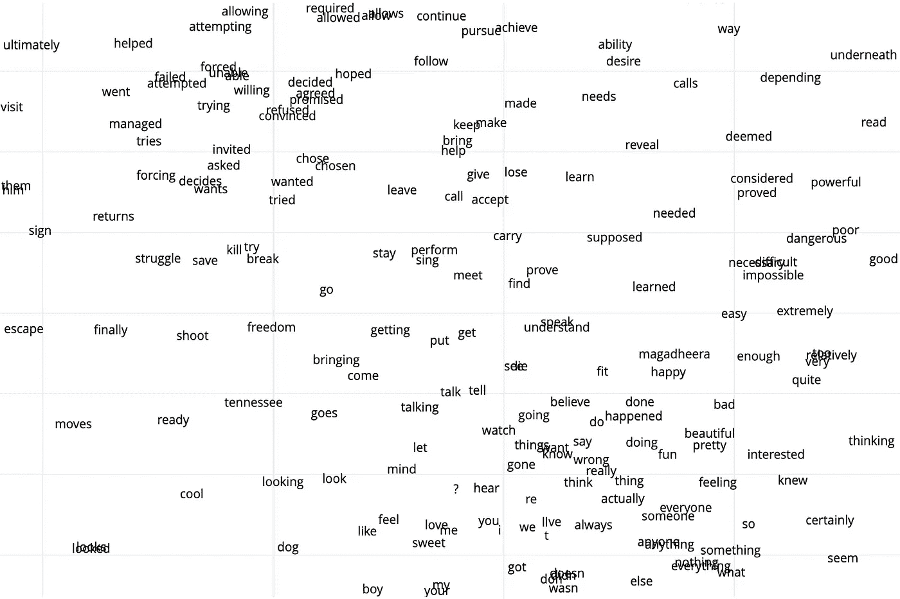
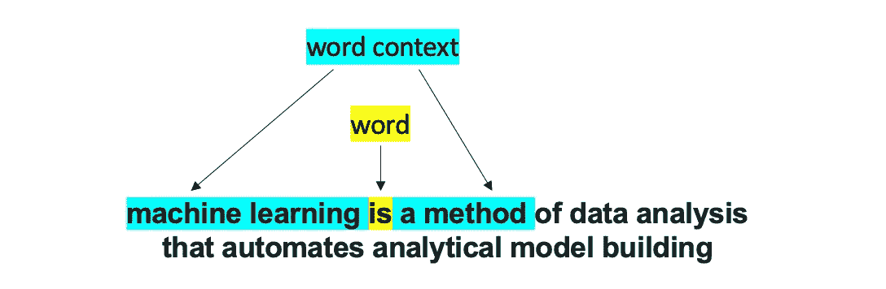
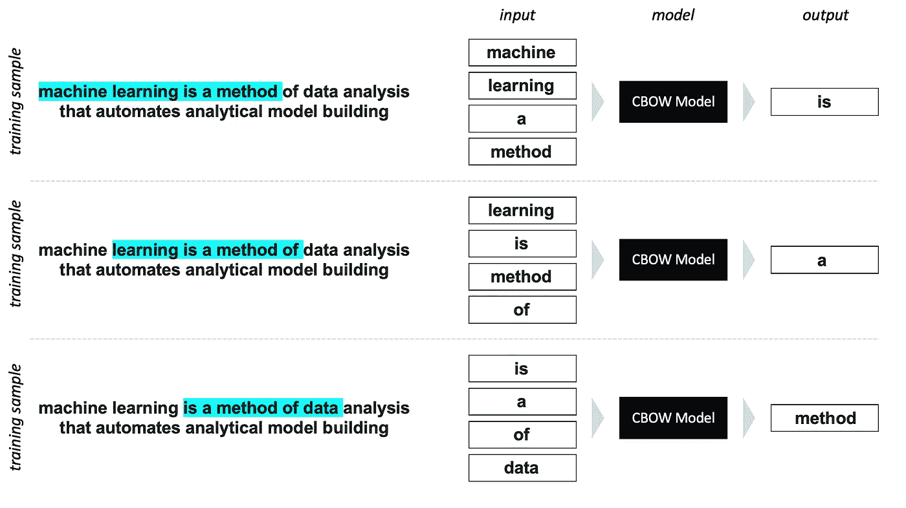
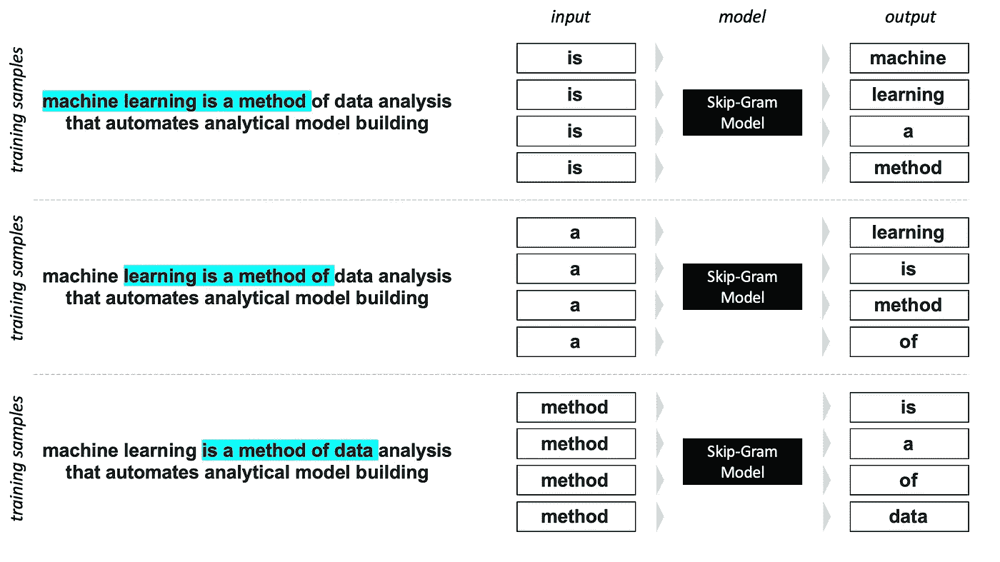
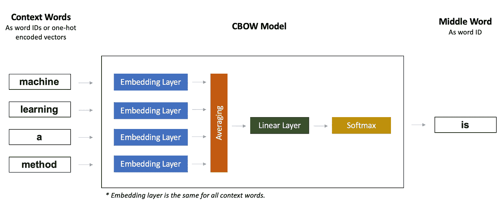
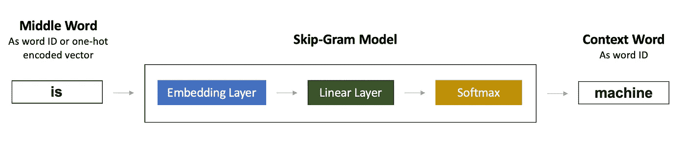
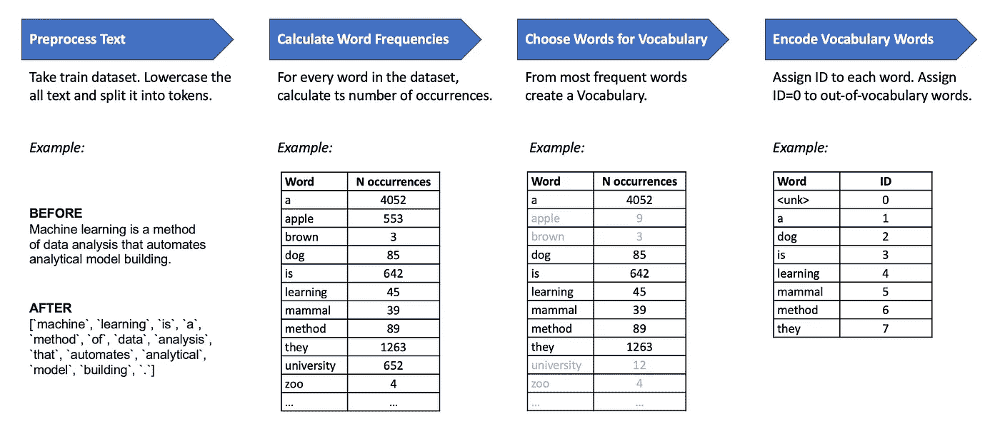
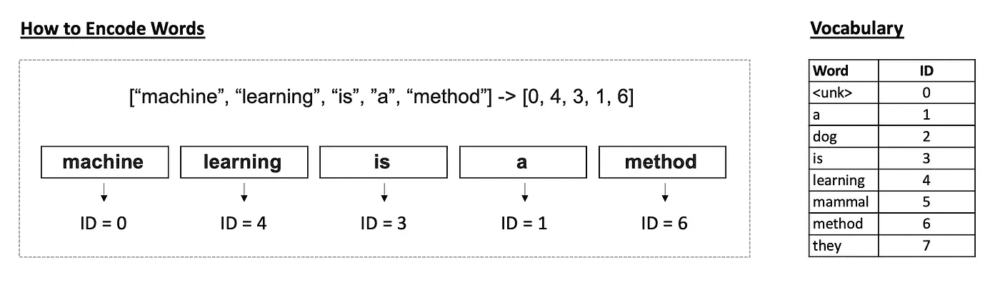
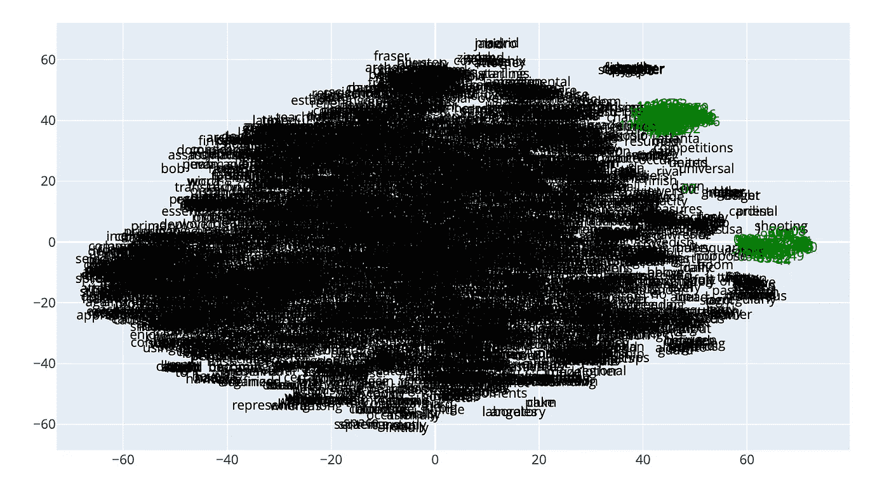
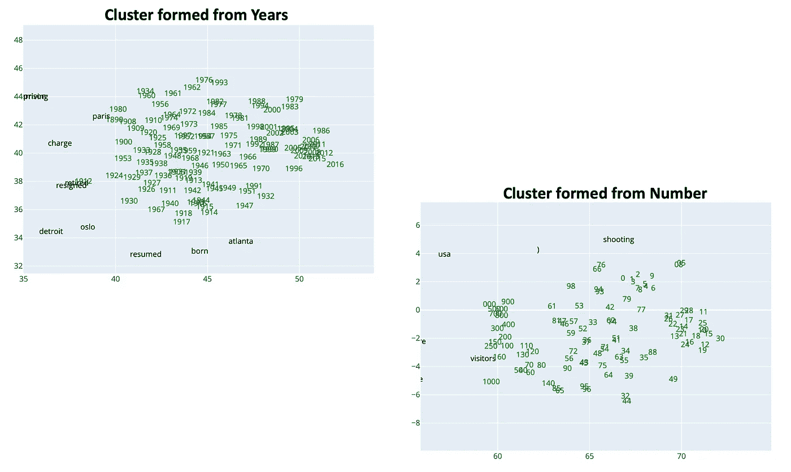

# 使用 PyTorch 的 Word2vec:实现原始论文

> 原文：<https://towardsdatascience.com/word2vec-with-pytorch-implementing-original-paper-2cd7040120b0?source=collection_archive---------2----------------------->

## [思想和理论](https://towardsdatascience.com/tagged/thoughts-and-theory)

## *涵盖所有实施细节，跳过高层概述。代码附后。*



作者图片

词语嵌入是深层自然语言处理中最基本的概念。word2vec 是最早用于训练单词嵌入的算法之一。

在这篇文章中，我想更深入地了解关于 word2vec 的第一篇论文— [向量空间中单词表示的有效估计](https://arxiv.org/abs/1301.3781) (2013)，截至目前，该论文已被引用 24k 次，并且这个数字仍在增长。

我们的计划如下:

*   回顾论文中描述的模型架构；
*   使用 PyTorch 从零开始训练 word2vec 模型；
*   评估我们得到的单词嵌入。

我附上我的 [Github 项目](https://github.com/OlgaChernytska/word2vec-pytorch)与 word2vec 培训。我们将在这篇文章中讨论这个问题。

今天我们只复习 word2vec 的 ***第一*** 篇。然而，有几篇后来的论文，描述了 word2vec 的演变:

*   [单词和短语的分布式表示及其组合性](https://arxiv.org/abs/1310.4546) (2013)描述了对原始 word2vec 的几个扩展，以加速训练并提高嵌入质量。
*   [句子和文档的分布式表示](https://arxiv.org/abs/1405.4053) (2014)展示了如何使用 word2vec 背后的思想来创建句子和文档嵌入。这种方法被称为 doc2vec。
*   [用子词信息丰富词向量](https://arxiv.org/abs/1607.04606) (2017)为 word2vec 引入了更多扩展。这种方法在字符级别(而不是像以前那样在单词级别)上操作，被称为 fastText。

我相信，如果你理解了第一篇文章，你会很容易理解后面文章中描述的观点。所以我们走吧！

*披露。Wor2vec 已经是一个老算法了，还有更新的选项(例如，* [*伯特*](https://en.wikipedia.org/wiki/BERT_(language_model)) *)。这篇文章是为那些刚刚开始深入 NLP 之旅的人，或者那些对阅读和实现论文感兴趣的人写的。*

**内容**
—什么是 word2vec？
—模型架构
—数据
—数据准备
—用 PyTorch 进行文本处理
—训练细节
—检索嵌入
—用 t-SNE 可视化
— —相似词
— —国王—男人+女人=女王
—接下来呢？

# word2vec 是什么？

以下是我的三句话解释:

1.  Word2vec 是一种创建单词嵌入的方法。
2.  单词嵌入是将单词表示为数字向量。
3.  除了 word2vec，还存在其他方法来创建单词嵌入，例如 fastText、GloVe、ELMO、BERT、GPT-2 等。

如果您不熟悉单词嵌入的概念，下面是几个重要资源的链接。跳过细节，但抓住背后的直觉。并返回到我的帖子中查看 word2vec 的详细信息和代码。

*   [为什么我们在 Natasha Latysheva 的 NLP](/why-do-we-use-embeddings-in-nlp-2f20e1b632d2) 中使用单词嵌入
*   杰伊·阿拉姆马的插图版 Word2vec
*   谢恩·林恩的《文本分析中的单词嵌入介绍》

现在好些了吗？

词嵌入实际上用在每个自然语言处理任务中——文本分类、命名实体识别、问题回答、文本摘要等。到处都是。模型不理解单词和字母，它们理解数字。这就是单词嵌入派上用场的地方。

# 模型架构

Word2vec 基于这样一种思想，即单词的含义是由其上下文定义的。上下文被表示为周围的单词。

想想吧。假设，你正在学习一门新的语言。你正在读一个句子，所有的单词你都很熟悉，除了一个。你以前没见过这个词，但你可以很容易地说出它的词性，对吗？有时候，甚至猜测它的意思。那是因为周围单词的信息对你有帮助。

对于 word2vec 模型，上下文被表示为当前单词之前的 N 个单词和之后的 N 个单词。n 是一个超参数。使用较大的 N，我们可以创建更好的嵌入，但同时，这样的模型需要更多的计算资源。在最初的论文中，N 是 4–5，在我下面的可视化中，N 是 2。



*图片 1。一个词和它的上下文。作者图片*

本文提出了两种 word2vec 架构:

*   **CBOW**(Continuous Bag-of-Words)——基于上下文单词预测当前单词的模型。
*   **Skip-Gram** —基于当前单词预测上下文单词的模型。

例如，CBOW 模型将“机器”、“学习”、“方法”作为输入，将“是”作为输出返回。跳格模型正好相反。

根据定义，CBOW 和 Skip-Gram 模型都是多类分类模型。下面详细的可视化应该会清楚。



*图片 2。CBOW 模型:高级概述。作者图片*



*图片 3。跳格模型:高层次的概述。作者图片*

**黑匣子里发生了什么？**

第一步是用 id 对所有单词进行编码。ID 是一个整数(索引),用于标识单词在词汇表中的位置。“词汇”是描述文本中一组独特词汇的术语。这个集合可以是文本中的所有单词或者仅仅是最频繁出现的单词。“数据准备”一节将详细介绍这一点。

Word2vec 模型非常简单，只有两层:

*   **嵌入层**，取 word ID，返回其 300 维向量。Word2vec 嵌入是 300 维的，因为作者证明了这个数字在嵌入质量和计算成本方面是最好的。您可以将嵌入层视为一个简单的具有可学习权重的查找表，或者视为一个没有偏差和激活的线性层。
*   然后是带有 Softmax 激活的**线性(密集)层**。我们为多类分类任务创建一个模型，其中类的数量等于词汇表中的单词数量。

CBOW 和 Skip-Gram 模型之间的区别在于输入单词的数量。CBOW 模型采用几个单词，每个单词都经过相同的嵌入层，然后在进入线性层之前对单词嵌入向量进行平均。跳格模型取而代之的是一个单词。详细的架构如下图所示。



*图片 4。CBOW 模型:细节中的建筑。作者图片*



*图 5。跳跃式模型:细节中的建筑。作者图片*

**单词嵌入在哪里？**

我们训练不会被直接使用的模型。我们不想从上下文中预测一个词，也不想从一个词中预测上下文。相反，我们想要得到单词向量。原来这些向量就是嵌入层的权重。更多细节在“检索嵌入”一节中。

# 数据

Word2vec 是一个无监督的算法，所以我们只需要一个大的文本语料库。原来 word2vec 是在 Google 新闻语料库上训练的，包含 6B 的令牌。

我用 PyTorch 中可用的较小数据集进行了试验:

*   [WikiText-2](https://pytorch.org/text/stable/datasets.html#wikitext-2) :列车部分 36k 文本行和 2M 记号(记号为单词+标点)
*   [WikiText103](https://pytorch.org/text/stable/datasets.html#wikitext103) :列车部分 180 万条线路和 100 万个令牌

在为商业/研究任务训练单词嵌入时，请仔细选择数据集。例如，如果你想对机器学习论文进行分类，就用关于机器学习的科学文本来训练 word2vec。如果你想对时尚文章进行分类，一个时尚新闻数据集会是更好的选择。这是因为“模型”这个词在机器学习领域意味着“方法”和“算法”，但在时尚领域意味着“人”和“女人”。

当重用训练过的单词嵌入时，注意它们被训练的数据集，以及这个数据集是否适合你的任务。

# 数据准备

数据准备的主要步骤是创建一个**词汇表**。词汇表包含将为其训练嵌入的单词。词汇可能是文本语料库中所有独特单词的列表，但通常不是。

最好创造词汇:

*   要么通过过滤掉在语料库中出现少于 N 次的罕见单词；
*   或者通过选择前 N 个最频繁出现的单词。

这种过滤很有意义，因为词汇表越小，模型训练就越快。另一方面，您可能不希望对文本语料库中只出现过一次的单词使用嵌入，因为这些嵌入可能不够好。为了创建好的单词嵌入，模型应该在不同的上下文中多次看到一个单词。

词汇表中的每个单词都有其唯一的索引。词汇中的单词可以按字母顺序或基于它们的频率排序，也可以不排序——这不应该影响模型训练。词汇通常表示为字典数据结构:

```
vocab = {
     "a": 1,
     "analysis": 2,
     "analytical": 3,
     "automates": 4,
     "building": 5,
     "data": 6,
     ...
}
```

标点符号和其他特殊符号也可以添加到词汇表中，我们也为它们训练嵌入。你可以小写所有的单词，或者为单词“Apple”和“apple”训练单独的嵌入；在某些情况下，它可能是有用的。

根据您希望您的词汇表(和单词嵌入)是什么样的，对文本语料库进行适当的预处理。小写与否，去掉标点符号与否，对文本进行记号化。



*图片 6。如何从文本语料库中创建词汇？作者图片*

对于我的模型:

*   我只从一篇文章中出现至少 50 次的单词中创造词汇。
*   我使用了 PyTorch 的 [basic_english tokenizer](https://pytorch.org/text/stable/data_utils.html#get-tokenizer) ,它将文本小写，用空格分割成记号，但将标点符号放入单独的记号中。

因此，在单词进入模型之前，它们被编码为 id。ID 对应于词汇表中的单词索引。不在词汇表中的单词(词汇表外的单词)用某个数字进行编码，例如 0。



*图 7。如何用词汇 id 对单词进行编码？作者图片*

# 使用 PyTorch 进行文本处理

[训练词 2vec 的完整代码在这里](https://github.com/OlgaChernytska/word2vec-pytorch)。让我们来看看重要的步骤。

**模型**是通过从 [nn 子类化在 PyTorch 中创建的。模块](https://pytorch.org/docs/stable/generated/torch.nn.Module.html#torch.nn.Module)。如前所述，CBOW 和 Skip-Gram 模型都有两层:嵌入和线性。

下面是 CBOW 的模型类，这里的[是 Skip-Gram 的](https://github.com/OlgaChernytska/word2vec-pytorch/blob/87b0418fcc6a0f5b8ac96698f6fc1079014b4615/utils/model.py#L30)。

```
import torch.nn as nn 
EMBED_DIMENSION = 300 
EMBED_MAX_NORM = 1 class CBOW_Model(nn.Module):
    def __init__(self, vocab_size: int):
        super(CBOW_Model, self).__init__()
        self.embeddings = nn.Embedding(
            num_embeddings=vocab_size,
            embedding_dim=EMBED_DIMENSION,
            max_norm=EMBED_MAX_NORM,
        )
        self.linear = nn.Linear(
            in_features=EMBED_DIMENSION,
            out_features=vocab_size,
        )
     def forward(self, inputs_):
        x = self.embeddings(inputs_)
        x = x.mean(axis=1)
        x = self.linear(x)
        return x
```

注意，线性层没有 Softmax 激活。这是因为 PyTorch CrossEntropyLoss [期望预测是原始的、非标准化的分数](https://pytorch.org/docs/stable/generated/torch.nn.CrossEntropyLoss.html?highlight=crossentropy#torch.nn.CrossEntropyLoss)。而在 Keras 中，您可以定制 CrossEntropyLoss 的输入是什么— [原始值或概率](https://keras.io/api/losses/probabilistic_losses/#categoricalcrossentropy-class)。

模型输入是单词 ID。模型输出是一个 N 维向量，其中 N 是词汇量。

EMBED_MAX_NORM 是[限制单词嵌入规范](https://pytorch.org/docs/stable/generated/torch.nn.Embedding.html)的参数(在我们的例子中为 1)。它作为一个正则化参数，防止嵌入层中的权重不受控制地增长。EMBED_MAX_NORM 值得一试。我所看到的:当限制嵌入向量范数时，类似的词如“母亲”和“父亲”具有更高的余弦相似度，与 EMBED_MAX_NORM=None 时相比。

我们使用 PyTorch 函数[build _ vocab _ from _ iterator](https://pytorch.org/text/stable/vocab.html#build-vocab-from-iterator)从数据集迭代器创建**词汇表**。WikiText-2 和 WikiText103 数据集用标记< unk >替换了罕见的单词，我们添加这个标记作为 ID=0 的特殊符号，并且所有不在词汇表中的单词也用 ID=0 编码。

```
from torchtext.vocab import build_vocab_from_iterator MIN_WORD_FREQUENCY = 50def build_vocab(data_iter, tokenizer):
    vocab = build_vocab_from_iterator(
        map(tokenizer, data_iter),
        specials=["<unk>"],
        min_freq=MIN_WORD_FREQUENCY,
    )
    vocab.set_default_index(vocab["<unk>"])
    return vocab
```

[**数据加载器**](https://pytorch.org/docs/stable/data.html?highlight=dataloader#torch.utils.data.DataLoader) 我们用 [collate_fn](https://pytorch.org/docs/stable/data.html) 创建。该函数实现了如何对单个样本进行批处理的逻辑。当遍历 PyTorch WikiText-2 和 WikiText103 数据集时，检索到的每个样本都是一个文本段落。

例如，在用于 CBOW 的 collate_fn 中，我们“说”:

1.  取每一段文字。
    —小写，标记，用 id 编码(函数 [text_pipeline](https://github.com/OlgaChernytska/word2vec-pytorch/blob/66ba7adabb56905185e95a00ef0089c6d16dda49/utils/dataloader.py#L133) )。如果段落太短，跳过它。如果太长—将其截断。
    —使用大小为 9 的移动窗口(4 个历史单词、中间单词和 4 个未来单词)在段落中循环。
    —所有中间词合并成一个列表——它们将是 Ys。
    —所有上下文(历史和未来单词)合并成一个列表列表—它们将是 Xs。
2.  将所有段落中的 x 合并在一起，它们将是批 x。
3.  将所有段落中的 y 合并在一起，它们将成为批量 y。

请注意，当我们调用 collate_fn 时，最终批次的数量(Xs 和 Ys)将与 Dataloader 中指定的参数 batch_size 不同，并且将因不同的段落而异。

CBOW 的 collate_fn 的代码如下，用于 [Skip-Gram —在这里](https://github.com/OlgaChernytska/word2vec-pytorch/blob/66ba7adabb56905185e95a00ef0089c6d16dda49/utils/dataloader.py#L85)。

```
import torch CBOW_N_WORDS = 4 
MAX_SEQUENCE_LENGTH = 256 def collate_cbow(batch, text_pipeline):
     batch_input, batch_output = [], []
     for text in batch:
         text_tokens_ids = text_pipeline(text) if len(text_tokens_ids) < CBOW_N_WORDS * 2 + 1:
             continue if MAX_SEQUENCE_LENGTH:
             text_tokens_ids = text_tokens_ids[:MAX_SEQUENCE_LENGTH] for idx in range(len(text_tokens_ids) - CBOW_N_WORDS * 2):
             token_id_sequence = text_tokens_ids[idx : (idx + CBOW_N_WORDS * 2 + 1)]
             output = token_id_sequence.pop(CBOW_N_WORDS)
             input_ = token_id_sequence
             batch_input.append(input_)
             batch_output.append(output)

     batch_input = torch.tensor(batch_input, dtype=torch.long)
     batch_output = torch.tensor(batch_output, dtype=torch.long)
     return batch_input, batch_output
```

下面是如何将 collate_fn 与 PyTorch Dataloader 一起使用:

```
from torch.utils.data 
import DataLoader 
from functools import partial dataloader = DataLoader(
         data_iter,
         batch_size=batch_size,
         shuffle=True,         
         collate_fn=partial(collate_cbow, text_pipeline=text_pipeline),
)
```

我还创建了[一个职业训练器](https://github.com/OlgaChernytska/word2vec-pytorch/blob/main/utils/trainer.py)，用于模型训练和验证。它包含一个典型的 PyTorch 训练和验证流程，所以对于那些有 PyTorch 经验的人来说，它看起来非常简单。

如果你想更好地理解代码——我推荐你[克隆我的库](https://github.com/OlgaChernytska/word2vec-pytorch)并使用它。

# 培训详情

使用交叉熵损失将 Word2vec 训练为多类分类模型。

您选择批量大小以适应内存。只要记住:那个批量大小就是数据集段落的数量，它会被处理成输入输出对，这个数字会大很多。

论文优化器是 AdaGrad，但是我用了一个更新的——Adam。

我已经跳过了层次化的 Softmax 的论文部分，只使用了普通的 Softmax。也没有使用霍夫曼树来构建词汇表。分层的 Softmax 和 Huffman 树是加速训练的技巧。但是 PyTorch 在引擎盖下有很多优化，所以训练已经足够快了。

正如论文中所推荐的，我从 0.025 的学习率开始，并在每个时期线性降低，直到在最后一个时期结束时达到 0。这里 [PyTorch LambdaLR 调度器](https://pytorch.org/docs/stable/generated/torch.optim.lr_scheduler.LambdaLR.html#torch.optim.lr_scheduler.LambdaLR)帮了大忙；这里是我如何使用它的。

作者在大多数实验中只训练了 3 个时期的模型(但在非常大的数据集上)。我尝试了越来越小的数字，并决定坚持使用 5 个纪元。

对于 WikiText-2 数据集:

*   我的词汇量大约是 4k 个单词(这些单词在文章中至少出现了 50 次)。
*   CBOW 和 Skip-Gram 模型在 GPU 上的训练时间不到 20 分钟。

对于 WikiText103 数据集:

*   我的词汇量大约是 50k 个单词。
*   模特通宵训练。

# 检索嵌入

完整的程序在[这本笔记本](https://github.com/OlgaChernytska/word2vec-pytorch/blob/main/notebooks/Inference.ipynb)中有描述。

单词嵌入存储在嵌入层中。嵌入层的大小是(vocab_size，300)，这意味着我们可以嵌入词汇表中的所有单词。

当在 WikiText-2 数据集上训练时，CBOW 和 Skip-Gram 模型都在大小为(4099，300)的嵌入层中具有权重，其中每一行都是单词向量。以下是获取嵌入层权重的方法:

```
embeddings = list(model.parameters())[0]
```

下面是如何获得与嵌入矩阵中相同顺序的单词:

```
vocab.get_itos()
```

在您的模型中使用嵌入之前，有必要检查他们是否接受了适当的培训。对此有几种选择:

1.  对单词嵌入进行聚类，并检查相关单词是否形成单独的聚类。
2.  使用 t-SNE 可视化单词嵌入，并检查相似的单词是否彼此靠近。
3.  为一个随机单词寻找最相似的单词。

## t-SN 可视化

你可以使用 [sklearn t-SNE](https://scikit-learn.org/stable/modules/generated/sklearn.manifold.TSNE.html?highlight=tsne#sklearn.manifold.TSNE) 和 [plotly](https://plotly.com/python/) 来创建一个两个组件的可视化，如下图所示。这里的数字串是绿色的，它们形成了两个独立的簇。



*图 8。基于 WikiText-2 语料库的 CBOW 嵌入可视化。*
*带有以绿色绘制的数字字符串的双组分 t 型 SNE。*

放大后，我们可能会发现将数字字符串分成两个簇很有意义。左上角的聚类是由年份组成的，而右下角的聚类是由普通数字组成的。



*图片 9。放大时的数字聚类。左上角的簇是由年份和组成的*
*，右下角的簇是由普通数字组成的。*

你可以探索[这种奇妙的视觉化](https://notrocketscience.blog/wp-content/uploads/2021/09/word2vec_visualization.html)来发现更有趣的关系。创建这个可视化的代码在这里。

## 相似的词

单词相似度计算为单词向量之间的[余弦相似度](https://en.wikipedia.org/wiki/Cosine_similarity)。显然，余弦相似度越高，假设的相似单词就越多。

例如，对于单词“父亲”,下面是词汇表中最相似的单词:

```
#CBOW model trained on WikiText-2 
mother: 0.842 
wife: 0.809 
friend: 0.796 
brother: 0.775 
daughter: 0.773 #Skip-Gram model trained on WikiText-2 
mother: 0.626 
brother: 0.600 
son: 0.579 
wife: 0.563 
daughter: 0.542
```

这里是[查找相似单词的代码](https://github.com/OlgaChernytska/word2vec-pytorch/blob/main/notebooks/Inference.ipynb)。

## 国王——男人+女人=王后

根据这篇论文，一个经过适当训练的 word2vec 模型可以解方程“king — man + woman =？”(回答:“女王”)，还是“更大—大+小=？”(回答:“小一点”)，还是“巴黎—法国+德国=？”(回答:“柏林”)。

通过对单词 vectors 执行数学运算来求解方程:vector(“king”)—vector(“man”)+vector(“woman”)。而最终的矢量应该是最接近矢量的(“皇后”)。

不幸的是，我不能复制这一部分。我在 WikiText-2 和 WikiText103 上训练的 CBOW 和 Skip-Gram 模型不能捕捉这种关系(这里的[代码是](https://github.com/OlgaChernytska/word2vec-pytorch/blob/main/notebooks/Inference.ipynb))。

与矢量(“国王”)—矢量(“男人”)+矢量(“女人”)最接近的矢量是:

```
#CBOW model trained on WikiText-2 dataset 
king: 0.757 
bishop: 0.536 
lord: 0.529 
reign: 0.519 
pope: 0.501 #Skip-Gram model trained on WikiText-2 dataset 
king: 0.690 
reign: 0.469 
son: 0.453 
woman: 0.436 
daughter: 0.435 #CBOW model trained on WikiText103 dataset 
king: 0.652 
woman: 0.494 
queen: 0.354 
daughter: 0.342 
couple: 0.330
```

与 vector(" bigger ")-vector(" big ")+vector(" small ")最接近的向量是:

```
#CBOW model trained on WikiText-2 dataset 
small: 0.588 
<unk>: 0.546 
smaller: 0.396 
architecture: 0.395 
fields: 0.385 #Skip-Gram model trained on WikiText-2 dataset 
small: 0.638 
<unk>: 0.384 
wood: 0.373 
large: 0.342 
chemical: 0.339 #CBOW model trained on WikiText103 dataset 
bigger: 0.606 
small: 0.526 
smaller: 0.273 
simple: 0.258 
large: 0.258
```

有时，正确的单词在前 5 名之内，但从来不是最接近的。我认为有两个可能的原因:

1.  代码中的一些错误。为了仔细检查，我用 [Gensim 库](https://radimrehurek.com/gensim/index.html)和相同的数据集——wiki text-2，wiki text 103——训练了 word2vec。Gensim 单词嵌入也不能解决这些方程。
2.  所以更可能的原因是数据集太小。WikiText-2 包含 2M 标记，WikiText103 包含 1 亿个标记，而本文使用的 Google 新闻语料库包含 6B 个标记，即 60(！！！)倍大。

在训练单词嵌入时，数据集大小确实很重要。作者在论文中也提到。

# 下一步是什么？

我希望这篇文章能帮助你在深层 NLP 中建立一个基础，这样你就可以继续学习更高级的算法。对我来说，深挖原论文，一切从零开始训练，非常有趣。推荐。

*原载于 2021 年 9 月 29 日*[*https://notrocketseconomy . blog*](https://notrocketscience.blog/word2vec-with-pytorch-implementing-original-paper/)*。
如果你想阅读更多类似的教程，可以订阅我的博客“非火箭科学”——*[*电报*](https://t.me/notrocketscienceblog) *和* [*推特*](https://twitter.com/nRocketScience) *。*