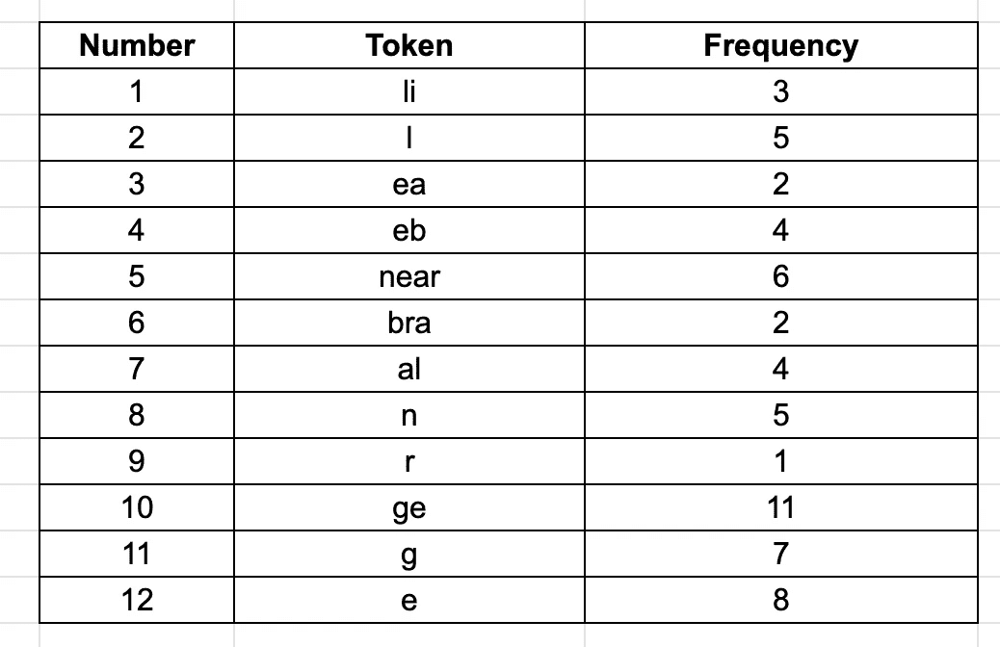

# 基于子词的标记化算法

> 原文：<https://towardsdatascience.com/wordpiece-subword-based-tokenization-algorithm-1fbd14394ed7?source=collection_archive---------6----------------------->

## 了解最新的自然语言处理模型使用的基于子词的标记化算法

[格伦](https://unsplash.com/@glencarrie)在 [Unsplash](https://unsplash.com/photos/oHoBIbDj7lo) 上的照片

在过去的几年里，在人工智能领域，尤其是自然语言处理领域，有很多讨论。😎理解和分析人类语言不仅是一个具有挑战性的问题，也是一个迷人的问题。人类的语言看起来很简单，但却非常复杂，因为即使是一篇很短的文章也可能涉及到个人生活和外部世界。🧐这种复杂性带来了很多挑战。世界各地的研究人员正在努力克服这些挑战，并正在构建更智能的现实世界应用程序。👩‍💻

当我们开始处理文本时，我们执行一组预处理步骤来将文本转换为数字。这些步骤在任何模型开发过程中，甚至在分析文本时都是至关重要的。在这个多阶段预处理过程中，一个重要的步骤是标记化，其也可以是不同的类型。有一个单词、子单词和基于字符的标记化。每一种都有自己的目的、优点和缺点。让我们先了解一下基于子词的标记化算法。

# 基于子词的标记化

基于子词的标记化是介于基于词和基于字符的标记化之间的一种解决方案。主要思想是解决基于单词的标记化(非常大的词汇量，大量的 OOV 标记，以及非常相似的单词的不同含义)和基于字符的标记化(非常长的序列和不太有意义的单个标记)所面临的问题。

基于子词的记号化算法不会将频繁使用的词分成更小的子词。而是将生僻的单词拆分成更小的有意义的子单词。例如，“男孩”不是分裂的，而是“男孩”分裂为“男孩”和“s”。这有助于模型了解单词“boys”是使用单词“boy”形成的，单词“boy”的意思略有不同，但词根相同。

一些流行的基于子词的记号化算法是单词块、字节对编码(BPE)、单语法和句子块。在本文中，我们将详细介绍单词块算法。WordPiece 用于语言模型，如 BERT、DistilBERT、伊莱克特。词块算法有两种实现方式——自底向上和自顶向下。最初的自下而上的方法是基于 BPE。BERT 使用自顶向下的 WordPiece 实现。在本文中，我将讨论基于 BPE 的最初的自底向上实现。

如果你想知道这三种标记化技术之间的区别，那么你可以阅读[这篇](/word-subword-and-character-based-tokenization-know-the-difference-ea0976b64e17)文章，这是一篇关于 TDS 的实践教程。😍

 [## 词、子词和基于字符的标记化:了解区别

### 从事 NLP 项目的任何人都应该知道的区别

towardsdatascience.com](/word-subword-and-character-based-tokenization-know-the-difference-ea0976b64e17) 

让我们从工件算法开始。🏃‍♀️

# 文字片

WordPiece 是一种基于子词的标记化算法。在论文“[日韩语音搜索(Schuster et al .，2012)](https://static.googleusercontent.com/media/research.google.com/ja//pubs/archive/37842.pdf) 中首次概述。该算法通过著名的最新模型 BERT 而广受欢迎。这种算法与 BPE 没有太大的不同，所以我建议你在阅读本文之前先了解一下 BPE。

如果你正在寻找一个好的来源，这里有一篇关于字节对编码(BPE)算法的文章。😇你可以阅读这篇文章，它将向你解释 BPE 算法的一步一步的过程。

 [## 字节对编码:基于子字的标记化算法

### 了解最新的 NLP 模型使用的基于子词的符号化算法——字节对编码(BPE)

towardsdatascience.com](/byte-pair-encoding-subword-based-tokenization-algorithm-77828a70bee0) 

BPE 获取一对令牌(字节)，查看每对令牌的频率，并合并具有最高组合频率的令牌对。该过程是贪婪的，因为它在每一步寻找最高的组合频率。

那么，BPE 有什么问题呢？🤔它可以有多种方式来编码一个特定的单词。然后，算法很难选择子词标记，因为没有办法区分优先使用哪一个。因此，相同的输入可以由不同的编码来表示，这影响了所学习的表示的准确性。🤦‍♀️

请看下面的子词标记表。

假设这是一个小型语料库的词汇，我们想要标记我们的输入短语“线性代数”。我们可以将其标记如下:

linear = **li +附近** *或* **li + n + ea + r**

代数= **al + ge + bra** *或* **al + g + e + bra**

我们可以看到，有两种不同的方法来标记给定短语中的每个单词，总共有四种方法来标记这个短语。因此，相同的输入文本可以用四种方式编码，这确实是一个问题。🤷‍♀️

每当我们考虑任何领域的进步/改进时，我们总是寻找更好和更现实的方法。一种可能比 BPE 的频率方法更有效的方法是考虑特定字节对(符号对)的合并在每一步的影响。👍

在数据科学中，当我们比频率或计数领先一步时，我们会寻找概率方法。在 WordPiece 中，我们实际上也是这样做的。WordPiece 和 BPE 之间的唯一区别是符号对添加到词汇表中的方式。在每一个迭代步骤中，WordPiece 选择一个符号对，该符号对在合并时将导致最大的可能性增加。最大化训练数据的似然性等同于找到这样的符号对，其概率除以该符号对中第一个符号的概率，然后除以第二个符号的概率，大于任何其他符号对。

例如，该算法将检查“es”的出现概率是否大于“e”后跟“s”的出现概率。只有当“es”除以“e”，“s”的概率大于任何其他符号对时，才会发生合并。

因此，我们可以说，WordPiece 通过合并这两个符号来评估它将会失去什么，以确保它正在采取的步骤实际上是值得的还是不值得的。🤗

工件算法是迭代的，根据[论文](https://static.googleusercontent.com/media/research.google.com/ja//pubs/archive/37842.pdf)的算法总结如下:

1.  用基本字符初始化单词单元目录。
2.  使用来自 1 的单词 inventory 在训练数据上建立语言模型。
3.  通过组合当前单词库中的两个单元来生成新的单词单元。在添加这个新的单词单元之后，单词单元库存将增加 1。新的单词单元是从所有可能的单词单元中选择的，因此当添加到模型中时，它最大程度地增加了训练数据的可能性。
4.  转到 2，直到达到单词单位的预定义限制或者可能性增加低于某个阈值。

你一定在想，如果使用暴力，训练一定是一个计算量很大的过程。如果是，那么你是对的。🤨时间复杂度是 O(K ),其中 K 是当前字单元的数量。对于每次迭代，我们需要测试所有可能的对组合，并且每次都训练一个新的语言模型。然而，通过遵循本文中讨论的一些简单技巧，训练算法可以显著加快速度。🏃‍♂️我们可以只测试实际存在于训练数据中的对，只测试有很大机会成为最佳的对(具有高先验的对)，将几个聚类步骤组合成单个迭代(对于一组互不影响的对是可能的)。根据这篇论文，这些贪婪的加速帮助在一台机器上仅用几个小时就为日本和韩国数据集构建了 20 万个词汇。是不是很神奇？🥳:这个清单可以用于语言建模、字典构建和解码。

**它还贪婪吗？**

是的，即使遵循了概率方法，WordPiece 算法仍然是贪婪的，因为它在每次迭代中挑选最佳对来合并，并自下而上地构建一个记号化器(从字符到对，等等)。完全概率模型将使用概率来选择要合并的对以及是否合并它们。尽管如此，这种算法还是很受欢迎，并给出了很好的结果。

所以，我们总结一下。👍

**单词块算法在基本词汇上训练语言模型，挑选具有最高可能性的对，将该对添加到词汇中，在新词汇上训练语言模型，并重复重复的步骤，直到达到期望的词汇大小或可能性阈值。**

我希望你对工件算法有所了解。如果你也想了解自上而下的方法，我鼓励你阅读 Tensorflow 的[这篇](https://www.tensorflow.org/text/guide/subwords_tokenizer#optional_the_algorithm)博客。

**参考文献:**

1.  [https://static . Google user content . com/media/research . Google . com/ja//pubs/archive/37842 . pdf](https://static.googleusercontent.com/media/research.google.com/ja//pubs/archive/37842.pdf)
2.  [https://huggingface.co/transformers/tokenizer_summary.html](https://huggingface.co/transformers/tokenizer_summary.html)
3.  [https://www . tensor flow . org/text/guide/subwords _ tokenizer # applying _ word piece](https://www.tensorflow.org/text/guide/subwords_tokenizer#applying_wordpiece)

感谢大家阅读这篇文章。请分享您宝贵的反馈或建议。快乐阅读！📗 🖌