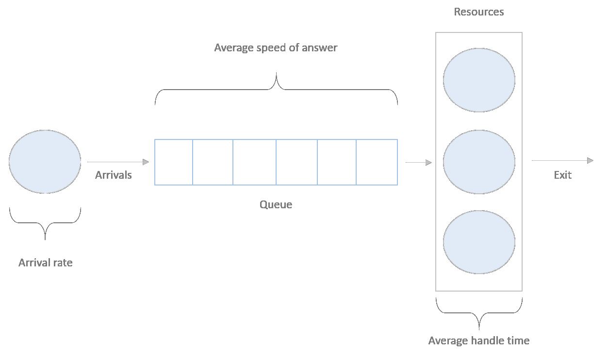
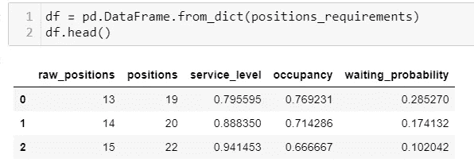

# 使用 Python 和 ErlangC 优化劳动力计划

> 原文：<https://towardsdatascience.com/workforce-planning-optimization-using-python-69af0ef9011a?source=collection_archive---------11----------------------->

## 了解如何找到管理传入流量所需的最佳位置数量


[李三多](https://unsplash.com/@lisanto_12)在 [Unsplash](https://unsplash.com/photos/pT4gB7T6tog) 上的照片

很长一段时间以来，寻找队列系统中使用的位置数量一直是一个研究案例；它在许多领域和行业都有应用，例如，寻找呼叫中心代理的最佳数量，决定支持站的银行家数量，网络流量分析等等。

分析这个问题有几种方法；在本文中，我们将看看如何使用 Erlang C 和 Python 的 [Pyworkforce](https://pypi.org/project/pyworkforce/) 包来解决这个问题。

# **1。排队系统**

在最基本的 Erlang C 方法中，我们使用以下假设将系统表示为一个队列:

*   有恒定速率的输入流量；到达遵循泊松过程
*   系统中有固定的容量；通常，一个资源一次只能处理一个事务
*   在时间间隔中有固定数量的可用位置
*   当所有位置都有总容量时，请求等待位置空闲的队列长度是无限的。
*   指数分布描述了队列中的等待时间
*   没有人退出队列。

具有这些特征的队列系统可能如下所示:



排队系统。图片由作者提供。

在这个表示中，我们可以看到几个有助于我们描述系统的度量；这是它们的定义，以及从现在开始我们将如何称呼它们:

*   **事务:**传入请求的数量
*   **资源:**处理事务的元素
*   **到达率:**一个时间间隔内的传入交易数
*   **平均应答速度(ASA):** 事务在队列中等待资源处理的平均时间
*   **平均处理时间(AHT):** 单个资源参与事务的平均时间

图中还有其他变量，但这对模型很重要，它们是:

*   **缩减:**服务器不可用的预期时间百分比，例如，由于休息、预定培训等原因。
*   **占用率:**资源处理事务的时间百分比
*   **服务水平:**在目标 ASA 之前到达资源的事务百分比

Erlang C 查找该系统中资源数量的方法是通过查找事务在队列中等待的概率，而不是立即被处理，它采用目标 ASA 和服务级别，并使用其他变量作为系统参数，如果您想了解更多关于 Erlang 公式的细节，可以在文章末尾查看其他资源。

# **2。Python 示例**

作为一个例子，我们将找到一个呼叫中心处理来电流量所需的代理数量。

在给定的约定下，资源将是代理的工作站，事务将是这个场景下的调用。

假设在 30 分钟的时间间隔内，平均有 100 个来电，AHT 为 3 分钟，预期缩水 30%。

作为呼叫中心管理员，我们希望事务在队列中等待的平均时间为 20 秒，并达到 80%的服务水平。我们还希望确保代理的最大占用率不超过 85%。

为了解决这个问题，我们将使用 Pyworkforce，这是一个用于劳动力管理、调度和优化问题的 python 包，所以让我们安装它。建议使用虚拟 env。

```
pip install pyworkforce 
```

这个包的使用非常简单；我们导入 ErlangC 并用给定的参数初始化该类，然后我们使用“required_positions”方法找到处理事务的最小资源数。考虑到班级期望所有时间变量都以分钟为单位:

这段代码的输出应该如下所示:

这本字典给我们的是:

**raw_positions:** 假设收缩率= 0 时找到的仓位数量

**位置:**根据用户提供的收缩量找到的位置数量

**service_level:** 队列中等待时间不超过目标 ASA 的事务的预期百分比

**占用率:**系统将拥有的预期占用率

**waiting_probability:** 事务在队列中等待的概率

**注意:**该示例以 30 分钟的时间间隔对系统进行建模。Erlan C 假设可能适用；如果您想延长时间间隔，您可以使用 Erlang C 与每个间隔的参数多次。

# **3。运行多个 Erlang C**

如果您想同时尝试不同的参数，pyworkforce 附带了一个 MultiErlangC 类，它允许您定义一组要迭代的参数。

首先，创建一个参数网格；它必须是一个 dict，并且每个参数选项必须在一个 iterable 中，作为一个列表。

然后 MultiErlangC 将使用 ErlangC 方法，并提供所有可能的参数组合。

例如，如果网格有三个事务值选项和两个缩减选项，那么将有六个不同的模型。

如果您有一个巨大的网格，您还可以使用参数“n_jobs”来控制并发运行的作业，“-1”意味着使用计算机中所有可用的 CPU。

在本例中，我们只尝试三种不同的服务级别选项:

输出是每个场景的列表，其结果与单个 Erlang C 方法相同:

如果您喜欢表格格式的输出，可以使用 pandas，例如:



列表式 MultiErlangC。图片由作者提供。

# **4。最后备注:**

Pyworkforce 是一个软件包，使劳动力管理优化问题更容易解决；除了规模之外，还有其他的子问题，比如排班和排班。要了解更多信息，你可以查看我所在的 Github 项目。非常欢迎对该包的任何建议或贡献:【https://github.com/rodrigo-arenas/pyworkforce 

# **5。参考文献**

[1] Pyworkforce 包:[https://pypi.org/project/pyworkforce/](https://pypi.org/project/pyworkforce/)

[2] Erlang C 公式:[https://en . Wikipedia . org/wiki/Erlang _(unit)](https://en.wikipedia.org/wiki/Erlang_(unit))