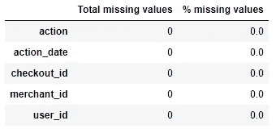
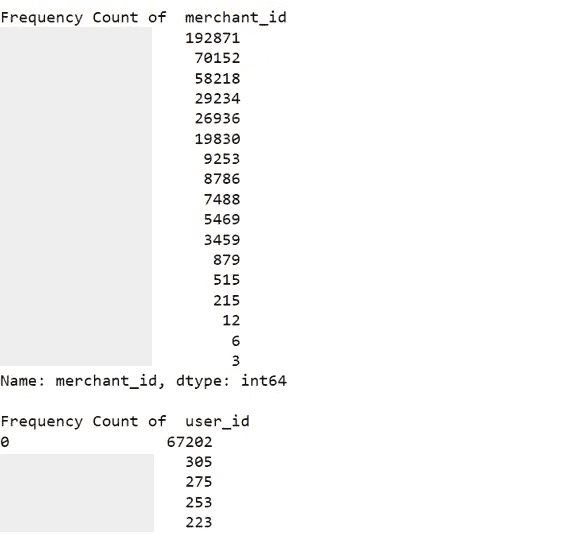
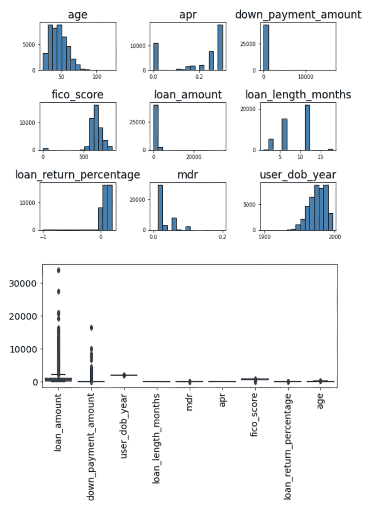
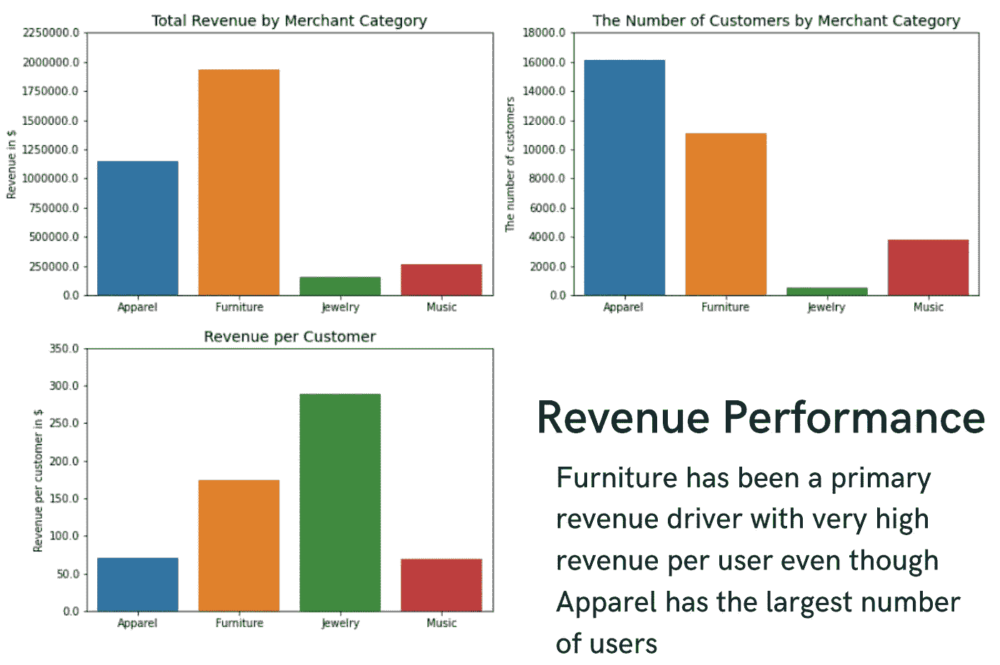
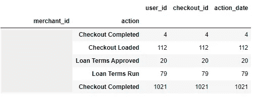
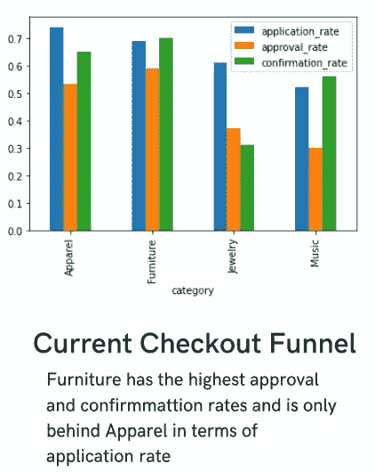
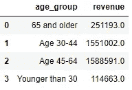
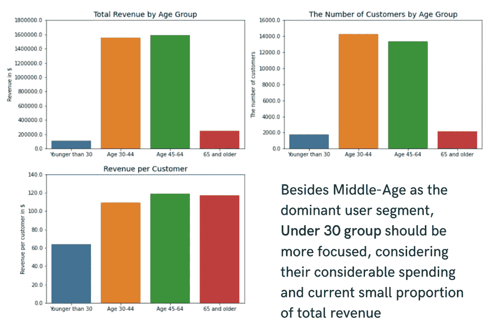
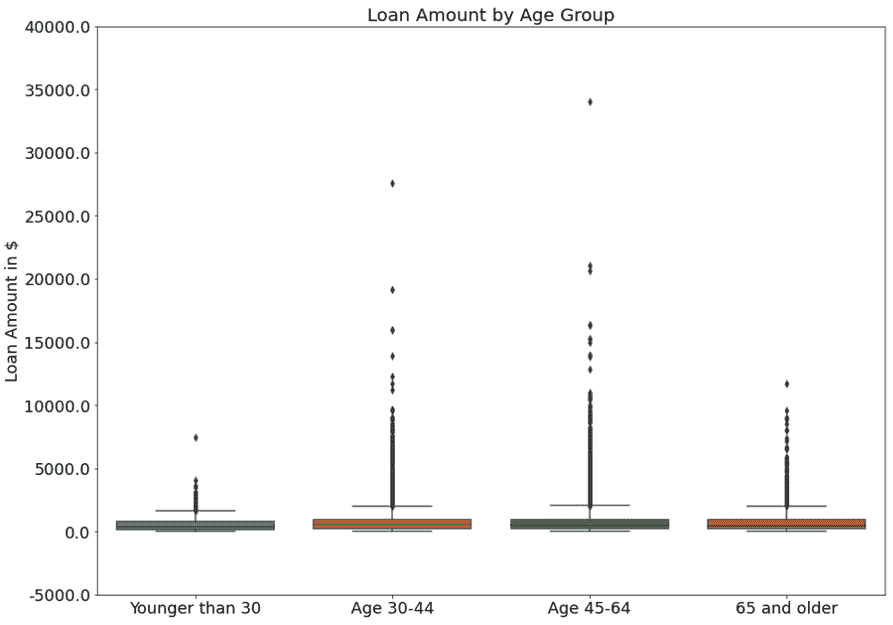
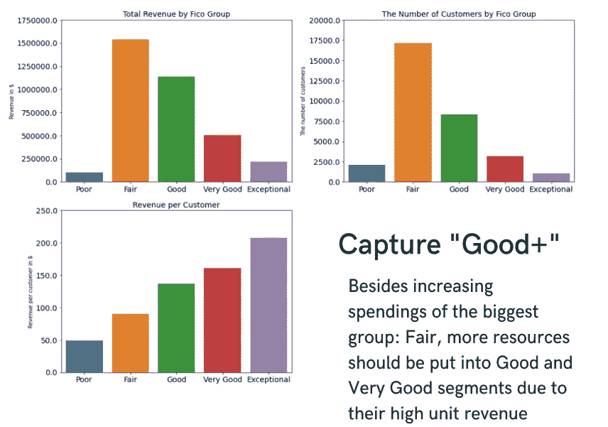

# 使用基本 Python 库处理数据框和可视化

> 原文：<https://towardsdatascience.com/working-with-data-frames-and-visualization-using-basic-python-libraries-f53d206ba2c5?source=collection_archive---------15----------------------->

## 本文旨在通过支付服务行业的案例研究，介绍与结构化数据交互的基本 Python 方法。


[斯科特·格雷厄姆](https://unsplash.com/@homajob?utm_source=unsplash&utm_medium=referral&utm_content=creditCopyText)在 [Unsplash](https://unsplash.com/s/photos/data-science?utm_source=unsplash&utm_medium=referral&utm_content=creditCopyText) 上拍照

# 语境

去年，我的老板来到我的住处，给了我一个小任务，分析现状在线支付行业。在当时我对 Python 的热情的激励下，我想为什么我只是尝试用这种编程语言来完成这个练习。关于上下文，Excel、SQL 和 Tableau 是我工作中最受欢迎的三种工具，考虑到它们对于我们的简单分析来说既方便又简单。与此同时，Python 被优先用于更具预测性和更高级的分析。然后，在接下来的两天里，我研究了集成 Python 来分析和与非 Python 观众分享我的工作的可能方法。

# 本文将涵盖的内容

包括一个支付服务行业的案例研究，这篇文章结合了技术和业务流程，其中我使用了带有数据框架和可视化的基本分析，从支付解决方案提供商的角度来解决业务问题。除了以非技术格式展示发现之外，我还将包括相关的 Python 代码和库。

# 这篇文章不会涉及的内容

首先，我同意许多其他工具可以帮助得到同样的结果，甚至更有效。例如，人们可以在 Excel 中快速地进行一些数据错误检测，在 SQL 中合并一些代码较短的数据表，或者在 Tableau 中轻松地可视化一些数字。r 也是另一个处理数据框的好工具。我在这里试验的是 Python。其次，Python 在预测分析、机器学习或神经网络等高级数据分析领域非常强大。然而，这些应用程序将不在本文中讨论。

# 案例研究和数据

好，那我们来谈谈我的“小作业”我的团队在一家市场研究公司工作，为其中一位客户提供支持，他们对金融服务行业的一个当前趋势进行了初步分析:先买后付。应该对这种商业模式的两个方面:卖方和买方提出一些见解，例如:“哪些行业正在采用这种新的支付解决方案？”，“这些新的支付解决方案提供商正在吸引哪些客户群体？”。为了准备这篇文章，我修改了一些原始数据。它意味着这里的结果分析不是“真实的”，只服务于模拟和“教育”目的。我们在这里的重点应该是方法本身。请不要将案例研究数据和分析(有些是经过审查的)用于任何实际用途。
(1)漏斗数据:关于支付服务提供商的结账产品上发生的事件的数据(在像 Casper 这样的商家尝试一下，了解一下流程)。它包括使用该服务的商家、用户——买家，以及用户在结账漏斗中的当前状态。
(2)贷款数据:来自“已完成结帐”操作的每笔贷款的数据。它包括更多关于用户贷款的详细信息，如金额、利率和期限。它还涵盖了用户/买家的数据:个人信息，人口统计，信用评分等。
(3)商户数据:整合了支付解决方案提供商产品的各商户的数据(行业、公司信息)。

# 分析

所以我将在我的案例分析中涵盖三个部分:(1)数据清洗；(2)检测数据异常；(3)数据分析。我使用这些库进行分析:

```
**import** **requests** *# library to handle requests*
**import** **pandas** **as** **pd** *# library for data analsysis*
**import** **numpy** **as** **np** *# library to handle data in a vectorized manner*
**import** **random** *# library for random number generation*

*# libraries for displaying images*
**from** **IPython.display** **import** Image 
**from** **IPython.core.display** **import** HTML 

*# Tranforming json file into a pandas dataframe library*
**from** **pandas.io.json** **import** json_normalize

*# libraries for visualization*
**import** **matplotlib.pyplot** **as** **plt** *# Library for 2D plots of arrays*
**from** **mpl_toolkits.mplot3d** **import** Axes3D  *# Library for 3D plotting*
**import** **matplotlib** **as** **mpl** *# Library for creating static, animated, and interactive visualizations*
**import** **seaborn** **as** **sns** *# Library based on matplotlib*
**import** **plotly.express** **as** **px** *# Contains functions that can create entire figures at once*
```

*(1)数据清理*

作为任何数据项目的第一步，数据清理与后续工作的相关效率密切相关。例如，在简要回顾了贷款数据表之后，我尝试进行一些基本的清理和转换，比如创建/删除列；并通过根据条件对列进行分组来合并信息:

```
*# Create a new column age by using current year - user_dob_year*
loansdata['age'] = (2021 - loansdata['user_dob_year'])*# Create a list of our conditions*
conditions = [
    (loansdata['age'] < 30),
    (loansdata['age'] >= 30) & (loansdata['age'] <= 44),
    (loansdata['age'] >= 45) & (loansdata['age'] <= 64),
    (loansdata['age'] >= 65)
    ]

*# create a list of the values we want to assign for each condition*
values = ['Younger than 30', 'Age 30-44', 'Age 45-64', '65 and older']

*# create a new column age_group and use np.select to assign values to it using our lists as arguments*
loansdata['age_group'] = np.select(conditions, values)
```

*(2)检测数据异常*

有几种方法可以检测数据异常或异常值，如识别缺失值、使用频率计数或直方图/箱线图可视化。我从每个变量切片的三个数据表的缺失值的主要计数开始，并以百分比视图显示它们:

```
*# Check missing data*
funnelmissing = pd.DataFrame({'Total  missing values': funneldata.isnull().sum(),
                   '% missing values': round((funneldata.isnull().sum() * 100/ len(funneldata)),2).sort_values(ascending=**False**)})
funnelmissing.sort_values(by=['% missing values'], ascending=**False**)
```



但是，这并不适用于所有情况，因为 0 和缺失值之间可能存在重叠。除了用你的领域知识去研究每个变量，没有其他方法可以解决这个困惑。然后，我对我们的数据列进行了频率计数，以获得丢失值的另一个视图。我们可以看到有 67202 个用户的值为 0，这可能是缺失值。

```
*# Frequency Counts of all columns in funnel data*
**for** col **in** funneldata.columns: 
    **try**:      
        print('Frequency Count of ', col)
        print(funneldata[col].value_counts())
        print('')
    **except** **ValueError**:
        print('This column can not be represented as a histogram')
```



检测数据异常的另一个选项是使用一个汇总统计表来观察数字数据变量的不同度量。例如，贷款数据，我们可以看到一些潜在的异常，如最高年龄为 122 岁；有些买家退房时 fico 评分为 0；首付和贷款金额异常高。

```
*# Looking at the histograms, we may see some potential outliers most of the features. Lets use summary stats for more info:*
loansdata[['age', 'apr', 'down_payment_amount', 
           'fico_score', 'loan_amount','loan_length_months',
           'loan_return_percentage', 'mdr', 'user_dob_year']].describe()
```


最后，我使用了一些可视化技术来深入研究潜在的数据问题。这些图表提供了先前分析(频率和统计摘要)中所涵盖的洞察力的可视化视图。最流行的是直方图和箱线图，它们非常擅长快速显示异常值。



在我们的分析中应用这些层来检查其他数据表将优化我们对潜在数据问题的检测。我没有在这个分析中包括缺失值和异常值的解决方案，因为除了广泛讨论的技术方法之外，我们还需要考虑领域知识和对业务情况的理解。然而，知道如何检测数据问题对几乎所有情况都适用。

*(3)数据分析*

让我们在这个案例研究中深入了解业务洞察力。本节将涵盖与数据框的不同交互，包括添加新列、移除不相关的列、创建计算/指标、分组数据以及创建自定义的数据透视表。
回答第一个问题，“关注哪个商户行业？”我们将使用两个指标来评估商业行业:收入表现和结账漏斗。
首先，寻求收入绩效指标需要三个步骤:合并两个数据集:贷款数据和商户数据；添加计算收入的新列，并按商家类别分组，以查看按类别/行业的总收入表现。

```
*# The first step is to merge loansdata and merchansdata*
loansmerchants = pd.merge(loansdata, merchantsdata,
                 on='merchant_id', 
                 how='left')*# Use formula: (mdr + loan_return_percentage) * loan_amount)*
*# We have two revenue sources: returns from consumers and transaction charges from merchants* 

loansmerchants['revenue'] = round((loansmerchants['mdr'] + loansmerchants['loan_return_percentage']) * loansmerchants['loan_amount'])*# Group by merchant category to see the total revenue performance by category*
loansmerchants2 = loansmerchants.groupby(['category']).sum()*# Drop irrelevant columns that might be incorrectly calculate using sum, keep revenue column*
*# We have the total revenue by merchant category*
columns = ['revenue']
loansmerchantsrevenue = loansmerchants2[columns]
```

即使来自商家的总收入按顺序递减:家具、服装、音乐、珠宝，我们也可能要考虑每个商家类别中每个用户的客户总数。这就是领域知识与我们的技术技能相结合的时候了。使用一个新的指标似乎更合理:四个类别中每个类别的每个用户/客户的收入。

```
*# Group by merchant category to see the total revenue performance by category*
loansmerchantscount = loansmerchants.groupby(['category']).nunique()*# Drop irrelevant columns*
*# We have the total number of user by merchant category*
columns = ['user_id']
loansmerchantscount_user = loansmerchantscount[columns]
loansmerchantscount_user.rename(columns={"user_id": "number_of_customers"}, inplace=**True**)*# Dive deep into the analysis by computing the revenue per user/customer for each of four category*
*# Merge two data*
loansmerchants_revenuesummary = pd.merge(loansmerchantsrevenue, loansmerchantscount_user,
                 on='category', 
                 how='left')
*# Create revenue per user column*
loansmerchants_revenuesummary['revenue_per_customer'] = (round(loansmerchants_revenuesummary['revenue'] /                                                 loansmerchants_revenuesummary['number_of_customers']))
```

因此，我们可以看到，根据每位顾客的收入，家具类别更有潜力。此外，我们不应该因为珠宝的市场规模小而让大量珠宝分散我们的分析。现在让我们建立一个可视化来总结我们的分析。



第二，我们希望使用漏斗数据和商户数据的组合来找到当前的结账漏斗。我们使用漏斗数据按商户 id 计算结账漏斗，然后按商户 id 和活动分组，并计算商户 id 和每种活动的结账 id。然后我们把行动因素放入不同的栏目。

```
*# Now we come back and calculate the current checkout funnel by merchant id using the first dataset: funneldata*
*# Group by merchant_id and action and count the checkout_id for merchant id and each type of action*
funnelcount2 = funneldata.groupby(['merchant_id','action']).count()
```



```
*# Pivot factors of action into different columns*
funnelcountpivot2 = pd.pivot_table(funnelcount2, index='merchant_id', columns='action', values='checkout_id')
```


```
*# Reorder the columns and change the column names to be the same as our data structure*
funneldata3 = funnelcountpivot2[['Checkout Loaded', 'Loan Terms Run', 'Loan Terms Approved', 'Checkout Completed']]
funneldata3.rename(columns={"Checkout Loaded": "num_loaded"}, inplace=**True**)
funneldata3.rename(columns={"Loan Terms Run": "num_applied"}, inplace=**True**)
funneldata3.rename(columns={"Loan Terms Approved": "num_approved"}, inplace=**True**)
funneldata3.rename(columns={"Checkout Completed": "num_confirmed"}, inplace=**True**)
```


然而，我们需要将这个漏斗数据 3 与第三个数据集:商家合并，以获得关于商家 id 的信息，然后按商家类别分组，以查看按类别的漏斗性能。最后，我们向当前数据表添加三个计算列。同样，使用可视化来总结我们的分析最终为家具类别提供了额外的支持，这是支付解决方案提供商的潜在关注点。

```
*# Merge this funneldata3 with the third dataset: merchants to get information about merchant id*
funnelmerchants = pd.merge(funneldata3, merchantsdata,
                 on='merchant_id', 
                 how='left')*# Group by merchant category to see the funnel performance by category*
funnelmerchantsperformance = funnelmerchants.groupby(['category']).sum().reset_index()*# Add three calculation columns to the funnelmerchantsperformance*
*# We end up with the current funnel performance by category*
funnelmerchantsperformance['application_rate'] = round(funnelmerchantsperformance['num_applied'] / funnelmerchantsperformance['num_loaded'], 2)
funnelmerchantsperformance['approval_rate'] = round(funnelmerchantsperformance['num_approved'] / funnelmerchantsperformance['num_applied'], 2)
funnelmerchantsperformance['confirmation_rate'] = round(funnelmerchantsperformance['num_confirmed'] / funnelmerchantsperformance['num_approved'], 2)
```



现在，转到第二个问题，“关注哪个用户群体？”，可以考虑年龄和 FICO 因素。我们先从年龄组开始，通过计算收入表现指数。我们希望按年龄组对数据进行分组，以查看按年龄组的收入表现。

```
*# Group by age_group to see the revenue performance by age_group*
loansmerchantsage = loansmerchants3.groupby(['age_group']).sum().reset_index()*# Drop irrelevant columns*
*# We have the total revenue by merchant category*
columnsage = ['age_group','revenue']
loansagerevenue = loansmerchantsage[columnsage]
```



尽管年龄组的总收入在下降:45-64 岁；年龄 30-44 岁；65 岁及以上；对于 30 岁以下的人，我们可能希望了解每个年龄组中每个用户的客户总数。我们使用相同的方法来计算一个新的指标:四个类别中每个用户/客户的收入。

```
*# Group by age_group to see the total revenue performance by age group*
loansagecount = loansmerchants.groupby(['age_group']).nunique()*# Drop irrelevant columns*
*# We have the total number of user by age group*
columns = ['user_id']
loansagecount_user = loansagecount[columns]
loansagecount_user.rename(columns={"user_id": "number_of_customers"}, inplace=**True**)*# Dive deep into the analysis by computing the revenue per user/customer for each of four category*
*# Merge two data*
loansage_revenuesummary = pd.merge(loansagerevenue, loansagecount_user,
                 on='age_group', 
                 how='left')
*# Create revenue per user column*
loansage_revenuesummary['revenue_per_customer'] = (round(loansage_revenuesummary['revenue'] /                                             loansage_revenuesummary['number_of_customers']))
```



第二，我们可能希望研究年龄组、贷款金额和贷款期限之间的关系。下图显示，由于不同群体的贷款期限相同，提供商应继续瞄准年轻-中年人，因为他们在大额贷款金额方面的差异较大。



为了支持我们的用户统计分析，我还考虑了买家的 FICO 分数。使用类似的技术步骤来处理相关的数据框，我们将得出如下结论:



然而，由于可能希望了解 fico 得分和漏斗转化率之间的关系，我使用了散点图来更好地可视化。

```
*# Group by fico to see the funnel performance by fico*
funnelloansperformance = funnelloans.groupby(['fico_score']).mean().reset_index()*# Add three calculation columns to the funnelloansperformance*
*# We end up with the current funnel performance by fico_score*
funnelloansperformance['application_rate'] = round(funnelloansperformance['num_applied'] / funnelloansperformance['num_loaded'], 2)
funnelloansperformance['approval_rate'] = round(funnelloansperformance['num_approved'] / funnelloansperformance['num_applied'], 2)
funnelloansperformance['confirmation_rate'] = round(funnelloansperformance['num_confirmed'] / funnelloansperformance['num_approved'], 2)*# 2D visualization*
**import** **seaborn** **as** **sns**
**import** **matplotlib.pyplot** **as** **plt**

v12 = sns.catplot(data=funnelloansperformance, y="approval_rate", x="fico_score")
v13 = sns.catplot(data=funnelloansperformance, y="confirmation_rate", x="fico_score")
```


从商业角度来看，我们可以考虑额外的研究，比如“我们应该在哪里找到我们的用户？”；“我们如何提高用户保留率？”通过请求更多关于结账位置/平台的数据或时间序列数据来获取用户终身价值。回答这些问题将为优化促销和合作打开大门，以推动用户支出，并增加高增长细分市场的保留率

# 最后的想法

无论我们是数据科学家还是商业/金融分析师，我们都越来越多地花费大量时间处理数据。它变得越来越混乱、复杂、不一致，由缺失和嘈杂的值组成。尽管目前优秀的工具可以帮助诊断、清理和分析数据集，但 Python 应该被认为是具有集中和多样化应用程序的优化程度最高的语言之一。出于这些原因，学习一些基本的 Python 库是非常有帮助的，比如它的内置模块 Pandas，它提供了一种快速有效的方法来管理和探索数据。