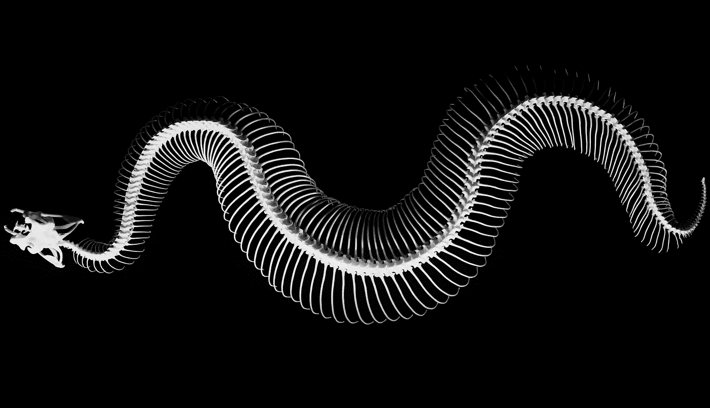
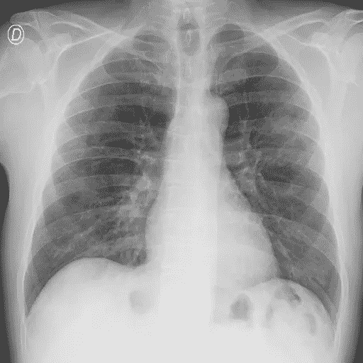

# 使用 DICOM-线程

> 原文：<https://towardsdatascience.com/working-with-dicom-threaded-6a066ad6dbbd?source=collection_archive---------36----------------------->

## 标准很重要，您应该能够与它们一起工作！

卢多维克·沙雷特在 [Unsplash](https://unsplash.com/s/photos/x-ray?utm_source=unsplash&utm_medium=referral&utm_content=creditCopyText) 上的照片

标准很重要。我是德国人，所以我知道我在说什么。我们有很多标准和规则，比如“德国工业规范”(DIN)。在这里，我们以纸张的大小或打印文档的样式为例。今天我们要讨论的是在医学图像计算中非常重要的一个标准，DICOM。这是医学数字成像和通信的简称。当我在 Kaggle 上进行[SIIM Covid-Detection Challenge](https://www.kaggle.com/c/siim-covid19-detection)时，我偶然发现了这个规范，今天我想向你展示如何使用它们进行机器学习。

在这个挑战中，以及在野外，DICOM 最常用作交换医学图像的文件格式。但问题出现了，如何打开和解析它们？我们如何在图像分类任务中使用它们？这就是我想向你解释它们的原因。我们将使用 Python 和 [BIMCV 新冠肺炎+](https://arxiv.org/pdf/2006.01174.pdf) 数据集一起完成这项工作。它包含超过 2000 个扫描，可以在 Kaggle 挑战页面下载。

# **py DICOM 库**

首先我们需要安装 pydicom 库。用 **pip** 或 **conda** 安装后。我们导入 lib 并输出第一幅图像的内容。

如果您现在打印我们的 **dicom_img** 对象，您可以看到一长串信息。这是 dicoms 最大的优点和缺点。你有许多可选字段，很容易填错，或者根本不填。但是我们现在讨论的是最重要的属性:

# **我们的转换代码**

但是现在我们只有一个 DICOM 数据集对象，我们需要的是一个实际的图像。通过这个简单的方法，我们可以将 DICOM 像素阵列转换成 8 位的 numpy 阵列:

正如你所看到的，我们有两个额外的开关 **voi_lut** 和 **fix_mono** 。 **voi_lut** 开关始终为真，因为如果我们对像素进行转换，我们会使用它，但这里有一个转折。如果我们的 DICOM 扫描中没有 VOI·LUT 序列，pydicom 会保持数组不变。第二个开关解决了以**单色 1** 格式存储的扫描的问题，因为在这种格式中，最小值以白色显示，而不是黑色，同样，这仅在存在**单色 1** 扫描时才会发生。

转换后，我们现在可以显示我们的图像，但有一些困扰我。

一些信息可能会丢失！DICOM 扫描提供了另一个有趣的属性:**位存储**和**位分配**。DICOM 扫描总是为每个像素分配一些位(1、8 或 16)，并实际存储一些位(8、12、16)。在上面的 DICOM 扫描中，我们存储了 12 位，因此我们需要一个更好的函数来根据分配的位进行转换，因此我们不使用详细信息:

到目前为止做得不错。现在让我们显示 PIL 的图像:

卡格尔·SIIM·科维德 19 号挑战赛的肺部 CT 扫描

正如您在我的代码的顶部看到的，您可以调整图像的输出大小以及应该使用多少线程。这段代码不会改变路径或数据，而是创建一个带有后缀 *_converted* 的新文件夹。如果您想添加一个 argparser，可以随意修改代码。

**建议:**

*   检查 DCM 扫描的可用大小，否则您会缩放得太多/太少
*   使用 PyTorch 的 8 位 PNGs，否则您将运行在 seg fault 错误！

感谢您的阅读，如果您有任何进一步的问题，请联系我。

参考资料:

如前所述，数据取自卡格尔比赛[SIIM·科维德 19](https://www.kaggle.com/c/siim-covid19-detection/data) 。