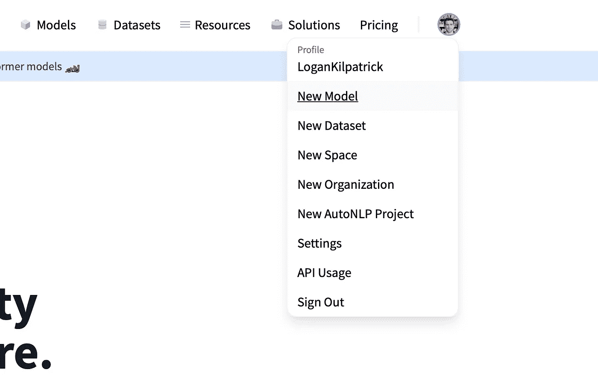

# 在拥抱面中枢上使用 Flux.jl 模型🤗

> 原文：<https://towardsdatascience.com/working-with-flux-jl-models-on-the-hugging-face-hub-b95af2b80a47?source=collection_archive---------18----------------------->


作者图片

本文将详细介绍如何在[flux . JL](https://fluxml.ai)(100%朱莉娅·迪普·学习包)中保存模型，然后从 Hugging Face Hub 上传或检索它。对于那些不知道什么是[抱脸](https://huggingface.co) (HF)的人来说，它就像 GitHub 一样，只是针对机器学习模型。传统上，机器学习模型通常会被锁起来，只有创建它们的团队才能访问。HF 正在机器学习生态系统中掀起风暴，因此了解如何在您的机器学习工作流程中使用 platfrom 至关重要。让我们深入了解如何使用您最喜欢的 Julia ML 软件包来处理 HF🤗！

如果你以前从未使用过 Flux.jl，你可以在这里找到安装说明:【https://fluxml.ai/Flux.jl/stable/#Installation[，下面还有一个关于你为什么会想使用它的快速视频:](https://fluxml.ai/Flux.jl/stable/#Installation)

编辑:我和我的合著者很高兴地告诉大家，我们的新书《朱莉娅速成班》已经开始预售了

<https://logankilpatrick.gumroad.com/l/juliacrashcourse>  

好了，现在我们已经安装了 Flux，并且您知道我们为什么可能要使用它，让我们创建一个简单的模型:

```
julia> using Flux
julia> model = Chain(Dense(10,5,relu),Dense(5,2),softmax)
Chain(Dense(10, 5, relu), Dense(5, 2), softmax)
```

然后，我们可以导入 [BSON 包](https://github.com/JuliaIO/BSON.jl)(这就是我们如何保存我们的模型，以便他们可以被其他人在拥抱脸上消费)

```
julia> using BSON: [@save](http://twitter.com/save)
```

最后，我们实际上可以通过执行以下操作来保存模型:

```
julia> [@save](http://twitter.com/save) "mymodel.bson" model
```

接下来，我们将把模型上传到拥抱脸中心，然后尝试在新的会话中下载它。如果您想了解更多关于 Flux 中的模型构建，请查看下面的视频:

前往:[https://huggingface.co](https://huggingface.co)并创建一个帐户。我不会经历所有这些步骤，因为它相当简单，但如果你遇到任何问题，请张贴在拥抱脸话语实例上:[https://discuss.huggingface.co](https://discuss.huggingface.co)

现在您已经在 HF Hub 上启动并运行，我们将在右上角选择您的个人资料图标，然后选择“新型号”。



作者图片

从那里，填写相关的细节，然后创建模型。你可以在这里找到我创建的基本模型:[https://huggingface.co/LoganKilpatrick/BasicFluxjlModel](https://huggingface.co/LoganKilpatrick/BasicFluxjlModel)

在您创建了基本的模型卡之后，下一步就是以 BSON 格式上传模型。如果你导航回到[朱莉娅·REPL](https://docs.julialang.org/en/v1/stdlib/REPL/)，你可以键入`;`然后`pwd`来找到你在本地保存模型的地方。我的保存在我的桌面上，以便于查找。在 HF 上，转到右侧的“文件和版本”和“添加文件”。现在你应该有一个自述文件和一个 BSON 格式的模型保存到拥抱脸中心了！接下来，如何将模型放回你的电脑或其他人的电脑？

所以现在我们有一个模型保存到 HF Hub，下一件事你可能想做的是下载别人的通量模型(像我的:[https://huggingface.co/LoganKilpatrick/BasicFluxjlModel](https://huggingface.co/LoganKilpatrick/BasicFluxjlModel))。

HF 提供了一个 [Python 库来与 Hub](https://huggingface.co/docs/hub/how-to-downstream) 交互。由于我还没有时间用 pure Julia 重新编写整个包，我们将开发出可靠的 PyCall.jl 包，它允许我们在 Julia REPL 会话或脚本中直接运行 Python 代码。

花一些时间来遵循 PyCall 安装指南:[https://github.com/JuliaPy/PyCall.jl#installation](https://github.com/JuliaPy/PyCall.jl#installation)，如果有任何不清楚的地方，请做开放问题。

好了，现在你已经启动并运行了，让我们使用它吧！

```
julia> using PyCalljulia> hf = pyimport("huggingface_hub")
PyObject <module 'huggingface_hub' from '/Users/logankilpatrick/.julia/conda/3/lib/python3.8/site-packages/huggingface_hub/__init__.py'>
```

注意，这里假设您已经在我们通过 PyCall 使用的同一个 Python 环境中安装了 *huggingface_hub* Python 包。

那么我们到底有什么呢？我们用 PyCall 导入了一个 Python 包到 Julia？是啊！现在我们已经导入了它，我们可以像平常使用 Python 包一样使用它:

```
julia> hf.snapshot_download(repo_id="LoganKilpatrick/BasicFluxjlModel", revision="main")
Downloading: 100%|██████████████████████████| 1.18k/1.18k [00:00<00:00, 345kB/s]
Downloading: 100%|██████████████████████████████| 711/711 [00:00<00:00, 130kB/s]
Downloading: 100%|█████████████████████████| 10.3k/10.3k [00:00<00:00, 2.07MB/s]
"/Users/logankilpatrick/.cache/huggingface/hub/LoganKilpatrick__BasicFluxjlModel.077a4b77d6175a09c156a20cf5bed0eac35c97ee"
```

现在我们已经将模型 repo 保存在本地，让我们再次将朱莉娅 repo 切换到命令行模式，键入`;`，然后将目录更改到模型文件的位置。

```
shell> cd "/Users/logankilpatrick/.cache/huggingface/hub/LoganKilpatrick__BasicFluxjlModel.077a4b77d6175a09c156a20cf5bed0eac35c97ee"
```

为了再次检查我们做得是否正确，我将运行一个 list 命令:

```
shell> ls -l
total 32
-rw - - - - 1 logankilpatrick staff 711 Oct 13 08:37 README.md
-rw - - - - 1 logankilpatrick staff 10260 Oct 13 08:37 mymodel.bson
```

太好了！我们在那里看到了模型。现在让我们把它装回通量。

```
julia> using BSON: [@load](http://twitter.com/load)
julia> [@load](http://twitter.com/load) "mymodel.bson" model
julia> model
Chain(Dense(10, 5, relu), Dense(5, 2), softmax)
```

嘣！我们做到了🎊！我们成功地用 Flux 创建了一个模型，上传到 Hub，然后下载了一个新的模型(或者是你创建的同一个)加载回 Flux / Julia。

下一步是保持训练模型并上传/分享它们。拥抱脸中心是一个与其他 ML 研究者和实践者合作的非常时髦的方式，所以我会在那里见到你！

另外，我还在 HF 上创建了一个 Julia 语言组织，所以如果你有一些令人印象深刻的模型想要分享，ping 我和我可以将你添加到该组织([https://huggingface.co/JuliaLanguage](https://huggingface.co/JuliaLanguage))。

~洛根·基尔帕特里克(【https://twitter.com/OfficialLoganK】T2