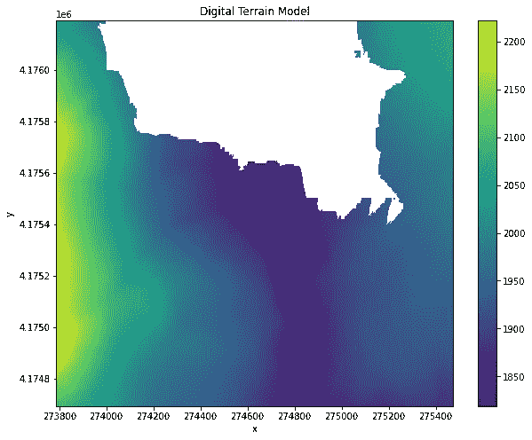

# 使用 Python 处理地理空间数据—第 1 部分

> 原文：<https://towardsdatascience.com/working-with-geospatial-data-in-python-part-1-453c97daebc5?source=collection_archive---------12----------------------->

## 常见数据类型和使用栅格从开源数据生成树冠高度模型。


安妮·斯普拉特在 [Unsplash](https://unsplash.com?utm_source=medium&utm_medium=referral) 上的照片

实话实说吧；地理空间数据很吓人。除了关于如何使用 Python 处理地理空间数据的信息不像使用其他类型数据的信息那样容易获取之外，我不认为有什么好的理由。

这是一个系列的第一篇文章，重点关注使用 Python 处理地理空间数据的各种必须了解的方面。在接下来的几周里，我们将探讨使用地理空间数据的主要主题，包括文件格式、数据类型、坐标系和使用数据的工具。我会尽量保持这些帖子的篇幅。我希望我们在整个系列中对这个话题产生一种安慰，我们的恐惧会逐渐消失。

这篇文章的前 2/3 介绍了一些概念。在最后的 1/3 中，我们将尝试从 opentopography.org 的[获取两个激光雷达栅格，并从数字表面模型和数字地形模型计算冠层高度模型。](http://opentopography.org)

我已经整理了文章，整理如下:

1.  数据类型
2.  [计]元数据
3.  实践栅格数据。

# 数据类型

地理空间数据中使用两种主要的数据类型:栅格数据和矢量数据。这可能不足为奇。如果你最近在电脑上做过任何视觉方面的工作，你可能会和两者都有过互动。下面我们将简要地看一下每一种数据。

## 栅格数据

栅格数据是网格中的数据。这和一张照片里的数据很像。在卫星图像的情况下，这些数据就像一张照片。这种地理空间栅格数据和照片栅格数据之间的区别在于，地理空间数据有一种将该数据与地球上特定位置相关联的方式。与只包含整数数据的图像不同，它还可以包含浮点或整数数据。


作者图片

栅格数据也可以是分类数据。例如，您可以将地面覆盖分为低、中或高。在这种情况下，我们将整数数据映射到一个类别。


作者图片

## 矢量数据

矢量地理空间数据也非常类似于您可能在 Adobe Illustrator 中使用过的设计数据。同样，不同之处在于地理空间矢量数据被映射到地球上的特定位置。

矢量数据有三种类型。


作者图片

每种类型的矢量数据可以表示不同种类的信息。

*   一个**点**可以代表像一棵树或一栋建筑这样的东西的位置。
*   一条**线**可以代表一条道路或者一条河流。
*   一个**多边形**可以代表地理单元，比如一个国家、州的边界，或者其他区域，比如国家公园。

# 栅格元数据

地理空间栅格使用元数据向我们传达数据的许多重要方面。以下是栅格文件元数据中的一些基本元素。

## 坐标参考系统

我在上面提到过，地理空间数据的本质特征是它将数据连接到地球上的特定点。建立这种联系的机制是坐标参考系统或 CRS。

有一个重要的复杂因素。地球是一个球体，我们的数据表示是二维的。像任何纸质地图一样，我们的数据被投影到二维空间。不同的 CRS 处理这个投影的方式不同。例如，一些 CRS 只关注地球上的特定区域。其他的更普遍，用于投影地球表面的大部分。有很多很多不同的 CRS。一些比另一些更常见，但出于我们的目的，我们需要知道当我们可视化或根据它们进行计算时，具有不同 CRS 的两个栅格不会对齐。我们需要有一种方法将两个栅格转换成相同的 CRS(在以后的文章中会有更多的介绍)。

## NoData 值

元数据的另一个关键部分是 NoData 值。栅格的格网格式要求每个方格中都有数据。`NoData`值告诉我们栅格所使用的数字，以表明它对于栅格的该部分没有值。对于整型和浮点型栅格，常见的 NoData 数据分别为`-9999`和`-3.4e+38`，但可以使用任何值。

如果您想更深入地了解地理空间栅格数据中常见的其他元数据，[这个 ArcGIS 帮助页面](https://desktop.arcgis.com/en/arcmap/10.3/main/manage-data/what-is-geodata.htm)很好地展示了各种可能性。

# 使用栅格数据

我们都可以承认，我们绝不是地理空间数据方面的专家，但这不应该阻止我们深入研究，看看我们能完成什么。

对于这个例子，我从加利福尼亚州约塞米蒂山谷的[illioulette Creek Basin LiDAR 调查中抓取了一些激光雷达数据，2018 年](https://portal.opentopography.org/raster?jobId=rt1628281995394)数据集在[opentopography.org](http://opentopography.org)上。数据是开源的，界面也很容易使用。如果你愿意，我已经上传了我使用的与本文相关的 [Github 库](https://github.com/benbogart/geospatial-python)的确切数据。

接下来我们需要的是一个工具，它可以让我们读入栅格数据。`xarray`是一个 python 库，允许我们在 python 中处理多维标签数组。对于多维数据来说有点像熊猫。`rioxarray`是构建在`xarray`之上的一个包，它提供了读写栅格文件及其元数据的方法。为了加载我们的数据，我们执行以下操作。

```
import rioxarrayterrain_file = 'data/rasters_CA18Thompson/output_be.tif'
terrain = rioxarray.open_rasterio(terrain_file)surface_file = 'data/rasters_CA18Thompson/output_hh.tif'
surface = rioxarray.open_rasterio(surface_file)
```

如果我们看一下`surface`，我们可以看到一些关于数据的信息。


作者图片

我们可以看到这个栅格文件有一个波段，x 轴和 y 轴上的数据都是浮点 64 值。我们还可以看到与上面讨论的`NoData`值相同的`_FillValue`。为了更直接地查看元数据，我们可以检查我们的`xarray`的单个属性。特定于栅格的数据位于一个名为`rio`的子类中。

```
# Get no data value
surface.rio.nodata
```

1.70141e+38

```
# Show surface CRS
print(surface.rio.crs)
```

EPSG:6340

上面告诉我们，我们的`NoData`值是`1.70141e+38`，我们的 CRS 是 EPSG:6340。前往[https://epsg.io/6340](https://epsg.io/6340)了解更多关于该 CRS 的信息。出于我们的目的，我们只需要知道这两个文件的 CRS 匹配。幸运的是，确实如此。

```
# Show terrain CRS
print(terrain.rio.crs)
```

EPSG:6340

让我们来看看如果绘制其中一个栅格会发生什么。

```
plt.figure(figsize=(10,8))
surface.plot()
```


作者图片

嗯。这没有你希望的那么令人印象深刻，不是吗？查看绘图右侧的彩色地图，我们看到 max 值相当大，与我们的`NoData`值非常相似。我们忘记了用`np.nan`替换 no data 值，这是表示缺失值的 pythonic 方式。最简单的方法是将文件通过`masked=True`重新导入到`rasterio`方法。

```
# reload the surface raster masking nan values
surface = rioxarray.open_rasterio(surface_file, masked=True)# plot surface raster
plt.figure(figsize=(10,8))
surface.plot()
plt.title('Digital Surface Model')
```


作者图片

那就好多了！现在很清楚，白色区域在数据集之外，不包含测量值。让我们来看看表面模型栅格。

```
# reload the terrain raster masking nan values
terrain = rioxarray.open_rasterio(terrain_file, masked=True)# plot terrain raster
plt.figure(figsize=(10,8))
terrain.plot()
plt.title('Digital Terrain Model')
```



作者图片

这看起来非常类似于表面模型。

最后，我们将做一点栅格数学。我们想知道树冠的高度。换句话说，我们希望看到树木和地面植被相对于地面的高度。我们有一个给我们土地上所有物体轮廓的表面模型和一个给我们土地本身轮廓的地形模型。为了得到冠层高度模型，我们从表面模型中减去地形模型。

```
# calculate canopy height model
canopy = surface - terrain# plot surface raster
plt.figure(figsize=(10,8))
canopy.plot()
plt.title('Canopy Height Model')
```


我们找到了。我们可以看到，这个地区大部分是低或没有地面覆盖，一些稀疏的树木高达 60 米。

# 结论

我希望这篇文章的最大收获是地理空间数据没有那么可怕。它处理一个我们在平面数据集中通常不必处理的问题:将三维地球投影到二维栅格上。在本系列的后续文章中，我们将学习如何重新投影和处理来自不同来源的数据。不过，今天我们学习了一些基本术语，并使用了一些基本的地理空间 python 包。

这只是本系列的第一篇文章。如果您想在我发布本系列的下一篇文章时得到通知，请在 medium 上关注我。

# 资源

*   [在由 Ryan Avery 维护的](https://carpentries-incubator.github.io/geospatial-python/) [carpentries 孵化器](https://github.com/carpentries-incubator/proposals/#the-carpentries-incubator)上使用 python 介绍地理空间栅格和矢量数据
*   [什么是地理数据？](https://desktop.arcgis.com/en/arcmap/10.3/main/manage-data/what-is-geodata.htm)在 ArcGIS 帮助页面中。
*   [OpenTopography.org](http://opentopography.org)—开源高分辨率地形数据和工具。