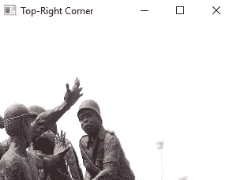

# 在 OpenCV 中使用图像像素

> 原文：<https://towardsdatascience.com/working-with-image-pixels-in-opencv-fb03b1fe9439?source=collection_archive---------16----------------------->


[翁贝托](https://unsplash.com/@umby?utm_source=unsplash&utm_medium=referral&utm_content=creditCopyText)在 [Unsplash](https://unsplash.com/s/photos/pixels?utm_source=unsplash&utm_medium=referral&utm_content=creditCopyText) 上拍摄的照片

## 使用 OpenCV 获取和设置要处理的图像像素

像素是计算机视觉中图像的重要属性。它们是代表图像中特定空间的光的颜色强度的数值，是图像中最小的数据单位。

图像中的像素总数是其高度、宽度和通道的乘积。

由于 **OpenCV** 中的图像被读取为像素值的 **Numpy** 数组，因此可以使用数组切片操作来获取和处理由该区域的像素表示的图像区域。

切片操作用于检索序列的子集，例如列表、元组和数组，并且同样可以用于获得图像区域的像素值以进行处理，例如编辑、格式化或裁剪。

**切片操作**

**脚本:使用切片操作获得列表的子集。**


输出(图片由作者提供)。

请注意，我使用了索引值来分割字母列表。例如，传递起始索引 1(列表中第二个字母的索引)和 4 会返回列表的一部分，从第二个值到第四个值。

由于索引值以这种方式用于检索感兴趣的子集，所以它们也用于定位和检索图像中的感兴趣区域。

以图像中的某个区域为目标的切片由图像的两个轴(水平轴(X)和垂直轴(Y))的起始值和结束值定义，格式如下:

***图像【startY: endY，startx:endX】***

它返回所需感兴趣区域的(图像像素的)Numpy 数组。

**那么，我们如何确定感兴趣区域的 X 轴和 Y 轴的起始值和终止值呢？**

这些值(startX，endX，startY，endY)是标出感兴趣区域的坐标值。当使用 **OpenCV** 显示时，这些值不会显示在图像旁边，但我们可以使用其他应用程序(如 Photoshop、Corel Draw、Paint e.t.c)或其他 python 可视化库(如 Matplotlib)来显示图像及其 X 和 Y 坐标值。

一如既往，这在实践中更容易理解。让我们使用***matplotlib . py plot***显示一幅图像，从中我们可以检索出绘制出图像中感兴趣的目标区域的坐标。

我用加纳共和国国旗的图像来证明这一点。在这里，我的目标是图像中围绕黑星的区域。

**获取感兴趣区域的坐标值。**

1.  **使用 *Matplotlib* 加载并显示图像。**


输出:加载的图像及其 X 和 Y 坐标。(图片由作者提供)。

如您所见， ***plt.imshow*** 函数返回读取的图像以及 x 和 y 轴的坐标值。

然后，我们可以检索感兴趣区域(黑星)的起点和终点坐标值。下面是一个如何追踪星形区域的值的图。


追踪黑星区域的坐标值。(图片由作者提供)。

该图像显示了如何追踪目标黑星周围区域的坐标。

从图像中，我们可以检索坐标(startY(y1)，endY(y2)，startX(x1)，endX(x2))。然后，我们可以定义两个轴的起点和终点坐标，并将星形裁剪为:

***图像【y1: y2，x1:x2】***

```
if we get y1, y2 = [145, 295] and x1, x2 = [245, 400]
```

那么画出黑星的区域应该是:

```
black_star = image[145:295, 245:400]
```

这将返回绘制感兴趣区域(在本例中为黑色星号)的像素值(在 Numpy 数组中)。

现在，我们可以使用这种技术来针对各种图像处理对图像区域进行定位和切片。

我使用一个来自尼日利亚埃努古的煤矿工人雕像的图像演示了切片操作的常见图像处理技术。

**使用切片操作裁剪图像**

**1。加载并显示原始图像**


输出:显示加载的图像(作者的图像)。

**2。获取图像的空间尺寸**


输出:显示图像的空间维度。(图片由作者提供)。

**3。使用尺寸来裁剪图像**

**裁剪掉图像的左上角**


输出:图片左上角(图片由作者提供)。

**裁剪掉图像的右上角**



输出:图片右上角(图片由作者提供)。

**裁剪掉图像的左下角**


输出:图片左下角(图片由作者提供)。

**裁剪掉图像的右下角**


输出:左下角(图片作者)。

**4。使用尺寸将部分图像设置为特定颜色。**


输出:设置左上角为绿色(图片由作者提供)。

**概要:**

图像像素是表示图像中颜色强度的数值。OpenCV 获取和设置不同图像处理的图像像素的过程是基于 Numpy 数组的切片操作。对像素值进行切片在裁剪、重置、复制或增强图像时非常有用。