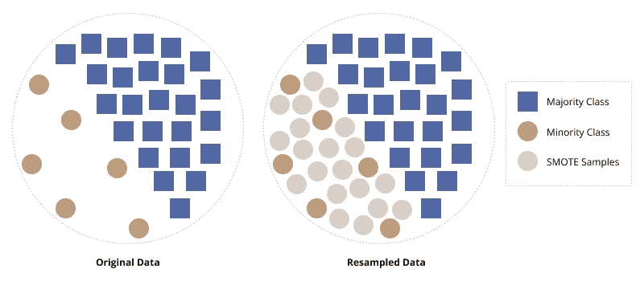

# 在构建你的 ML 模型时，不要陷入不平衡数据的陷阱

> 原文：<https://towardsdatascience.com/working-with-imbalanced-data-efbd96b3e655?source=collection_archive---------22----------------------->

## 利用这些技术带来平衡并提高性能


[阿格巴洛斯](https://unsplash.com/@agebarros?utm_source=medium&utm_medium=referral)在 [Unsplash](https://unsplash.com?utm_source=medium&utm_medium=referral) 上的照片

# 什么是不平衡数据

**不平衡数据**是机器学习应用中极其常见的一种情况。当您的数据中有许多观察值代表一种类型的类和其他小得多的类时，就会出现不平衡数据。这方面的例子可能是与合法购买相关的欺诈性*信用卡交易*或与合法电子邮件相关的潜在*垃圾电子邮件*(现在合法电子邮件也可能是少数)。

# 挑战是什么？

你会遇到的不平衡数据的挑战是算法如何从你的数据中学习。当您构建训练/测试数据集时，表示少数类的观察值数量将比多数类少得多。该算法没有足够的数据来真实地模拟少数阶级的样子，并最终过度偏向多数阶级。使用简单的*精度*指标来评估你的模型或者寻找高精度或者向少数类召回可能是特别危险的。稍后将详细介绍[评估指标](https://medium.com/data-knows-all/evaluating-ml-models-with-a-confusion-matrix-3fd9c3ab07dd)。

# 处理不平衡数据的方法

幸运的是，在您的培训和测试阶段，只要有一点额外的思考和设置，您就可以处理不平衡的数据；有许多方法可以处理不平衡的数据。以下是您可以管理它的一些(不是全部)方法:

1.  算法选择
2.  不平衡数据的交叉验证
3.  生成合成数据
4.  选择正确的绩效指标

# 我如何知道我是否有不平衡的数据

检查不平衡数据只需要一行简单的代码。取你的目标变量，使用下面的代码

```
df['Target'].value_counts()
```

```
1    17433 
0     5193
```

通过检查项目的数量，我们可以快速而容易地看到,`1`类比`0`类多得多。

# 算法选择

先说最简单的方法。在这个例子中，我将参考 **Scikit-Lern 的**算法选择以及它们如何处理不平衡数据。他们的很多算法都支持一个可以设置为`balanced`的`class_weight`参数。例如`RandomForest`、`LogisticRegression`、`Perceptron`、`SVM`都支持此参数。根据[文档](https://scikit-learn.org/stable/modules/generated/sklearn.ensemble.RandomForestClassifier.html?highlight=class_weight):

> **class_weight{"balanced "，" balanced_subsample"}，字典或字典列表，default=None** 与表单`{class_label: weight}`中的类相关联的权重。如果没有给定，所有类的权重都应该是 1。对于多输出问题，可以按照与“y”列相同的顺序提供字典列表。
> 
> “平衡”模式使用`y`的值自动调整与输入数据中类别频率成反比的权重，如`n_samples / (n_classes * np.bincount(y))`

如果您发现其中一个分类器在您的模型选择阶段表现良好，您可以简单地继续使用该算法。

# 训练-测试分离和交叉验证

当数据不平衡时，您需要以保持类比例的方式分割数据，也称为*分层分割*。`train_test_split`自动默认通过`stratify=None`参数分割数据。为了对你的分割进行分层，然后使用你的目标变量`stratify=y`。

```
X_train, X_test, y_train, y_test = train_test_split(X,
                                                    y,
                                                    test_size=0.33,
                                                    random_state=53,
                                                    stratify=y)
```

那么分层是什么意思呢？据[维基百科](https://en.wikipedia.org/wiki/Stratified_sampling):

> 在统计学中，分层抽样是一种从可以划分为子人群的人群中抽样的方法。

换句话说，它考虑了*子种群*或*类*的大小，并在分割时考虑了这一点。

当执行**交叉验证**进行模型评估时，您应该使用`StratifiedKFold`交叉验证器。这将确保通过保留每个类别的样本百分比来进行折叠。

***重要提示:*** *这一步很关键。如果没有这一点，您可能会在测试中以零个少数类样本结束。*

# 重击

合成少数过采样技术(SMOTE)使用最近邻方法来生成新的少数类样本。该方法仅应用于*训练数据*，然后在原始的*未受影响的*测试分区上进行测试。这里选择的方法是首先对少数类进行过采样以使其平衡，然后对其进行欠采样以减小大小和膨胀。



作者图片

通过综合生成类似于但不等同于其他少数类观察值的少数类观察值*，我们可以提高模型在少数类上的性能。*

包 [imblearn](https://imbalanced-learn.org/stable/index.html) 包含 SMOTE 算法，可以很容易地集成到 SKLearn 管道中。

***重要说明:*** *永远不要对你的* ***测试*** *数据集执行 SMOTE，只对* ***训练*** *分区！*

***实现注意:*** *必须导入* `*imblearn*` *管道而不是 sklearn 管道，否则无法工作。*

```
from imblearn.pipeline import Pipeline
from imblearn.over_sampling import SMOTE
from imblearn.under_sampling import RandomUnderSampler

pipeline = Pipeline([('prep',column_trans),
                     ('over', SMOTE(random_state=42)),
                     ('under', RandomUnderSampler(random_state=42)),
                     ('clf', clf)])
```

**更多:**关于使用管道的更多信息，请查看我的帖子:[在 Sci-kit 中使用管道学习](https://medium.com/@broepke/using-pipelines-in-sci-kit-learn-516aa431dcc5)。

# 选择正确的评估指标

最后，对于不平衡的数据，选择正确的评估指标至关重要。如果你依赖于准确性，你很可能不会达到你认为的结果。根据您想要的结果，您可以查看几个不同的指标，如*精度*、*召回*和*F1-分数*。请看我的另一篇帖子:[停止用精度来评价你的分类模型](/evaluating-ml-models-with-a-confusion-matrix-3fd9c3ab07dd)。

# 结论

在机器学习的实际应用中，不平衡数据无处不在。我们很容易陷入忽略不平衡数据的陷阱，却发现数据并没有按照我们想象的方式运行。幸运的是，有几种方法可以处理这一点，例如*选择一种处理不平衡数据的* *算法*，*分割*您的数据，并以*分层*的方式*交叉验证*您的模型，利用 *SMOTE* 综合生成数据，最后但并非最不重要的是，为您想要的结果选择*最佳评估指标*。快乐模型建筑！

如果你喜欢阅读这样的故事，并想支持我成为一名作家，可以考虑报名成为一名媒体成员。一个月 5 美元，让你可以无限制地访问成千上万篇文章。如果你使用[我的链接](https://medium.com/@broepke/membership)注册，我会赚一小笔佣金，不需要你额外付费。

## **参考文献**

1.  [SMOTE:合成少数过采样技术](https://doi.org/10.1613/jair.953)
2.  [交叉验证:评估评估者的表现](https://scikit-learn.org/stable/modules/cross_validation.html)
3.  [用 Python 对不平衡分类进行 SMOTE】](https://machinelearningmastery.com/smote-oversampling-for-imbalanced-classification/)