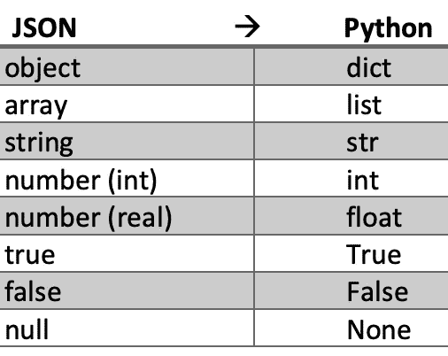

# 在 python 中使用 JSON 数据

> 原文：<https://towardsdatascience.com/working-with-json-data-in-python-45e25ff958ce?source=collection_archive---------12----------------------->


由[费伦茨·阿尔马西](https://unsplash.com/@flowforfrank?utm_source=medium&utm_medium=referral)在 [Unsplash](https://unsplash.com?utm_source=medium&utm_medium=referral) 拍摄的照片

在本文中，我想重点介绍一种叫做 JSON 的格式类型。我很确定你以前听说过 JSON。但是如果没有，让我简单地向你描述一下 JSON。

JSON 是 JavaScript 对象符号，其灵感来自于 JS 编程语言处理对象字面语法的子集。然而，它同时是语言不可知的，这意味着如果你不写 JavaScript 也没关系。您可以用任何其他编程语言处理 JSON 格式的数据。

但是为什么 JSON 对你很重要，你关心数据科学对吗？我在构建自己的 python 项目，试图获得数据科学/机器学习工程师的工作时，偶然发现了 JSON。稍后会详细介绍。【小节:“真实世界？”]因此，如果你和我走在同一条路上，并且想学习另一种有用的工具。这篇文章是给你的。即使您正处于职业生涯的不同阶段，我也相信，既然标题引起了您的注意，您一定想更新关于 JSON 格式的知识来解决当前的问题，或者您想在您的数据科学 python 库中寻找新的技能。

# JSON 看起来怎么样

好的，JSON 看起来怎么样，它支持什么？

这是文件`example.json`

如你所见，它支持基本类型，如字符串、整数、列表和嵌套对象。它看起来像 Python。但是请注意，我提供了一个读转换和写转换表，以便您了解 JSON 和 python 之间的区别。

# 为什么使用 JSON 模块在 Python 中存储数据？

1.  JSON 格式使程序员能够将简单的数据结构转储到一个文件中，并在需要时将它们加载回程序中
2.  使用 JSON 格式的文件可以在其他语言的程序之间共享数据。

由于 JSON 格式的优势来自于存储和获取数据，所以本文将与您分享一些函数和示例，以便下次您想要处理数据时，JSON 格式技巧就在您的掌握之中。

如果你想要更多关于这个话题的文章，你有必要了解一些词汇。将数据编码成 JSON 称为序列化(数据存储为一系列字节)。从 JSON 格式的文件中获取数据的反向过程称为反序列化。但是我觉得对于基本任务来说没必要知道这些。所以现在开始做一些体验吧。

# 数据到 json —序列化

假设您构建了一个创建数据的程序，但是您还想与其他用户/程序共享数据和底层信息。这就是为什么您想要获取数据并将其存储在 JSON 格式的文件中。但是数据是如何翻译的呢？我给你提供一个 Python 的换算表。


按作者分类的表格

好了，现在我们知道了在存储过程中我们可以从转换中得到什么，我们可以看看内置的 json 包中的函数。

```
import json
```

json 库中有两个函数叫做`json.dump()`和`json.dumps()`，它们可能用于序列化。

我们一次看一个。

# json.dump()将数据对象作为 json 字符串存储在。json 文件

`json.dump(data, file_object)`函数接受两个参数:

1.  需要写入 JSON 文件的数据。
2.  可用于保存数据的文件对象

example.json 如下所示

# json.dumps()将 python 对象转换成 json 字符串

这很简单。

# JSON 到数据—反序列化

同样，反序列化是将 JSON 数据转换成本地数据类型的过程。这里，我们将 JSON 数据转换回 Python 中的字典。但是我们必须再次考虑 Python 的转换表，以便意识到可能发生的错误。



按作者分类的表格

看，如果我们编码一个元组，它变成一个数组，数组变成一个列表。请记住这个。

接下来，我们想要检查用于反序列化的两个函数。

# json.load()将 json 文件读入 python 类型

`json.load(filename)`

数据来自`example.json`文件，并存储在名为 data 的字典中。

# json.loads()将 json 字符串转换成 python 类型

# 真实世界？

我在介绍中已经提到，我在构建自己的 python 项目试图获得数据科学/机器学习工程师的工作时偶然发现了 JSON。我的目标是将我从 API 收集的数据存储到一个文件中，这样我可以在以后的测试中使用它。从 API 接收 json 字符串形式的数据是很常见的。通过名为`requests`的库，你可以从一个 API 获取数据。然后，您需要将数据转换成 python 对象，这可以很容易地完成，只需使用`response.json()`而无需任何参数。

现在，假设您进行了一些争论，并决定获取数据的一个子集，并希望将其存储起来以备后用。您了解到您可以使用`json.dump(data, filename)`并在以后使用它。耶！

# 结论

很高兴您学会了如何以一种在许多其他语言中都可以管理的方式存储数据。您还知道在哪里查找换算表，并且您看到了一些无需太多努力就可以进行更改的示例，这些示例对您自己的需求非常有用。我将关键的工作流程步骤总结为以下 4 点。

1.  导入`json`包
2.  用`json.load(JSON_string)`或`json.loads(filename)`读取数据
3.  处理数据
4.  用`dump(data, filename)`或`dumps(data)`写入更改的数据

谢谢你坚持到最后。我欢迎你阅读我的另一篇文章。

</skip-gram-neural-network-for-graphs-83b8f308bf87>  </node-embeddings-for-beginners-554ab1625d98>  </graph-coloring-with-networkx-88c45f09b8f4> 