# 使用多索引熊猫数据框架

> 原文：<https://towardsdatascience.com/working-with-multi-index-pandas-dataframes-f64d2e2c3e02?source=collection_archive---------8----------------------->

## 了解如何轻松使用多索引数据框架


由 [Unsplash](https://unsplash.com?utm_source=medium&utm_medium=referral) 上的[absolute vision](https://unsplash.com/@freegraphictoday?utm_source=medium&utm_medium=referral)拍摄

大多数熊猫数据帧的学习者都熟悉数据帧的样子，以及如何使用 **loc[]** 和 **iloc[]** 索引器方法提取行和列。然而，当涉及到多索引数据框架时，事情会变得非常棘手。多索引(也称为*层次索引*)数据帧使用多个列作为数据帧的索引。一个多索引的数据框架允许你以多维的格式存储你的数据，并且打开了许多令人兴奋的来表示你的数据。

在本文中，我将向您介绍如何操作多索引数据帧，以及您可能会遇到的一些陷阱。也就是说，系好安全带——这将是一次过山车之旅！开个玩笑，会很有趣的！

# 加载数据集

对于本文，我将使用下面的数据框架进行说明:

```
import pandas as pdscores = {'Zone': ['North','South','South',
                   'East','East','West','West','West','West'], 
          'School': ['Rushmore','Bayside','Rydell',
                     'Shermer','Shermer','Ridgemont',
                     'Hogwarts','Hogwarts','North Shore'],             
          'Name': ['Jonny','Joe','Jakob', 
                   'Jimmy','Erik','Lam','Yip','Chen','Jim'], 
          'Math': [78,76,56,67,89,100,55,76,79],
          'Science': [70,68,90,45,66,89,32,98,70]}df = pd.DataFrame(scores, columns = 
                  ['Zone', 'School', 'Name', 
                   'Science', 'Math'])
df
```

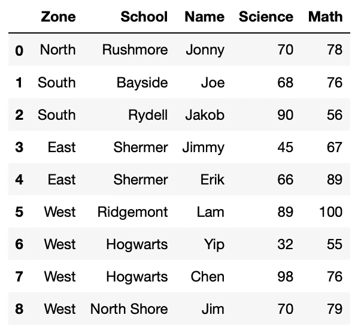

# 获取多索引数据帧

当您在 **df** 数据帧上应用聚合函数时，您将获得一个多索引数据帧:

```
**df_result_zone_school** = df.groupby(['Zone','School'])**.agg(
    {
        'Science':['mean','min','max'],
        'Math':['mean','min','max']
    })**
df_result_zone_school
```

结果看起来像这样:

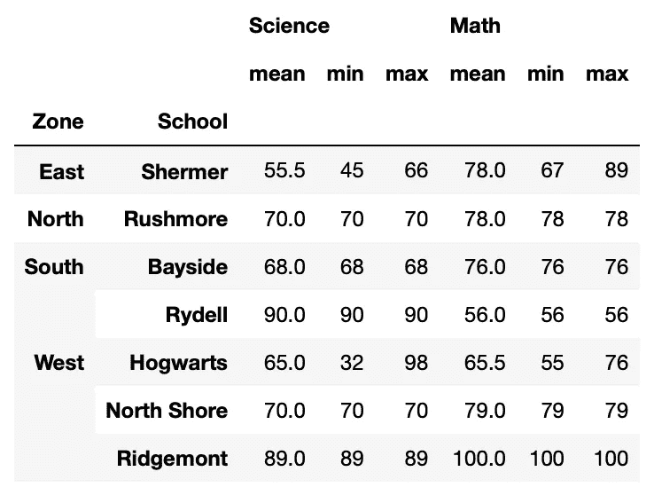

您拥有的是一个具有多列的数据帧，这些列充当数据帧的索引(通常称为*多索引*数据帧)。此外，列标题还包含多个级别。

在下面几节中，我将向您展示如何从多索引数据帧中提取行和列。

# 使用列

让我们先从柱子开始。您可以使用**列**属性来获取列标题列表:

```
df_result_zone_school**.columns**
```

您将看到以下内容:

```
MultiIndex(levels=[['Science', 'Math'], ['mean', 'min', 'max']],
           codes=[[0, 0, 0, 1, 1, 1], [0, 1, 2, 0, 1, 2]])
```

标题按级别分组，第一列属于 0 级，第一列属于下一级:

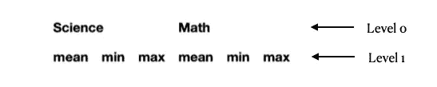

您可以使用**列获得每个级别的值。get_level_values()** 函数:

```
print(df_result_zone_school.columns.get_level_values(0))
print(df_result_zone_school.columns.get_level_values(1))
```

这将打印以下内容:

```
Index(['Science', 'Science', 'Science', 'Math', 'Math', 'Math'], dtype='object')Index(['mean', 'min', 'max', 'mean', 'min', 'max'], dtype='object')
```

## 提取具有 0 级标题的列

如果您想要提取一个单独的列，比如说**科学**列，您可以简单地指定 0 级列名:

```
df_result_zone_school[**'Science'**]
```

这将产生以下输出:

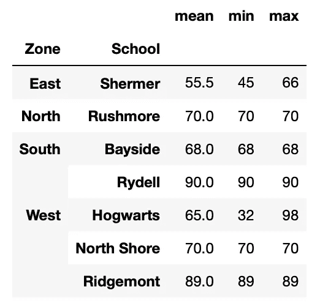

请注意，结果中不包括**科学**列标题。要包含它，请用列表( **[]** )将列名括起来:

```
df_result_zone_school[**['Science']**]
```

**科学**列标题现在包含在结果中:

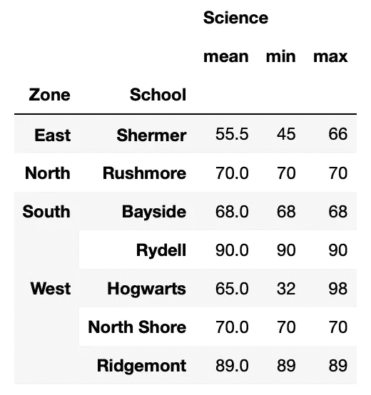

如果需要其他列，只需将列名添加到列表中:

```
df_result_zone_school[['Science'**, 'Math'**]]
```

**科学**和**数学**列现在都会出现在结果中:


## 提取具有 0 级和 1 级标题的列

如果你只想得到**理科，意思是**列呢？在这种情况下，可以通过**科学**和**意思**作为元组:

```
df_result_zone_school[**('Science','mean')**]
```

这将返回一个**系列**(即一个*多索引系列*):

```
Zone   School     
East   Shermer        55.5
North  Rushmore       70.0
South  Bayside        68.0
       Rydell         90.0
West   Hogwarts       65.0
       North Shore    70.0
       Ridgemont      89.0
Name: (Science, mean), dtype: float64
```

希望结果是数据帧吗？使用列表( **[]** )包装元组:

```
df_result_zone_school[**[('Science','mean')]**]
```

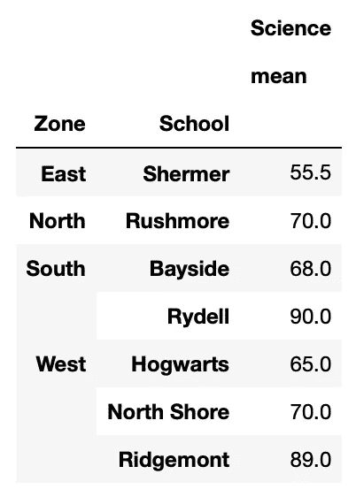

在**科学**下的*和*都是指和**最小**栏呢？您可能会尝试这样做:

```
df_result_zone_school[('Science',**['mean','min']**)]
```

不幸的是，这不起作用。相反，您必须使用 **loc[]** 索引器:

```
df_result_zone_school**.loc**[**:**, **('Science',['mean','min'])**]
```

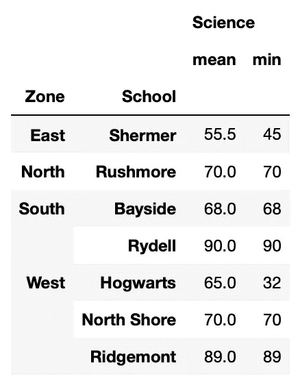

上面也可以写成:

```
df_result_zone_school.loc[:,**[('Science','mean'),
                             ('Science','min')]**]
```

使用这种技术，您现在可以检索基于 0 级和 1 级标题的附加列:

```
df_result_zone_school.loc[:,[('Science','mean'),
                             ('Science','min'),
                             **('Math','mean')**]]
```

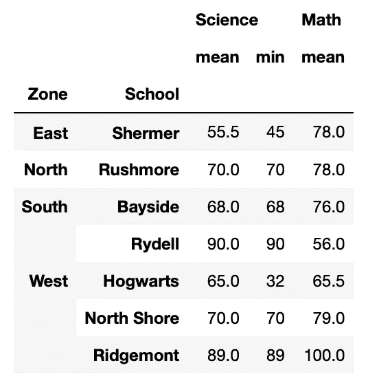

务必注意，下面的**将*而不是*将**工作:

```
df_result_zone_school.loc[:, [('Science',['mean','min']), 
                              ('Math','mean')]]
```

## 分割列

您可以对 0 级列标题执行切片:

```
df_result_zone_school.loc[:,**'Science':'Math'**]
```

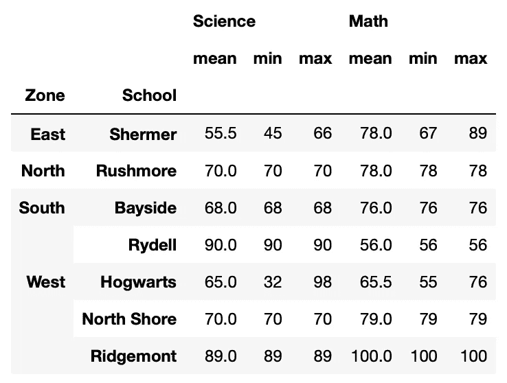

在一级标题上切片怎么样？像下面这样的？

```
df_result_zone_school.loc[:,('Science','mean':'max')]
```

不，这不行。要对 1 级头进行切片，您需要将开始和结束指定为元组:

```
df_result_zone_school.loc[:,**('Science','mean'):('Science','max')**]
```

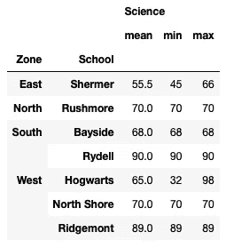

下面是另一个跨 0 级和 1 级头切片的例子:

```
df_result_zone_school.loc[:,**('Science','mean'):('Math','min')**]
```

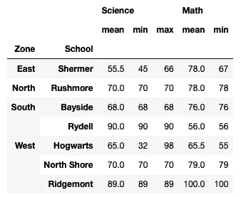

# 使用行

现在您已经查看了列，是时候查看行了。首先要做的是检查数据帧的索引:

```
df_result_zone_school**.index**
```

您应该看到以下内容:

```
MultiIndex([( 'East',     'Shermer'),
            ('North',    'Rushmore'),
            ('South',     'Bayside'),
            ('South',      'Rydell'),
            ( 'West',    'Hogwarts'),
            ( 'West', 'North Shore'),
            ( 'West',   'Ridgemont')],
           names=['Zone', 'School'])
```

索引中的每一项都是包含 0 级(**区**)和 1 级(**学校**)索引的元组。


与列标题一样，您可以使用 **get_level_values()** 函数来获取各个级别的索引:

```
df_result_zone_school.index**.get_level_values(0)**     # level-0
```

与列标题不同，索引的每个级别都有一个名称。除了通过级别号获取索引，您还可以直接使用其名称:

```
df_result_zone_school.index.get_level_values('**Zone**')
```

上述两个语句的结果是:

```
Index(['East', 'North', 'South', 'South', 'West', 'West', 'West'], dtype='object', name='Zone')
```

要获得 1 级指数:

```
df_result_zone_school.index.get_level_values(1)      # level-1
*# OR*
df_result_zone_school.index.get_level_values('**School**')
```

结果是:

```
Index(['Shermer', 'Rushmore', 'Bayside', 'Rydell', 'Hogwarts', 'North Shore', 'Ridgemont'],
      dtype='object', name='School')
```

## 提取索引级别为 0 的行

现在让我们尝试获取属于**南部**区域的所有行:

```
df_result_zone_school.loc[**'South'**]
```

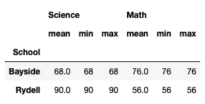

请注意，结果中未显示索引 **South** 。为了显示这一点，将它放在一个列表中( **[]** ):

```
df_result_zone_school.loc[**['South']**]
```


如果你想在**南区**和**西区**都有学校:

```
df_result_zone_school.loc[**['South','West']**]
```

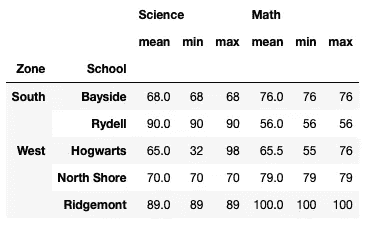

## 提取具有 0 级和 1 级索引的行

如果您想让**湾畔**学校位于**南部**区域，请将这两个值包含在一个元组中:

```
df_result_zone_school.loc[**('South','Bayside')**]
```

结果将是一个**系列**(多指标系列):

```
Science  mean    68.0
         min     68.0
         max     68.0
Math     mean    76.0
         min     76.0
         max     76.0
Name: (South, Bayside), dtype: float64df_result_zone_school.loc[[**('South','Bayside')**]]
```

要获得 dataframe 形式的结果，请使用 list( **[]** )包装元组:

```
df_result_zone_school.loc[**[('South','Bayside')]**]
```

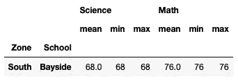

如果您想要分别来自**南部**和**西部**区域的 **Bayside** 和 **Ridgemont** 学校，请将它们作为元组传递:

```
df_result_zone_school.loc[
    **[('South','Bayside'),
     ('West','Ridgemont')]**
]
```

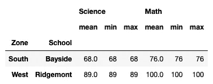

把**霍格沃茨**和**里奇蒙**从**西区**区弄来怎么样？下面这个说法能行得通吗？

```
*# this wouldn't work*
df_result_zone_school.loc[('West',['Hogwarts','Ridgemont'])]
```

不幸的是，上面的方法行不通。要使它工作，您需要在元组的后面添加一个**逗号(，)** *:*

```
*# note the comma at the end*
df_result_zone_school.loc[('West',['Hogwarts','Ridgemont'])**,**]*# this will also work*
df_result_zone_school.loc[('West',['Hogwarts','Ridgemont'])**,:**]
```

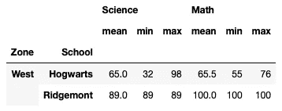

解决上述问题的另一种方法是指定两个元组:

```
df_result_zone_school.loc[
    [**('West','Hogwarts'),
     ('West','Ridgemont')**]
]
```

使用这种方法，您可以检索任何想要的行:

```
df_result_zone_school.loc[
    [
 **       ('West','Hogwarts'),
        ('West','Ridgemont'),
        ('South','Bayside')**
    ]
]
```

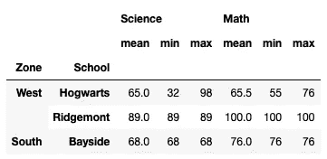

## 切片行

当然，您可以根据索引对行进行切片。假设您想要从**北部**到**西部**区域的所有学校:

```
df_result_zone_school.loc[**'North':'West'**]
```

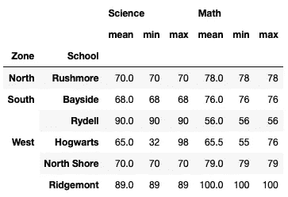

从南面的**，海湾边的**到西面的**，霍格沃茨**的所有学校怎么样？没问题:

```
df_result_zone_school.loc[
    **('South','Bayside'):('West','Hogwarts')**
]
```

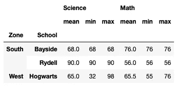

把**霍格沃茨**带到**西区**的**里奇蒙**怎么样？既然都属于**西**区，下面还能工作吗？

```
*# this wouldn't work*
df_result_zone_school.loc[
    ('West','Hogwarts':'Ridgemont')
]
```

相反，您应该这样做:

```
df_result_zone_school.loc[
    **('West','Hogwarts'):('West','Ridgemont')**
]
```

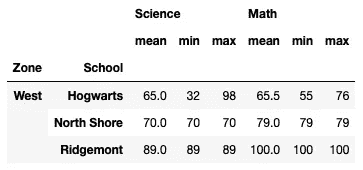

# 按位置获取行和列

通过位置获取行和列比通过值获取更直接。以下是一些使用 **iloc[]** 索引器的示例:

```
df_result_zone_school.iloc[**[0],[0]**]
```


```
df_result_zone_school.iloc[**[0],[0,1]**]
```

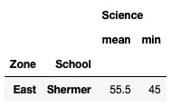

```
df_result_zone_school.iloc[**[1,2,3]**]
```

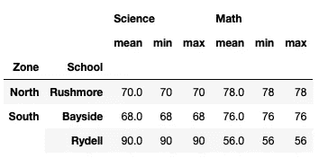

```
df_result_zone_school.iloc[**2:5, 3:**]
```

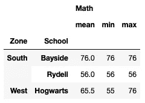

# 基于索引值搜索行

有时基于数组索引提取行更容易。例如，假设您想要获取属于北**和南**区域的所有行。你可以得到 0 级索引，然后使用 **isin()** 函数，就像这样:

```
condition = df_result_zone_school.index.**get_level_values(
    'Zone').isin(['North','South'])**
df_result_zone_school[condition]
```

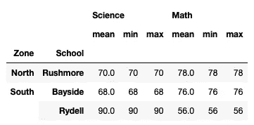

如果你想得到所有以' *th* 结尾的区域，你可以使用 **endswith()** 函数:

```
condition = df_result_zone_school.index.**get_level_values(
    'Zone').str.endswith('th')**
df_result_zone_school[condition]
```

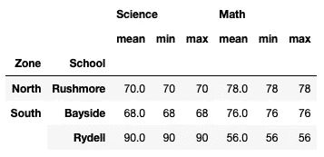

只上赖德尔和谢默学校怎么样？检查过了！

```
condition = df_result_zone_school.index**.get_level_values(
    'School').isin(['Rydell','Shermer'])**
df_result_zone_school[condition]
```

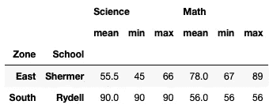

最后，如果你想得到 **Rydell** 和 **Shermer** 学校，以及 **West** 区的所有学校呢？

```
condition1 = df_result_zone_school.index**.get_level_values(
    'School').isin(['Rydell','Shermer'])**
condition2 = df_result_zone_school**.index.get_level_values(
    'Zone').isin(['West'])**
df_result_zone_school[ **condition1 | condition2** ]
```

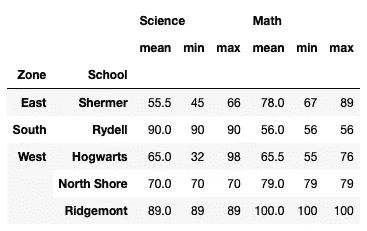

# 重置索引

如果你到现在还在关注，那就太好了！还记得我们的多索引数据框架吗？

```
df_result_zone_school
```

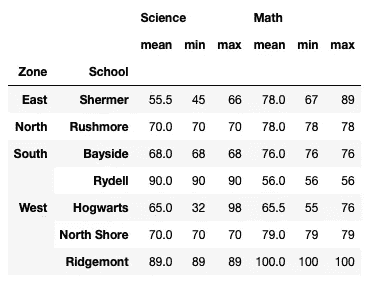

有时，您希望将索引扁平化，以便更容易处理数据帧。您可以通过 **reset_index()** 函数来实现:

```
df_result = df_result_zone_school**.reset_index()**
df_result
```

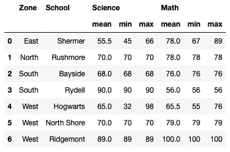

**reset_index()** 函数具有**级**参数，允许您指定要移除的索引。默认情况下，它会删除所有级别的索引。所以上面的语句本质上是这样的:

```
df_result = df_result_zone_school.reset_index(
 **level=['Zone','School']**)
```

您可以使用索引的级别号或索引名来指定要删除的索引:

```
df_result_school = df_result_zone_school.reset_index(level=[0])
# same as 
df_result_school = df_result_zone_school.reset_index(level=
    ['Zone'])
df_result_school
```

上述语句从索引中删除了区域:


以下语句将**学校**从索引中删除:

```
df_result_zone = df_result_zone_school.reset_index(level=[1])
# same as 
df_result_zone = df_result_zone_school.reset_index(level=['School'])
df_result_zone
```

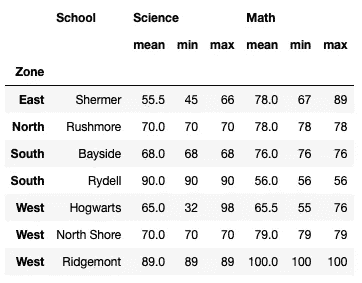

您可以使用 **set_index()** 函数指定一列作为索引，而不是使用 **reset_index()** 函数从索引中删除一列。调用 **df_result** 数据帧:

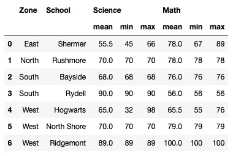

以下语句将**区域**设置为索引:

```
df_result.**set_index('Zone')**
```

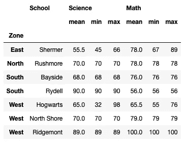

最后，下面的语句将**区域**和**学校**都设置为索引:

```
df_result.set_index(**['Zone','School']**)
```


# 结论

我希望这篇文章使处理多索引数据框架不像最初看起来那么可怕。记住我在本文中讨论的技术的最好方法是自己尝试代码示例。如果你有进一步的问题，请留下你的评论，我会尽量在这里回答。玩得开心！

[](https://weimenglee.medium.com/membership) [## 加入媒介与我的介绍链接-李伟孟

### 作为一个媒体会员，你的会员费的一部分会给你阅读的作家，你可以完全接触到每一个故事…

weimenglee.medium.com](https://weimenglee.medium.com/membership)