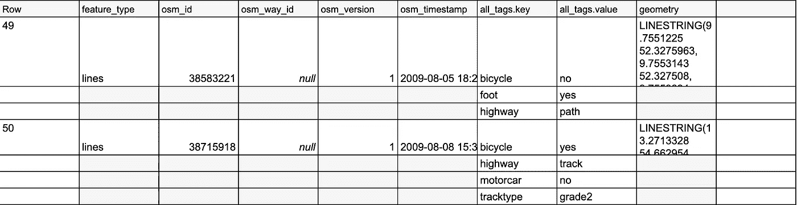
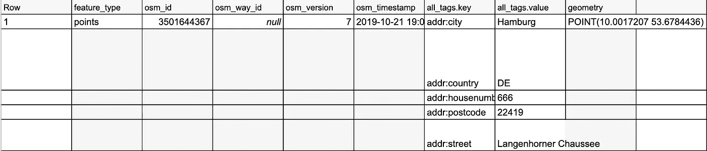
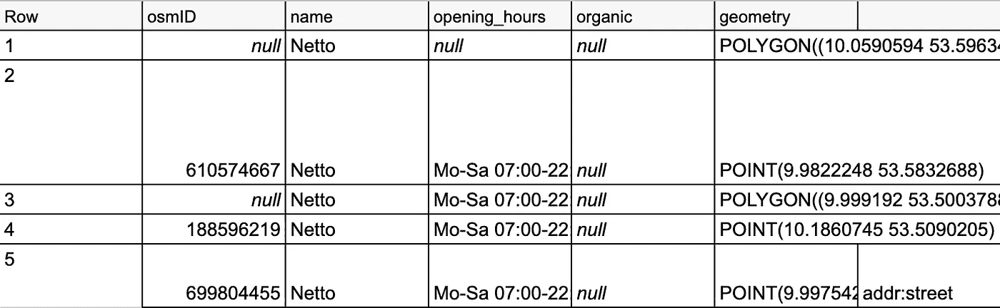
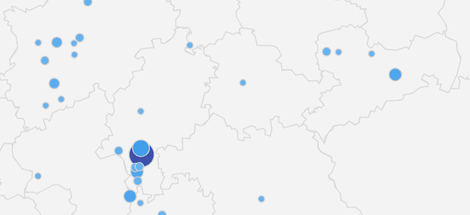

# 使用 OpenStreetMap 数据

> 原文：<https://towardsdatascience.com/working-with-openstreetmap-data-37da18d55822?source=collection_archive---------30----------------------->

## 如何使用开放数据进行商业洞察


乔伊·孙约在 [Unsplash](https://unsplash.com/s/photos/map?utm_source=unsplash&utm_medium=referral&utm_content=creditCopyText) 上的照片

在本演练中，我将使用 BigQuery 中的 OpenStreetMap 数据。谷歌在他们的公共数据集中免费发布，这太棒了。所以你可以用 SQL [1]轻松查询地理信息。谷歌上传了一次他们的数据集，但没有任何更新。如果您需要更新的数据，那么 OpenStreetMap API 结合一些简单的 python 代码可能是您的问题的一个可能的解决方案。

## OpenStreetMap 的用例

OpenStreetMap.org 是一个国际项目，成立于 2004 年，目标是创建一个免费的世界地图。为此，我们收集了世界范围内的公路、铁路、河流、森林、房屋等数据。

虽然来自 OpenStreetMap 的数据是免费的，但你可以很好地得出一定的商业优势。我帮助开发或至少参与开发的一些示例如下:

*   地理分析(我的客户在哪里？)
*   市场分析(我的竞争对手在哪里有门店？)
*   旅游优化(如何优化物流路线？)
*   欺诈检测(运输发票是否合理？)
*   还有更多

## 什么是嵌套数据？

从 BigQuery 数据集中查询数据将返回嵌套的数据字段。BigQuery 支持从支持基于对象的模式(例如 JSON)的源格式中加载和查询嵌套和循环数据。下面是嵌套数据的简短说明:


嵌套和重复数据的图示-按作者分类的图像

地址列包含一个值数组。数组中的不同地址是重复出现的数据。每个地址中的不同字段是嵌套数据。

## 真实的例子

对于使用 BigQuery 的示例演练，我在 *geo_openstreetmap* 数据集*中使用了开放数据集 *planet_features* 。*在这里，数据是以嵌套格式存储的，所以我们来看看:

```
SELECT * FROM `bigquery-public-data.geo_openstreetmap.planet_features` LIMIT 1000
```

这是以下输出中的结果:



输出—按作者分类的图像

结果乍一看还不错。与传统的关系数据库不同，我可以使用数组并保存额外的列。此外，整件事的效果非常好。现在，我想在德国找一家超市，应该使用简单的 where 子句，对吗？差不多了。在这里，你需要 ***Unnest、*** 的魔力

```
SELECT * 
FROM   `bigquery-PUBLIC-   data.geo_openstreetmap.planet_features` 
WHERE  'Netto' IN 
       ( 
              SELECT value 
              FROM   unnest(all_tags)) 
AND    ( 
              'addr:country', 'DE') IN 
       ( 
              SELECT (KEY, value) 
              FROM   unnest(all_tags)) 
AND    ( 
              'addr:city', 'Hamburg') IN 
       ( 
              SELECT (KEY, value) 
              FROM   unnest (all_tags));
```

这导致了期望的输出:



输出—按作者分类的图像

利用 ***功能，您还能够*** 展平**数据并由此输出查询结果:**

```
SELECT osm_id,tags
FROM bigquery-public-data.geo_openstreetmap.planet_features,
UNNEST(all_tags) as tags limit 100
```


拼合数据—按作者排列的图像

当在 BigQuery 中处理嵌套数据并想要查询一些数据时，这可能是您必须知道的最重要的事情。但是，如果您想将数据用于进一步的 ETL 过程，将数据存储在关系数据库中，或者需要键值对作为分类器的属性，该怎么办呢？这里，您不希望数据变平，因为这将导致重复的行，这里您希望数组中的键值对作为新列:

```
SELECT
       (
              SELECT osm_id) osmid,
       (
              SELECT value
              FROM   unnest(all_tags)
              WHERE  KEY = "Address") AS address,
       (
              SELECT value
              FROM   unnest(all_tags)
              WHERE  KEY = "name") AS name,
       (
              SELECT value
              FROM   unnest(all_tags)
              WHERE  KEY = "opening_hours") AS opening_hours,
       (
              SELECT value
              FROM   unnest(all_tags)
              WHERE  KEY = "organic") AS organic,
       (
              SELECT geometry) AS geometry,
FROM   bigquery-public-data.geo_openstreetmap.planet_features
WHERE  (
              'Edeka' IN
              (
                     SELECT value
                     FROM   unnest(all_tags))
       OR     'Rewe' IN
              (
                     SELECT value
                     FROM   unnest(all_tags))
       OR     'Netto' IN
              (
                     SELECT value
                     FROM   unnest(all_tags)))
AND    (
              'addr:country', 'DE') IN
       (
              SELECT (KEY, value)
              FROM   unnest(all_tags)) -
AND    (
              'addr:city', 'Hamburg') IN
       (
              SELECT (KEY, value)
              FROM   unnest(all_tags));
```

这给了我们输出:



嵌套和重复出现的列数据—按作者分类的图像

最后，您可以通过 Google Data Studio 等商业智能工具来可视化数据——尤其是在使用 BigQuery 时。



用于可视化地理数据的 Google Data Studio 按作者分类的图片

在相关的用例中，数据也显示在地图上，以了解商店的分布情况。在仪表板中，一个底层表格也提供了更接近的见解。为了进行更深入的分析，这些数据还被用于即将到来的客户细分场景。

## 结论

除了 OpenStreetMap API 和 Googles 的公共数据集之外，你还可以找到更多的数据集用于你的分析。在这里，我推荐谷歌数据集搜索网站:[https://www.google.com/publicdata/directory](https://datasetsearch.research.google.com/)

BigQuery 等新系统通过基于列的数据库提供了极高的计算能力和快速的结果。通过上面的例子，您应该能够很好地查询和处理大多数嵌套数据用例。有了免费数据和计算能力，您可以实现许多有利可图的用例。作为第一步，我建议简单地处理数据。使用 Google Cloud 免费层，你可以相对容易地做到这一点。

## 资料来源和进一步阅读

[1]谷歌， [OpenStreetMap 公共数据集](https://console.cloud.google.com/marketplace/details/openstreetmap/geo-openstreetmap)

[2] OpenStreetMap，【https://www.openstreetmap.de/ (2021)

[3]谷歌，[在谷歌云上解决真正的商业挑战](https://cloud.google.com/free) (2021 年)