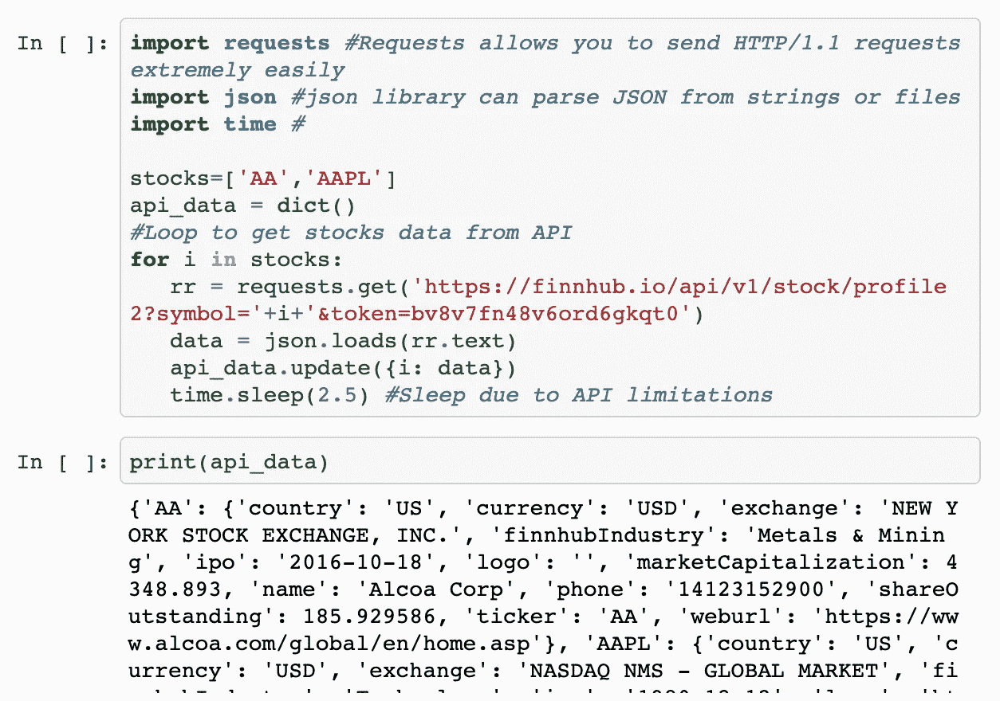
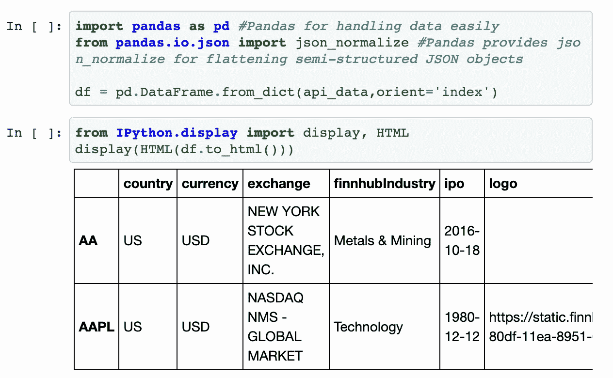
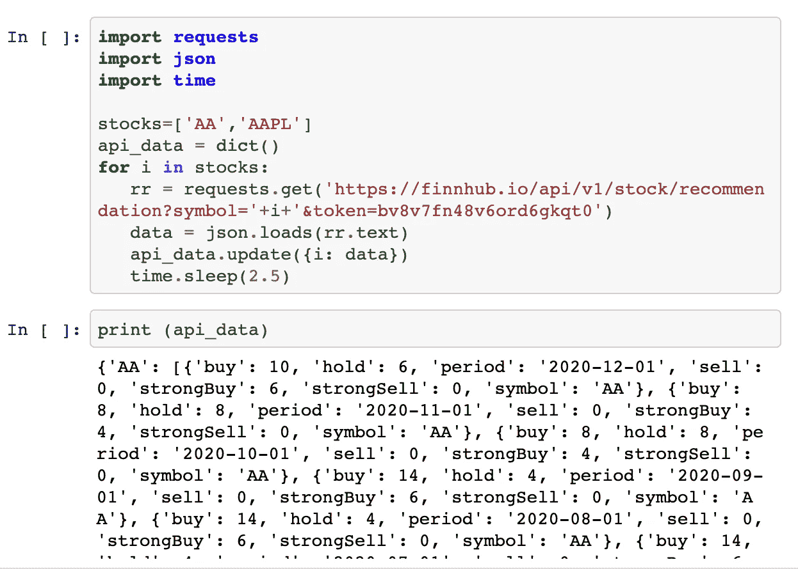
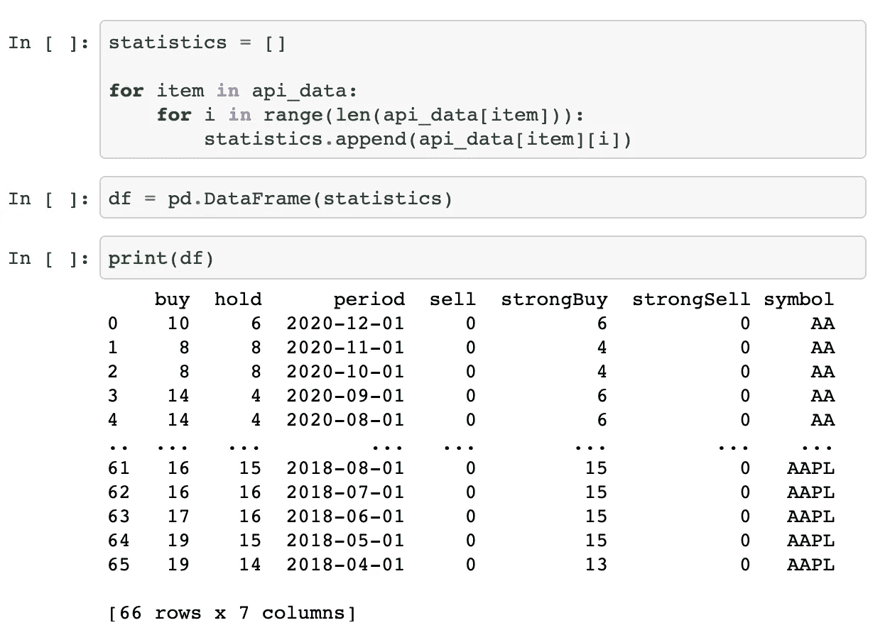
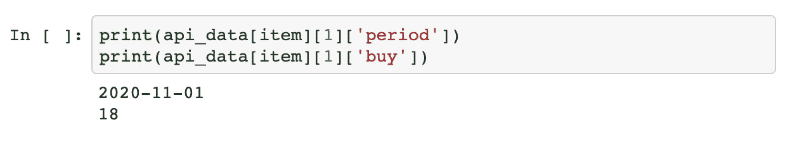

# 使用 Python 和 JSON

> 原文：<https://towardsdatascience.com/working-with-python-and-json-1ca0a7446744?source=collection_archive---------32----------------------->

## 每个数据爱好者都必须了解的基础知识


在 [Unsplash](https://unsplash.com/s/photos/pine?utm_source=unsplash&utm_medium=referral&utm_content=creditCopyText) 上由 [Vadym Lebedych](https://unsplash.com/@lebedych?utm_source=unsplash&utm_medium=referral&utm_content=creditCopyText) 拍摄的照片

作为数据分析师、数据工程师或数据科学家，你经常会接触到 JSON 格式的数据。而且对数据有兴趣的经理或来自不同部门的员工也经常有机会处理 API 并为仪表板或类似的东西提供数据。在这里，您经常使用 JSON 格式，因此了解它的最基本的知识对于快速、轻松地将数据放入 Python DataFrame 是很有用的。

## JSON 是什么来着？

**JSON** (JavaScript 对象符号)是一种数据交换格式。用户可以轻松读写这种格式，机器也可以轻松解析生成。

JSON 建立在两种结构之上:

*   名称/值对的集合:在各种语言中，这被实现为一个*对象*、记录、结构、字典、散列表、键列表或关联数组。
*   值的有序列表:在大多数语言中，这被实现为一个*数组*、向量、列表或序列【1】。

**示例**

```
{
  "company": "Google",
  "companycontacts": {
    "phone": **12345678**,
  },
  "employees": [
    {
      "name": "Lukas",
      "id": 19,
    },
    {
      "name": "Lisa",
      "id": 14,
    }
  ]
}
```

在下图中，您可以看到一个典型的 JSON 示例。JSON 对象以“{”开头，后跟一个名称(“公司”)和值(“Google”)。通常，您还会在对象中找到对象，如公司联系人。元素“employee”是一个经典的数组示例，其中也可以包含另一个数组。

## 四个主要使用案例

首先让我们获取一些数据——在这里，我使用了 finnhub API，这是一个非常好的 API，可以为您提供非常智能的金融数据，如股票、货币和密码[2]。



获取 API 数据—按作者排序的图像

**第一种情况:对象中的对象:**通常你会需要数据帧中来自 API 的数据——所以你需要平铺对象中的对象。将数据放在数据框中便于将数据用于数据科学任务或将其加载到数据库中。



在对象中展平对象—按作者排列的图像

**第二种情况:从 JSON 数组中读取:**

现在让我们用 JSON 中的数组获取一些数据——在这个例子中，我请求了一些股票数据，包括买入、持有等。信息:



获取 API 数据—按作者排序的图像

从对象的数组中获取数据有点困难，但从数组本身的对象中获取数据也有点困难，就像您在这里看到的:



拼合对象中的数组—按作者排列的图像

这个想法是在一个关系表结构中获得每只股票的基于周期的数据。这里，我们需要一些循环:

**第三种情况:显式键和值**

上面的例子，但以获取某些键和值为目标可以通过:



获取显式的键和值—按作者排序的图像

例如，我从数组中取出第二个项目(period 月)和相应的 *buy=18* 值。

**第四种情况:将 DataFrame 写成 JSON 格式**

如果您需要其他方式，只需通过以下方式即可:

```
out = df.to_json(orient=’records’)[1:-1].replace(‘},{‘, ‘} {‘)
```

如果您想将数据写回到像数据仓库或数据湖这样的系统中，这通常是需要的。像 Amazon 的 Redshift 或 Google 的 Big Query 这样的现代数据仓库技术也经常支持 JSON 和嵌套数据结构[3]。

## 结论

当处理数据时，您无法避免 JSON，尤其是在处理 API 和免费数据源时。对于数据管理系统的数据集成，使用 JSON 格式也是一个好主意。许多现代技术都支持 JSON 格式。作为一名数据分析师或工程师，你可能无法避开 JSON，但即使作为一名经常处理数据的普通雇主，了解一些基础知识以及如何使用 Python 将数据转换成数据帧以供进一步处理也是有意义的。我希望这篇文章能为您提供关于 JSON 的最重要的信息，以及一些实际上如何开始处理这类数据的例子。

## 资料来源和进一步阅读

[1]JSON.org，[介绍 JSON](https://www.json.org/json-en.html) (2021)

[2]芬兰枢纽，[https://finnhub.io/](https://finnhub.io/)(2021)

[3] Google，[从云存储中加载 JSON 数据](https://cloud.google.com/bigquery/docs/loading-data-cloud-storage-json) (2021)