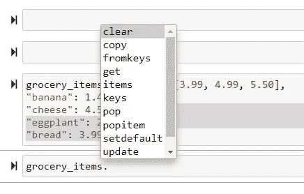

# 使用 Python 字典:备忘单

> 原文：<https://towardsdatascience.com/working-with-python-dictionaries-a-cheat-sheet-706c14d29da5?source=collection_archive---------3----------------------->


照片由[艾迪·克劳斯](https://unsplash.com/@eduardo_mekmuffin?utm_source=medium&utm_medium=referral)在 [Unsplash](https://unsplash.com?utm_source=medium&utm_medium=referral) 上拍摄

## 访问、编辑和循环浏览字典项目

## 一些基础知识

Python 中的字典是键值对的集合，这意味着字典中的每个条目都有一个键和一个关联值。

如果我们想写下杂货店里一些商品的价格，通常我们会把它们记在一张纸上，就像这样:

```
eggs - 4.99
banana - 1.49
cheese- 4.5
eggplant - 2.5
bread - 3.99
```

在 Python 字典行话中，每件商品的名称是“key”，相关的价格是“value”，它们成对出现。我们可以在 Python 字典数据结构中表示相同的内容，如下所示:

```
{"eggs": 4.99,
"banana": 1.49,
"cheese": 4.5,
"eggplant": 2.5,
"bread": 3.99}
```

注意不同之处。在字典里

*   每个键都在引号内，因为它们是字符串
*   相关值没有被引用，因为它们是数字
*   键和值由冒号(:)分隔
*   这些项目用逗号分隔

现在，在第一项中，我们有`{"eggs”: 4.99}`，但实际上，鸡蛋可以有几个值——一个是褐色鸡蛋，一个是白色鸡蛋，一个是有机鸡蛋 python 字典允许在字典中添加多个值，这样`{“eggs”: [3.99, 4.99, 5.50]}`。

让我们给这本字典起个名字，玩玩它:

```
grocery_items = {"eggs": [3.99, 4.99, 5.50],
"banana": 1.49,
"cheese": 4.5,
"eggplant": 2.5,
"bread": 3.99}
```

您可以打开 IDE/text 编辑器，按照下面的代码使用我们刚刚创建的字典。

## 添加和删除项目

我们已经建立了包含 5 个条目的初始字典，但是我们可以通过添加更多条目来扩展它:

```
grocery_items["onion"] = 3.50 Out: {"eggs": [3.99, 4.99, 5.50], "banana": 1.49, "cheese": 4.5, "eggplant": 2.5, "bread": 3.99, "onion": 3.50}
```

您可以用类似的方式添加多个项目。

我们也可以反过来做——从列表中删除一个或多个项目。有几种方法可以做到这一点:

使用`popitem()`方法移除最后一个项目:

```
grocery_items.popitem()Out: {"eggs": [3.99, 4.99, 5.50], "banana": 1.49, "cheese": 4.5, "eggplant": 2.5, "bread": 3.99}
```

或者只使用`pop()`方法通过项目的键名删除项目:

```
grocery_items.pop("banana")Out: {"eggs": [3.99, 4.99, 5.50], "cheese": 4.5, "eggplant": 2.5, "bread": 3.99}
```

最后，你可以用`clear()`方法清空整个字典(也就是清空它)，用`del`关键字删除整个字典(如果你不得不使用它的话，一定要小心)。

您可能想知道有人在哪里可以找到所有这些方法？只要按键盘上的“tab”键，所有的方法都会弹出来。



在 Python 中访问字典方法

## 访问项目

通常有必要在字典中获得一个键或值的列表，以供进一步分析(我们将在后面看到原因)。

要访问所有键:

```
grocery_items.keys()Out: dict_keys(['eggs', 'banana', 'cheese', 'eggplant', 'bread'])
```

要改为访问所有值:

```
grocery_items.values()Out: dict_values([[3.99, 4.99, 5.5], 1.49, 4.5, 2.5, 3.99])
```

我们还可以查询字典来访问特定键的值(例如香蕉的价格)。有几种方法可以做到这一点:

```
# access values by key
grocery_items["banana"]# or 
grocery_items.get("banana")Out: 1.49
```

但是鸡蛋呢？我们有三种不同的鸡蛋价格。我们可以选择访问所有价格:

```
grocery_items.get("eggs")Out: [3.99, 4.99, 5.5]
```

我们也可以选择按索引位置访问列表中的第一个:

```
grocery_items.get("eggs")[0]Out: 3.99
```

事实上，我们可以以类似的方式访问更复杂的嵌套字典项/键/值。

## 更多的方法和功能

除了上述最常用于字典的方法之外，还有一些方法和函数可以在数据分析中派上用场:

要获得字典中的条目数:

```
len(grocery_items)Out: 5
```

要更改键值，请执行以下操作:

```
grocery_items.update({"banana": 0.85})
```

要将密钥转换为列表:

```
list(grocery_items)Out: ['eggs', 'banana', 'cheese', 'eggplant', 'bread']
```

如果字典非常大，我们可以检查一个键是否存在:

```
"potato" in grocery_itemsOut: False
```

最后，为了返回字典的字符串表示:

```
str(grocery_items)Out: "{'apple': 2.5, 'orange': 4.99, 'banana': 0.59}"
```

## 在字典中循环

经常需要根据某些条件更改字典元素或提取特定的值或键。因为字典是可迭代的对象，循环经常被用于这样的操作。这里有几个例子:

打印所有密钥的简单循环:

```
for i in grocery_items:
    print(i)Out:
eggs
banana
cheese
eggplant
bread
```

或者用于字典键的条件过滤的`for`循环:

```
for i in grocery_items.keys():
    if i.startswith("e"):
        print(i)Out:
eggs
eggplant
```

## 词典释义

像列表理解一样，Python 也支持字典理解来执行不同种类的操作。我们上面创建的`for`循环也可以用字典理解语法来表达。

例如，要打印字典的值:

```
[x for x in grocery_items.values()]Out:
[[3.99, 4.99, 5.5], 1.49, 4.5, 2.5, 3.99]
```

## 摘要

概括地说，我们在本文中介绍了:

*   Python 字典是具有键值对的可迭代对象
*   可以编辑字典来添加、删除和更新值
*   字典元素可以通过`.keys()`、`.values()`、`.items()`等方法访问
*   字典是可迭代的对象，所以 Python 允许`for`循环或字典理解。

我省略了许多其他的方法和功能，但是我希望这为构建一个使用 Python 字典对象的备忘单提供了一个良好的开端。

如果你有意见，请随意写在下面，或者通过[媒体](https://mab-datasc.medium.com/)、[推特](https://twitter.com/DataEnthus)或 [LinkedIn](https://www.linkedin.com/in/mab-alam/) 与我联系。