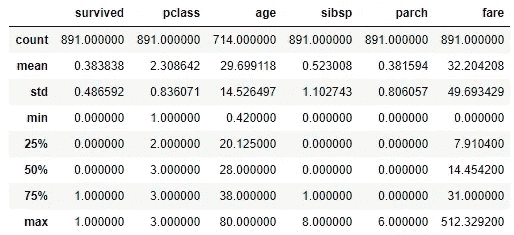
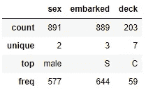
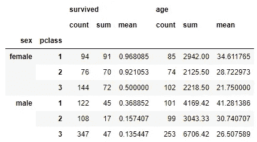

# 使用 SQL 与熊猫(第 2 部分)以及练习题

> 原文：<https://towardsdatascience.com/working-with-sql-versus-pandas-part-2-plus-practice-problems-ae1c19aab114?source=collection_archive---------19----------------------->

## 聚合和分组数据


塞尔吉奥·卡普齐马蒂在 [Unsplash](https://unsplash.com?utm_source=medium&utm_medium=referral) 上拍摄的照片

这是系列文章的第二部分。你可以在这里找到第一部分:

[](/working-with-sql-versus-pandas-part-1-plus-practice-problems-c23934c41e3) [## 使用 SQL 与熊猫(第 1 部分)以及练习题

### 选择、过滤和排序数据

towardsdatascience.com](/working-with-sql-versus-pandas-part-1-plus-practice-problems-c23934c41e3) 

# 介绍

在本系列中，我将 Python Pandas 与 SQL 进行比较。这两个都是流行的数据操作工具，在功能上有很多重叠。在本文中，我们将讨论数据的聚合和分组。对于本文中的示例，我们将再次使用可以在 Kaggle 上找到的 [Titanic 数据集。我鼓励你下载它，并遵循最大保留。另外，不要忘记在最后尝试一下练习题。好吧，我们开始吧！](https://www.kaggle.com/c/titanic)

# 聚合函数

假设我们对找出一些数据的统计感兴趣，比如支付的最高和最低票价，乘客的平均年龄，以及有多少人幸存。

## 结构化查询语言

要在 SQL 中执行聚合函数，您可以将`AVG()`、`COUNT()`、`MIN()`、`MAX()`和`SUM()`用于您想要在括号中应用函数的列。需要注意的是，这些聚合函数会忽略空值。这是我们设置的问题的样子。

```
SELECT MAX(fare), MIN(fare), AVG(age), SUM(survived)
FROM titanic
```

请记住，幸存的列用 1 表示幸存的列，用 0 表示未幸存的列。这就是为什么`SUM()`函数能够给出幸存者的总数。

对于这些聚合函数，您可能会发现使用`ROUND()`可以获得更漂亮的结果。例如，如果我们想将平均年龄列的结果四舍五入到小数点后一位，结果应该是这样的:`ROUND(AVG(age), 1)`。如果我们想要四舍五入到最接近的整数，那么它将是这样的:`ROUND(AVG(age))`。

SQL 的一个缺点是前面列出的聚合函数是唯一的标准函数。没有如此简单、直接的方法来计算一列的中值或标准差。我相信 SQL 的某些特定版本可能有更多的聚合函数选项，所以我建议对您正在使用的版本做一些研究。

## 熊猫

pandas 中有几个集合函数选项。Pandas 默认忽略空值，但是如果你真的想的话，有一些参数可以包含它们。为了在某些列上完成特定的聚合函数，我们可以单独计算每个函数。这就是它的样子。

```
titanic.fare.agg(['max','min'])
titanic.age.mean()
titanic.survived.sum()
```

这里让我们列出一个清单。因为我们想要找到 fare 列的最大值和最小值，所以我们可以使用`agg()`方法将其合并到一行代码中。

正如在 SQL 示例中提到的，您可能想要舍入以获得更好的结果。你可以在一个`round()`上链这样做。第一个参数是小数位数，默认值为 0。例如，平均年龄四舍五入到小数点后一位就是`titanic.age.mean().round(1)`。

Pandas 真正了不起的地方是`describe()`方法，它返回数字列的汇总表。代码`titanic.describe()`返回下表。



作者创造的形象

这比技术上要求的信息要多，但是仍然非常有用，并且只需要一行非常简单的代码。您还可以通过`titanic.describe(include=”O”)`获得一些关于“object”数据类型列的信息。下面是返回的内容。



作者创造的形象

Pandas 拥有比 SQL 更多的聚合函数，如 median ( `median()`)、standard deviation ( `std()`)和 variance ( `var()`)。`agg()`方法还允许更大的灵活性，如果你愿意，你可以基于一个定制的函数进行聚合。

# 分组依据

比方说，我们希望找到每个班级的男性和女性的一些汇总数据。让我们找出每个班级中男性和女性的数量、平均年龄和存活人数。

## 结构化查询语言

在 SQL 中，`GROUP BY`子句用于此目的。这是它看起来的样子。

```
SELECT sex, pclass, COUNT(*), SUM(survived), AVG(age)
FROM titanic
GROUP BY sex, pclass
```

在本例中，由于我们返回的列不是聚合值(sex，pclass)，如果没有 GROUP BY 子句，代码将无法运行，因为 SQL 不知道如何处理没有 GROUP BY 子句的这些列。在按性别和阶级分组时，将为性别和阶级的每个组合单独计算汇总列(女性在一等，男性在一等，女性在二等，等等)。)

## 熊猫

在熊猫身上，我们有获得我们想要的结果的方法。和以前一样，我们可以运行代码来获得我们想要的每一个片段，或者我们可以运行包含比我们需要的更多信息的代码。这是把信息分成几部分的样子。

```
titanic.groupby(['sex', 'pclass']).survived.agg(['count', 'sum'])
titanic.groupby(['sex', 'pclass']).age.mean()
```

我们也可以生成一个包含我们想要的信息的表，但是它包含的信息比我们要求的要多。这就是它的样子。

```
new_df = titanic.groupby(['sex', 'pclass'])[['survived', 'age']]
new_df.agg(['count', 'sum', 'mean'])
```

在这个例子中，我创建了一个新的变量来拆分代码行，这样更容易查看，但是您可以在一行中完成所有这些。首先我们应用 groupby，然后对我们需要的列进行切片，然后对这些列应用聚合函数。下面是生成的表格。



作者创造的形象

在某些情况下，这些额外的信息可能是额外的兴趣，在其他情况下，它可能只会引起更多的混乱。例如,“存活”和“年龄”列的计数不同。这是因为 age 列中有空值，所以 survived 列中的计数是我们关心的真实计数，因为没有空值。但是这会导致不必要的混乱。另一方面，存活列中的平均值告诉我们每个组中存活者的百分比，这是增加分析价值的有趣信息。

# 练习题

1.  查找平均票价和按上船港口和舱位分类的乘客人数。
2.  找出按等级和存活率分组的乘客的最小、最大和平均年龄。
3.  查找按生存分组的乘客的平均票价、最小年龄和最大年龄。

# 停止—下面的答案


约翰·马特丘克在 Unsplash[拍摄的照片](https://unsplash.com?utm_source=medium&utm_medium=referral)

在偷看答案之前，你有没有尝试过每个问题？请记住，您的答案可能会与我的略有不同，因为通常有多种解决方法。

1.  **查找平均票价和按上船港口和舱位分组的乘客人数。**

SQL:

```
SELECT embarked, pclass, COUNT(*), AVG(fare)
FROM titanic
GROUP BY embarked, pclass
```

熊猫:

```
titanic.groupby(['embarked', 'pclass']).fare.mean()
titanic.groupby(['embarked', 'pclass']).embarked.count()
```

**2。找出按等级和存活率分组的乘客的最小、最大和平均年龄。**

SQL:

```
SELECT pclass, survived, MIN(age), MAX(age), AVG(age)
FROM titanic
GROUP BY pclass, survived
```

熊猫:

```
titanic.groupby(['pclass','survived']).age.agg(['min','max','mean'])
```

**3。查找按生存分组的乘客的平均票价、最小年龄和最大年龄。**

SQL:

```
SELECT survived, AVG(fare), MIN(age), MAX(age)
FROM titanic
GROUP BY survived
```

熊猫:

```
titanic.groupby('survived').age.agg(['min', 'max'])
titanic.groupby('survived').fare.mean()
```

# 结论

我希望您喜欢关于聚合函数和分组的讨论。我想让这些文章足够短，容易消化，这也是我决定就此打住的原因。我期待着与您一起继续这篇文章系列的旅程，所以请务必参加我的下一部分！