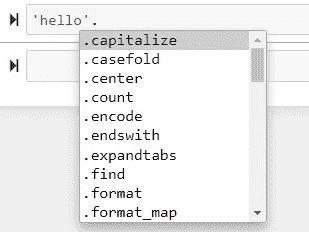
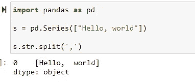

# 在 Python 中使用字符串:备忘单

> 原文：<https://towardsdatascience.com/working-with-strings-in-python-a-cheat-sheet-e6f462e611f0?source=collection_archive---------14----------------------->


照片由[阿玛多·洛雷罗](https://unsplash.com/@amadorloureiroblanco?utm_source=medium&utm_medium=referral)在 [Unsplash](https://unsplash.com?utm_source=medium&utm_medium=referral) 上拍摄

## 包含 f 字符串、计数器和正则表达式

也许你不想成为 NLP 专家。但是作为一名数据科学家，你肯定要处理字符串对象；无一例外。它可能包括命名和重命名列、遍历列名或编辑数据集中存在的其他类型的字符串对象等简单操作。

或者也许你正在考虑成为一名 NLP 专家。无论哪种方式，学习一些基本的字符串操作技术都将使您在很大程度上提高技能，并使您能够轻松地处理文本数据。

Python 标准库中有一些有用的工具，其他包也非常强大。在 I 中使用内置工具和外部库将在本文中涉及以下内容:

*   内置字符串方法
*   计数器模块
*   访问元素
*   f 字符串文字
*   正则表达式

让我们开始吧。

## 预热

我先做个热身。

您可能应用了内置的`len()`函数来计算列表、集合、元组或字典中的项目。你可以用同样的方法来检查一个字符串的总长度。

```
len('hello')>> 5
```

还可以通过使用`list()`构造函数将一个字符串转换成一个列表。

```
list('hello!')>> ['h', 'e', 'l', 'l', 'o', '!']
```

连接两个字符串的工作方式就像数学函数中普通的数字加法一样。

```
first_string = 'hello'
second_string = 'world'
new_string = first_string + second_string>> 'hello world'
```

同样，你可以通过多次相乘得到一个字符串的副本！

```
string = 'hello'
(string + ' ') *5>> 'hello hello hello hello hello '
```

## 字符串方法

和其他东西一样，字符串是 Python 中的对象。自然，它带有内置的方法，你可以通过点击来发现。字符串后的 tab 键:



Python 中的字符串方法

那么你到底能用字符串方法做什么呢？一些基本的功能包括将字符串转换成大写或小写，大写等。下面是一些例子:

```
# make uppercase
'hello'.upper()
>> 'HELLO'# make lowercase
'HELLO'.lower()
>> 'hello'# capitalize
'hello'.capitalize()
>> 'Hello'# title
'hello world'.title()
>> 'Hello World'
```

除了基本方法，还可以调用几个非常有用的方法。例如，您可以使用自己选择的分隔符(如字母)来拆分字符串(比如一个句子)。

```
# split a word 
'hello'.split(sep = 'e')>> ['h', 'llo']
```

最有用的方法是用空格(“”)分隔符将一个句子分成一系列单词。

```
sent = 'hello world'
sent.split(sep = ' ')>> ['hello', 'world']
```

还有一种方法可以将字符串中的元素逆序排列。

```
# reverse a string
s = 'hello'
s[::-1]>> 'olleh'
```

如果你发现反转一个字符串对你的工作没什么用，去掉字符串中不需要的东西当然有用。你可以从字符串中删除任何你想删除的东西。

```
# strip part of a string
'hi there'.strip('hi ')>> 'there'
```

替换单词或字符也可以派上用场。

```
# replace a character
'hello'.replace('l', 'L')
>> 'heLLo'# replace a word
'hello world'.replace('world', 'WORLD')
>> 'hello WORLD'
```

通过使用`join()`方法，你可以将一列字符或单词连接成一个更长的字符串对象。

```
# join a list of letters
s = ['h', 'e', 'l', 'l', 'o']
''.join(s)>> 'hello'# join a list of words 
w = ['hello', 'world']'-'.join(w)>> 'hello-world'
```

在结束字符串方法之前，我只想强调，如果你使用 Python `pandas`库，你会发现内置的字符串方法同样有用。如果你只是在一个熊猫对象(比如字符串)上使用`.str.`，你可以访问所有这些方法。



在 Pandas 对象中使用内置字符串方法

## 包括…在内

下一个重要的话题是计数——从计算字符到计算单词等等。

用于计数的内置方法是`.count()`,它应用于一个对象，您可以指定想要计数的对象作为参数。请记住它是区分大小写的。

```
# counting characters
sent = 'His name is Abdul. Abdul is a good boy. Boy o boy'
sent.count('a')>> 2# counting the occurance of an word
sent.count('name')>> 1
```

Python 还附带了一个带有`collections`库的`Counter`模块。它可以计算字符串中每个元素的频率，并返回一个 dictionary 对象。

```
# count ALL characters in a string
from collections import Counter
Counter('aaaaabbbbbbxxxxxx')>> Counter({'a': 5, 'b': 6, 'x': 6})
```

通过增加一行代码，`Counter`还可以拆分单词并显示词频。

```
# counting ALL words in a sentence
sent = 'His name is Abdul. Abdul is a good boy, boy o boy'
word_lis= sent.split(' ')
Counter(word_list)>> Counter({'His': 1,
         'name': 1,
         'is': 2,
         'Abdul.': 1,
         'Abdul': 1,
         'a': 1,
         'good': 1,
         'boy,': 1,
         'boy': 2,
         'o': 1})
```

作为一个最佳实践，您应该删除字符串中的任何标点符号，否则，它可能会造成一些麻烦。

关联的`.most_common()`方法返回出现频率最高的项目元组。

```
Counter(word_list).most_common(3)>> [('is', 2), ('boy', 2), ('His', 1)]
```

## 接近

通过索引访问单个项目或通过项目访问索引非常有用。

要访问字符/单词的索引:

```
'hello how are you'.find('how')>> 6
```

或者通过索引访问字符/单词:

```
s = 'hi there'
s[3]>> 't'
```

分割字符串的方式与处理列表对象的方式类似。

```
s = 'hi there'
s[0:4]>> 'hi t'
```

## f 弦

在 Python 中，可以用多种方式格式化字符串。在 Python 3.6 之前，大多数人会使用% formatting 或`.format()`，但是 f-string 让它变得更加简单——易于使用和阅读。这里有一个例子:

```
name = 'Anna'
age = 23
print(f"my name is {name} and I am {age} years old")>> my name is Anna and I am 23 years old
```

对于数值变量，您可以在格式-> value:width.precision 中指定值的精度

```
# f string numbers
div = 11/3
print(f'the result of the division is {div:2.3f}') >> the result of the division is 3.667
```

## **正则表达式**

正则表达式`re`是 Python 中一个非常强大的库，你可以用它做很多事情，尤其是在数据集中搜索模式。下面是其功能的一个小例子。

如果您希望搜索匹配的文本模式:

```
import re
text = 'hello my phone number is (000)-111-2222'
pattern = 'phone're.search(pattern, text)>> <re.Match object; span=(9, 14), match='phone'>
```

在输出中，span 告诉匹配的索引位置(在本例中从索引 6 开始，到索引 8 结束)。

您还可以搜索您认为最有可能出现的特定格式的数字模式。

```
text = 'my zipcode is 22202'
pattern = r'\d\d\d\d\d'
re.search(pattern, text)>> <re.Match object; span=(14, 19), match='22202'>
```

最后，还有所谓的“通配符”，用。(点)元字符。

```
# input text
text = 'the dog and the hog sat in the fog'# regex search
re.findall(r'.og', text)>> ['dog', 'hog', 'fog']
```

# 摘要

总结一下我在本文中介绍的所有内容:

*   基本功能的内置字符串方法，如改变大小写、拆分、连接、替换等。
*   使用内置`.count()`方法或使用`Counter`模块计数字符串元素
*   访问字符串模式和索引值
*   使用 f 字符串文字进行字符串格式化
*   应用正则表达式`re`模块进行模式搜索。

我留下了许多其他方法和功能，但我希望这是构建一个使用字符串对象的备忘单的良好开端。

如果你有意见，请随意写在下面，或者通过[媒体](https://mab-datasc.medium.com/)、[推特](https://twitter.com/DataEnthus)或 [LinkedIn](https://www.linkedin.com/in/mab-alam/) 与我联系。