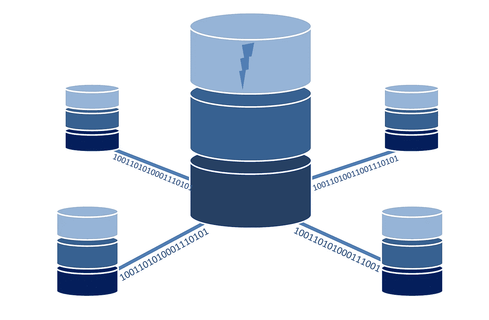
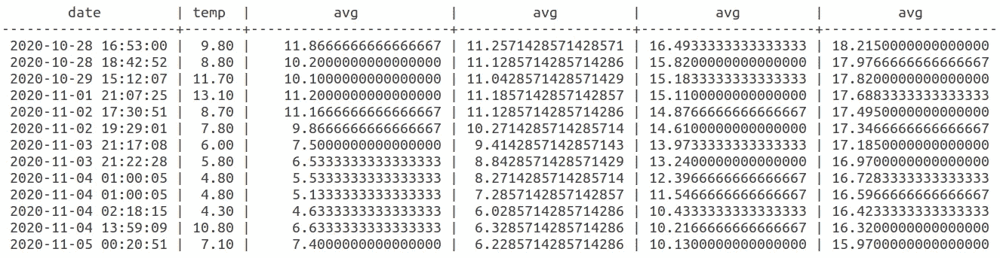

# 使用 SQL 处理时间序列

> 原文：<https://towardsdatascience.com/working-with-time-series-using-sql-34e70ce48025?source=collection_archive---------30----------------------->

## 使用 SQL 操作时间序列数据



来源:图片来自 [Pixabay](https://pixabay.com/illustrations/database-data-computer-network-1954920/)

Python 或 R 等工具最常用于进行深度时间序列分析。

但是，了解如何使用 SQL 处理时间序列数据是非常重要的，尤其是在处理非常大的数据集或不断更新的数据时。

下面是一些有用的命令，可以在 SQL 中调用它们来更好地处理数据表本身中的时间序列数据。

# 背景

在本例中，我们将使用在不同时间和地点收集的天气数据。

PostgreSQL 数据库表中的数据类型如下:

```
weather=# SELECT COLUMN_NAME, DATA_TYPE FROM INFORMATION_SCHEMA.COLUMNS WHERE TABLE_NAME = 'weatherdata';
 column_name |          data_type          
-------------+-----------------------------
 date        | timestamp without time zone
 mbhpa       | integer
 temp        | numeric
 humidity    | integer
 place       | character varying
 country     | character varying
 realfeel    | integer
 timezone    | integer
(8 rows)
```

正如您所看到的， *date* 被定义为不带时区的时间戳数据类型(我们也将在本文中看到这一点)。

感兴趣的变量是 temp(温度)—我们将研究使用 SQL 更直观地分析该变量的方法。

# 计算移动平均值

下面是数据表中一些列的片段:

```
 date         | mbhpa | temp  | humidity 
---------------------+-------+-------+----------
 2020-10-12 18:33:24 |  1010 | 13.30 |       74
 2020-10-15 02:12:54 |  1017 |  7.70 |       75
 2020-10-14 23:53:42 |  1016 |  8.80 |       75    
 2020-10-15 11:03:25 |  1016 |  9.70 |       75      
 2020-10-15 13:05:23 |  1017 | 12.30 |       74    
 2020-10-15 18:47:25 |  1015 | 12.10 |       74     
 2020-10-16 23:23:23 |  1011 |  9.10 |       75   
 2020-10-20 10:25:15 |   967 | 13.80 |       83   
 2020-10-27 16:30:30 |   980 | 12.00 |       75   
 2020-10-29 15:12:07 |   988 | 11.70 |       75   
 2020-10-28 18:42:52 |   990 |  8.80 |       77
```

假设我们希望计算不同时间段内温度的移动平均值。

要做到这一点，我们首先需要确保数据是按日期排序的，并决定在平均窗口中应该包括多少个周期。

首先，使用 7 周期移动平均值，所有温度值按日期排序。

```
>>> select date, avg(temp) OVER (ORDER BY date ROWS BETWEEN 6 PRECEDING AND CURRENT ROW) FROM weatherdata where place='Place Name'; date         |         avg         
---------------------+---------------------
 2020-11-12 16:36:40 |  8.8285714285714286
 2020-11-14 15:45:08 |  9.8142857142857143
 2020-11-15 08:53:26 | 10.3857142857142857
 2020-11-17 10:50:32 | 11.2285714285714286
 2020-11-18 14:18:58 | 11.8000000000000000
 2020-11-25 14:54:11 | 11.6285714285714286
 2020-11-25 19:00:21 | 10.9142857142857143
 2020-11-25 19:05:31 | 10.2000000000000000
 2020-11-25 23:41:34 |  9.2857142857142857
 2020-11-26 15:03:10 |  9.4857142857142857
 2020-11-26 17:18:33 |  8.3428571428571429
 2020-11-26 21:30:39 |  7.9142857142857143
 2020-11-26 22:29:17 |  7.6142857142857143
```

现在，让我们添加一个 30 和 60 周期移动平均线。我们将这些平均值与 7 期移动平均值一起存储在一个表中。

```
>>> select date, temp, avg(temp) OVER (ORDER BY date ROWS BETWEEN 2 PRECEDING AND CURRENT ROW), avg(temp) OVER (ORDER BY date ROWS BETWEEN 6 PRECEDING AND CURRENT ROW), avg(temp) OVER (ORDER BY date ROWS BETWEEN 29 PRECEDING AND CURRENT ROW), avg(temp) OVER (ORDER BY date ROWS BETWEEN 59 PRECEDING AND CURRENT ROW) FROM weatherdata where place='Place Name';
```



来源:作者创作的作品

关于如何在 SQL 中计算移动平均值的更多信息可以在以下资源中找到，作者是[sqltrainingonline.com](https://www.sqltrainingonline.com/sql-moving-average/)。

# 使用时区

您会注意到时间戳包含日期和时间。虽然在表中只存储一个位置时这很好，但是当处理跨多个时区的位置时，事情可能会变得非常棘手。

注意，在表中创建了一个名为*时区*的整数变量。

假设我们正在分析输入时间之前一系列时区的不同地方的天气模式，在这种情况下，所有数据点都是在 GMT 时间输入的。

```
 date          | timezone 
---------------------+----------
 2020-05-09 15:29:00 |       11
 2020-05-09 17:05:00 |       11
 2020-05-09 17:24:00 |       11
 2020-05-10 13:02:00 |       11
 2020-05-13 19:13:00 |       11
 2020-05-10 13:04:00 |       11
 2020-05-10 15:47:00 |       11
 2020-05-13 19:10:00 |       11
 2020-05-14 17:17:00 |       11
 2020-05-09 15:20:00 |        5
 2020-05-09 17:04:00 |        5
 2020-05-09 17:25:00 |        5
 2020-05-09 18:12:00 |        5
 2020-05-10 13:02:00 |        5
 2020-05-10 15:50:00 |        5
 2020-05-10 20:32:00 |        5
 2020-05-11 17:31:00 |        5
 2020-05-13 19:11:00 |        5
 2020-05-17 21:41:00 |       11
 2020-05-15 14:08:00 |       11
 2020-05-14 16:55:00 |        5
 2020-05-15 14:10:00 |        5
(22 rows)
```

新时间可以按如下方式计算:

```
weather=# select date + interval '1h' * timezone from weatherdata;
      ?column?       
---------------------
 2020-05-10 02:29:00
 2020-05-10 04:05:00
 2020-05-10 04:24:00
 2020-05-11 00:02:00
 2020-05-14 06:13:00
 2020-05-11 00:04:00
 2020-05-11 02:47:00
 2020-05-14 06:10:00
 2020-05-15 04:17:00
 2020-05-09 20:20:00
 2020-05-09 22:04:00
 2020-05-09 22:25:00
 2020-05-09 23:12:00
 2020-05-10 18:02:00
 2020-05-10 20:50:00
 2020-05-11 01:32:00
 2020-05-11 22:31:00
 2020-05-14 00:11:00
 2020-05-18 08:41:00
 2020-05-16 01:08:00
 2020-05-14 21:55:00
 2020-05-15 19:10:00
(22 rows)
```

我们现在可以将新的时间存储为一个更新的变量，我们将其命名为 *newdate。*

```
>>> select date + interval '1h' * (timezone+1) as newdate, temp, mbhpa from weatherdata; newdate       | temp | mbhpa
--------------------+------+-------
2020-05-10 03:29:00 |  4.2 |  1010
2020-05-10 05:05:00 |  4.1 |  1009
2020-05-10 05:24:00 |  3.8 |  1009
```

该子句允许我们生成更新的时间(这将反映记录温度、气压等变量时每个特定地点的实际时间)。

# 内部连接和 Having 子句

你会注意到上表中包括了许多地方的温度值。

假设还在单独的表中计算每个地方的风速。

在这种情况下，我们希望计算风速高于 20 的每个列出地点的平均温度。

这可以通过使用具有如下子句的**内部连接**和**来实现:**

```
>>> select t1.place, avg(t1.temp), avg(t2.gust) from weatherdata as t1 inner join wind as t2 on t1.place=t2.place group by t1.place having avg(t2.gust)>'20'; place      |         avg          |         avg          
-----------------+----------------------+----------------------
 Place 1         |        17.3          |        22.4
 Place 2         |        14.3          |        26.8
 Place 3         |        7.1           |        27.1
```

# 结论

在本文中，您已经了解了一些使用 SQL 处理时间序列数据的介绍性示例。

特别是，您看到了如何:

*   计算移动平均值
*   使用不同的时区
*   计算不同数据子集的平均值

非常感谢阅读，任何问题或反馈都非常感谢！您还可以在这里找到原始文章，以及有用的 SQL 实践的更多例子。

*免责声明:本文是在“原样”的基础上编写的，没有任何担保。它旨在提供数据科学概念的概述，不应被解释为专业建议。本文中的发现和解释是作者的发现和解释，不被本文中提到的任何第三方认可或隶属于任何第三方。*