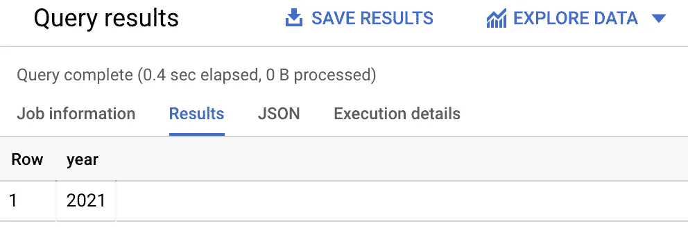
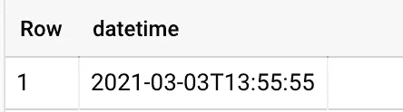
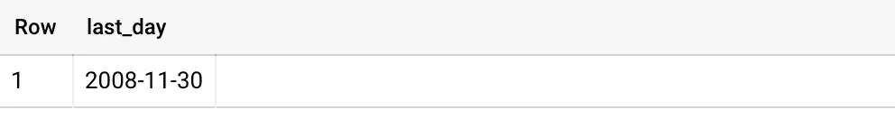

# 在 BigQuery 中使用时间和日期

> 原文：<https://towardsdatascience.com/working-with-times-and-dates-in-bigquery-f131af140fc2?source=collection_archive---------17----------------------->

## 你必须知道的


[团队 voyas](https://unsplash.com/@voyas?utm_source=unsplash&utm_medium=referral&utm_content=creditCopyText) 在 [Unsplash](https://unsplash.com/s/photos/time?utm_source=unsplash&utm_medium=referral&utm_content=creditCopyText) 上的照片

谁不熟悉这种情况？正确的时间戳格式是什么来着？只要谷歌一下，下次它就会再次结束。这里是一些我经常接触到的用例，我想把它们写下来，希望不用再去谷歌它们。

## 当前日期时间

让我们从一个非常简单但是有用的开始。获取当前时间—您可能需要它来进行比较，例如在分析或技术数据转换中:

```
SELECT CURRENT_DATETIME() as now;
```

这个函数支持可选的 timezone 参数。关于如何设置时区[1]的说明，参见时区[定义](https://cloud.google.com/bigquery/docs/reference/standard-sql/datetime_functions?hl=de)。


当前日期示例—按作者分类的图像

## 提取

从提供的 *datetime_expression* 中返回对应于指定部分的值。例如，这里我只提取了年份。我经常将这种逻辑用于分析中的约束或数据转换，在这种情况下，我转换日期格式并将它们以不同的格式存储在新表中。

```
SELECT EXTRACT(YEAR FROM DATETIME(2021, 07, 02, 15, 45, 00)) as year;
```



结果—作者提供的图像

## 日期时间差异

计算两个日期之间的差异。如果第一个*日期时间*在第二个日期时间之前，则输出为负[1]。

```
Select DATETIME_DIFF(DATETIME”2021–03–03", DATETIME”2021–04–04", Day)as difference;
```

这导致-32。

## 格式化日期时间

根据指定的 *format_string* 格式化 *DATETIME* 对象。与其他示例类似，人们喜欢在数据转换过程中使用这种格式化选项。

```
SELECT
 FORMAT_DATETIME(“%c”, DATETIME “2008–12–25 15:30:00”)
 AS formatted;
```

这里，以%c 为例，输出完整的日期和时间表示[2]。


格式化日期时间-按作者排序的图像

## 解析日期时间

使用 *PARSE_DATETIME* 你可以做与上面提到的例子相反的事情。它将一个*日期时间*对象的字符串表示转换成一个*日期时间*对象。

```
SELECT PARSE_DATETIME(‘%Y-%m-%d %H:%M:%S’, ‘2021–03–03 13:55:55’) AS datetime;
```



解析的日期时间-按作者排序的图像

例如，当其他数据源将日期显示为字符串并且您希望在 BigQuery 中将它显示为标准化的*日期时间*时，这总是有用的。

## 最后审判日

从包含日期的 *DATETIME* 表达式中返回最后一天。这通常用于返回一个月的最后一天。您可以选择指定应该返回最后一天的日期部分。

```
SELECT LAST_DAY(DATETIME ‘2008–11–25’, MONTH) AS last_day
```

如果不使用该参数，默认值为*月*。特别是在评估领域，例如有趣且经常使用的财务月报表。



结果—作者提供的图像

## 摘要

由于我经常在 BigQuery 中搜索日期格式，因为我忘记了正确的 SQL 表达式是什么，所以我为您提供了关于这个主题的备忘单。在我看来，这些是最常见的用例——如果我忘记了什么，请随时告诉我。

## 资料来源和进一步阅读

[1][https://cloud . Google . com/big query/docs/reference/standard-SQL/datetime _ functions？hl=de](https://cloud.google.com/bigquery/docs/reference/standard-sql/datetime_functions?hl=de)

[2][https://cloud . Google . com/big query/docs/reference/standard-SQL/datetime _ functions？HL = de # supported _ format _ elements _ for _ datetime](https://cloud.google.com/bigquery/docs/reference/standard-sql/datetime_functions?hl=de#supported_format_elements_for_datetime)