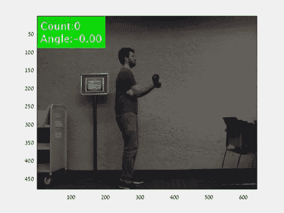

# 使用光流监测健身程序—第 1 部分

> 原文：<https://towardsdatascience.com/workout-monitoring-using-optical-flow-part-1-4fa81f8cb56e?source=collection_archive---------23----------------------->

## 一份关于图像处理项目的详细报告，该项目始于学术界，并在一次行业会议上发表

光流叠加示例练习(作者提供 GIF)

这是我和我的团队 Shaked Cohen，Inbal Rimon 和 Hagai Michel 构建的图像处理项目系列文章的第一部分。本部分将提供项目概述以及工作流程描述。未来的部分将深入系统的不同组件:

第 1 部分:项目概述和工作流程

[第二部分:光流和举重](/workout-monitoring-using-optical-flow-part-2-8cd55e55fbe5)

第三和第四部分:TBD

这个项目是作为一门名为“数字图像处理”(DIP)的学术课程的一部分完成的，由教授*塔米·瑞克林·拉维夫*领导，我之前在[这里](/lessons-i-learnt-from-my-first-image-processing-hackathon-f3f8ae6ae748)写过。这个项目，以及同一课程的其他项目，也在[系统学网站](https://www.systematics.co.il/matlab-simulink-blog/bgu-students/)(以色列 MATLAB 经销商，希伯来文)上有所介绍。

# 一些背景

我们在 2020 年初开始从事这个项目，就在 COVID 成为现实的几个月前。为什么我们在将近 2 年后现在写它？因为我们终于找到时间了。哦，可能是因为该项目被接受作为以色列机器视觉大会( [IMVC2021](https://www.imvc.co.il/) )的现场演示。

该项目的目标是实现一个基于经典图像处理和计算机视觉工具的实时视频处理系统。

> 等等，没有深度学习？那我为什么要在乎？！

这是一个很好的问题。如果你对 SoTA 结果或一些新颖的方法感兴趣，那么你可能不应该这样做，但是如果你有兴趣了解图像处理的核心工具以及如何用它们解决现实世界的问题，你应该继续读下去。

对于我们的项目，我们选择关注对人类运动的实时监控。我们选择这个主题是因为它提出了一个巨大的挑战:

*   运动过程中的人体运动相对较快，需要允许实时处理速度(10~30 FPS)的高效算法。
*   人体是一个高度可变形的形状，尤其是在运动时。这意味着我们识别和跟踪受训者的方法不能依赖于每个框架内的固定形状或位置。
*   练习和正确练习之间的区别是微妙的。这需要足够灵敏的运动和姿态跟踪方法来注意到这种差异。

# 项目概述

我们的系统——蔻驰健身中心——为 4 种不同的锻炼提供反馈:仰卧起坐、深蹲、单人举重和双人举重。一旦开始练习，将受训者从背景中分割出来，并进行进一步的裁剪和遮罩细化，以仅保留感兴趣的对象。然后屏蔽的视频被用于监控正在进行的锻炼。最后，在输入视频之上生成反馈，以通知受训者他们的进度并添加任何姿势校正(如果必要)。

系统流程图(作者提供的图表)

每个练习都提出了独特的挑战，需要实施四个独立的反馈机制:

**单次举重:**检测帧中的径向运动，估计手臂角度。

**双人举重:**使用面部检测算法定位受训者，并利用达芬奇的身体比例来设置最佳运动范围。

**深蹲:L** 通过计算给定面具的重心来定位受训者的下半身。

*   **仰卧起坐:**使用智能裁剪和几何变换最大化 FPS。

下图展示了不同的练习和一些给用户反馈的例子。是的，我们知道 UI 是可怕的，我们做了最少的工作，以便将大部分时间投入到系统的大脑上，而不是美化它。

(作者供图)

每个练习使用的逻辑和算法将在本系列的未来部分详细解释，但现在我们想分享我们的工作过程以及我们如何结束使用光流。

# 通往最佳细分的漫长道路

由于所有四个练习都依赖于良好的分割，这项任务在早期就成为我们项目的主要焦点。我们对现有方法进行了文献回顾，并测试了不同的实现，直到找到最佳解决方案。我们训练了基于特征的对象检测器，使用休变换来检测图像中的线条和圆形，以及许多其他方法，这些方法提供的结果很差，并且计算量很大(远非实时)。

我们尝试过使用基于颜色的过滤，但是我们很快排除了它，因为它需要使用绿色屏幕或者强迫受训者穿非常特殊的颜色。面对现实吧，基本上就是作弊，没有挑战性。

那时，我们开始提出自己的算法，这些算法都基于两个主要概念:

1.  *简单性*:解决方案必须足够简单，以便我们能够实时提供反馈。
2.  *基于运动的*:解决方案应该利用受训者是帧中唯一的运动对象这一事实。

在实践中，这些算法对两个连续的帧执行一些操作，并试图通过减去处理过的帧来检测运动。我们尝试使用空间导数，索贝尔过滤器，Canny 边缘检测和更多。尽管如此，我们仍然非常依赖于这样的想法，即最好的分割依赖于捕捉时间轴上的运动。

这是其中一种算法的简化版本:

这里的主要思想是:

1.  将两个连续帧转换成二进制边缘图像:

两个连续画面的锐利边缘(作者提供照片)

2.减去图像以捕捉视频中的运动物体(中值滤波用于降低噪声):

我不是在黑暗中举重，这是时间导数(视频由作者提供)

重要的是要注意，边缘检测在许多方面是图像空间梯度的近似，减去两帧是图像时间梯度的近似。我们将在第 2 部分详细阐述这些概念。

这些帧差算法比我们以前尝试的解决方案好得多，但它们仍然不够好，主要是由于灵敏度问题。我们的算法要么检测到太多的运动，要么检测到太少的运动，如果不包括灯的闪烁或其他背景噪声，很难提供对受训者的一致检测。

就在我们准备放弃的时候，我们偶然发现了一种算法，它正好给出了我们需要的东西——一种以实时速度检测运动并提供稳健结果的算法。

# 光流

经过冗长的文献回顾和其他方法的大量反复试验，我们发现在帧中分割受训者的最佳解决方案是使用光流。简而言之，这是一种估计视频中运动的方法，这对我们来说很好，因为我们视频中唯一的运动来自于受训者。

阅读第 2 部分，了解我们解决方案的更多细节。