# 使用光流监测健身程序—第 2 部分

> 原文：<https://towardsdatascience.com/workout-monitoring-using-optical-flow-part-2-8cd55e55fbe5?source=collection_archive---------10----------------------->

## 我们如何用光流追踪举重

这是一系列文章的第二部分。如果错过了第 1 部分，请在此处阅读[。](/workout-monitoring-using-optical-flow-part-1-4fa81f8cb56e)

要查看该系列所有文章的列表，请点击[这里](https://towardsdatascience.com/tagged/diproject)。

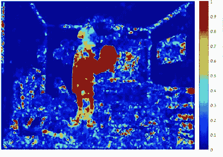

我们在看什么？(作者供图)

前情提要“光流监测锻炼练习”，我们介绍了这个项目，它是如何工作的，以及引导我们最终实现系统的算法过程。

在这一部分中，我们将深入我们系统的理论和技术方面，主要关注光流以及它如何用于为哑铃举重提供反馈。

正如您在上一部分中回忆的那样，我们的主要挑战是将学员从背景中分割出来。这最终通过使用称为光流的运动估计算法来实现。

# 光流

## 问题定式化

光流表示场景相对于观察点的运动。用外行的话来说，这是一种测量两个视频帧之间运动的方法。对于给定的视频帧***【𝐼(x,y,𝑡】***，光流旨在估计序列中连续帧之间的运动，这意味着我们需要一个连接***【𝐼(𝑥,𝑦,𝑡】***和***【𝐼(𝑥+𝛿𝑥,𝑦+𝛿𝑦,𝑡+𝛿𝑡】***的方程，其中***【𝛿𝑥,𝛿𝑦】***是在***【𝛿𝑡***的一小段时间内帧之间运动的微小变化。下图可以说明这一点:

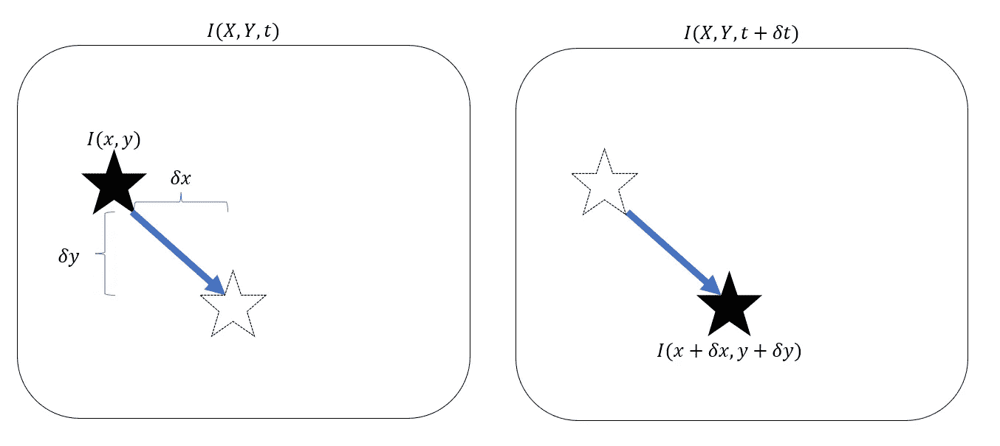

(作者供图)

为了模拟光流问题，我们必须首先假设恒定的亮度，这意味着每个像素的值在位置和时间周期的微小变化中保持不变。这一假设允许我们写出如下内容:

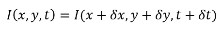

我们现在可以将一阶泰勒展开式应用于等式的右侧:

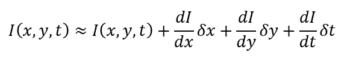

移除共同项并除以𝛿𝑡将得出:

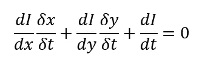

假设位置和时间的变化足够小，该等式可以替换为:

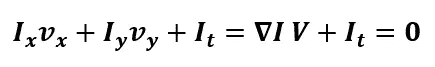

其中***【𝑉=[𝑉𝑥,𝑉𝑦】***是我们感兴趣的速度矢量，𝛁𝑰是帧的梯度 *I* 。上述方程被称为梯度约束方程，其中图像的梯度可以容易地计算，速度***【𝑉𝑥,𝑉𝑦】***是感兴趣的未知变量。

## 用 Farneback 方法求解光流

既然我们理解了眼前的问题，我们终于可以试着解决它了。有许多方法来解决光流，但现在我们将重点放在 Farneback 的方法，因为它是我们在这个项目中使用的方法。

该方法提供了基于矩阵多项式展开和图像金字塔的密集光流解决方案。其思想是将图像分割成固定大小的邻域(例如 3×3 或 5×5)，用二阶矩阵多项式表示，如下所示:

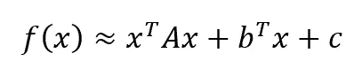

其中 ***x*** 是代表图像邻域的环境， ***A*** 是对称矩阵， ***b*** 是矢量， ***c*** 是标量。系数 ***A、B*** 和 ***c*** 是根据对邻域中的图像值的加权最小二乘拟合来估计的。

使用这种表示，我们现在可以将速度场建模为应用于两个帧的多项式函数的平移变换。给定两个不同帧中相同邻域的两个多项式函数，光流方程现在变成:

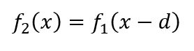

其中 ***d*** 为两帧之间的位移距离。代入多项式表达式，我们得到:

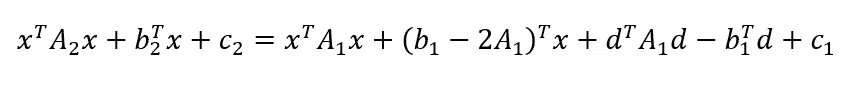

求解 ***d*** 给出了每一个像素在两帧之间移动的距离，并给出了帧之间的参考时间单位，这有效地表示了速度场，从而求解光流。更多细节，MATLAB[和 OpenCV](https://www.mathworks.com/help/vision/ref/opticalflowfarneback.html)[都有 Farneback 方法的优秀实现。](https://opencv24-python-tutorials.readthedocs.io/en/latest/py_tutorials/py_video/py_lucas_kanade/py_lucas_kanade.html)

# 举重练习

> 好了，我们理解了光流问题，以及如何有效地近似求解它——这对我们举重有什么帮助？！

使用光流在多个方面帮助我们:

1.  将用户从背景中分割出来
2.  检测学员面向哪边(有助于获得更好的反馈)
3.  计算重复次数，跟踪手臂的运动范围

为了更好地理解功率光流，让我们逐一分析这些用途。

## 使用光流幅度的分割

光流帮助我们解决了学员细分的挑战。理解它如何工作的最好方法是可视化通过求解光流获得的速度场。这些可以用笛卡尔坐标(沿 X 和 Y 轴的速度)来表示，但是现在让我们使用极坐标来表示每个点的运动幅度和运动角度，以表示运动方向。让我们从可视化运动的归一化幅度开始:

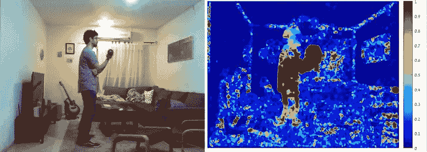

光学流动可视化

这已经看起来非常接近于一个好的分割掩模，因为举重手臂和躯干具有最大的幅度。我们只需要使用智能阈值和过滤机制，以确保我们在手臂和重量周围获得鲁棒的分割掩模。

经过反复试验，我们发现最好的解决方案是设定大小的阈值，然后应用斑点分析，只保留最大的斑点。这个过程如下图所示:

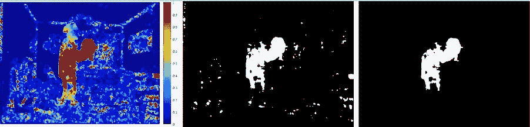

原始幅度(左)、幅度阈值(中)、最大斑点(右)。(作者供图)

在最终的系统中，我们使用原始图像上的颤动图来可视化掩模和其中的光流矢量。下面是一个向下运动的例子:

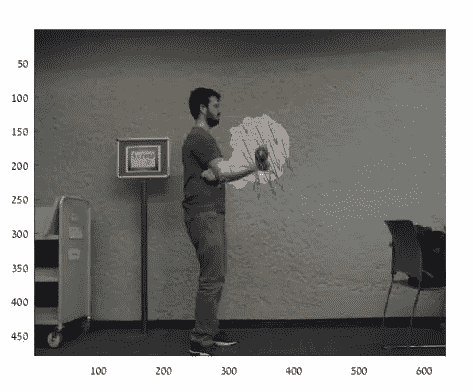

蒙版图像+颤动图(图片由作者提供)

## 使用光流角的反馈

一旦我们有了分割蒙版，下一步就是利用速度角度来为受训者提供反馈。让我们观察掩蔽区域内的平均速度角:

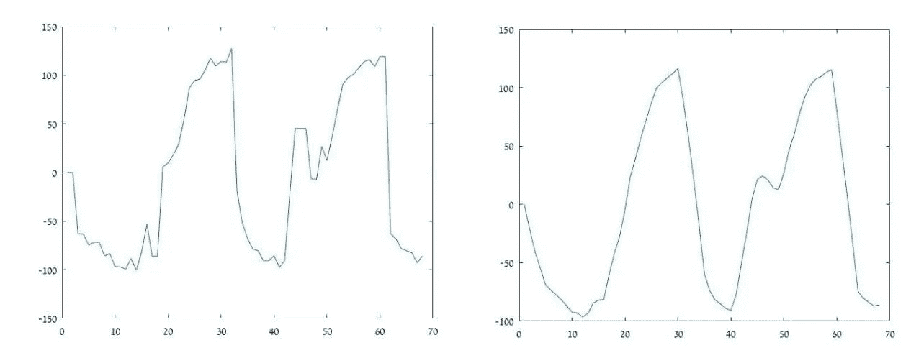

两次重复举重过程中的光流方向(原始和平滑的)(作者提供的图表)

该角度以相对于标准轴系统的度数来测量，这意味着当臂平行于 X 轴时角度为 0，当臂平行于 Y 轴时角度为 90。当观察平滑的图表(在右边)时，你可以很容易地看到每次重复练习的正弦曲线模式——在这种情况下，有两对最大值和最小值点。

通过测量分割区域随时间的平均角度，我们可以实时生成此图，并通过检测极值点来计算重复次数。我们还可以通过测量手臂运动的范围，使用角度数据向用户提供更定性的反馈。例如，大约从-50 度到+100 度的重复是好的，但是从-10 度到+45 度的重复就不好了。

## 使用笛卡尔光流的分割改进

关于光流的最后一个观点，是使用它的笛卡尔表示来确定哪只手正在被用来举起重物。这有助于改进遮罩，使其仅包含受训者的前臂和手，并过滤掉大部分躯干。改进的面罩提供更精确的角度测量，这允许更好和更稳健的锻炼监测和反馈。

如前所述，光流速度场的笛卡尔表示只是一对 ***(Vx，Vy)***——每轴速度。让我们来看看这种表现的两个例子:

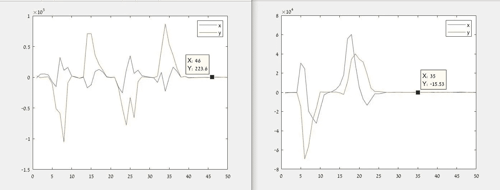

你能通过观察速度来判断哪只手臂在举重吗？(作者提供的图表)

为了从这些图表中推断出是哪只手臂在做举升动作，让我们把注意力集中在前 10 帧。 ***Vy*** 中的负尖峰与锻炼开始时的向上运动相关(记住，在图像中 Y 轴是反转的)。

假设受训者站在一个侧面，举臂更靠近摄像机，我们可以在练习的第一次向上运动中，通过查看***【Vx】***来检测举臂。

> 你能在上面的每张图中找出是哪只手臂在举东西吗？答案在这个帖子的最后。

一旦我们知道哪一侧正在进行提升，我们就可以裁剪分割蒙版，使其只包含足够接近权重的像素。例如，如果受训者用他的右手举着东西，我们可以把所有离最左边的像素(也就是重量)太远的像素裁剪掉。

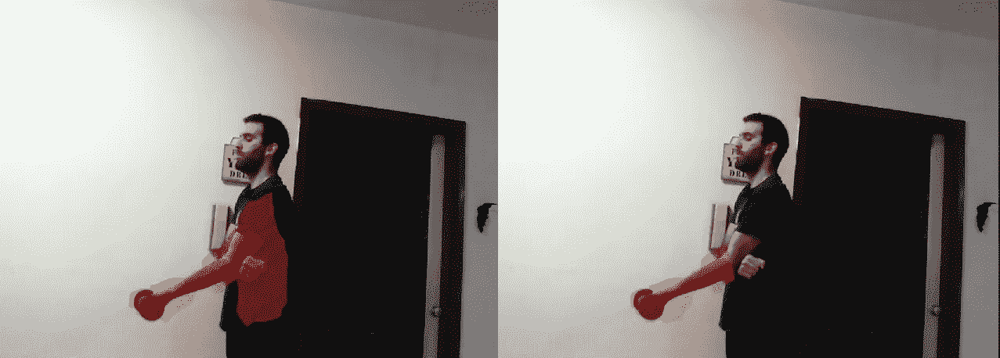

原始面膜(左)、精制面膜(右)(作者供图)

# 把所有的放在一起

到目前为止，我们已经使用光流生成了一个分割掩模，并在举重练习中跟踪手臂的角度。这涵盖了我们项目的基本组成部分。最终系统如下图所示:

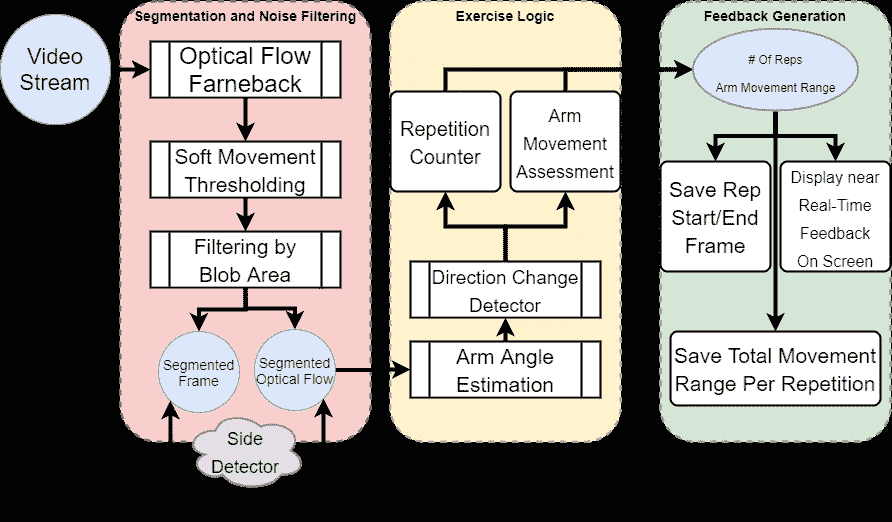

整个 enchilada(作者提供的框图)

如您所见，还有更多的内容要介绍，但这超出了本文的范围。本系列的未来部分将通过解释如何监控其他练习来触及该系统的不同方面。

至于侧面检测游戏——左边的图形代表用左手举起，右边的图形代表右手。右手对着摄像头举(就像上面的图)是指当手向上举(负 Vy)时，在 X 轴上的运动是正向的，直到角度为 0，然后就切换方向了。这显示在右图的 Vx 小波中，它以一个正尖峰开始，然后改变符号(反之亦然)。

## 参考

基于多项式展开的两帧运动估计。第 13 届斯堪的纳维亚图像分析会议论文集，363–370。瑞典哈尔姆斯塔德:SCIA，2003 年

(作者的所有可视化)