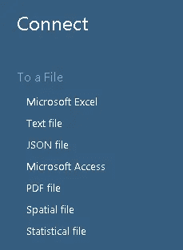
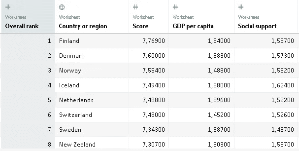
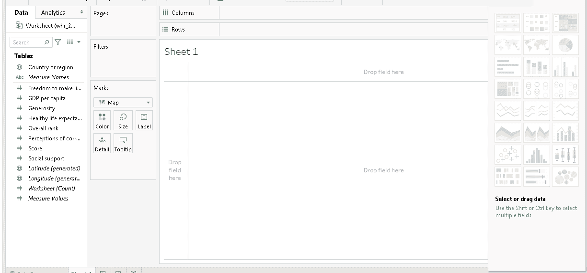
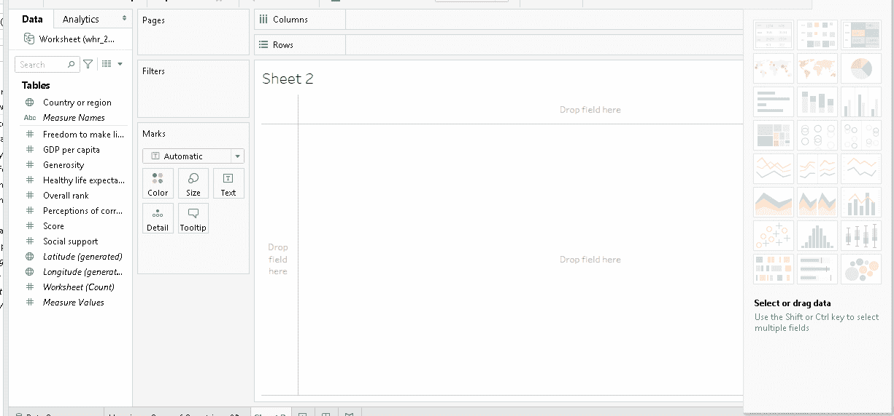
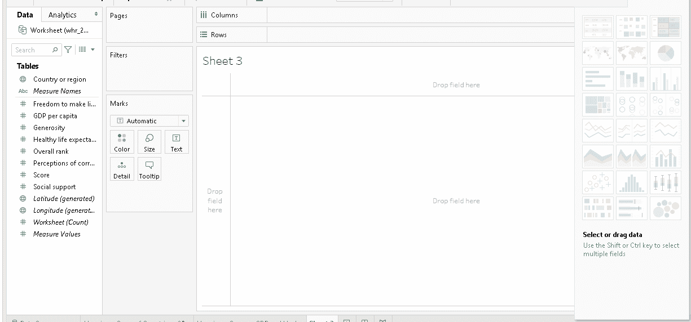
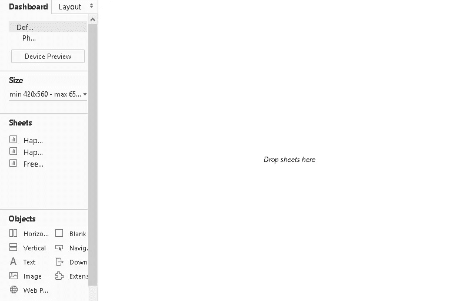
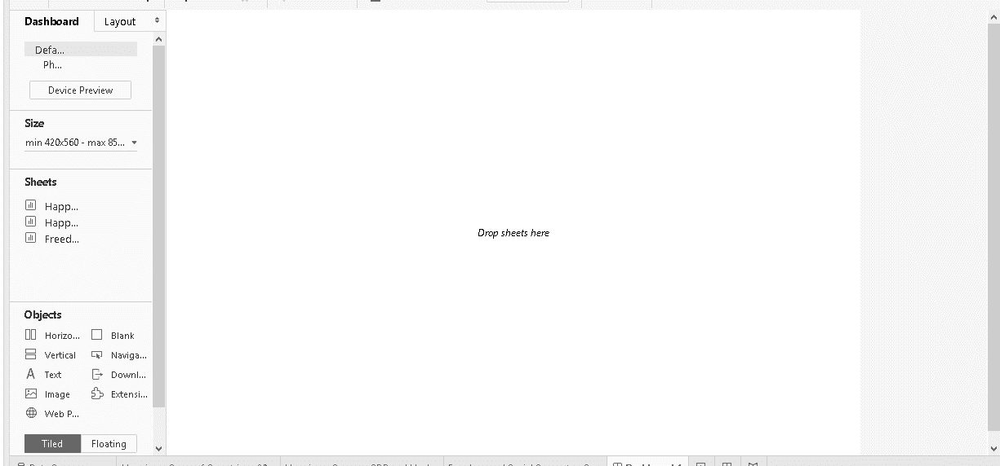
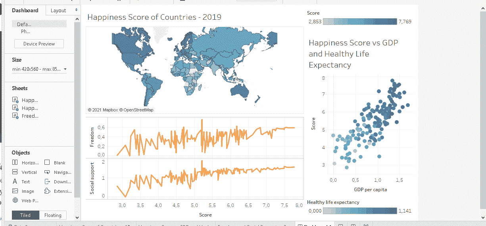

# Tableau 中的世界幸福仪表板

> 原文：<https://towardsdatascience.com/world-happiness-dashboard-in-tableau-4dc504212288?source=collection_archive---------15----------------------->

## Tableau 实用指南

(图片由作者提供)

Tableau 是创建数据可视化的强大而高效的工具。它允许创建高度信息化的情节，而无需编写任何代码。此外，多个可视化可以很容易地结合到一个仪表板。

讲故事是数据科学家工作的基本部分，而数据可视化是讲故事的必要条件。因此，数据科学家的技能组合中应该至少有一个数据可视化工具或框架。Tableau 的多功能性使其成为数据科学生态系统中非常受欢迎的数据可视化工具。

学习如何有效地使用 Tableau 需要练习。我们可以下载 Windows 和 Mac 都有的 Tableau Desktop】公版免费练习。

Tableau 还提供 Tableau Public，这是一个免费的平台，可以公开分享你的仪表盘。这是展示你的技能和创造力的好方法。

在本文中，我们将使用 public edition 创建一个简单的仪表板。我们将使用来自 Kaggle 的[数据集](https://www.kaggle.com/unsdsn/world-happiness?select=2019.csv)，其中包含 2019 年各国的世界幸福指数和其他指标。

第一步是添加到数据源的连接。这里强调“连接”这个词很重要，因为 Tableau 连接到数据文件并使用它来创建可视化。它不编辑原始文件。

(图片由作者提供)

我们选择适当的格式，然后导航到保存数据集的文件。

Tableau 连接到文件后，它会提供数据源的概述，并自动创建一个工作表。

(图片由作者提供)

除了上面截图中看到的度量之外，数据集还包含 4 个度量。额外的衡量标准是健康的预期寿命、做出生活选择的自由、慷慨和对腐败的看法。

在 Tableau 中，我们使用工作表来创建可视化效果。工作表完成后，我们可以将它们合并成一个仪表板。我们将在本文中创建的仪表板包含三种可视化效果:

1.  基于各国幸福指数着色的世界地图
2.  展示人均 GPD、幸福指数和健康预期寿命之间关系的散点图
3.  展示做出生活选择的自由、社会支持和幸福得分之间关系的线图。

## 可视化 1

Tableau 的一个很酷的地方是，它可以根据国家名称自动生成经度和纬度信息。创建信息丰富的地图非常容易。

我们首先打开一个新的工作表。生成的纬度和经度列被拖动到绘图区域。然后,“国家名称”列被拖到“标记”窗格中。

Tableau 在右侧窗格中突出显示了可能的可视化类型。我们可以使用世界地图的颜色或大小。彩色的根据给定的数量用不同的颜色显示国家。衡量颜色的标准是快乐分数，所以我们将分数列拖到标记窗格中的颜色图标上。

下面的屏幕记录演示了所有这些步骤。

(作者 gif)

第一次可视化完成了。最好给它起一个更具描述性的名字。我就改名为“各国幸福得分— 2019”。

## 可视化 2

对于第二个可视化，我们将创建一个散点图。和往常一样，我们首先使用现有工作表旁边左下角的 new sheet 图标创建一个新的空白工作表。

程序是一样的。我们根据所需的可视化类型来拖放列。散点图将包含三条信息。幸福指数和人均 GDP 分别代表 x 轴和 y 轴上的维度。因此，在我们将它们拖动到页面中之后，我们通过使用下拉菜单将它们设置为一个尺寸。

现在，在散点图中，每个国家都用相同的标记表示。我们将使用健康预期寿命列作为第三维度来调整标记的颜色。

下面的屏幕记录演示了所有这些步骤。

(作者 gif)

我将把这张表重新命名为“幸福得分与 GDP 和健康预期寿命”。

## 可视化 3

我们还为最后一个可视化创建了一个新的工作表。它将包含一个两行的线图，这两行是做出生活选择的自由与幸福得分和社会支持与幸福得分。

我们将 score 列拖到 columns 部分，并将其设置为一个维度。另外两列放在 rows 部分。

下面的屏幕记录演示了所有这些步骤。

(作者 gif)

我会把最上面的支线剧情的 y 轴重命名为“自由”，因为这个名字似乎太长了。这可以通过点击轴名并选择编辑轴来轻松完成。

我将把这张表重新命名为“自由和社会支持与分数”。

我们已经完成了可视化。下一步是将它们组合成一个仪表板。Tableau 也让这个过程变得简单而高效。我们首先通过单击左下方的“new dashboard”图标创建一个新的控制面板。

空仪表板(作者图片)

我们创建的所有工作表都可以在左侧窗格中看到。我们现在可以通过拖动页面来自定义仪表板。

下面是我如何定制仪表板。请随意使用界面，创建您自己的定制仪表板。在 Tableau 界面中，你可以探索许多很酷的特性。

(作者 gif)

Tableau 的一个很酷的特性是，我们可以选择一个特定的可视化作为过滤器，使仪表板具有交互性。

(作者 gif)

我们已经完成了我们的世界幸福分数仪表板。这是我的 Tableau 公共配置文件中仪表板的最终版本。

(图片由作者提供)

# 结论

我们创建了一个简单的仪表板。Tableau 是一个高度通用和实用的工具，因此它可以用来创建更高级的仪表板。然而，最好先理解基础知识。

成为高级 Tableau 用户需要大量的练习。如果您正在或计划在数据科学领域工作，这是一个非常重要的工具。

感谢您的阅读。如果您有任何反馈，请告诉我。