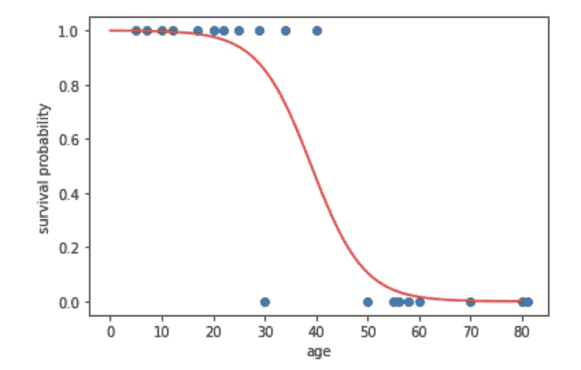
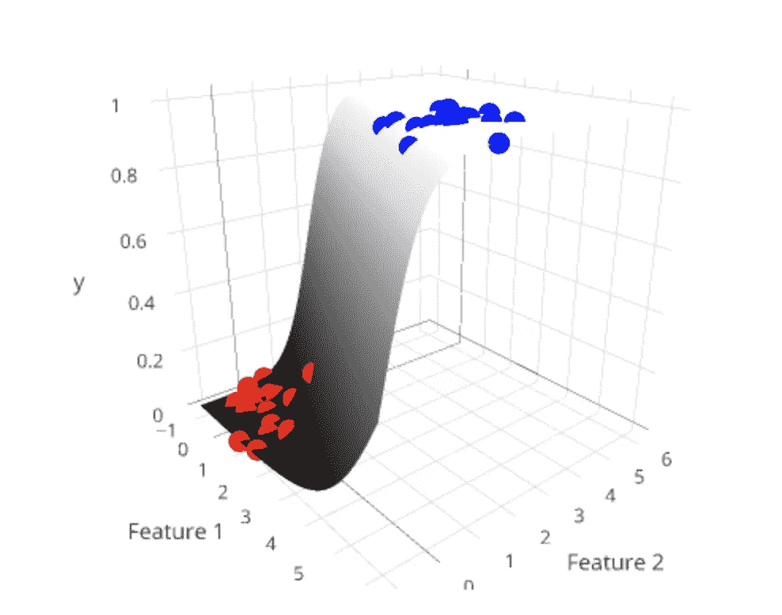
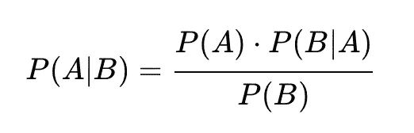
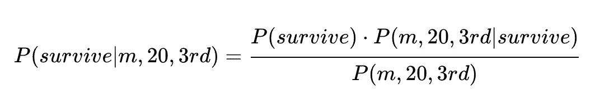
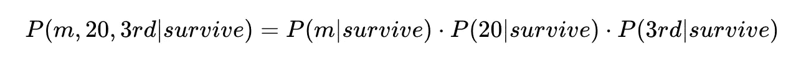
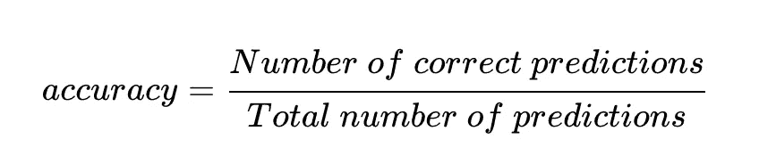
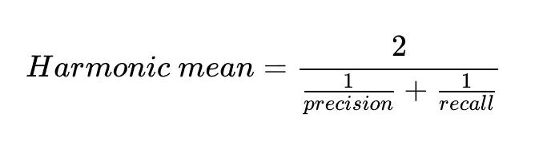
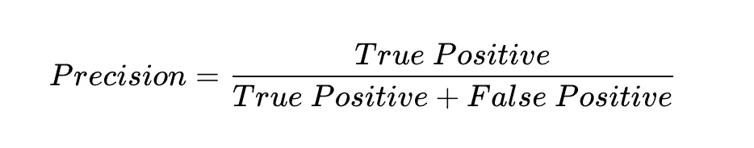
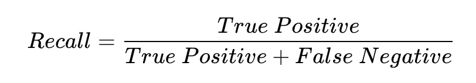
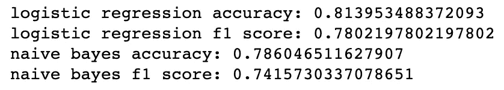

# 杰克真的会死在泰坦尼克号上吗？

> 原文：<https://towardsdatascience.com/would-jack-realistically-have-died-aboard-the-titanic-a6ac8308ed49?source=collection_archive---------32----------------------->

## 机器学习如何回答这个问题

逻辑回归和朴素贝叶斯的演练。


图像[来源](https://commons.wikimedia.org/wiki/RMS_Titanic#/media/File:RMS_Titanic_3.jpg)

那是 1912 年，强大的泰坦尼克号开始了它的处女航。杰克，一个“ *20 岁”“三等”“男”*乘客，赢了一手扑克和他去自由之地的票。在 4 月 14 日的最后一个小时，泰坦尼克号撞上了冰山，它的命运已经注定。杰克能在这场灾难中幸存下来吗？

(是的，我知道他在电影里死了，但如果他是真人，他会活下来吗？)

这是一个二元分类问题，因为我们试图预测两种结果之一:生存或不生存。有许多分类算法，根据数据的不同，有些算法比其他算法效果更好。

我准备训练两个不同的机器学习模型来回答这个问题，对这些不同的算法做一个深入的比较。

我正在使用来自 [Kaggle](https://www.kaggle.com/c/titanic/data) 的泰坦尼克号数据集。

<https://www.kaggle.com/c/titanic/data>  

这个数据集有很多关于乘客的信息:姓名、年龄、性别、舱位等级(一等、二等或三等)、票价、车上兄弟姐妹的数量等等。

我们应该选择这些特征中的哪一个来预测杰克的命运？

特性选择的艺术和科学应该有自己的文章。现在，让我们应用一些推理。性别和年龄可能很重要(记得在电影中他们就像“妇女和儿童优先”)。乘客等级可能也很重要。让我们挑选这三个特征。

我将使用的第一个算法是逻辑回归。

## 算法 1:逻辑回归

逻辑回归预测一种结果相对于另一种结果的可能性。在这种情况下，我们使用模型来预测杰克活下来的概率。因为模型计算概率，所以模型的输出总是在 0 和 1 之间。

**在 2D，模型是最适合数据集的逻辑曲线。**在下图中，每个蓝点都是乘客，x 轴是年龄，y 轴是他们是否幸存。1 表示存活，0 表示未存活。模型是红色曲线。



作者图片

有几种方法可以找到最佳拟合的函数。梯度下降法是其中之一，牛顿法是另一种。要深入了解实现，请阅读本文。

给定 x 轴上的一个新输入点(比如年龄= 39)，我们看看曲线落在 y 轴上的位置，看看存活的概率是多少。

*注意:该图并不代表真实的数据集，它仅用于说明目的。*

在 3D+中，模型是最适合数据集的超平面。



[图像来源](https://florianhartl.com/logistic-regression-geometric-intuition.html)

我们来做一些预测吧！

在训练模型之前，我们需要先进行一些数据处理。

1.  将数据分为训练集和测试集。训练集用于训练模型，测试集用于测试模型的准确性。
2.  通过一键编码将分类变量转换成二进制格式。

分类变量是具有两个或更多类别的变量，这些类别没有内在的顺序。本例中的性别是一个分类变量，有两个类别(男性和女性)。

我们有两个分类变量(性别和阶级)。我们不能用这些变量原始形式的值来进行训练。换句话说，我们不能将格式`[male, 3rd class]`传入训练模型。我们必须使用一键编码来转换它们。

通过一键编码，变量的每个类别(如性别变量的男性和女性)成为输入向量中自己的**二进制**列。如果乘客属于该类别，则该列的值为 1，否则为 0。总的来说，我们将得到 6 列。1 代表年龄，2 代表性别，3 代表阶级。

输入向量的格式是:

```
[age, female?, male?, 1st class?, 2nd class?, 3rd class?]
```

年龄只是一个数字。第二列`female?`女性为 1，男性为 0。第三列`male?`为 1 表示男性，为 0 表示女性，以此类推。

杰克的数据点`[20, male, 3rd class]`变成了`[20, 0, 1, 0, 0, 1]`。

为了训练我的模型，我使用了一个名为 SciKit learn 的库。SciKit learn 是一个很棒的机器学习工具，提供了很多学习算法。

```
import pandas as pd
import numpy as np
import math
from sklearn.linear_model import LogisticRegression
from sklearn.preprocessing import OneHotEncoder
from sklearn.model_selection import train_test_split# read the data from csv file
data = pd.read_csv('train.csv').T.to_dict()X_categorical = []
X_age = []
y = []for idx in data:
    info = data[idx]
    sex = info['Sex']
    p_class = info['Pclass']
    survived = info['Survived']
    age = info['Age']
    # don't use data if age is absent
    if not math.isnan(age):
        X_categorical.append([sex, p_class])
        X_age.append([age])
        y.append(survived)# one hot encoding to transform the categorical data:
enc = OneHotEncoder()
enc.fit(X_categorical)
features = enc.transform(X_categorical).toarray()# Combine the age vector with the transformed matrix
X = np.hstack((X_age, features))# split data into train and test set
X_train, X_test, y_train, y_test = train_test_split(X, y, test_size=0.30, random_state=40)# logistic regression to fit the model
clf = LogisticRegression().fit(X_train, y_train)# Print out the prediction
print(clf.predict([[20,0,1,0,0,1]]))
print(clf.predict_proba([[20,0,1,0,0,1]]))
```

要查看更漂亮的原始代码，请在 Github 上下载我的 [Jupyter 笔记本](https://github.com/lilychencodes/Titanic-survival-prediction/tree/master)。

杰克会活下来吗？很可能不是。这个模型预测存活的概率是 0.1078528，因此死亡的概率是 0.8921472。

现在让我们看看另一种学习算法，朴素贝叶斯。

## 算法 2:朴素贝叶斯

朴素贝叶斯是一个概率公式。贝叶斯定理求给定 b 的概率。



在我们的例子中，我们需要给定男性、20 岁和三等兵的生存概率。

数学表示为:



`P(survive)`是幸存的乘客数除以乘客总数。

根据链式法则，



查看[这篇文章](/logic-and-implementation-of-a-spam-filter-machine-learning-algorithm-a508fb9547bd)，我在这里解释了如何更详细地计算提名者和分母。

SciKit Learn 也有朴素贝叶斯。训练数据`X_train`和标签`y_train`与上面的逻辑回归示例相同。拟合模型后，我们用它来预测杰克的命运。还是那句话，Jack 一热编码后的数据点是[20，0，1，0，0，1]。

```
from sklearn.naive_bayes import MultinomialNBnb = MultinomialNB()
nb.fit(X_train, y_train)print(nb.predict([[20,0,1,0,0,1]]))
print(nb.predict_proba([[20,0,1,0,0,1]]))
```

杰克会活下来吗？可能没有。该模型预测存活概率为 0.10072895，因此死亡概率为 0.89927105。

我的结论是，现实地说，杰克确实已经死了。

# 那么我们的模型有多可靠呢？

评估模型性能的指标有很多。我们来看其中的两个:准确率和 F1 成绩。

准确性就是正确预测的百分比。



F1 得分是“*精确度和召回率之间的调和平均值”*。

说什么？

我们来分解一下。

**调和平均值**两个数(精度和召回)之间的关系是:



精度是模型预测的所有存活数中正确预测的存活数。



Recall 是数据集中所有实际存活数据中正确预测存活数据的数量。



F1 值越高，模型越稳健。

注意:这些指标确实有警告，当数据平衡时(即在训练样本中存活和死亡的数量大致相等)，它们工作得很好。在 Kaggle 的数据中，有 59%的人死亡，所以分布相对均匀。

我们可以使用 SciKit learn 和测试数据集来获得准确性和 F1 分数。

```
from sklearn.metrics import f1_score
from sklearn.metrics import accuracy_scorey_pred_logistic_reg = clf.predict(X_test)
y_pred_naive_bayes = nb.predict(X_test)print(f'logistic regression accuracy: {accuracy_score(y_test, y_pred_logistic_reg)}')
print(f'logistic regression f1 score: {f1_score(y_test, y_pred_logistic_reg)}')
print(f'naive bayes accuracy: {accuracy_score(y_test, y_pred_naive_bayes)}')
print(f'naive bayes f1 score: {f1_score(y_test, y_pred_naive_bayes)}')
```

这些指标是:



逻辑回归得分高于朴素贝叶斯。

我们能通过不同的特征使模型更精确吗？如果我们包括票价或机上兄弟姐妹的数量呢？这个数据有没有比 Logistic 回归更好的算法？答案很可能是肯定的。我将在以后的文章中跟进这些开放性的问题。

现在，你会在泰坦尼克号上幸存吗？请继续关注我的网络应用程序，在那里您可以输入您的信息，并获得您的生存概率！

您可以从我的 Github repo 中获取这些示例的[代码](https://github.com/lilychencodes/Titanic-survival-prediction/tree/master)。

## 感谢您的阅读。你想让我谈什么话题吗？在下面回复或者在 [Twitter](https://twitter.com/lilychendances) 或者 [LinkedIn](https://www.linkedin.com/in/yilingchen405/) 上给我发消息。