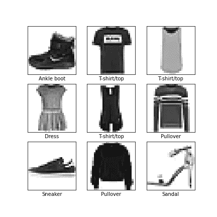

# 为你的 Keras 模型编写一个定制的训练程序

> 原文：<https://towardsdatascience.com/write-a-custom-training-routine-for-your-keras-model-a9139312a8a9?source=collection_archive---------10----------------------->

## [*小窍门*](https://towardsdatascience.com/tagged/tips-and-tricks)

## 当简单性和易用性开始阻碍你时

由[拍摄的谷仓图片](https://unsplash.com/@barnimages?utm_source=medium&utm_medium=referral)上[的 Unsplash](https://unsplash.com?utm_source=medium&utm_medium=referral)

对于开始学习深度学习的人来说，Keras 工具箱是无可匹敌的。它拥有你所需要的一切，令人困惑的底层内容保持在最少。该 API 非常直观，让您专注于设计网络的重要部分，允许快速实验而没有太多麻烦。例如，本指南中使用的网络是用不到 25 行 Python 代码指定和训练的。

然而，有时基本 Keras 功能的易用性会受到限制。许多更高级的神经网络训练方案和损失函数变得不必要地复杂，难以用本地 Keras 进行编码。在本指南中，我旨在展示如何将训练神经网络的基本 Keras 方法分解为其基础部分，从而为用户根据需要更改每个部分提供可能性。我没有在示例中包含任何这些自定义部件；本指南的目的只是给你一些工具，让你自己去做更多的实验。

在本指南中，我将使用 FashionMNIST 数据集来设置和展示两种不同的训练神经网络的方法，以对不同服装对象的图片进行分类。该数据集包含来自 10 个对象类的 70000 幅图像，在 60000 幅训练图像和 10000 幅验证图像之间有预定义的分割。这个例子改编自 Keras 教程，在那里你可以找到更多有趣的教程。

时尚主义者数据集的一些示例图像

# 古典希腊

使用 Keras 构建神经网络非常简单。您可以一层一层地定义它，同时指定层的属性。这些属性是卷积滤波器的数量、内核大小、激活函数等。示例模型由两个 3x3 卷积块组成，中间有一个 4x4 最大池操作。最终的要素地图通过全局平均池操作运行，激活 softmax 的最终密集图层提供类别预测。下面的函数构建神经网络并返回包含所有层的 tf.keras.Model 对象。该对象稍后用于训练和测试神经网络。

在训练模型之前，Keras 要求我们指定一些关于训练过程的细节，比如优化器和损失函数。例如，我们还告诉 Keras 在训练过程中跟踪网络的准确性。

真正的奇迹发生在现在，在网络的训练下。训练神经网络包括在训练样本的大数据集上最小化损失函数。使用取自大数据集的小批量样本来最小化该损失函数。为这些小批量计算损失函数，并且对于每个批量，用梯度下降算法的小步骤更新网络的参数。Keras 只需调用“fit”函数，使用适当的参数，就可以处理所有这些问题。

这告诉 Keras 在带有相应标签“y_val”的训练数据集“x_train”上训练我们的网络。小批量包含 64 个图像。我们的网络将训练 10 个纪元，或者在整个训练数据集上进行 10 次传递。在这样一个时期结束时，为验证数据计算性能，允许我们在训练期间监控网络的泛化潜力。

默认情况下，Keras 会在训练过程运行时向您显示有关训练过程的有价值的信息，例如您让它跟踪的损失和潜在指标，并告诉您它通过数据集的速度。

# 风俗习惯

仔细想想,“fit”功能会为您处理很多细节。它组成批次，计算损失函数，推断我们应该在参数空间中的哪些方向移动，跟踪验证性能。对于大多数用例，这将是你所需要的。所有这些细节在用例之间不会有太大的变化，将它们留给 API 可以腾出时间来调整和修补重要的东西。当细节发生变化时，Tensorflow 提供了足够的工具。然而，你需要自己做更多的工作。

首先是数据集的*批处理*。Tensorflow 提供了两种解决这个问题的方法:“TF . data”API 和“tf.keras.utils.Sequence”类。这个例子将使用后者。“tf.data”有可能提供改进的性能，但是对于我自己编写的许多“定制”训练例程来说，“Sequence”类更容易使用。您必须创建自己的子类，实现几个在训练期间使用的函数:

*   __init__，初始化子类的对象
*   __len__，指定批次的数量
*   __getitem__，编写从完整训练集中抽取一个批次的指令(这也是您经常执行某种形式的数据扩充的地方)
*   on_epoch_end，可以在训练时期结束时调用，例如，执行一些数据混洗，以改变下一个时期的图像排序

接下来是实际训练的设置。您必须指定您的优化器并获得损失函数的实例。您可能还想初始化一些簿记变量。在这里，我跟踪训练和验证数据集的损失和准确性。你可以把这看作是为 Keras 的“编译”函数编写你自己的替代函数。

最后，我们到了关键的一步:训练网络。Tensorflow 允许我们将使用 Keras API 函数构建的相同模型用于自定义训练循环。然而，其他一切都将改变。现在，训练需要两个嵌套的 for 循环，而不是一个函数调用。外部循环跟踪不同的时期，内部循环提供了迭代批处理的机制。对于每个批处理迭代步骤，我们使用自定义的“Sequence”子类生成相应的批处理。Tensorflow 使用“tf”监视该批次通过网络的转发。GradientTape ',因此我们可以稍后使用损耗的*梯度*来确定对网络参数的必要改变。在每个时期结束时，平均训练损失和准确度存储在我们的簿记变量中。这也是根据验证数据确定网络性能的时候。

这就是全部内容:在神经网络的训练过程中，将不同部分分开的所有步骤。编写定制的训练循环将允许您更容易地跟踪各种奇异的性能度量，或者构建依赖于直接批量训练输入和标签之外的信息的损失函数。把它看作是你的神经网络工具箱的扩展。

为了完整起见，您可以在下面找到一个 Jupyter 笔记本，它将所有不同的步骤都包含在一个包中，供您自己测试。

包含所有不同步骤的 Jupyter 笔记本