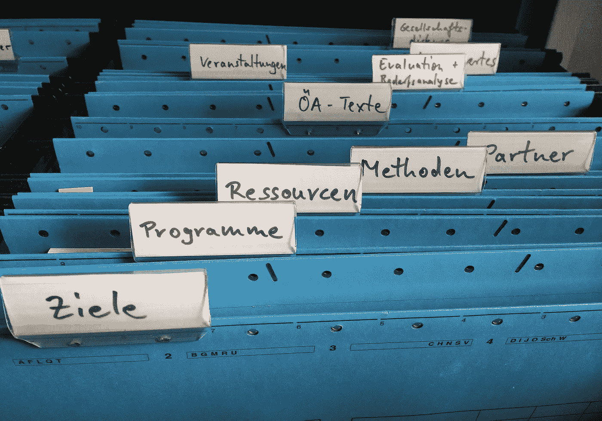

# 在不到 30 分钟的时间内编写一个文档分类器。

> 原文：<https://towardsdatascience.com/write-a-document-classifier-in-less-than-30-minutes-2d96a8a8820c?source=collection_archive---------15----------------------->

## 让我们看看如何快速实现一个模型来对文档进行分类。



图片来自[皮克斯库](https://pixabay.com/?utm_source=link-attribution&amp;utm_medium=referral&amp;utm_campaign=image&amp;utm_content=1205171)

在我过去的一次面试中，有人要求我实现一个模型来对论文摘要进行分类。我的目标不是得到一个完美的调优模型，而是看看我在最短时间内完成整个过程的能力。以下是我所做的。

# 数据

数据由 PubMed 数据库中的论文摘要组成。PubMed 是所有生物医学文献的资料库。管理 PubMed 的机构 NCBI 提供了一个下载论文的 API。已经有很多库可以用几种语言与 API 交互。我使用了 Python，我找到的最简单的库是 Bio 及其用于这个特定数据库的模块 Entrez。

我们导入该模块，并配置一个电子邮件，这是强制性的，让他们跟踪每秒的请求数。您甚至可以要求 API_KEY 将每秒的文档数增加到 10。

```
from Bio import EntrezEntrez.email = '[your@email.com](mailto:ya.netsec@gmail.com)'
Entrez.api_key = "abcdefghijklmnopqrstuvwxyz42"
```

为了从 PubMed 获取文章，我们首先执行一个查询，返回每个文档的元数据，比如它的 ID。然后，我们使用 id 来获取细节(在我的案例摘要中)。

```
def search(query, max_documents=1000):

    handle = Entrez.esearch(db=’pubmed’,
                            sort=’relevance’,
                            retmax=max_documents,
                            retmode=’xml’,
                            term=query)
    results = Entrez.read(handle)

 return results
```

该函数将在 PubMed 数据库的参数中执行查询，根据相关性对结果进行排序，并将结果的数量限制为 max_documents。

查询其实很简单。您可以使用文档关键字和逻辑运算符。PubMed 文档详细解释了如何构建查询。

在面试中，我被要求拿到 4 门课(题目)的资料。我们通过在查询中指定每个类的相关关键字来做到这一点。

该函数的结果是一个没有内容的文档细节列表。然后，我们使用这些 id 来获取文档的所有细节。

```
def fetch_details(id_list):
    handle = Entrez.efetch(db=”pubmed”, id=’,’.join(map(str,                 id_list)),rettype=”xml”, retmode=”text”)

    records = Entrez.read(handle)
    abstracts = [pubmed_article[‘MedlineCitation’][‘Article’]   [‘Abstract’][‘AbstractText’][0] for pubmed_article in records[‘PubmedArticle’] if ‘Abstract’ in pubmed_article[‘MedlineCitation’][‘Article’].keys()]

 return abstracts
```

该函数将获取一个 id 列表，并返回一个包含所有摘要的数组。获取特定类的所有摘要的完整函数是:

```
def get_abstracts_for_class(ab_class):
    list_abstracts = [] ## get keywords of the class query = " AND ".join(keywords[ab_class]) res = search(query)
    list_abstracts = fetch_details(res["IdList"]) return list_abstracts
```

我将所有关键字保存在字典中，并使用它们来构建查询。

我们为每个类调用函数，以获取所有类的所有摘要。最后，我们将它们重新格式化，得到一个可用的熊猫数据帧。

```
list_all_classes = []list_all_classes += [{“abs”: a, “class”: 1} for a in list_abs_class1]
list_all_classes += [{“abs”: a, “class”: 2} for a in list_abs_class2]
list_all_classes += [{“abs”: a, “class”: 3} for a in list_abs_class3]
list_all_classes += [{“abs”: a, “class”: 4} for a in list_abs_class4]abs_df = pd.DataFrame(list_all_classes)
```

## 数据清理

同样，这里的目标不是完美地清理数据集，但是一个小的标准预处理是必要的。我个人大部分时间使用 NLTK，但是你可以用几乎所有的 NLP 库做同样的事情。

```
from nltk.tokenize import word_tokenize
from nltk.corpus import stopwords
import string## 1) Lower
abs_df[“abs”] = abs_df[“abs”].str.lower()## 2) Remove tags
abs_df[“abs”] = abs_df.apply(lambda x: re.sub(“<[^>]*>”, “”, x[“abs”]), axis=1)## 3) Tokenize
abs_df[“abs_proc”] = abs_df.apply(lambda x: word_tokenize(x[“abs”]), axis=1)## 4) Remove punctuationnltk.download('punkt')
table = str.maketrans(‘’, ‘’, string.punctuation)
abs_df[“abs_proc”] = abs_df.apply(lambda x: [w.translate(table) for w in x[“abs_proc”]], axis=1)## 5) Remove non-alpha
abs_df[“abs_proc”] = abs_df.apply(lambda x: [w for w in x[“abs_proc”] if w.isalpha()], axis=1)## 6) Remove stop-words
nltk.download('stopwords')
stop_words = set(stopwords.words(‘english’))abs_df[“abs_proc”] = abs_df.apply(lambda x: [w for w in x[“abs_proc”] if not w in stop_words], axis=1)## 7) Reformat to have a single text. abs_df[“abs_proc_res”] = abs_df.apply(lambda x: ‘ ‘.join(x[“abs_proc”]), axis=1)
```

我们使用 Pandas 应用功能的强大功能，对整个数据帧应用相同的处理:

1.  降低所有文本
2.  我发现文本中有一些标签，比如来表示粗体文本。即使这些标签可能很重要，但这对于一个小时的练习来说太复杂了。所以我决定用正则表达式删除它们。
3.  我们首先对文本进行记号化:即，将它分割成一系列单独的单词。
4.  删除所有标点符号，如问号(？)或逗号(，)。
5.  我们移除非字母符号，即数字。
6.  我们删除停用词。我们首先使用 NLTK 检索英语停用词词汇，然后使用它过滤掉我们的标记。
7.  最后，我们将处理过的数据连接起来，使每个摘要都有一个单独的文本。

## 数据嵌入

如果你熟悉 NLP 问题，那么你知道在处理文本数据时最重要的部分可能是向量表示，即嵌入。关于这一点已经取得了很多进展，并且已经提出了一些强大的模型，如谷歌的 BERT 或 OpenAI 的 GPT。然而，这些模型很难调优，绝对不适合 1 小时的练习。此外，对于许多实际问题，一个非常简单的嵌入就足以获得数据的正确矢量表示。

最简单的大概就是 TF-IDF(词频-逆文档频)，也就是我用过的那个。

sklearn 库已经有一个 TF-IDF 模块，可以直接在 dataframe 上使用。

```
from sklearn.feature_extraction.text import TfidfVectorizervec = TfidfVectorizer()
x = vec.fit_transform(abs_df["abs_proc_res"])
```

此时，我们有一个矩阵 X 对应于我们所有的矢量化摘要。然而，看着 X 的形状，我们注意到了一些东西:

```
print(x.shape)(25054, 60329)
```

我们最终得到大量的列(即 60329)。这是正常的，因为这个数字对应于整个语料库(即整个数据集)的词汇大小。这个数字有两个问题。

首先，它会使模型的训练复杂化。

第二，即使我们做了大量的预处理，词汇表中的大多数单词与分类无关，因为它们没有添加任何相关信息。

幸运的是，有一种方法可以减少列数，同时避免丢失相关信息。最常见的方法称为 PCA(主成分分析)，它将矩阵分解为一组不相关的低维矩阵。我们应用 SVD(奇异值分解)，这是一种 PCA。还是那句话，有一个 sklearn 模块可以轻松做到。

```
**from** **sklearn.decomposition** **import** TruncatedSVDsvd = TruncatedSVD(n_components=100)
res = svd.fit_transform(x)print(res.shape)
(25054, 100)
```

我选择将我们的初始矩阵减少到 100 个组件(即特性)。这是一个要优化的参数:我们越接近初始维度，我们在缩减过程中丢失的信息就越少，而较小的数量将降低我们的模型训练的复杂性。

我们现在准备训练一个分类器。

# 模型

有很多分类模型。理解和实现最简单的方法之一可能是 SVM(支持向量机)。简而言之，它将试图画一条线，尽可能地将每个类的点分开。

我们还使用交叉验证来提高指标的代表性。

```
**from** **sklearn** **import** svm
**from** **sklearn.model_selection** **import** RepeatedKFold
**from** **sklearn.model_selection** **import** cross_val_score
**from** **sklearn.model_selection** **import** cross_validate
**from** **numpy** **import** mean
**from** **numpy** **import** stdy = abs_df["class"].values
X = rescv = RepeatedKFold(n_splits=10, n_repeats=3, random_state=1)model = svm.SVC(kernel='linear', C=1, decision_function_shape='ovo')
```

我们使用线性内核，也就是说，它会尝试绘制一条线来分隔数据。其他核存在，如多项式，试图找到一个多项式函数，更好地分离点。

决策函数被设置为 ovo，即一对一，这将花费每次尝试来分离每对类别，而忽略其他类别。

我们训练吧！

```
metrics = cross_validate(model, res, y, scoring=['precision_macro', 'recall_macro'], cv=cv, n_jobs=-1) print('Precision: **%.3f** (**%.3f**)' % (mean(metrics["test_precision_macro"]), std(metrics["test_precision_macro"])))
print('Recall: **%.3f** (**%.3f**)' % (mean(metrics["test_recall_macro"]), -std(metrics["test_recall_macro"])))-----------------------------------Precision: 0.740 (0.021)
Recall: 0.637 (0.014)
```

这里有两个有趣的指标:精确度和召回率。

精度是指，对于每一类，在预测的文档中，有 74%是正确预测的，这已经不错了。

另一方面，召回意味着在某个类的所有文档中，我们能够捕获 63%。

# 结论和展望

正如你所看到的，只使用机器学习的基础知识，实现一个快速分类器是相对容易的。当然它并不完美，但是当你什么都没有的时候，即使是一个糟糕的模型也是可以接受的。

很明显，还有很多可以改进的地方。预处理可能是对模型影响最大的部分。例如，不使用 TF-IDF，我们可以尝试更复杂的算法，如 BERT。从模型的角度来看，我们也可以尝试其他分类器，甚至堆叠几个分类器以获得更好的性能。

也就是说，如果您的目标是有一个工作模型来分类您的文档，这是一个很好的起点。

下一步就是把这个投入生产！我将在另一篇文章中讨论这一部分。