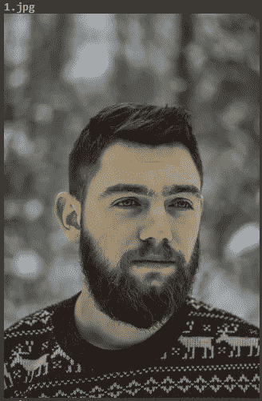
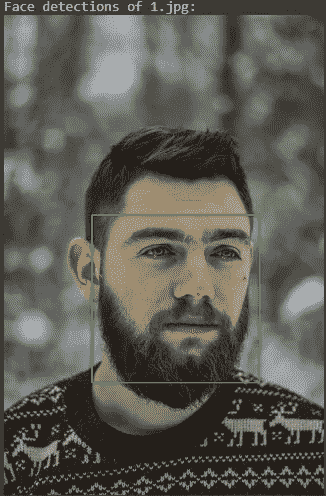
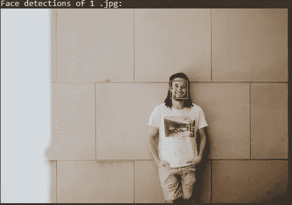
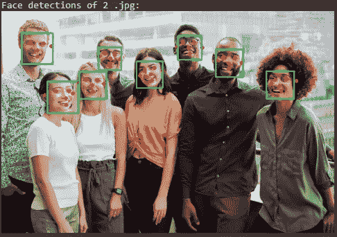

# 写几行代码检测人脸，从复杂图像中画出地标~MediaPipe

> 原文：<https://towardsdatascience.com/write-a-few-lines-of-code-and-detect-faces-draw-landmarks-from-complex-images-mediapipe-932f07566d11?source=collection_archive---------8----------------------->


图片由[皮克斯拜](https://pixabay.com/?utm_source=link-attribution&utm_medium=referral&utm_campaign=image&utm_content=4791810)的 Gerd Altmann 提供

## 使用 MediaPipe 从复杂图像中检测人脸既简单又有趣

## 媒体管道概述

> MediaPipe 是 Google 内部最广泛共享和可重用的媒体处理库之一。”— Kahye Song

G oogle 开源 ***MediaPipe*** 于 2019 年 6 月首次推出。它旨在通过提供一些集成的计算机视觉和机器学习功能来使我们的生活变得简单。媒体管道是一个框架，用于构建多模态(如视频、音频或任何时间序列数据)、跨平台(如 eAndroid、IOS、web、边缘设备)的应用 ML 管道。Mediapipe 还有助于将机器学习技术部署到各种不同硬件平台上的演示和应用程序中。

**值得注意的应用**

*   人脸检测
*   多手跟踪
*   头发分割
*   目标检测和跟踪
*   反对:3D 物体检测和跟踪
*   自动裁剪:自动视频裁剪管道

*以此类推..*

**您为什么需要 MediaPipe**

有效管理资源(CPU 和 GPU)以实现低延迟性能，处理音频和视频帧等时序数据的同步，以及 MediaPipe 必不可少的更多有效理由。MediaPipe 将每个感知模型抽象成一个模块，并用维护图将它们连接起来。除了上述特性，MediaPipe 还支持 TensorFlow 和 TF Lite 推理引擎。任何 TensorFlow 和 TF Lite 模型都可以在 MediaPipe 上使用。同时在移动和嵌入式平台上，MediaPipe 也支持设备本身的 GPU 加速。

*是时候介绍 MediaPipe 的一个令人惊叹的应用了，人脸检测。*

## **人脸检测**

> 考虑这样一个场景，“一个零售商要求你统计访客的数量，并跟踪访客在他们店里的活动。”

***似乎很难！！*** ***怎样才能解决问题？*** 嗯嗯……

哦，是的！我们将使用人脸跟踪来解决这个问题。现在的问题是怎样才能检测出顾客的脸。这个问题的答案是人脸跟踪技术使用人脸检测作为检测人脸的第一步。

人脸检测是计算机视觉中定位和定位照片中的一个或多个人脸的问题。

> 这个问题的一般陈述可以定义如下:给定一幅静止或视频图像，检测并定位未知数量(如果有的话)的人脸——[人脸检测:一项调查](https://www.sciencedirect.com/science/article/pii/S107731420190921X)，2001。

**使用 MediaPipe 执行面部检测的模型:**

为了执行面部检测，使用了三种模型:

1.  *近距离模式(最适合距离摄像头 2 米以内的人脸)*
2.  *全范围模型(密集，最适合距离摄像机 5 米以内的人脸)*
3.  *全范围模型(稀疏，最适合距离摄像机 5 米以内的人脸)*

全范围密集和稀疏模型在**[**F-score**](https://en.wikipedia.org/wiki/F-score)方面具有相同的质量，但是在底层指标方面有所不同。密集模型在 [**召回**](https://en.wikipedia.org/wiki/Precision_and_recall) 上稍好，而稀疏模型在 [**精度**](https://en.wikipedia.org/wiki/Precision_and_recall) **上优于密集模型。****

***是时候用 MediaPipe 的动手人脸检测模型让我们的手变脏了。***

*****循序渐进方针*****

****安装必要的库****

**要执行面部检测，您必须首先在机器上安装 MediaPipe。如果您是 windows 用户，那么您可以在计算机的命令提示符下运行下面的代码。**

```
pip install mediapipe
```

**有关详细说明，您可以点击以下链接:**

**[https://Google . github . io/media pipe/getting _ started/python . html](https://google.github.io/mediapipe/getting_started/python.html)**

**你还需要安装 OpenCV 用于网络摄像头或图像输入。如果您是 windows 用户，您可以在命令提示符下运行下面的代码。**

```
pip install opencv-python
```

**有关详细说明，您可以点击以下链接:**

**[*https://pypi.org/project/opencv-python/*](https://pypi.org/project/opencv-python/)**

****写代码了解 API 的使用:****

**我们使用 Google Colab 来运行代码。你可以随意使用它。导入必要的库。我们需要`cv2`模块来读取和显示图像，以及 MediaPipe 模块，它公开了我们执行面部检测所需的功能**

**项目中提供了 google colab 版本和 jupyter 笔记本版本的全部代码。本文结论部分的末尾给出了链接。**

```
*import cv2
import mediapipe as mp*
```

***然后我们将访问两个子模块`face_detection` 和`drawing_utils` **。****`face_detection`**为用于加载所有功能以执行人脸检测，而`drawing_utils` 用于在图像上绘制检测到的人脸。*******

```
*****mp_face_detection = mp.solutions.face_detection
mp_drawing = mp.solutions.drawing_utils*****
```

*****是时候深入挖掘代码了。首先，我们将一幅图像作为输入。这里我们使用两种类型的图像*****

******(i)包含两米内的面部的图像******

******(ii)五米内包含人脸的图像。******

*****我们使用来自 colab 的`files` 直接从本地目录加载图像。当您在本地计算机上工作时，也可以使用`cv2.imread()`加载图像。*****

******(a)拍摄的第一张图像******

```
*****from google.colab import files
uploaded_short_range = files.upload()*****
```

******(b)拍摄的第二张图像******

```
*****from google.colab import files
uploaded_full_range = files.upload()*****
```

*****在本地电脑上工作时，您可以使用*****

```
*****cv2.imread() #to take input.*****
```

*****[*点击这里*](https://www.geeksforgeeks.org/python-opencv-cv2-imread-method/) 了解更多`cv2.imread()`*****

*****现在，我们将调整图像的大小并显示图像。为了显示图像，我们必须使用来自 colab 的`**cv2_imshow**` 模块，或者在本地机器上工作时使用`cv2.imshow(frame name, iamge)`模块。我们可以使用下面的代码来调整和显示谷歌 colab 中的图像。*****

*****用于调整大小和显示图像的代码*****

**********

*****上述代码的输出示例(照片由 [Radu Florin](https://unsplash.com/@raduflorin?utm_source=unsplash&utm_medium=referral&utm_content=creditCopyText) 在 [Unsplash](https://unsplash.com/?utm_source=unsplash&utm_medium=referral&utm_content=creditCopyText) 上拍摄)*****

*****现在，我们将在面上绘制地标。*****

*****我们可以如下改变`thickness` 和`circle_radius`的值。*****

```
*****drawing_spec = mp_drawing.DrawingSpec(thickness=1, circle_radius=1)*****
```

*****要了解关于`mp.solutions.face_detection` 运行的详细信息*****

*****代码下方:*****

```
*****help(mp_face_detection.FaceDetection)*****
```

*****在这之后，我们将创建一个类为[**Fac**](https://github.com/google/mediapipe/blob/350fbb2100ad531bc110b93aaea23d96af5a5064/mediapipe/python/solutions/face_mesh.py#L175)**e detection**的对象。这个对象将允许我们处理图像并执行面部标志估计。此类的构造函数支持以下参数:*****

*******(一)型号选择**:整数索引 *0* 或 *1。*使用 0 选择最适合距离摄像机 2 米以内的人脸的短程模型，使用 1 选择最适合距离摄像机 5 米以内的人脸的全程模型。对于全范围选项，使用稀疏模型以提高推理速度。具体请参考 [**型号卡**](https://google.github.io/mediapipe/solutions/models.html#face_detection) 。如果未指定，则默认为 0。*****

*******(ii)MIN _ DETECTION _ CONFIDENCE:**来自面部检测模型的最小置信度值([0.0，1.0])，用于检测被认为是成功的。默认为 0.5。*****

```
*****with mp_face_detection.FaceDetection(min_detection_confidence=0.5, model_selection=0) as face_detection:*****
```

*****上面的代码`model_selection = 0`表示我们选择近距离模型进行人脸检测。使用下面的代码，我们使用一个简短的图像模型进行最终的人脸检测，并绘制出地标。*****

*****短长度(2 米以内)图像的人脸检测模型*****

**********

*****作者图片*****

*****现在对于`model_selection = 1`来说，这意味着我们选择人脸检测 `full-range model`。使用下面的代码，我们使用完整的图像模型执行最终的人脸检测，并绘制地标。*****

*****全长(5 米以内)图像的人脸检测模型*****

**********

*****作者图片*****

*****我们也可以用全长人脸检测模型的代码在团体照片上执行这个过程。*****

**********

*****作者图片*****

*****使用 **MediaPipe，我们可以超越人脸检测。**下面这篇关于**[***algo scale***](https://algoscale.com/)*的文章，将为你展示一个使用 OpenCV 和 MediaPipe 估算姿态的方向。********

******[*使用 OpenCV 和 MediaPipe*](https://algoscale.com/tech-corner/workout-pose-estimation-using-opencv-and-mediapipe/) 进行姿态估计******

## ******结论******

******人脸检测是计算机视觉中最常见的问题之一。有许多用于人脸检测和人脸标志绘制的技术。最有效的技术是在深度学习模型的帮助下创建的。但是如果我们试图从零开始制作模型，这需要巨大的计算能力、复杂的知识以及数据集。大多数情况下，是老百姓的问题。Mediapipe 库在使困难的任务变得简单方面是惊人的。该库提供定制的内置模型。在本文中，我们刚刚展示了使用 MediaPipe 进行面部检测和面部标志绘制的简单易行的过程。在接下来的文章中，将在 MediaPipe 的帮助下展示更多简单而有用的技术。******

********github 中的源代码********

*********Colab 源代码……..*********

******[](https://github.com/Zubair063/ML_articles/blob/7385b71cb4fa0e2d1771f4bb2efe84d7d243af83/Face_detection.ipynb) [## Face_detection.ipynb

### 在 GitHub 上创建一个帐户，为 Zubair063/ML_articles 的开发做出贡献。

github.com](https://github.com/Zubair063/ML_articles/blob/7385b71cb4fa0e2d1771f4bb2efe84d7d243af83/Face_detection.ipynb) 

***Jupyter 笔记本源代码…..***

[](https://github.com/Zubair063/ML_articles/blob/7385b71cb4fa0e2d1771f4bb2efe84d7d243af83/face%20detection%20.ipynb) [## 人脸检测。ipynb

### 在 GitHub 上创建一个帐户，为 Zubair063/ML_articles 的开发做出贡献。

github.com](https://github.com/Zubair063/ML_articles/blob/7385b71cb4fa0e2d1771f4bb2efe84d7d243af83/face%20detection%20.ipynb) 

## 给你一些更有趣的文章

[](/spread-of-covid-19-with-interactive-data-visualization-521ac471226e) [## 通过交互式数据可视化传播新冠肺炎

### 一个完整的指南条形图比赛和互动 Choropleth 地图新冠肺炎疫情与 Python。

towardsdatascience.com](/spread-of-covid-19-with-interactive-data-visualization-521ac471226e) [](/less-is-more-the-art-of-sampling-dda8b59d399) [## 少即是多；取样的“艺术”

### 使用样本提高您对大量数据集的数据分析能力

towardsdatascience.com](/less-is-more-the-art-of-sampling-dda8b59d399) 

## 祖贝尔·侯赛因

*   *如果您喜欢这篇文章，请关注我的* [***中的***](https://mzh706.medium.com/) *了解更多。*
*   *把我连上*[***LinkedIn***](https://www.linkedin.com/in/zubair063/)*进行协作。*******