# 使用 PyCaret 编写和训练您自己的自定义机器学习模型

> 原文：<https://towardsdatascience.com/write-and-train-your-own-custom-machine-learning-models-using-pycaret-8fa76237374e?source=collection_archive---------8----------------------->

## 一步一步的，初学者友好的教程，关于如何用 PyCaret 编写和训练定制的机器学习模型


罗布·兰伯特在 [Unsplash](https://unsplash.com?utm_source=medium&utm_medium=referral) 上拍摄的照片

# PyCaret

PyCaret 是一个开源的低代码机器学习库和端到端的模型管理工具，内置于 Python 中，用于自动化机器学习工作流。它因其易用性、简单性以及快速高效地构建和部署端到端 ML 原型的能力而广受欢迎。

PyCaret 是一个替代的低代码库，可以用几行代码代替数百行代码。这使得实验周期成倍地快速和有效。

py caret**简单** **好用**。PyCaret 中执行的所有操作都顺序存储在一个**管道**中，该管道对于**部署是完全自动化的。**无论是输入缺失值、一键编码、转换分类数据、特征工程，甚至是超参数调整，PyCaret 都能实现自动化。

本教程假设您对 PyCaret 有一定的了解和经验。如果您以前没有使用过，没关系，您可以通过这些教程快速入门:

*   [PyCaret 2.2 已经发布——新功能](/pycaret-2-2-is-here-whats-new-ad7612ca63b)
*   [宣布 PyCaret 2.0](/announcing-pycaret-2-0-39c11014540e)
*   关于 PyCaret 你不知道的五件事

# 正在安装 PyCaret

安装 PyCaret 非常容易，只需要几分钟。我们强烈建议使用虚拟环境来避免与其他库的潜在冲突。

PyCaret 的默认安装是 pycaret 的精简版本，只安装这里列出的硬依赖项。

```
**# install slim version (default)** pip install pycaret**# install the full version**
pip install pycaret[full]
```

当你安装 pycaret 的完整版本时，这里列出的所有可选依赖项也会被安装。

# 👉我们开始吧

在我们开始讨论定制模型训练之前，让我们来看一个 PyCaret 如何处理开箱即用模型的快速演示。我将使用 [PyCaret 的存储库](https://github.com/pycaret/pycaret/tree/master/datasets)上的“保险”数据集。该数据集的目标是基于一些属性预测患者费用。

# 👉**数据集**

```
**# read data from pycaret repo** from pycaret.datasets import get_data
data = get_data('insurance')
```

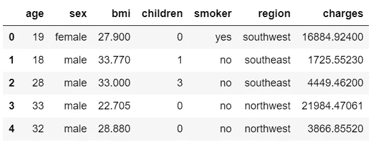

保险数据集中的样本行

# 👉**数据准备**

对于 PyCaret 中的所有模块来说，`setup`是在 PyCaret 中执行的任何机器学习实验中的第一个也是唯一一个强制步骤。该函数负责训练模型之前所需的所有数据准备。除了执行一些基本的默认处理任务，PyCaret 还提供了一系列预处理功能。要了解 PyCaret 中所有预处理功能的更多信息，您可以查看这个[链接](https://pycaret.org/preprocessing/)。

```
**# initialize setup** from pycaret.regression import *
s = setup(data, target = 'charges')
```

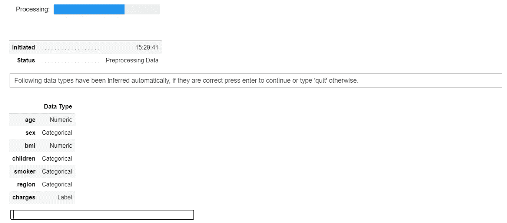

pycaret.regression 模块中的设置函数

每当在 PyCaret 中初始化`setup`函数时，它都会分析数据集并推断所有输入要素的数据类型。如果所有数据类型都推断正确，您可以按 enter 键继续。


设置的输出—为显示而截断

# 👉可用型号

要查看所有可用于训练的模型列表，您可以使用名为`models`的功能。它显示一个表格，其中包含模型 ID、名称和实际评估者的参考。

```
**# check all the available models** models()
```

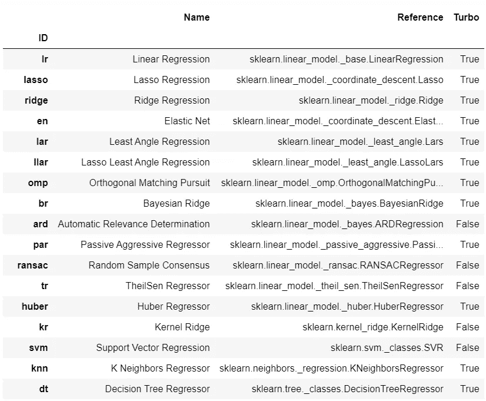

models 的输出()-出于显示目的，输出被截断

# 👉模型训练和选择

PyCaret 中训练任何模型使用最多的函数是`create_model`。它需要一个你想要训练的估计器的 ID。

```
**# train decision tree** dt = create_model('dt')
```

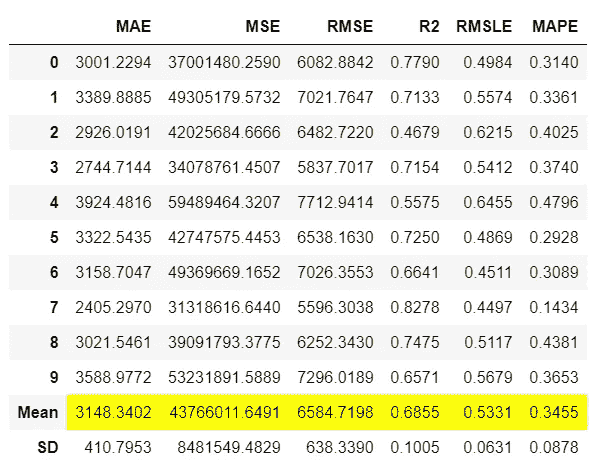

create_model 的输出(' dt ')

输出显示了带有平均值和标准差的 10 倍交叉验证指标。这个函数的输出是一个经过训练的模型对象，它本质上是一个`scikit-learn`对象。

```
print(dt)
```

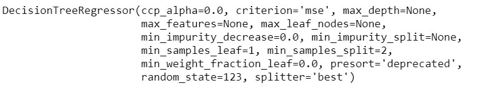

打印输出(dt)

要在一个循环中训练多个模型，您可以编写一个简单的列表理解:

```
**# train multiple models**
multiple_models = [create_model(i) for i in ['dt', 'lr', 'xgboost']]**# check multiple_models** type(multiple_models), len(multiple_models)
>>> (list, 3)print(multiple_models)
```

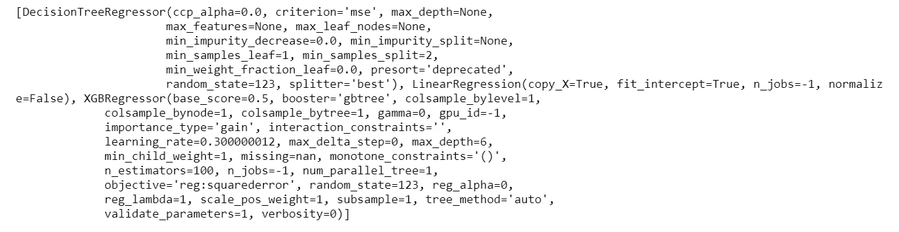

打印输出(多种型号)

如果您想训练库中所有可用的模型，而不是选定的几个，您可以使用 PyCaret 的`compare_models`函数，而不是编写自己的循环(*结果将是相同的，尽管*)。

```
**# compare all models**
best_model = compare_models()
```

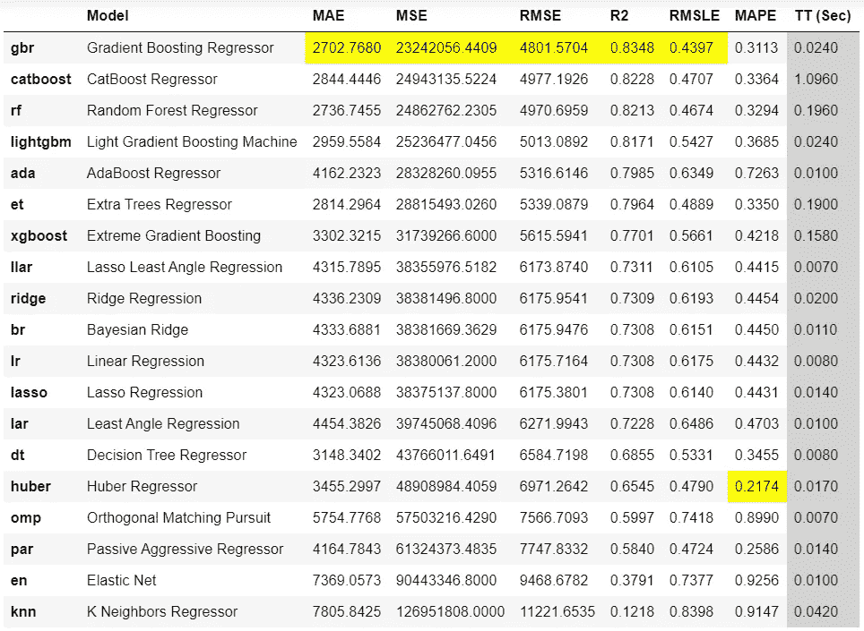

compare_models 函数的输出

`compare_models`返回显示所有模型的交叉验证指标的输出。根据这个输出，梯度推进回归器是最好的模型，在训练集上使用 10 重交叉验证，平均绝对误差**【MAE】**为 2702 美元。****

```
****# check the best model**
print(best_model)**
```

****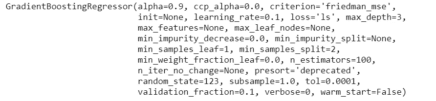****

****打印输出(最佳模式)****

****上面表格中显示的指标是交叉验证分数，用于检查保留集上的`best_model`的分数:****

```
****# predict on hold-out** pred_holdout = predict_model(best_model)**
```

****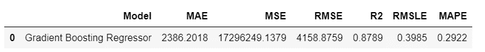****

****预测模型(最佳模型)函数的输出****

****要在看不见的数据集上生成预测，您可以使用相同的`predict_model`函数，但只需传递一个额外的参数`data`:****

```
****# create copy of data drop target column**
data2 = data.copy()
data2.drop('charges', axis=1, inplace=True)**# generate predictions** predictions = predict_model(best_model, data = data2)**
```

****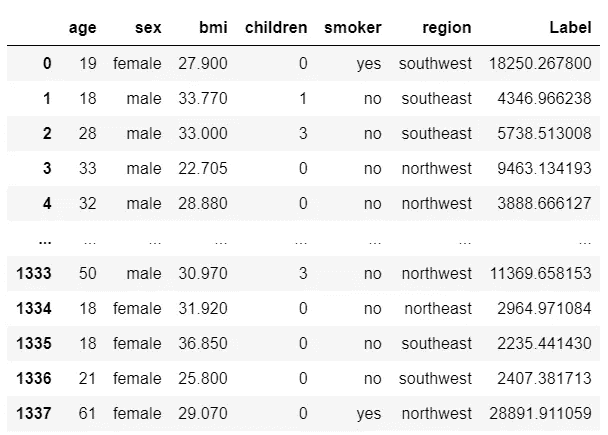****

****预测模型的输出(最佳模型，数据=数据 2)****

# ****👉编写和培训自定义模型****

****到目前为止，我们看到的是 PyCaret 中所有可用模型的训练和模型选择。然而，PyCaret 为定制模型工作的方式是完全相同的。只要您的估算器与`sklearn` API 风格兼容，它就会以同样的方式工作。我们来看几个例子。****

****在向您展示如何编写自己的定制类之前，我将首先演示如何使用定制的非 sklearn 模型(sklearn 或 pycaret 的基库中没有的模型)。****

## ****👉 **GPLearn 车型******

****虽然遗传编程(GP)可以用来执行[非常多种多样的任务](http://www.genetic-programming.org/combined.php)，`gplearn`被有目的地限制于解决符号回归问题。****

****符号回归是一种机器学习技术，旨在识别最佳描述关系的基础数学表达式。它首先构建一组简单的随机公式来表示已知自变量与其因变量目标之间的关系，以预测新数据。每一代程序都是通过从种群中选择最适合的个体进行遗传操作而从上一代进化而来的。****

****要使用`gplearn`的型号，您必须先安装它:****

```
****# install gplearn** pip install gplearn**
```

****现在您可以简单地导入未训练的模型，并在`create_model`函数中传递它:****

```
****# import untrained estimator**
from gplearn.genetic import SymbolicRegressor
sc = SymbolicRegressor()**# train using create_model** sc_trained = create_model(sc)**
```

****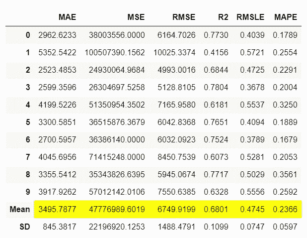****

****create_model 的输出(sc_trained)****

```
**print(sc_trained)**
```

****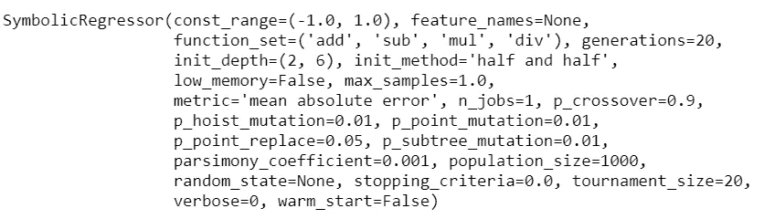****

****打印输出(sc_trained)****

****您还可以检查这方面的坚持分数:****

```
****# check hold-out score** pred_holdout_sc = predict_model(sc_trained)**
```

****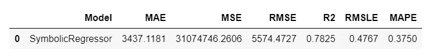****

****预测模型(sc_trained)的输出****

## ****👉NGBoost 型号****

****ngboost 是一个实现自然梯度提升的 Python 库，如[“NGBoost:概率预测的自然梯度提升”](https://stanfordmlgroup.github.io/projects/ngboost/)所述。它建立在 [Scikit-Learn](https://scikit-learn.org/stable/) 的基础上，在选择适当的评分规则、分布和基础学习者方面设计为可扩展和模块化的。本[幻灯片](https://drive.google.com/file/d/183BWFAdFms81MKy6hSku8qI97OwS_JH_/view?usp=sharing)提供了 NGBoost 基础方法的教学介绍。****

****要使用 ngboost 中的模型，您必须首先安装 ngboost:****

```
****# install ngboost**
pip install ngboost**
```

****安装后，您可以从 ngboost 库中导入未经训练的评估器，并使用`create_model`来训练和评估模型:****

```
****# import untrained estimator**
from ngboost import NGBRegressor
ng = NGBRegressor()**# train using create_model** ng_trained = create_model(ng)**
```

****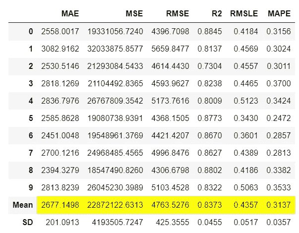****

****create_model 的输出(ng)****

```
**print(ng_trained)**
```

****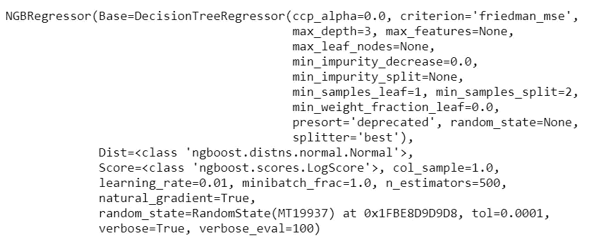****

****打印输出(ng_trained)****

## ****👉编写自定义类****

****上面的两个例子`gplearn`和`ngboost`是 pycaret 的定制模型，因为它们在默认库中不可用，但是您可以像使用任何其他现成模型一样使用它们。然而，可能有一个用例涉及编写你自己的算法(即算法背后的数学)，在这种情况下，你可以从`sklearn`继承基类并编写你自己的数学。****

****让我们创建一个简单的估计器，它在`fit`阶段学习`target`变量的平均值，并预测所有新数据点的相同平均值，而不考虑 X 输入(*可能在现实生活中没有用，只是为了演示功能*)。****

```
****# create custom estimator**
import numpy as npfrom sklearn.base import BaseEstimatorclass MyOwnModel(BaseEstimator):

    def __init__(self):
        self.mean = 0

    def fit(self, X, y):
        self.mean = y.mean()
        return self

    def predict(self, X):
        return np.array(X.shape[0]*[self.mean])**
```

****现在让我们使用这个估计器进行训练:****

```
****# import MyOwnModel class**
mom = MyOwnModel()**# train using create_model** mom_trained = create_model(mom)**
```

****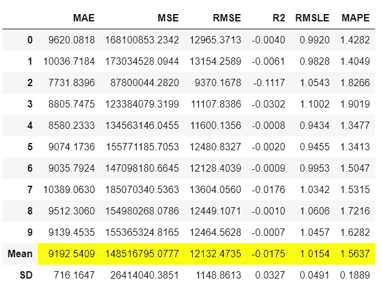****

****create_model(mom)的输出****

```
****# generate predictions on data**
predictions = predict_model(mom_trained, data=data)**
```

****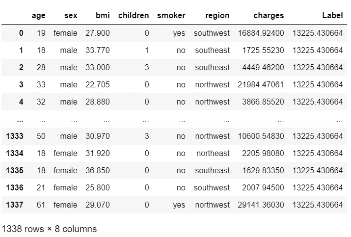****

****predict_model 的输出(mom，data=data)****

****请注意，`Label`列实际上是所有行的预测，是相同的数字$13，225，这是因为我们以这样的方式创建了该算法，它从训练集的平均值中学习并预测相同的值(只是为了保持简单)。****

****我希望您会喜欢 PyCaret 的易用性和简单性。只需几行代码，您就可以执行端到端的机器学习实验，并编写自己的算法，而无需调整任何本机代码。****

# ****即将推出！****

****下周我将写一篇教程来推进这篇教程。我们将编写一个更复杂的算法，而不仅仅是一个均值预测。我将在下一个教程中介绍一些复杂的概念。请在 [Medium](https://medium.com/@moez-62905) 、 [LinkedIn](https://www.linkedin.com/in/profile-moez/) 、 [Twitter](https://twitter.com/moezpycaretorg1) 关注我，获取更多更新。****

****使用 Python 中的这个轻量级工作流自动化库，您可以实现的目标是无限的。如果你觉得这很有用，请不要忘记给我们 GitHub 库上的⭐️。****

****要了解更多关于 PyCaret 的信息，请关注我们的 LinkedIn 和 Youtube。****

****加入我们的休闲频道。此处邀请链接[。](https://join.slack.com/t/pycaret/shared_invite/zt-p7aaexnl-EqdTfZ9U~mF0CwNcltffHg)****

# ****您可能还对以下内容感兴趣:****

****[使用 PyCaret 2.0](/build-your-own-automl-in-power-bi-using-pycaret-8291b64181d)
[在 Power BI 中构建您自己的 AutoML 使用 Docker 在 Azure 上部署机器学习管道](/deploy-machine-learning-pipeline-on-cloud-using-docker-container-bec64458dc01)
[在 Google Kubernetes 引擎上部署机器学习管道](/deploy-machine-learning-model-on-google-kubernetes-engine-94daac85108b)
[在 AWS Fargate 上部署机器学习管道](/deploy-machine-learning-pipeline-on-aws-fargate-eb6e1c50507)
[构建并部署您的第一个机器学习 web 应用](/build-and-deploy-your-first-machine-learning-web-app-e020db344a99)
[使用 AWS Fargate serverless](/deploy-pycaret-and-streamlit-app-using-aws-fargate-serverless-infrastructure-8b7d7c0584c2)
部署 PyCaret 和 Streamlit 应用****

# ****重要链接****

****[文档](https://pycaret.readthedocs.io/en/latest/installation.html)
[博客](https://medium.com/@moez_62905)
[GitHub](http://www.github.com/pycaret/pycaret)
[stack overflow](https://stackoverflow.com/questions/tagged/pycaret)
[安装 PyCaret](https://pycaret.readthedocs.io/en/latest/installation.html) [笔记本教程](https://pycaret.readthedocs.io/en/latest/tutorials.html) [贡献于 PyCaret](https://pycaret.readthedocs.io/en/latest/contribute.html)****

# ****想了解某个特定模块？****

****单击下面的链接查看文档和工作示例。****

****[分类](https://pycaret.readthedocs.io/en/latest/api/classification.html) [回归](https://pycaret.readthedocs.io/en/latest/api/regression.html)
[聚类](https://pycaret.readthedocs.io/en/latest/api/clustering.html)
异常检测
[自然语言处理](https://pycaret.readthedocs.io/en/latest/api/nlp.html) [关联规则挖掘](https://pycaret.readthedocs.io/en/latest/api/arules.html)****