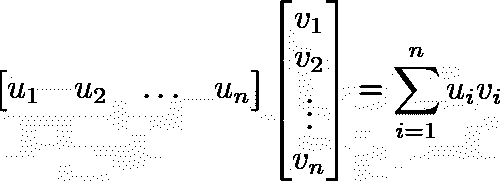

# 使用爱因斯坦符号编写更好更快的 Python

> 原文：<https://towardsdatascience.com/write-better-and-faster-python-using-einstein-notation-3b01fc1e8641?source=collection_archive---------0----------------------->

## 使用“einsum”让你的代码更易读、简洁、高效

刘易斯·康的照片在 [Unsplash](https://unsplash.com?utm_source=medium&utm_medium=referral)

在 Python 中处理线性或多线性代数时，求和循环和 NumPy 函数可能会变得相当混乱，难以阅读，甚至很慢。在我发现 NumPy 的`einsum`功能之前，情况就是这样，我很惊讶不是每个人都在谈论它。

我将向您展示如何使用 **NumPy** 、 **TensorFlow、**或 **PyTorch** 中的[爱因斯坦符号](https://en.wikipedia.org/wiki/Einstein_notation)来使您的代码更具可读性、简洁和高效。

# **理解爱因斯坦符号**

**爱因斯坦符号**的基础是去掉求和符号**σ**，当它不会引起歧义时(当我们可以确定指数的界限时)。

## 例#1:矩阵的乘积

在下面的公式中，矩阵 **A** 的形状为`(m, n)`，矩阵 **B** 的形状为`(n, p)`。

因为我们从矩阵的形状中知道了 I，j 和 k 的界限。我们可以将公式简化为:

## 例 2:两个向量的点积

两个 n 维向量的点积为:

我们可以用爱因斯坦符号把它写成:

## **例 3:两个矩阵的点积**

我们可以使用以下公式定义两个矩阵的点积:

在爱因斯坦的符号中，这很简单:

## 例子#4:张量

我们可以使用两个以上的指数。张量(高阶矩阵)。

例如，我们可以这样写:

或者甚至像这样:

你明白了！

# 什么时候使用爱因斯坦符号？

这主要发生在你处理向量、矩阵和/或张量的时候，你必须:以特定的方式对它们进行乘法、转置和/或求和。

用爱因斯坦符号写出这些运算的组合结果会更简单。

# 使用 Python 的 einsum

`einsum`在`numpy`、`torch`、`tensorflow`中实现。在所有这些模块中，它都遵循语法`einsum(equation, operands)`。

这里我们用指数代替 **■** 。在`->`之后，我们将输出指数。

这相当于:

如果输入或输出是标量(它没有索引)，我们可以让索引为空。

下面是上面的例子。

## 例子#1:矩阵乘法

`einsum("ik,kj->ij", A, B)`

## 示例 2:矢量点积

`einsum("i,i->",u, v)`

## 示例#3:矩阵点积

`einsum("ij,ij->", A, B)`

## 例子#4:张量

`einsum("ijkl,klij->ij", A, B)`

`einsum("iqrj,klqmr->ijklm", A, B)`

你可以用它来处理几乎任何涉及线性代数和多线性代数的公式。

# 表演

那么与使用循环或 numpy 函数相比，`einsum`的性能如何呢？

我决定使用三种方法运行**示例#3** :

运行 100 万次测试并使用`timeit`后:

*   **循环:**24.36 秒
*   **内置函数**:7.58 秒
*   **爱因斯坦:3.78 秒**

`einsum`显然是更快。实际上，比 numpy 的内置函数快两倍，在这种情况下，比循环快 6 倍。

# einsum 为什么快？

这归结为 numpy 是用 c 写的。

当使用本地 Python 循环时，所有的数据操作都发生在 Python 解释器中。

当使用内置的 numpy 函数时，它发生在 C 中，这为 numpy 开发人员提供了优化代码的能力。这就是 numpy 更快的原因。

但在使用`einsum`时，numpy 在 C 中处理一次数据并返回最终结果，而使用多个 numpy 函数则花费更多时间返回多个值。

在某些情况下，这可能是一个很好的俏皮话。虽然这不是提高代码可读性和效率的唯一方法，但在可能的情况下，使用它肯定是不需要动脑筋的。

不过，还有其他方法可以优化 Python 代码，比如使用缓存，我将在以后的文章中介绍这一点。