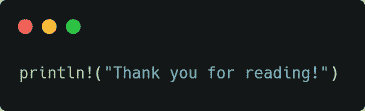

# 在 Rust 中编写更好的匹配语句

> 原文：<https://towardsdatascience.com/write-better-match-statements-in-rust-7458402afacd?source=collection_archive---------8----------------------->

## 使用闭包来编写更清晰的匹配语句

照片由 [MART 出品](https://www.pexels.com/@mart-production?utm_content=attributionCopyText&utm_medium=referral&utm_source=pexels)来自 [Pexels](https://www.pexels.com/photo/a-busy-man-using-a-laptop-7550304/?utm_content=attributionCopyText&utm_medium=referral&utm_source=pexels)

如果你用 Rust 编程，你肯定用过 match 语句。这是 Rust 中决策的首选方式，还有 if-let 语句。然而，许多初学者在使用 match 语句时可能会有冗余，重复的模式会导致可读性降低和糟糕的代码。

## 情况

为了理解如何优化匹配语句，从而避免冗余，让我们举一个简单的例子。假设我们正在为一个基本的基于文本的应用程序编写解析用户输入的逻辑，该应用程序添加、删除或获取特定部门的雇员。

实现的五个基本命令是~
1。*GET<department>*-获取特定部门中所有员工的姓名，如果没有指定部门，则获取公司中所有员工的姓名。
2。*添加<姓名> <部门>* -向给定部门添加新员工。
3。*删除<姓名> <部门>* -从部门中删除一个员工。
4。*帮助-* 显示帮助信息，最后是
5。*退出-* 退出程序。

考虑到*获取*、*添加*和*移除*命令的逻辑已经被编程。使用它，我们得到了一个接受`CmdType`对象的函数。`CmdType`枚举如下所示。

## 解析命令

现在，我们可以快速编写一个输入解析机制，如下所示，用于从标准输入中获取命令。

我们想到的第一个实现是为输入字符串的第一个单词创建一个`match`。让我们现在就这样做，然后我们会看到我们如何优化它，以及由此产生的任何问题。

> 注意，我们没有向`handle_command`传递任何其他参数，因为它是一个已经捕获了变量`inp`的闭包，并将其传递给命令逻辑。以这种方式使用闭包可以防止代码重复，并稍微清理代码。

似乎不错？不完全是。使用当前的 match 语句，我们允许 *ADD* 和 *REMOVE* 命令，用户可能没有添加这两个参数，现在需要将处理这些参数的代码添加到处理命令的逻辑中，这并不理想。

解决这个问题的一个方法是在运行 add 和 remove 的匹配语句时检查参数的数量，有点像下面的代码。

这段代码的问题很明显。我们正在重复*添加*和*删除*命令的模式。重用的一种方法是用`"add" | "remove"`替换匹配臂，然后如果参数是正确的，再次检查值，但这也是重复的，因为每个要添加的新命令都需要插入到布尔表达式中。

相反，有两种更好的方法来解决这个问题。
1。在 match 语句中添加 2 个参数要求作为参数。
2。使用闭包来检查参数的数量，并在需要验证时使用闭包。

第二种方法的可伸缩性稍强，因为它不需要对所需的参数数量进行硬编码，但是我们将对这两种解决方案都进行编码。

现在让我们编写第一个方法。为此，我们可以使用第一个单词的元组和命令是否满足 2 个参数的要求，作为匹配参数。

*好多了*，不是吗！但是，此方法将参数的数量硬编码为 2。如果我们有一个需要三个参数的命令会怎么样？这就引出了我们的最后一个方法。

为此，让我们编写闭包代码。回想一下，闭包应该将命令类型和参数数量作为输入，如果输入符合参数要求，就调用`handle_command`。

整洁！现在剩下要做的就是从比赛队伍中调用这个关闭。这看起来有点像下面的。

太神奇了！这段代码与我们的第一段代码非常相似，尽管有不同的闭包和另一个参数。这本身就是对我们最终代码的证明，因为它看起来非常简单，同时也是可伸缩和可实现的。

## 结论，谢谢！

图片来自作者，使用[碳](https://carbon.now.sh/)生成

在本文中，我们简要介绍了使用闭包重构匹配语句，并涵盖了边缘情况。我希望你能从这篇文章中学到一些东西，并在以后的文章中写得更干净。为任何反馈留下评论。

***感谢您的阅读，祝您有美好的一天！***