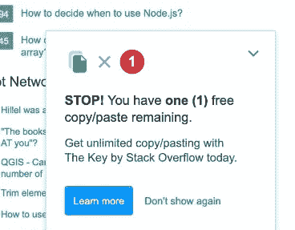
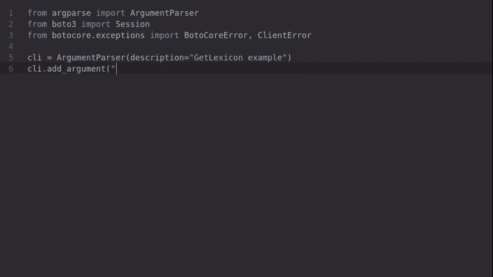

# 用人工智能助手编写高质量的代码

> 原文：<https://towardsdatascience.com/write-high-quality-code-with-an-ai-assistant-8ec3096fcbac?source=collection_archive---------26----------------------->

## 跟上潮流，提高工作效率，并遵循 Tabnine 的最佳实践

由[约书亚·阿拉贡](https://unsplash.com/@goshua13?utm_source=unsplash&utm_medium=referral&utm_content=creditCopyText)在 [Unsplash](https://unsplash.com/s/photos/code?utm_source=unsplash&utm_medium=referral&utm_content=creditCopyText) 拍摄

你开发新功能的流程是什么？例如，如何向 API 发出新的请求来检索一些关键信息？如何实例化客户端？你用什么方法发布你的 JSON 数据？它的标志是什么？你期望得到什么回报？

> 全屏显示您的 IDE，开始编写代码，并有一个助手在您的指尖为您提供基于上下文的高质量建议，这不是很好吗？

我猜你的第一个想法是查看库的文档。然后呢？也许可以试着跟随一些教程或者建立几个例子。你也可以在 StackOverflow 停下来复制粘贴，我的意思是，寻找答案，获得一些灵感。

StackOverflow 的愚人节恶作剧——作者截图

然而，这种工作流程会把你扔出那个区域，让你的工作效率降低。此外，您不会从复制粘贴的固定解决方案中学到任何新东西，同时，您会用质量可疑的代码污染您的代码库。

全屏你的 IDE，开始写代码，指尖有一个助手根据上下文给你高质量的建议不是很好吗？

让我们看看世界领先的人工智能代码完成工具如何让我们离最终目标更近一步。

> [学习率](https://www.dimpo.me/newsletter?utm_source=medium&utm_medium=article&utm_campaign=tabnine)是为那些对 AI 和 MLOps 的世界感到好奇的人准备的时事通讯。你会在每周五收到我关于最新人工智能新闻和文章的更新和想法。订阅[这里](https://www.dimpo.me/newsletter?utm_source=medium&utm_medium=article&utm_campaign=tabnine)！

# 泰伯宁

Tabnine 是世界领先的人工智能代码完成工具，可用于 30 多种语言，受到 100 多万开发人员的信任。

Tabnine —作者图片

Tabnine 的底层模型(主要是 [GPT-2](https://openai.com/blog/better-language-models/) )是在高质量的公共 GitHub 库上训练出来的。然而，如果你选择加入`team`计划(每个用户每月 24.00 美元)，你可以在你的代码库上个性化和培训他们。

</the-way-you-write-code-is-about-to-change-join-the-waiting-list-8c9e544e5de0>  

您可以利用它的预测来更快地编写代码，提高生产率，减少错误，并遵循使那些伟大的开源项目大放异彩的编码实践。

Tabnine 在 15 个 ide 上支持 30 多种语言。因此，在大多数情况下，它独立于语言和工具。为此，tabnine 为 Python、JavaScript TypeScript、Java、Ruby、PHP、Go、C++等等提供了代码完成功能。此外，它可以在 VS Code、IntelliJ、Android Studio、Atom、PyCharm、Sublime Text 和任何其他主流 IDE 或代码编辑器上使用。

因此，如果您正在用 tabnine 支持的任何语言编写代码，并且可以在您的 IDE 中安装 tabnine 扩展，那么您可以:

*   **跟上潮流:**停止在网上寻找答案，滚动文档页面，或者浏览论坛主题，让你的代码发挥作用。专注于你的工作环境，减少上下文切换。
*   **更快地编码:**拥有一个强大的开源库让你更加自信和高效。再也不需要键入整行的代码，记住特定操作的语法，并担心打字错误。
*   **发现最佳实践:** Tabnine 后端使用 GPT-2，一种可以预测序列中下一个单词的语言模型。使用高质量的 GitHub 库，对 GPT-2 进行了扩展和再利用，以涵盖代码完成的用例。因此，它为您提供了最佳的通用编码实践，因此您可以将精力集中在尚未解决的问题上。
*   保护你的隐私:你写的代码会保存在你的机器上。Tabnine 将模型下载到您的本地环境，并在您的机器上进行预测。如果你愿意，你甚至可以离线工作！

# 技术细节

正如我们已经看到的，tabnine 使用深度学习，主要是 GPT-2，来执行代码完成。GPT-2 是一个语言模型，这意味着它是在一个大型文本语料库上训练的，以预测句子中的下一个单词。

tabnine 团队通过在高质量的 GitHub repos 上训练它，重新利用它来学习常见的代码习惯用法和模式。tabnine 最强大的模型使用超过 3.8 亿个参数，并将 GPT-2 扩展到编程世界。

因此，tabnine 使用语言模型(如 GPT-2 和语义模型)的组合，根据同一文件中的所有其他内容来预测最有可能的命令。此外，tabnine 模型会定期更新，以跟上公共 GitHub 存储库和其他可靠来源中的新模式。

Tabnine 支持所有主流编程语言:Javascript、Python、Typescript、PHP、Java、C++、C、C#、Objective-C、Go、Rust、Perl、Ruby、Swift、Haskell、Scala、F#、Kotlin、Julia、Lua、SQL 和 Bash。

它还支持最常见的配置语言和 web 技术:JSON、YAML、TOML、HTML、CSS 和 Markdown。

最后，由于 tabnine 使用的模型理解英语，它提供了注释完成支持，这在其他地方是不容易找到的！

# 结论

编写代码时，上下文切换越多，效率就越低。在一个理想的场景中，您将全屏显示您的 IDE，开始编写代码，并且有一个助手在您的指尖为您提供基于上下文的高质量建议。

这个故事介绍了 tabnine，世界领先的人工智能代码完成工具，可用于 30 多种语言，受到 100 多万开发人员的信任。您可以使用 tabnine 更快地编写代码，提高生产率，减少错误，并遵循让那些伟大的开源项目大放异彩的编码实践。

首先，在 IDE 或代码编辑器中安装 tabnine，然后像往常一样开始编写代码！例如，[在这里](https://marketplace.visualstudio.com/items?itemName=TabNine.tabnine-vscode)你可以找到如何在 VS 代码上设置[标签](https://www.tabnine.com/)的说明。此外，您可以通过它的创建者之一使用 VS 代码来观看这个演练。

# 关于作者

我的名字是[迪米特里斯·波罗普洛斯](https://www.dimpo.me/?utm_source=medium&utm_medium=article&utm_campaign=tabnine)，我是一名为[阿里克托](https://www.arrikto.com/)工作的机器学习工程师。我曾为欧洲委员会、欧盟统计局、国际货币基金组织、欧洲央行、经合组织和宜家等主要客户设计和实施过人工智能和软件解决方案。

如果你有兴趣阅读更多关于机器学习、深度学习、数据科学和数据操作的帖子，请关注我的 [Medium](https://towardsdatascience.com/medium.com/@dpoulopoulos/follow) 、 [LinkedIn](https://www.linkedin.com/in/dpoulopoulos/) 或 Twitter 上的 [@james2pl](https://twitter.com/james2pl) 。请访问我的网站上的[资源](https://www.dimpo.me/resources/?utm_source=medium&utm_medium=article&utm_campaign=tabnine)页面，这里有很多好书和顶级课程，开始构建您自己的数据科学课程吧！