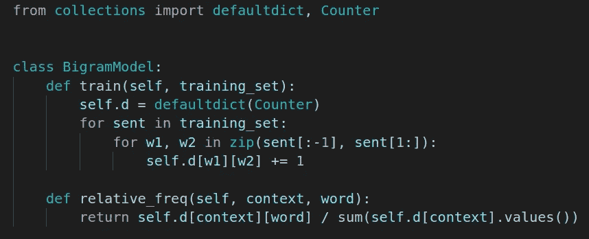

# 用 Python 集合编写超简洁的代码

> 原文：<https://towardsdatascience.com/write-ultra-concise-code-with-python-collections-ab79f03bb54?source=collection_archive---------7----------------------->



内置的 Python `collections`库是有用工具的宝库。我将把重点放在我认为最有用的两个结构上:`Counter`和`defaultdict`。理解这些数据结构将有助于你使你的代码更加简洁、易读和易于调试。

## 计数器

`Counter`对象接受一个 iterable 并将项目聚合成 iterable 中唯一值的计数。结果存储在一个类似字典的结构中，其中唯一项是键，计数是值。例如，以下代码获取单词列表并返回每个单词的计数:

```
from collections import Countertext = "apple banana orange apple apple orange"
counts = Counter(text.split())print(counts.most_common())
# [('apple', 3), ('orange', 2), ('banana', 1)]print(counts['apple'])
# 3print(counts['pear'])
# 0
```

您可以像使用普通 Python 字典一样从`Counter`中检索值。注意，`Counter`有一个非常好的特性，如果你查询一个不存在的键(比如上面的‘pear’)，它会返回 0 而不是给你一个`KeyError`。

`Counter`对象的另一个非常有用的特性是它们可以用一个简单的`+`操作符合并。这使得合并来自不同位置/文件的项目计数变得轻而易举:

这节省了大量时间和代码行。我在文本处理/NLP 任务中经常使用`Counter`，这无疑让我的生活变得更加轻松。以下是使用`Counter`的一些最终提示和技巧:

*   使用`dict()`将计数器转换成普通的 Python 字典。
*   使用不带参数的`most_common()`函数返回(item，count)元组列表，按计数降序排序。
*   使用`Counter`计算字符串中的字符数——这很有效，因为字符串在 Python 中是可迭代的。

## 默认字典

当你不想担心`KeyErrors`和特殊情况时，这是基本字典数据结构的一个很好的替代。您只需用您选择的默认值创建一个`defaultdict`,数据结构会自动将默认值分配给任何以前看不见的键。需要理解的重要一点是，`defaultdict`构造函数的参数应该是`callable`。这包括以下内容:

*   `list`:默认为空列表
*   `int`:默认为 0
*   `lambda`表情:非常灵活，可以让任何东西随时调用
*   `set`:默认为空集

这是一个非常有用的数据结构，因为它消除了在增加/修改一个条目的值之前检查它是否存在于字典中的需要。

让我们看一个实际的例子，看看什么时候我们可以使用 defaultdict 来编写真正优雅、简洁的代码。下面的代码使用`defaultdict`在 **5 行代码**中从头开始实现了一个二元语法语言模型**的训练循环**！关于 n-gram 语言模型的更多内容，你可以查看我以前写的一篇文章[这里](/generate-fake-donald-trump-tweets-using-python-8d83885fd5c6)，在这篇文章中我没有使用`defaultdict`。注意我们通过使用`defaultdict`节省的代码量！

诀窍是在上面的第 6 行嵌套使用`defaultdict`。语言模型被训练来学习单词在上下文中的概率。我们希望有一个嵌套的数据结构，其中外层键指定上下文(即在二元模型的情况下是前一个单词)，内层键指定当前单词。我们希望能够提出这样的问题:“在训练数据中，单词*后面跟着单词 *cat* 出现了多少次？*

请注意，内部的`defaultdict`实际上只是在做与`Counter`完全相同的事情，所以我们可以用下面的代码行替换上面的代码行，得到相同的结果:

```
self.d = defaultdict(Counter)
```

## 结论

谢谢你读到这里！我希望你在下一个 Python 项目中尝试使用`Counter`和`defaultdict`结构。如果你有其他好的用例，请在评论中告诉我！如果您对此感兴趣，请查看我的其他 Python 相关文章:

</python-sets-are-underrated-55fc27db2ada>  </7-essential-python-skills-for-research-496e1888e7c2> 