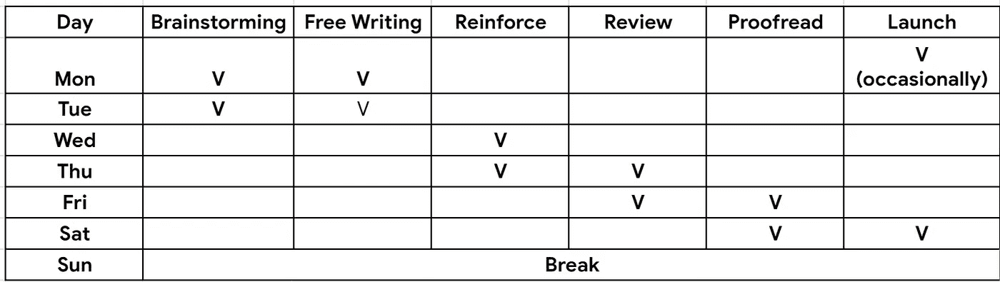
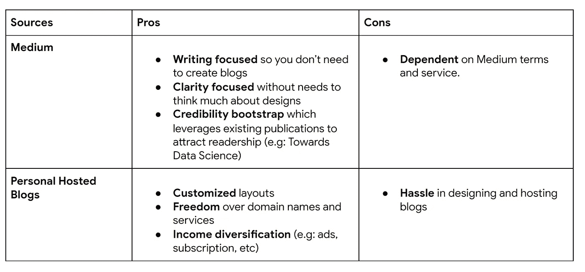

# 撰写您自己的令人惊叹的数据科学博客

> 原文：<https://towardsdatascience.com/write-your-own-amazing-data-science-blogs-8b9c19a4255d?source=collection_archive---------5----------------------->

## 给我的数据初学者的建议

## 帮助你开始旅程的 5 大技巧

源不溅

# 问题陈述

> 我对机器学习特别是深度学习感兴趣，也在谷歌工作。当你说你被谷歌采访是因为你在 Medium 上有一个博客时，也许很快我会开始我的 Medium 博客。
> 
> 如果我可以问的话，你有一些关于如何开始在媒体上写博客的建议吗？再次感谢你接受我的请求，祝你有美好的一天。
> 
> —一位富有灵感的数据科学家

2019 年，作为一个新手，开始写博客。我以前是云系统软件工程师，没有机器学习和数据科学方面的经验。但是我还是开始写博客，通过阅读和分享我的知识来学习。

写了 3 年博客后，我觉得[写作给了我被动收入、更好的沟通软技能，以及在谷歌](/the-hidden-gems-of-writing-analytics-6db78fad5a51)宝贵的职业机会。

从那以后，我也收到了大量关于如何开博客和积累专业知识的问题。

**总的来说，我想和你分享五个小技巧:**

*   **沟通**:了解你的受众
*   **交付**:教育和激励
*   节奏:调整自己的节奏
*   **共享**:识别分发内容的渠道
*   **庆祝**:产生技能、品牌、收入

# 沟通:了解你的受众

> 你的读者是你写作的关键原因。

每一个写作和交流都需要一个听众。如何从一个到另一个取决于谁是观众。

这意味着一篇有如此多方程式和公式的过于技术性的文章可能不为该领域的一些新手所接受。这就是为什么[专家会根据不同受众的专业知识水平来识别不同复杂程度的重要概念](https://www.youtube.com/watch?v=WW0IIyrq8z4)。

因此，知道你在为谁写作，并据此制定你的成功标准是至关重要的。

**一般来说，这些是你写作的关键受众:**

*   **你自己**:分享学习之旅、集思广益和未来有影响力的项目。
*   **团队成员/同事**:确定协作点、升级和系统特定影响。为同事写作的一个好例子是设计文档，它是指导你的数据项目的概念灯塔。
*   **有抱负的/专业的数据从业者**:传授相关的技巧和诀窍，以帮助有抱负的数据从业者。比如这个博客就是为了指导你写数据科学博客而创建的。

就我而言，我的数据科学博客的最大受众是 25-35 岁的年轻人，他们勇敢地迈出了涉足数据科学世界的第一步，并积累了数据科学和技术的各种专业知识。

当我 25 岁的时候，我面临着类似的问题。因此，我创建了这个博客，以帮助有类似需求的人在数据科学职业生涯中导航。

同样，你应该知道你在和谁一起建设，以及你为建设你的博客所提供的价值。

# 交付:教育和激励

> 教育为可能性铺路，而灵感推动影响

**一般来说，写作有两个目标:**

*   **教育**:分享知识，创造可能性，避免陷阱，减少时间沉淀。
*   **激发**:分享趣闻轶事和故事，煽动观众行动起来。

记住你的读者时间有限。他们来看你的文章是因为你能带给他们的价值。

例如，我给我的读者简单的指示，让他们在 10 分钟内创建一个谷歌数据工作室仪表板。在我的分析工具箱中，我展示了[代码片段，供读者快速启动他们的数据科学项目](/quick-and-dirty-data-visualization-toolbox-a2e24f201e29)。[我还创造了一个关于员工保留的数据驱动故事](/whos-quitting-today-e1b0ca2fa90f)，意在教育和激励员工。

这意味着，如果你能从你的指令(教育)中节省读者的时间，同时将行动转化为真正的结果(灵感)，你就是成功的。

# 节奏:调整自己

> 决定你想多久发送一次

决定你发布博客和文章的频率。这可以是每月一次、每两周一次、每周一次，甚至每天一次。

我见过许多新手每天和每周都发布文章，但是过一会儿就停止发布了。对我来说，我每周写一次，但由于其他生活优先事项，我经常拨回每月。重要的不是你写了多少次，而是你将如何按照一个管道或时间表去写。

**例如，我的写作管道如下:**

*   **头脑风暴**:思考对我的听众可能有用并且与我的案例相关的话题。例如，当我使用 tmux 时，我写了关于 tmux 的文章，并认为这将帮助其他人提高他们的生产力。
*   **自由写作**:我把我所知道的关于某个话题的所有观点都写下来，并把它们组织起来，没有任何事先的批评或太多的思考。主要目的是让你的思路不受任何评判地自由驰骋。
*   我进一步在我的文章中加入了更多的想法，这进一步支持了我的观点。
*   **回顾:**我让我的一两个朋友调查这件事，并给了我反馈。这帮助我发现了我的盲点并修复了它。
*   **校对:**我修正了关键的语法错误以增加可读性。
*   **启动:**我在周六或周一启动它，以便在第二天休息时完成管道。最近，我一直在周一[发布我的博客，以吸引工作日](https://www.quora.com/What-is-the-best-time-of-day-or-day-of-week-to-submit-a-post-on-Medium-To-maximize-chances-the-curator-will-accept-your-post)的读者。

我的总体写作计划(可能因繁忙程度而异)

总之，你可以创建一个写作管道，并随着你生活重心的改变而调整节奏。

就像跑马拉松一样，你不能一直冲刺，相反，你需要调整你的速度并保持你的耐力。暂时停下来关注生活中的其他优先事项是可以的。

# 共享:确定分发内容的渠道

> 决定你想如何传授你的知识。

在你喜欢的任何平台上写作。理解你写作的核心价值和目标。

由于我总是在媒体上写作，我想在这里发表一些关于写作的建议。

媒体博客和个人博客写作的利弊

在我看来，你可以从 Medium 开始快速启动，然后一旦你达到一定的势头和读者数量，就在你自己的博客上投入更多的时间。这可以让你平坦的学习曲线，开始更简单，直到你建立你的写作管道和声誉，然后再去主持你自己的网站。

# 庆祝:创造技能、品牌和收入

> 写博客如何帮助我成为一名更好的数据科学家并增加我的收入

**写作的回报是多方面的:**

*   **创造共享影响**:除了帮助他人，使用你的技能的最佳方式是什么。知识是上帝赐予我们的礼物。分享的越多，知识越丰富。你分享的越多，钱就会用完，但知识永远不会用完。事实上，它在每次分享后都会扩大。
*   建立你的技能:通过分享，你正在建立你的技能。通过教学，你正在学习超越。
*   **培养更好的个人品牌:**这为合作和职业机会铺平了道路。这就是我如何被谷歌挖走的。

**顺便说一下，你也可以创造被动收入:**我目前每月收到 500 美元的博客周刊/月刊，偶尔还有*顶级作家*的奖金。虽然不多，但是写作的收入足以让我在朝九晚五的工作之外靠写数据科学博客生活。

# 结论

希望一旦你读到这里，你知道如何开始你的旅程。如果你有进一步的想法，请在评论中告诉我。

*   **沟通**:了解你的受众
*   **交付**:教育和激励
*   节奏:调整自己的节奏
*   **共享**:识别分发内容的渠道
*   **庆祝**:产生技能、品牌、收入

# 下一步是什么

如果你想了解更多关于我的写作历程，请随时访问我的以下帖子:

 [## 写作分析的隐藏宝石

### 这是我在谷歌工作、吸引被动收入、激励数据初级人员以及更多事情的黄金入场券

towardsdatascience.com](/the-hidden-gems-of-writing-analytics-6db78fad5a51) 

还有更多对你有用的职业指导

 [## 在数据分析面试中脱颖而出的 5 大经验

### 从 Visa 和谷歌数据访谈中吸取的教训

towardsdatascience.com](/top-5-lessons-to-excel-in-data-analytics-interviews-24f5cf0605d1)  [## 数据分析很难……以下是你如何超越的方法

### 我在 Google、Visa 和 Lazada 担任数据分析师/工程师 3 年来学到了什么

towardsdatascience.com](/data-analytics-is-hard-here-how-you-can-excel-aa2a99d0fad0) 

最后，感谢 [Albert Bingei](https://medium.com/u/fcf6ad08f12d?source=post_page-----8b9c19a4255d--------------------------------) 和 [ranon sim](https://medium.com/u/3b62f7285717?source=post_page-----8b9c19a4255d--------------------------------) 快速阅读和评论本文。反馈很好！

索利·德奥·格洛丽亚

# 关于作者

文森特用 ML @ Google 对抗网络滥用。文森特使用高级数据分析、机器学习和软件工程来保护 Chrome 和 Gmail 用户。

除了在谷歌的工作，文森特还是[佐治亚理工学院计算机科学硕士校友](/5-biggest-tips-to-juggle-work-and-study-as-data-scientists-7cad143f10a)、三项全能运动员和[面向数据科学媒体的特约作家，该媒体在全球拥有 100 万以上的观众，为有志的 ML 和数据从业者提供指导](https://medium.com/@vincentkernn)。

最后，请通过 [**LinkedIn**](http://www.linkedin.com/in/vincenttatan/?source=post_page---------------------------) **，** [**Medium**](https://medium.com/@vincentkernn?source=post_page---------------------------) **或** [**Youtube 频道**](https://www.youtube.com/user/vincelance1/videos?source=post_page---------------------------) 联系文森特