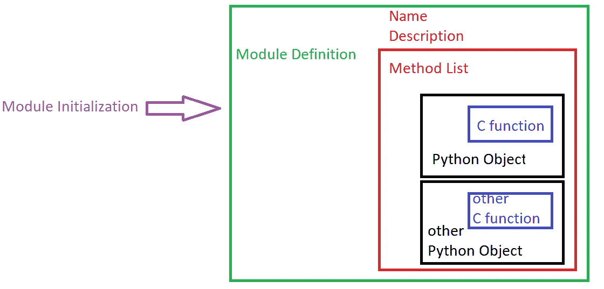

# 编写自己的 C-extension，将 Python 的速度提高 100 倍

> 原文：<https://towardsdatascience.com/write-your-own-c-extension-to-speed-up-python-x100-626bb9d166e7?source=collection_archive---------5----------------------->

## 如何编写、编译、打包和导入你自己的超高速 C 模块到 Python 中


这就像在你的卡车上安装喷气发动机一样！(图片由 [Y S](https://unsplash.com/@santonii) 在 [Unsplash](https://unsplash.com/photos/MbJpHqUOt0U) 上拍摄)

Python 是一种非常棒的语言，非常容易掌握，开发速度非常快，而且读起来非常清晰。所有这些好处都是有代价的:与其他一些语言相比，Python 相当慢。在继续弄清楚我们正在试图解决的问题之前，我强烈推荐阅读 [**这篇文章**](https://mikehuls.medium.com/why-is-python-so-slow-and-how-to-speed-it-up-485b5a84154e) 。本文的目标是回答这个问题:

> 如何在不牺牲速度的情况下，结合 Python 的易开发性？

讽刺的答案是用另一种语言重写项目，但这不是我们在这里的目的。你是一名 Python 程序员，已经有很多用 Python 编写的程序，并且只想加快其中一小部分的速度。另外:如果你习惯于用 Python 来写，转换到另一种语言如 C#或 Java 可能会很困难。

我们将结合两个世界的精华:我们用一个用 C 编写的小模块来扩展我们的程序。Python 程序员只需导入这个包，不需要知道一行 C 语言，仍然可以享受 100 倍的速度提升。


将 C 模块导入我们的 Python 程序(图片由([Kat sazo nova](https://unsplash.com/@_ks_)on[Unsplash](https://unsplash.com/photos/KlOw94HiuGc))提供)

## 用 C 写？听起来很难

”*用 C 写的！？*“我听到你问了。

"*你刚刚谈到了向 Java 的粗略过渡，现在我们要转向 C 了？！*”。的确，用 C 写代码可能有点挑战性，但是你会发现 100 倍的速度提升绝对是值得的！

此外，我们只需用 C 语言重写一小部分代码(在我们的例子中，只是一个函数)。

## 这和用另一种语言重新写项目不一样吗？

本文描述的解决方案的美妙之处在于，您只需重写代码中较慢的部分。假设我们用 Python 编写了一个 API 来接收和分析音频文件。用 C 重写分析音频文件的函数是有意义的，因为这是项目的瓶颈。我们会浪费很多时间来重写我们的 API。

## 这个不能做的简单一点吗？

是的，有更简单的方法来创建 C 扩展，这将大大加快我们的程序。在 [**这篇文章**](https://mikehuls.medium.com/getting-started-with-cython-how-to-perform-1-7-billion-calculations-per-second-in-python-b83374cfcf77) 中，我们使用 Cython 将一些类似 Python 的代码转换成 C 模块，实现了大致相同的性能提升。

然而，在这篇文章中，我们将努力用 C 编写我们自己的模块，因为它让我们对 Python 的内部工作以及它如何集成用 C 编写的模块有了一个非常有趣的了解。

## 什么时候创建 C 模块有意义？

我们能够优化的任务类型是 CPU 密集型任务，而不是等待响应之类的 I/O 任务。在“更快的语言”中，等待 API 并不会更快。

我们希望优化一小部分执行 CPU 密集型任务的代码。这类任务非常适合在 c 语言中进行优化。


让我们开始工作，加速这个项目(图片由 [Damir Kopezhanov](https://unsplash.com/@kpzhnv) 在 [Unsplash](https://unsplash.com/photos/w-bRrLmXODg) 上提供)

# 设置

首先要做的事情是:建立一个虚拟环境。这并不是绝对必要的，但是保持你的依赖关系不混乱是最好的做法。

正如你在前面读到的，我们需要一个做大量计算的函数。我们将使用一个简单的例子:计算一个范围内的素数。下面是实现这一点的普通 Python 代码。

上面的代码看起来有点乱，我听说你认为“ *WHILE LOOPS？！旗帜？！*”。相信我，他们进去是有原因的。

还要注意，这不是计算质数最有效的方法，但这不是重点:我们只需要一个需要大量计算的函数！

## 您已经在使用 C 编译的功能

代替 while 循环和标志，我们可以使用内置函数`range()`。这通过了生成、迭代，并检查我们是否完成了更快的 C 模块。让我们用`range()`升级那个讨厌的功能:

请注意，这段代码不仅可读性更好，而且速度更快。我们可以使用这两个函数来查找 0 到 100.000 之间的素数:

```
[Vanilla] examined 100000 numbers; found 9592 primes in 30.38632 sec
[V+range] examined 100000 numbers; found 9592 primes in 20.00026 sec
```

使用一些内置的 C 模块已经稍微提高了执行速度，但是我们才刚刚开始。


我们必须让我们的手有点脏，但结果将是惊人的(图片由 [Adi Goldstein](https://unsplash.com/@adigold1) 在 [Unsplash](https://unsplash.com/photos/E_8Zk_hfpcE) 上提供)

# 为 Python 编写 C 模块

我们要做的第一件事是将寻找素数的函数转换成 C 语言。然后，我们必须让 Python 与 C 语言的函数进行对话。这个问题的解决方案是将 C 函数封装在 Python 模块中。

你对这些已经很熟悉了。想想`time`、`os`和`sys`，例如，我们称我们的模块为`Fastcount`。

在这一部分的最后，我们将安装我们的模块，以便您可以导入模块并在模块上执行如下方法:

```
import Fastcount
res = Fastcount.primecounter(0, 100)
print(res) 
# 25
```

我们将分三步完成:

1.  用 C 重写求素数函数
2.  将 C 函数打包到 Python 模块中
3.  构建并安装模块

## 第一步:C 功能

如果你不熟悉 C 语言，这部分可能有点难。它很像 Python，但有更多的限制。看看这个:

除了这里或那里的一些语法，这个函数看起来很像我们在前一章写的那个讨厌的函数。

## 2.在模块中包装 C 函数

好，我们有一个用 C 写的函数和一个 Python 文件。我们如何从 Python 文件中访问 C 函数？我们必须采取一些措施:



所有元素如何组合在一起(图片由作者提供)

我们已经在上面定义了我们的 C 函数，所以让我们将 C 函数包装在一个 Python 对象和(黑色)中，并向外展开:

**2.1 将** `**C-function**` **包装成** `**Python Object**` **。** 我们来看一下代码:

记住 Python 中的一切都是对象？事实上 Python 中的一切都是一个`PyObject`。即使声明 integer 也会导致一个`PyObject`。在幕后，Python 引擎使用这种结构来支持动态类型。

在上面的代码中，我们将 C 函数包装在一个`PyObject`中。这个函数使用`PyArg_ParseTuple`函数解析 Python 发送给我们的参数。`ii`表示我们期望两个整数(更多信息[在这里](https://docs.python.org/3/c-api/arg.html))。

接下来，我们称之为 C-函数，即发现的素数。最后，在我们把它们转换成一个`PyLong`之后，我们返回找到的素数；Python 可以解释为类型的对象`long`。

**2.2 将** `**Python Object**` **增加到一个** `**list of methods**` **。下面的代码指定了我们在 Python 中调用的函数名:**

在这里，我们定义了模块拥有的所有方法的列表。

在这个例子中，我们将`primecounter`定义为函数名；这就是我们在 Python 中称之为函数的东西。然后我们引用上一步中创建`PyObject`的函数。`METH_VARAGS`定义了签名:它期望来自 Python 的`self`和`*args`。最后，我们为 docstring 定义了一个方法描述。

如果我们希望我们的模块有更多的功能，我们可以在那里添加更多的对象，但是为了这个演示的目的，我们将保持简单。这个`PyMethodDef`也需要 3 号线；包含所有`NULL`的行。

**2.3 创建** `**Module Definition**` **并在上面注册模块名称、描述和** `**list of methods**` **。** 下面是代码:

这段代码定义了我们的模块。创建`PyModuleDef`需要第一项。在第 4 行和第 5 行，我们指定了模块的名称和描述。

在第 6 行中，我们可以指定存储程序状态所需的内存量。当您的程序在多个子解释器中使用时，这是必需的。

负值表示这个模块不支持子解释器。用一个非负值指定要在每个子解释器会话上分配的模块的内存需求。

第 7 行的最后一项引用了我们在上一步中指定的方法列表。

**2.4 创建一个** `**Initialization function**` **，从** `**Module Definition**` **创建我们的模块。** 最后一块！这是 Python 第一次导入我们的模块时将调用的函数:

我们使用`PyModule_Create`并传递给它一个对前一部分的`PyModuleDef`的引用。这将返回一个包装了我们的 C 函数的`PyObject`。点击查看全部代码[。](https://gist.github.com/mike-huls/e424bfe1f6f8633fa2079c33d06823bb)

## 3.构建、安装和运行扩展

这部分类似于创建您自己的公共或私有 Python 包的过程中的步骤。我们必须创建一个`setup.py`文件，该文件指向上一步中的 C 代码，然后创建包。我们走吧:

上面的代码非常简单明了；最重要的一行是第 11 行，在这里我们指定了在哪里可以找到我们在步骤 2 中编写的 C 文件。

下一步:简单地给`python setup.py install`打电话。这将把我们所有的代码打包到一个名为 Fastcount 的模块中。现在在 Python 中，我们可以:

## **故障排除**

Windows:调用`python setup.py install`可能会得到一个类似如下的错误:

```
Microsoft Visual C++ 14.0 or greater is required. Get it with "Microsoft C++ Build Tools": [https://visualstudio.microsoft.com/visual-cpp-build-tools](https://visualstudio.microsoft.com/visual-cpp-build-tools)
```

你可以通过安装 C++构建工具来解决这个问题，你可以在这里下载。


让我们比赛算法(图片由 [Jonathan Chng](https://unsplash.com/@jon_chng) 在 [Unsplash](https://unsplash.com/photos/HgoKvtKpyHA) 上提供)

# 标杆管理

让我们测试一下我们的代码；我们想计算 0 到 500.000 之间的质数。为了做到这一点，我们需要检查大约 13 亿个数字；我可怜的笔记本有很多工作要做。我们将进行基准测试:

*   香草蟒
*   普通 Python +内置(比如 range)
*   快速计数(我们的 C 模块)
*   快速计数 MP

在多次执行所有方法并花费最少的时间后，结果就出来了。所有方法都找到了正确的素数(41.538)，这是它们花费的时间(越少越好):


查找一个范围内素数的所有方法的执行时间(越低越好，图片由作者提供)

使用像`range()`这样的内置函数已经节省了大约 35%的完成时间。尽管这是一个相当不错的增加，但我们自己的模块几乎比普通 Python 完成了这个任务。

为了获得更快的速度，我们通过多重处理我们的函数将所有计算分散到多个 CPU 上，与普通 Python 相比，这个函数完成了我们的计算。查看 [**这篇文章**](https://mikehuls.medium.com/multi-tasking-in-python-speed-up-your-program-10x-by-executing-things-simultaneously-4b4fc7ee71e) 或 [**这篇文章**](https://mikehuls.medium.com/advanced-multi-tasking-in-python-applying-and-benchmarking-threadpools-and-processpools-90452e0f7d40) 了解更多关于使用线程和进程在 Python 中安全执行多任务的信息。

# 结论

这是一篇很长很复杂的文章，但是我们学到了很多关于 Python 如何在幕后工作的知识。我们已经编写、编译、打包并导入了我们自己的定制 C 模块。尽管这篇文章相当长，但最终，我们将执行速度从 10 分钟以上降低到了近 6 秒:减少了 99%的执行时间！

如果你有建议/澄清，请评论，以便我可以改进这篇文章。同时，看看我的其他关于各种编程相关主题的文章:

*   [Python 为什么这么慢，如何加速](https://mikehuls.medium.com/why-is-python-so-slow-and-how-to-speed-it-up-485b5a84154e)
*   【Cython 入门:如何在 Python 中执行>每秒 17 亿次计算
*   [Python 中的多任务处理:通过同时执行，将程序速度提高 10 倍](https://mikehuls.medium.com/multi-tasking-in-python-speed-up-your-program-10x-by-executing-things-simultaneously-4b4fc7ee71e)
*   [Python 中的高级多任务处理:应用线程池和进程池并进行基准测试](https://mikehuls.medium.com/advanced-multi-tasking-in-python-applying-and-benchmarking-threadpools-and-processpools-90452e0f7d40)
*   [用 FastAPI 用 5 行代码创建一个快速自动归档、可维护且易于使用的 Python API](https://mikehuls.medium.com/create-a-fast-auto-documented-maintainable-and-easy-to-use-python-api-in-5-lines-of-code-with-4e574c00f70e)
*   [创建并发布你自己的 Python 包](https://mikehuls.medium.com/create-and-publish-your-own-python-package-ea45bee41cdc)
*   [创建您的定制私有 Python 包，您可以从您的 Git 库 PIP 安装该包](https://mikehuls.medium.com/create-your-custom-python-package-that-you-can-pip-install-from-your-git-repository-f90465867893)
*   [绝对初学者的虚拟环境——什么是虚拟环境，如何创建虚拟环境(+示例)](https://mikehuls.medium.com/virtual-environments-for-absolute-beginners-what-is-it-and-how-to-create-one-examples-a48da8982d4b)
*   [通过简单的升级大大提高您的数据库插入速度](https://mikehuls.medium.com/dramatically-improve-your-database-inserts-with-a-simple-upgrade-6dfa672f1424)

编码快乐！

—迈克

页（page 的缩写）学生:比如我正在做的事情？[跟我来！](https://mikehuls.medium.com/membership)