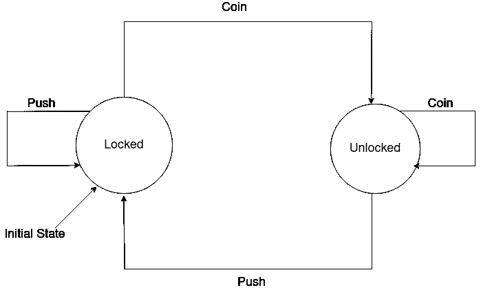

# 在 Go 中编写有限状态机

> 原文：<https://towardsdatascience.com/writing-a-finite-state-machine-in-go-e5535e89d615?source=collection_archive---------8----------------------->



作者图片

经过漫长的时间，我带着一篇新的博文回来了。抱歉，无线电中断了。我的生活中有太多的事情要做，尽管我在此期间做了一些非常酷的事情(例如使用一些传统的 ML 和图像处理技术在特定领域以很大的优势击败了所谓的艺术级深度学习算法)，但我没有时间写任何东西。

我最近在工作中从事一个非常有趣的项目，涉及机器学习、代码翻译和其他一些很酷的东西。项目的一部分正在用 Go 开发，一部分在用 Python 开发。多亏了它，几年后我有机会回去写一些 Go 代码。

我希望拥有的东西之一是一个**有限状态机**。


作者图片

直观地说，有限状态机(从现在开始是 FSM)只是一个有向图，其中每个节点代表一个状态，从一个状态(节点)你可以访问另一个节点(状态),主要基于两件事

*   这两个节点之间必须有一条边(如果你愿意，可以用箭头表示)(这条边实际上是显而易见的，但最好还是明确表示出来)
*   每条边代表某种动作/规则，当你处于一个状态时，只要你接收到的输入(我们称之为事件)与连接这两个状态的规则相匹配，你就可以进入任何其他连接的状态。

简单来说，请看一下我用作文章顶部图像的状态机。为了简单起见，我再次把它放在这里。


作者图片

在这里，您从`locked`状态开始。这通常被称为初始状态。在那里，您有两个可用的操作。一个是**投币**，另一个是**推**。现在，如您在图像中所见，如果操作是投币，那么您将状态更改为**未锁定**。但是如果动作是推，那么你又回到相同的状态，即锁定。

FSM 是计算的数学模型。这意味着你可以用有限状态机来表达大量的计算任务。它不如图灵机(另一种计算模型)或下推自动机强大，但已经相当强大了。


作者图片

是的，好的！:)我要展示代码了。

在我开始之前，我只想声明，我的代码有一个外部依赖，`gonum/graph`你可以在这里看到完整的文档[。](https://pkg.go.dev/gonum.org/v1/gonum@v0.9.3/graph)

此外，我必须提到，已经有一些很好的 FSM 实现。比如来自 [looplab](https://github.com/looplab/fsm) 的那个。但我想推出自己的产品，以提高灵活性和学习性。

让我们从进口开始。

这个相当简单。让我们继续看第一个街区。我们在这里定义了 FSM 的主干。这意味着我们将定义一个简单的节点(状态)和边(链接)结构。

在 gonum 中，只要实现了`ID`函数，你就可以让任何结构成为一个节点。此外，我们将使用有向多图。对于这种类型的图，gonum 称边为线。所以我们也定义了我们的生产线。

我们的节点结构有一个值字段，它是一个`interface`，这意味着它可以包含许多不同类型的值。

我们的 Link struct 有一个 Rules 字段，它是从一个`Operator`到一个`Event`的映射，这两个是定制的数据类型。我很快会给他们看的。但是为了不让你感到困惑，我现在要告诉你，他们只是`string`类型。

现在让我们定义一下`StateMachine`

这很简单。

现在，我们将继续定义一些重要的函数。第一个是创建新的状态机。

做完这些，我们还需要几个。让我们定义一个函数来初始化 FSM，一个函数向它添加更多的状态，另一个函数用一个链接来链接两个状态(它也包含需要满足的规则，以便可以遍历它。)

很简单。我们还将创建一个函数来创建一个新规则。

这些都很重要，然而，它们在某种意义上可以被称为`boiler-plate`。现在，我们将定义 FSM 的核心。我们将定义一个名为`FireEvent`的函数，它将触发一个事件，并基于触发的事件、FSM 所在的当前状态以及从该状态发出的链接，它将调用是否应该将状态更改为新的状态。

因此，在这个函数的开始，我们得到了 FSM 当前所处的状态。一旦我们获得了它，我们就获得了一个迭代器，用于所有连接到它的状态(因此有了`From`函数调用)。一旦我们得到迭代器，我们迭代所有这些节点。

对于那里的每个状态，在输出意义上连接到`PresentNode` ，我们获得连接它们两者的链接。

我们获取该链接的规则，并将规则的值与事件的值进行比较。

举个例子，假设一个链接`l`有这个规则`eq:coin`，当前事件是`coin.`，这意味着状态接收到的事件等同于该规则。这意味着我们可以把这个链接，移动到这个链接结束的状态。

在这里，我想花一点时间来解释为什么我引入了一个叫做`Operator.`的东西。我的想法很简单。我们将有一组预定义的操作符，如`eq`、`neq`、`gt`、`lt`、`gte`、`lte`等。许多人可能对它们很熟悉。他们=，！=，>，<。≥，≤分别为。通过在我们的状态机中引入这个概念，它可以表达的规则变得非常大。所以我们可以用这个来模拟大量的过程。(我的秘密野心是引入概率算子，把 FSM 变成非确定性 FSM:)。当然，出于演示和本文的目的，我只展示了一个操作符:`eq`

在这个阶段，我们基本上完成了。然而，我将定义一个名为`Compute`的小函数，它获取一部分事件，并计算 FSM 在事件链末端的位置。

我们完了！😅

虽然看起来很多，实际上我们到目前为止写的代码非常简单易懂。它也非常简洁。

现在是时候让状态机转一转了。

当我们运行这段代码时，结果如下

```
$ go run main.go                                                                                                                                                                                     ✔ 
Initial state is ------- locked
unlocked
locked
------------ Final state is locked
```

这正是我们所期望的！

这种实现的一些优点如下

*   状态值可以是任何值。
*   规则可以是任何东西，只要它涉及支持的操作符
*   我们实际上可以从任何地方读取一系列事件，用户提示，网络流量，csv 文件…你能想到的。
*   高度可扩展和可定制(没有 main，代码少于 150 行)
*   它依赖于一个非常健壮的库`gonum`，这个库带来了强大的功能和可靠性。

这就是所有的人。如果你喜欢这篇文章，请鼓掌分享。给了我以后写其他文章的灵感。你也可以在 [Linkedin](https://www.linkedin.com/in/shubhadeep-roychowdhury/) 和我联系。

和往常一样，该代码是开源的，可以以您想要的任何方式使用。完整的代码可以在这个 github 链接找到—[https://gist . github . com/rcshubhadeep/1606 c 7 F3 ee 4606 EDB 194 a 30 c 04811 bb 2](https://gist.github.com/rcshubhadeep/1606c7f3ee4606edb194a30c04811bb2)

希望你喜欢这篇文章，并希望很快再次见到你。