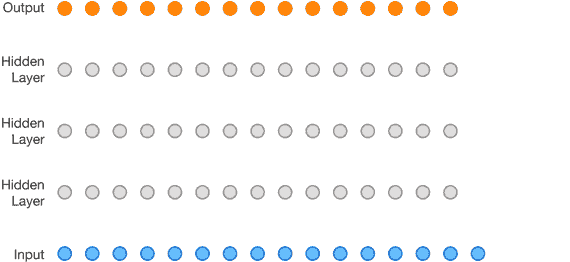

# 用深度学习写音乐专辑

> 原文：<https://towardsdatascience.com/writing-a-music-album-with-deep-learning-4ee3bd2e9b05?source=collection_archive---------19----------------------->

## [实践教程](https://towardsdatascience.com/tagged/hands-on-tutorials)

## 我使用深度学习生成架构创建了一个环境音乐 EP

[斯蒂夫·约翰森](https://unsplash.com/@steve_j?utm_source=unsplash&utm_medium=referral&utm_content=creditCopyText)在 [Unsplash](https://unsplash.com/s/photos/fender-rhodes-piano?utm_source=unsplash&utm_medium=referral&utm_content=creditCopyText) 上拍照

我一直相信音乐和技术领域允许一个对双方都有利的反馈生态系统。一方面，技术为音乐家提供了新的声音，与他们的作品互动的界面，他们以前没有探索过的作曲方式。另一方面，由这些新技术创造的音乐本身，激发人类的思维创造新的工具，以便与这些新的创作互动。

在我的声音和音乐计算硕士课程中，我有机会了解和探索各种用于音乐生成的深度学习架构。从可变的自动编码器，它在符号表示的音乐生成的频谱中操作，到在波形表示上操作的更复杂的系统。

有机会探索这些网络，用我收集的音频从头开始训练它们，并能够创作新的音乐，这让我非常兴奋。这是因为，作为一名作曲家、音乐制作人，同时也是一名软件工程师，我开启了无尽的表达可能性，这在限制我的创造力的同时也推动了我的创造力。

因此，在这篇文章中，我打算分享和反思我在计算机音乐创作课程的期末项目开发过程中的创作过程。

# 探索深度学习架构

在项目开始时，我不太清楚自己想做什么。最终项目的规格主要由我们决定，但他们必须至少利用一些在课堂上学到的不同技术和资源。这些可以是:为效果创建界面；音乐效果的创造；为音乐生成训练某种算法或深度学习架构；将已编译的工具用于创作目的；通过与 Python 的交互在 PureData 中创建补丁；在许多其他选项中。

由于这项任务的自由性质，在第一个例子中，我让自己完全被我的好奇心所驱使。我想知道那里有什么。有一点对我来说很清楚:我想探索算法和深度学习架构，以产生独特的音乐、声音和纹理。所以，我遇到的第一个架构是 [WaveNet](https://arxiv.org/pdf/1609.03499.pdf) 。

Wavenet 是一种生成波形架构，主要通过卷积神经网络工作。它是由总部位于伦敦的人工智能公司 DeepMind 在 2016 年创建的。WaveNet 能够通过使用直接在波形域上操作的卷积滤波器来逐个样本地生成音频样本。

从波网中存在的卷积层生成新样本。摘自 A. et .范登欧德。艾尔。:WaveNet:原始音频的生成模型。2016.在 https://arxiv.org/pdf/1609.03499.pdf[有售](https://arxiv.org/pdf/1609.03499.pdf)

WaveNet 主要用于语音合成和文本到语音的任务。这就是为什么你能找到的大多数开源实现都是基于对 [VCTK 数据集](https://datashare.ed.ac.uk/handle/10283/3443)或类似数据集的训练。VCTK 数据集是一组说英语的人的录音。110 名操不同口音的英语者在一个消声室中背诵不同的短语。

我尝试了一些 WaveNet 实现，但是给我最好结果的是这个。我的第一个实验是训练它“唱歌”。带着这个目标，我使用了 [MUSDB18 数据集](https://sigsep.github.io/datasets/musdb.html)中的声带。MUSDB18 是专门用于源分离任务的数据集。它由 144 首专业制作的歌曲组成，其中的音轨被简化为 4 个混合音轨:人声、鼓声、低音、其他(其他一切)+最终的混合音轨。在这些音轨上训练了 wavenet 之后，我得到了第一个生成的样本:

MUSDB18 数据集中 vocals 文件经过 200，000 个时期后的 Wavenet 实施示例。

正如我们所听到的，WaveNet 能够学习一些非常有特色的声音元素，比如一些辅音。最突出的是“s”音，可以在曲目的后半段听到。

老实说，对于第一次尝试，我对生成的音轨不是很满意，因为它不可能欣赏演唱的人声的音高或其他音乐特征。出于这个原因，我继续寻找可以用于音乐生成的深度学习架构的其他实现。这就是我如何遇到[Google Magenta](https://magenta.tensorflow.org/):*一个开源研究项目，探索机器学习作为一种工具在创作过程中的作用。*

那一刻，我觉得自己就像一个在玩新玩具的孩子。Magenta 有大约 20 个基于深度学习的最先进的模型，可用于各种音乐目的；鼓的人性化；钢琴声部的产生；旋律的延续；以旋律为条件的和弦伴奏；基于变分自动编码器的测度间插值:除其他外。除此之外，它还有其他模型来执行任务，如图像风格化和生成矢量化的类似草图的绘图。它为创作者开启了无限可能！

> 在 Ableton 中，一些用于音乐创作的 Magenta 模型被实现为独立的应用程序和 Max for Live 补丁。我强烈推荐[下载并探索它们](https://magenta.tensorflow.org/studio/)。

最引起我注意的两款是 [PerformanceRNN](https://magenta.tensorflow.org/performance-rnn) 和 [Piano Transformer](https://magenta.tensorflow.org/piano-transformer) 。第一个是基于 LSTM 的递归神经网络，旨在通过一系列 MIDI 事件(具有学习的开始、持续时间、速度和音高)来模拟具有表现力的时序和动态的复调音乐。另一方面，钢琴转换器是一种自回归模型，能够生成学习长期结构的富有表现力的钢琴演奏。钢琴变形金刚由 YouTube 用户直接上传的大约 10.000 小时的钢琴演奏进行训练，并使用谷歌的 [Wave2Midi2Wave](https://magenta.tensorflow.org/maestro-wave2midi2wave) 转换为 MIDI。遗憾的是，与 PerformanceRNN 不同的是，Piano Transformer 模型还没有向社区发布，我们只能在这个 [Colab 笔记本](https://colab.research.google.com/notebooks/magenta/piano_transformer/piano_transformer.ipynb)中使用预先训练好的模型。

> 如果你也想尝试一下性能 RNN，Magenta 团队已经发布了一个 [Colab 笔记本](https://colab.research.google.com/notebooks/magenta/performance_rnn/performance_rnn.ipynb)，你可以在[雅马哈电子钢琴比赛数据集](https://www.piano-e-competition.com/)上与预先训练的模型一起玩:大约 1400 场专业钢琴家的 MIDI 表演。

# 动机

在尝试了 WaveNet、PerformanceRNN 和 Piano Transformer 之后，我准备开始创作音乐了。通过我所做的实验，特别是 PerformanceRNN，我确信我想要*保留机器的声音*。我的意思是，不管一个或另一个模型是用什么数据集训练的，当生成一个样本时，你会得到一个独特的作品，它的作者是分散的。一方面，我们有所有的艺术家，他们是训练网络的数据集的一部分。我们还让所有的研究人员和开发人员参与架构和模型的实现。最后，作为这个复杂系统的用户，我要对训练集、生成样本的持续时间以及一段音乐的后续安排和创作做出决定。

我做这个练习的目的纯粹是出于好奇。这是一个探索性的过程，让我能够聆听这个跨学科团队创作的织体和作品，这个团队不同意合作，但仍然发生了。这样，我想通过 EP 的创作来探索这些新形式的音乐创作给我们提供的不同空间。当一个人获得从未听过的纹理和构图时，创造力就会爆发，但与此同时，这与一种伦理冲突，这种伦理建议对“编曲者”或我的空间采取某些限制，我是一个决策者，决定哪些东西不动，以保留系统中所有演员的声音，哪些东西要修改。

这样，我挑战自己创作了 3 首歌。这张 EP 将带听众踏上一段旅程，关于我自己的创造力的限制，为了网络的创造力和它背后的所有人的创造力。

# 第一首:萨蒂诺

在与声音艺术家 Nico Rosenberg 谈论这些技术时，他建议去看看布赖恩·伊诺和埃里克·萨蒂的作品。布赖恩·伊诺被认为是环境音乐之父之一。另一方面，埃里克·萨蒂是二十世纪的作曲家和钢琴家。他称他的流派为家具音乐，因为他创作音乐不是为了坐下来听，而是为了“装饰”空间。

> 埃里克·萨蒂甚至要求他的音乐会上的观众互相交谈，以强调他的音乐的家具功能。

通过增加历元数训练的性能 RNN 网络示例。最后一个是一个非常过分的版本。

我汇编了一套埃里克·萨蒂作品的 MIDI 转录集来训练演奏者。大约过了 16000 个纪元，网络学会了高表现力地弹琴。有时，也许是因为我训练这个系统的作品数量很少，可以听到《裸地 1 号》中一些可辨认的部分。由于这个原因，我对温度参数进行了调整，以使网络在生成时有一定的自由度。

我最终选择了一首由系统生成的特别有感情的曲子，并决定将它作为第一首歌的主旋律。

为 PerformanceRNN 生成的第一首曲目选择样本 RNN

钢琴曲目很棒，但不足以创作一首歌。我的意图是能够将 PerformanceRNN 生成的旋律与直接生成波形的网络生成的其他一些音频样本混合在一起。这就是为什么我回到 WaveNet，但这次我用了近 2 个小时的布赖恩·伊诺音乐来训练它。我用了专辑《机场音乐》( T1)和《T2 》( Ascent)一个 1 小时的加长版结尾。

> 两张专辑都是从 YouTube 上获得的，数据集被用*分割成 16 秒长的小块。/download-from-youtube.sh* 由 SampleRNN 提供的脚本由 Deepsound 实现:[https://github.com/deepsound-project/samplernn-pytorch](https://github.com/deepsound-project/samplernn-pytorch)

123，000 个纪元后，结果令人惊讶:

为 WaveNet 生成的第一个音轨选择样本

有了 WaveNet 生成的这个环境音频文件和 PerformanceRNN 生成的钢琴音轨，我去了 Ableton 开始创作第一首歌。

我想限制我作为编曲者的角色。通过这种方式，做出的决定试图尽可能地保持 WaveNet 和 PerformanceRNN 生成的样本不变。总之，在这两个音频上制作音轨的主要安排是:

*   从 WaveNet 产生的音频中剔除不和谐的和弦。
*   使用 Ableton 的音阶对象，使得由 PerformanceRNN 生成的 MIDI 钢琴旋律所演奏的所有音符都处于由 WaveNet: D 大调生成的旋律的相同主调中。
*   我复制了钢琴旋律的最低音符，为歌曲的某些部分生成了大提琴伴奏。
*   我复制了一些钢琴旋律中比较有特色的音符来创作编钟。
*   wavenet 生成的音频是复制的。第一个副本保持不变，我把它一直摇到最左边。第二个副本被分成两半，并颠倒了两个片段，因此后半部分在开头，前半部分在结尾，平移到右边。这个音轨是基本的环境声音。
*   我再次复制了环境轨道，并将音高上移了一个音阶，以获得高音信息(WaveNet 在 16kHz 采样，因此在 8kHz 上没有信息)。
*   为主旋律达到恒定节拍的部分增加了鼓轨。
*   添加了一个声码器轨道，带有钢琴旋律的低音和弦和 WaveNet 生成的环境。
*   在歌曲的两个特定部分添加了电吉他。

# 第二轨道:响应

对于第二首歌，我的意图是我作为编曲者的决定将比第一首歌少得多，但同时应该有一个连贯的故事和声音设计。因此，我使用 Piano Transformer 模型来生成第一首歌曲中使用的钢琴音轨的延续。我认为这特别有趣，因为这意味着两种不同架构的交互，因此是原始的变体，但现在采用雅马哈数据集作为合成风格。

结果也很显著，但与萨蒂训练有素的演奏样本不同，这首曲子没有容易识别的节拍，这使它成为一首更具氛围的钢琴独奏作品的理想选择。

然而，对于这首曲子，我不想抛开布赖恩·伊诺的影响，所以我从 WaveNet 上取了另一个样本，但这次我对它进行了数量减少的时期训练，以使这首曲子更具原始气息。生成的音频比第一首歌曲中使用的音频具有更恒定的音高。然而，人们可以清楚地听到信号的失真，因为如果你不给 WaveNet 一个预先的种子，音频是从白噪声中雕刻出来的。我认为音频中的爆音和滴答声给了这首歌一种复古的黑胶风格，并给这首歌增添了许多特色。

对于这件作品，我的干预更加有限:

*   我没有接触 WaveNet 生成的音频，我只是复制了它，以创建与上一首曲目相同的立体声图像。
*   我再次在钢琴变形器生成的钢琴曲上使用了 Ableton 的音阶对象，这次使用的是大调。
*   我复制并颠倒了钢琴音轨。加了很多混响又反转了一遍。这创造了一个非常梦幻的声音设计。
*   大提琴的旋律来自钢琴轨道的最低音符，做了一些调整以避免不和谐。
*   加了一些铃铛来强调一些音符。

# 最后一首歌:罗德斯不喜欢流行音乐

对于最后一首歌，我想尽可能少地介入。在这里，我想尝试一些不同于 Satie + Eno 的东西。我想要一个 100%在波形域中生成的音频，这将允许我探索新的声音设计。在我的探索中，我试图训练 SampleRNN 的两种不同实现: [1](https://github.com/deepsound-project/samplernn-pytorch) 和 [2](https://github.com/Unisound/SampleRNN) 。除了损坏我耳机的音频爆音外，他们都没有给我结果。存储库已经很多年没有维护了，我找不到一个能够给出我期望的结果的分支。

我还尝试了 OpenAI 的点唱机。我找到了一个 [Colab](https://colab.research.google.com/github/openai/jukebox/blob/master/jukebox/Interacting_with_Jukebox.ipynb) 笔记本来测试从自动点唱机中按照流派、艺术家和歌词进行的采样。结果令人惊讶:

然而，我想自己训练网络，用我觉得有趣的音乐和片段。所以最后我回到 WaveNet，在平行的两个网络中训练。第一个用了[大约 10 个小时的 DubStep 音乐](https://www.youtube.com/watch?v=AvxBRHM9U9k)。

WaveNet 训练了超过 10 个小时的 DubStep，共 131350 步。

WaveNet 训练了超过 10 个小时的 DubStep，共 519900 步。

有趣的是，WaveNet 是如何设法学习小军鼓和鼓鼓的声音，以及这种特殊音乐类型中属于中断的许多噪音的。然而，结果是迄今为止从概念上从其他两个轨道，我决定不与此样本工作。

WaveNet 在 6 小时的史诗音乐上训练了超过 999999 步。

第二次尝试是使用 [6 小时的“史诗”音乐](https://www.youtube.com/watch?v=yR2ElHDhPVo)。这个结果让我很沮丧，因为我以为人声、管弦乐或弦乐会占据更大的优势。然而，这最后两个实验让我意识到，当数据集的音色特征在文件之间相似时，至少这种 WaveNet 实现学习得更好。这就是为什么有 WaveNet 实现，如 [WaveNet Tacotron2](https://github.com/Rayhane-mamah/Tacotron-2) ，它允许根据 VCTK 数据集中的说话者 ID 进行文本到语音合成。换句话说，为了获得更好的结果，训练网络的音频段必须共享声学特征。

这就是我最后一次尝试的过程。在这方面训练网络:

小笠原郁美在她的罗德斯演奏流行歌曲。

在我看来，用罗兹的表演来训练 WaveNet，这是第一首歌的主要元素，加上小笠原郁美对著名流行歌曲的出色诠释，可以取得良好的效果。不过， *WaveNet 好像不喜欢 Pop* ，更喜欢具象的音乐。对于这最后一个轨道，唯一的安排是降低主要有噪声的部分的增益。

# 结果

所有的音轨都是我混音的，所以混音过程的一部分包括了诸如压缩器、均衡器、延迟、混响和一些自动化的效果。最终专辑可以在下面听到。

罗兹不喜欢流行音乐。EP。

# 奖金

此外，只是为了好玩，我用梦剧场的歌曲数据集来训练 PerformanceRNN。这种过度拟合的模型创造了一些众所周知的作品的变化，如《泪之小径》和《迷失不能忘记》的介绍。