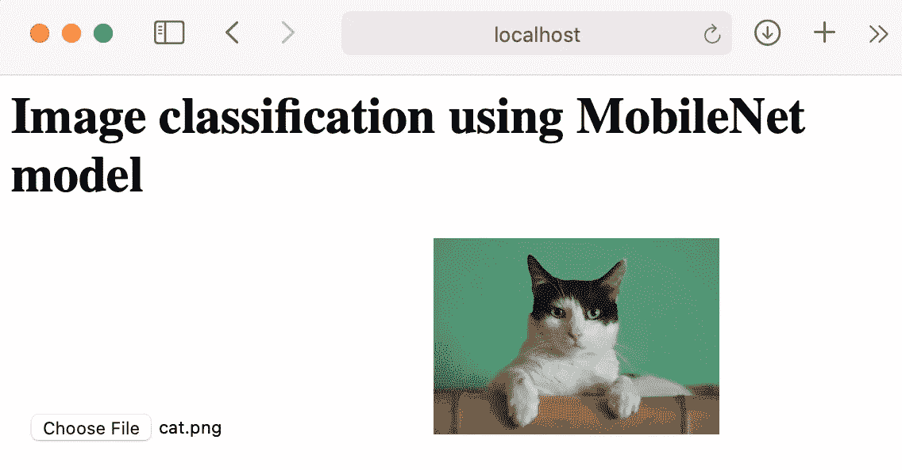
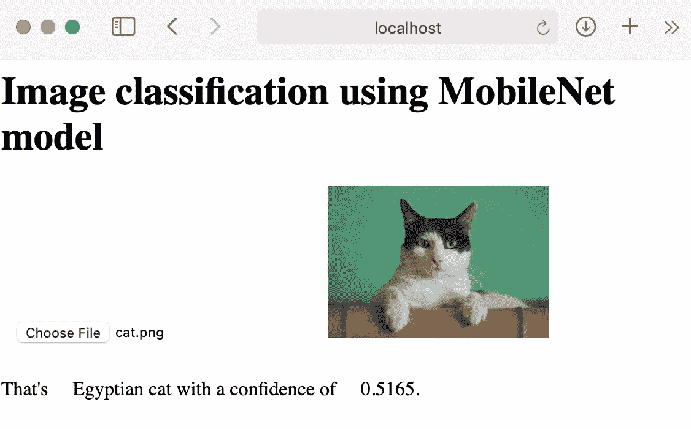

# 用 HTML 和 ML5.js 为初学者编写一个图像分类程序

> 原文：<https://towardsdatascience.com/writing-an-image-classification-program-for-beginners-using-html-and-ml5-js-13c8dc000aed?source=collection_archive---------22----------------------->

## 数据科学家

## HTML、Javascript 和库


照片由 [Manja Vitolic](https://unsplash.com/@madhatterzone?utm_source=medium&utm_medium=referral) 在 [Unsplash](https://unsplash.com?utm_source=medium&utm_medium=referral) 上拍摄

如你所知，机器学习有潜力影响每个行业。今天，我将指导您使用 ml5.js 和 p5.js 在浏览器中编写第一个机器学习程序。它使您能够使用 TensorFlow.js 迈出第一步。

# 你需要知道的是

以下所有知识都是新手级别所需要的。

*   超文本标记语言
*   半铸钢ˌ钢性铸铁(Cast Semi-Steel)
*   Java Script 语言

# 这个程序怎么运行？

您可以通过点击`index.html` 文件或使用下面的`Python`命令来运行该程序。

```
python3 -m http.server 8081
```

在浏览器 URL 中，键入以下内容。

```
localhost:8081
```

# 编写一个图像分类程序

首先我写一个静态的 HTML 页面，有基本的内容。

*   *index.html*

```
<!-- There are not any stylesheets and scripts here --><html>
<head>
</script>
    <meta charset="UTF-8">
    <title>Image Classification program for Beginners</title>
</head>
<body>
...
</body>
</html>
```

然后，我需要上传一个稍后将被分类的图像并显示它。因此，我添加了一个上传按钮和 180x180 大小的占位符图像。

*   *index.html*

```
<html>
<head>
...
<head><body>
    <input type='file' id='getval'/>
    
</body>
</html>
```

接下来，我编写一个脚本来获取上传的图像并显示它。

*   *myscript.js*

```
const image = document.getElementById('image');
document.getElementById('getval').addEventListener('change', readURL, true);

function readURL() {
    var file = document.getElementById("getval").files[0];
    if (file) {
        var reader = new FileReader();
        reader.onload = function (e) {
            image
                .src = e.target.result;
        };
        reader.readAsDataURL(file);
    }
}
```

然后，我在 HTML 页面的 body 标签中加入了`myscript.js`。

```
<body>
...
     <script src="myscript.js"></script>
...
</body>
```

试图测试我的程序。它运行良好。



然后，我将使用 ML5.js 库对我的图像进行分类。

## ml5.js 库是什么？

`ml5.js`图书馆创建于纽约大学，2018 年 7 月公开发布。它可以访问程序中的人工智能方法和模型，在`TensorFlow.js`上扩展，没有其他外部依赖性。

*   我将`ml5.js`库添加到 HTML 页面中。

```
<head>
    <script src="https://unpkg.com/ml5@latest/dist/ml5.min.js"></script>
</head>
```

*   我更新了`myscript.js`文件来处理上传的图片。

```
const result = document.getElementById('result');
const probability = document.getElementById('probability');
ml5.imageClassifier('MobileNet')

    .then(classifier => classifier.classify(image))

    .then(results => {

        result.innerText = results[0].label;

        probability.innerText = results[0].confidence.toFixed(4);

    });
```

*   显示了分类器算法的结果。

```
<!-- There are not any stylesheets and scripts here. -->
<html>
<head>
    <script src="https://unpkg.com/ml5@latest/dist/ml5.min.js"></script>
    <link rel="stylesheet" href="mystyle.css">
    <meta charset="UTF-8">
    <title>Image Classification program for Beginners</title>
</head>

<body>
    <!-- <h1>Image classification using MobileNet model</h1> -->
    <p>That's
            <span id="result">... </span> with a confidence of
            <span id="probability">...</span>.
    </p>

</body>
```

最后，我用一个 CSS 文件来设计我的程序。

*   *mystyle.css*

```
img{
    max-width:180px;
}

input[type=file]{
      padding:10px;
      background:#ffffff;
}
```

这是最终的结果。



# 结论

在这篇文章中，你学习了如何使用`ml5.js`来在浏览器上构建和部署一个简单的机器学习应用程序。这个新的和改进的库已经在许多应用案例中证明了自己的有效性。

很简单，对吧？

# 参考

[1][https://ml5js.org](https://ml5js.org)

[2][https://github . com/house cricket/Beginning-Machine-Learning-in-the-Browser/tree/master/Image-class ification-using-MobileNet-model](https://github.com/housecricket/Beginning-Machine-Learning-in-the-Browser/tree/master/Image-classification-using-MobileNet-model)