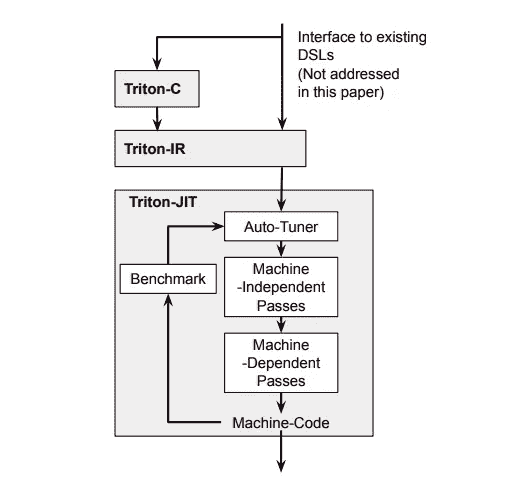
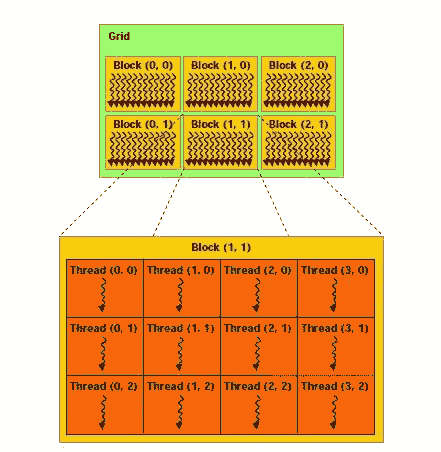
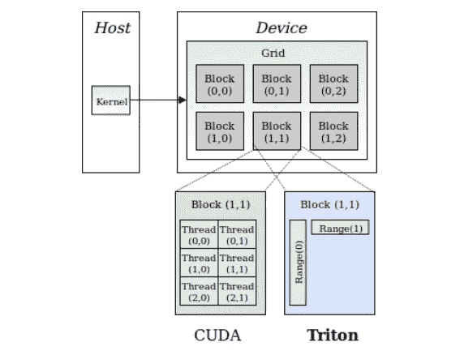

# 用 Triton 编写自定义 CUDA 内核

> 原文：<https://towardsdatascience.com/writing-custom-cuda-kernels-with-triton-abf6b6ad1168?source=collection_archive---------26----------------------->

## 探索 Triton 的实时(JIT)编译器和代码生成后端

随着深度学习的成功和研究论文的爆炸，我们经常会发现自己处于这样一种情况:我们提出了一个新想法，但却发现它没有经过硬件加速。更具体地说，当我们提出一个新的激活函数或自我关注机制，并且必须依赖 PyTorch/Tensorflow 提供的功能来处理模块的向前和向后传递时。

PyTorch JIT 是这些情况下的一种选择。但是 PyTorch JIT 是一个高级编译器，只能优化部分代码，不能用来写自定义 CUDA 内核。

写 CUDA 内核还有一个问题。这很难做到。针对局部性和并行性优化计算非常耗时且容易出错，通常需要花费大量时间学习如何编写 CUDA 代码的专家。此外，GPU 架构正在快速发展，如最新版本的张量核心，这意味着编写代码以利用硬件的最大性能是一个更大的挑战。

这就是 OpenAI [Triton](https://github.com/openai/triton) 的用武之地。Triton 有三个主要组成部分



图 Triton 主要组件概述。[来源](http://www.eecs.harvard.edu/~htk/publication/2019-mapl-tillet-kung-cox.pdf)(经许可)

1.  Triton-C:一种类似 C 的语言，主要面向已经熟悉 CUDA 的程序员。
2.  Triton-IR:一种基于 LLVM 的中间表示(IR)。Triton-IR 程序直接从 Triton-C 构建而来。简而言之，LLVM 提供了许多特定于硬件的优化，这意味着我们可以直接使用 Nvidia 的 CUDA 编译器(NVCC)来优化我们特定于特定硬件的代码。
3.  Triton-JIT:一个实时(JIT)编译器和代码生成后端，用于将 Triton-IR 程序编译成高效的 LLVM 位代码。这还包括许多独立于机器的优化，这意味着我们的工作量减少了。

对我来说，Triton-JIT 是 Triton 项目中最令人兴奋的部分。它允许几乎没有 CUDA 编程经验的程序员用 Python 编写高度优化的 CUDA 内核。在讨论 Triton 之前，我们需要了解 CUDA 程序是如何在 GPU 上工作的。

有用的链接

*   [Triton:用于平铺式神经网络计算的中间语言和编译器](http://www.eecs.harvard.edu/~htk/publication/2019-mapl-tillet-kung-cox.pdf)
*   [Triton 简介:用于神经网络的开源 GPU 编程](https://openai.com/blog/triton/)
*   [triton github](https://github.com/openai/triton)
*   [triton 文档](https://triton-lang.org/)

# GPU 编程基础

从 CPU(主机)开始。CPU 可以访问 RAM、存储磁盘和所有连接的外围设备。另一方面，GPU(设备)无法访问 RAM 或任何东西。GPU 有自己的内存，称为 VRAM，数据必须从 CPU->GPU 复制，以便 GPU 对其进行处理，数据必须再次从 GPU->CPU 复制，以便 CPU 将其存储在其中一个存储设备中或与连接的外围设备共享。

> ***注:*** *这就是你要尽可能减少 CPU 和 GPU 之间数据移动的原因。要做到这一点，您必须集思广益，研究如何以块的形式加载数据，以便并行处理数据，或者在导入下一个数据项之前，以可以多次重用的方式导入数据。*

在 CUDA 中，我们在线程组**块**中启动许多**线程**，形成一个**网格**。线程*块*中的所有*线程*可以相互通信。您可以一次启动每个块 1024 个线程和 2^32-1 块。图 2 显示了一个这样的例子。



图 CUDA 程序的架构。[来源](https://www.wikiwand.com/en/Thread_block_(CUDA_programming))

使用*块*背后的想法是，如果你将来得到一个新的 GPU，你不需要改变你的代码。因此，新的 GPU 可以简单地同时执行更多的*块*，而无需更改任何代码。

# CPU 程序 vs CUDA 程序

不涉及技术细节，让我们考虑一个简单的例子，添加两个长度为 3 的数组。

在 C++中，如果我们想要添加这些数组，那么我们将创建一个运行三次的 for 循环(假设是单线程程序)。

但是在 CUDA 中，我们将启动 3 个线程，每个线程将在一个索引处执行加法，而 for 循环在一个步骤中完成。实际上，会发生以下情况

1.  将`arr1`、`arr2`从 CPU 复制到 GPU。
2.  创建一个大小为 3 的新数组(或者将加法的结果存储在`arr1`中)。
3.  启动 3 个线程进行加法运算，并将结果存储在新数组中。
4.  将结果从 GPU 复制到 CPU。

因为 GPU 有 1000 个内核，所以在 GPU 上做加法、矩阵乘法等简单的事情要比 CPU 快得多(前提是加速比大于 CPU 和 GPU 之间传输数据所花费的时间)。

# CUDA vs Triton

我们在上面看到了 CUDA 执行模型。现在我们来看看 Triton 和上面的模型有什么不同。

在 CUDA 中，每个内核都与一个*线程块*相关联(即一组*线程*)。在 Triton 中，每个内核都与一个*线程*相关联。这种执行范例解决了线程间的内存同步、线程间通信的问题，同时允许自动并行化。

现在，块由一个*范围*组成，即指向线程的指针块，而不是将线程存储在线程块中。有趣的是，你可以想有多少范围就有多少范围。因此，如果您的输入是 2D，您可以为 x 轴指定 Range(10 ),为 y 轴指定 Range(5 ),总共 50 个线程。同样，您可以根据需要定义任意多个维度的范围。



图 3: CUDA 执行模型与 Triton 执行模型。[来源](http://www.eecs.harvard.edu/~htk/publication/2019-mapl-tillet-kung-cox.pdf)(经许可)

# 使用 Triton 添加两个数组

现在我们对 CUDA 和 Triton 的工作原理有了基本的了解，我们可以编写 Triton 程序了。使用以下命令安装 Triton

```
pip install triton
```

下面给出了这些步骤的摘要:

1.  定义**块** 。我们知道**块** 是通过指定一个范围来定义的。所以除此之外，我们只需要定义一维的范围。设它是 512，我们定义它为全局`BLOCK_SIZE=512`。
2.  512 的范围实际上意味着我们启动 512 个线程来进行计算。
3.  接下来，我们得到输入数据的索引。假设输入数组的大小为 1000。因为我们定义了大小为 512 的块，所以我们将以大小为 512 的块来处理输入数组。所以第一个数据块来自`0:512`，第二个数据块来自`512:1024`。这是使用下面显示的代码完成的

```
*# Addition is 1D, so we only need to get the index of axis=0* pid = triton.language.program_id(axis=0)*# Below offsets are a list of pointers* block_start = pid * BLOCK_SIZEoffsets = block_start + triton.language.arange(0, BLOCK_SIZE)
```

4.屏蔽以保护内存操作。在上面的例子中，输入数组的大小为`N=1000`，但是偏移量来自`512:1024`。因此，我们需要指定一个掩码来防止越界访问。需要为每个轴指定该掩码。

```
mask = offsets < N
```

5.加载数据。现在我们已经定义了偏移量和掩码，我们可以从 RAM 加载数据并屏蔽掉所有额外的元素。

```
def add_kernel(arr1_ptr, arr2_ptr, output_ptr, ...):
    ...
    arr1 = triton.language.load(arr1_ptr + offsets, mask=mask)
    arr2 = triton.language.load(arr2_ptr + offsets, mask=mask)
```

6.做相关操作。在这种情况下，我们只需要做加法。

```
output = arr1 + arr2
```

7.完成计算后，将结果存储在 RAM 中。GPU 无法访问存储，所以我们必须首先将数据移动到 RAM，然后如果需要，我们可以将数据存储到磁盘。

```
triton.language.store(output_ptr + offsets, output, mask=mask)
```

整个内核的代码如下所示

```
import triton
import triton.language as tlBLOCK_SIZE = 512@triton.jit
def add_kernel(arr1_ptr, arr2_ptr, output_ptr, N):
    *# Step 1: Get range of axis* pid = tl.program_id(axis=0)

    *# Step 2: Define the offsets and mask* block_start = pid * BLOCK_SIZE
    offsets = block_start + tl.arange(0, BLOCK_SIZE)
    mask = offsets < N *# Step 3: Load the data from RAM* arr1 = tl.load(arr1_ptr + offsets, mask=mask)
    arr2 = tl.load(arr2_ptr + offsets, mask=mask)

    *# Step 4: Do the computation* output = arr1 + arr2 *# Step 5: Store the result in RAM* tl.store(output_ptr + offsets, output, mask=mask)
```

要使用内核，我们可以定义一个如下所示的助手函数

```
def add(arr1: torch.Tensor, arr2: torch.Tensor):
    output = torch.empty_like(arr1)
    N = output.numel() grid = lambda meta: (triton.cdiv(N, BLOCK_SIZE),) add_kernel[grid](arr1, arr2, output, N)
    return output
```

基本上是指定我们工作的空间。在我们的例子中，网格是 1D，我们指定如何沿着网格分割数据。因此，如果输入数组的大小，那么我们希望网格如下`[0:512], [512:1024]`。所以在这一步，我们基本上是指定如何分割输入数据并将其传递给内核。

默认情况下，`grid`接受一个位置参数，我们称之为`meta`。`meta`的目的是提供类似`BLOCK_SIZE`的信息，但是在这个例子中，我们使用了一个全局变量来定义，所以使用`meta`是多余的。

现在我们可以像调用普通 python 函数一样调用`add`函数，如下所示(确保传递给函数的输入已经在 GPU 上)

```
arr_size = 100_000
arr1 = torch.rand(arr_size, device='cuda')
arr2 = torch.rand(arr_size, device='cuda')pytorch_out = arr1 + arr2
triton_out = add(arr1, arr2)print(torch.sum(torch.abs(pytorch_out - triton_out)))
```

在外

```
> python main.py
tensor(0., device='cuda:0')
```

## 添加更高的维数张量

我们也可以对 N 维张量重用相同的核。这给了我们避免为不同数量的输入维度编写多个内核的灵活性。这个想法很简单，我们在辅助函数中把张量整形为 1D 张量，然后整形输出张量。

整形操作不是耗时的操作，因为我们只是修改张量类中的步幅值。修改后的助手函数如下所示。

```
def add(arr1: torch.Tensor, arr2: torch.Tensor):
    input_shape = arr1.shape
    arr1 = arr1.view(-1)
    arr2 = arr2.view(-1) output = torch.empty_like(arr1)
    N = output.numel() grid = lambda meta: (triton.cdiv(N, **BLOCK_SIZE**),) add_kernel[grid](arr1, arr2, output, N) output = output.view(input_shape)
    return output
```

然后我们像以前一样调用这个函数

```
arr_size = (100, 100, 100)
arr1 = torch.rand(arr_size, device='cuda')
arr2 = torch.rand(arr_size, device='cuda')pytorch_out = arr1 + arr2
triton_out = add(arr1, arr2)print(torch.sum(torch.abs(pytorch_out - triton_out)))
```

在外

```
> python main.py
tensor(0., device='cuda:0')
```

这是一个简单的例子。但是在矩阵乘法这样的复杂例子中，如何分割数据会对性能产生巨大的影响。Triton docs 提供了一个关于如何编写一个高效的矩阵乘法内核的教程[,其中包含了更多的细节。](https://triton-lang.org/getting-started/tutorials/03-matrix-multiplication.html)

这是一个简短的教程，介绍了 GPU 编程基础知识，并让您开始使用 Triton。如果您想了解更多信息，请查看 openai/github 上的 Triton 项目。

[twitter](https://twitter.com/Kkushaj) ， [linkedin](https://www.linkedin.com/in/kushaj/) ， [github](https://github.com/KushajveerSingh)

*原载于 2021 年 9 月 12 日*[*https://kushajveersingh . github . io*](https://kushajveersingh.github.io/blog/writing-custom-cuda-kernels-with-triton)*。*