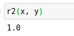
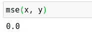
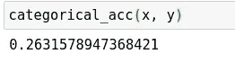
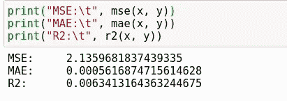

# 从头开始编写验证指标

> 原文：<https://towardsdatascience.com/writing-validation-metrics-from-scratch-e7d10af59f98?source=collection_archive---------40----------------------->

## 从头做起

## 查看各种验证指标，以及如何计算它们


(src =[https://pixabay.com/images/id-1044725/](https://pixabay.com/images/id-1044725/)

# 介绍

我们都经历过，你的模型完成了，你想测试它。您将测试数据放入模型中，然后得到一个预测作为回报。现在是时候验证您的模型了，并弄清楚您在创建模型方面做得如何。有几个验证指标可供选择，但是您如何知道选择哪一个来验证您的模型呢？此外，这些技术背后有哪些公式可以让我们更好地理解它们？今天，我想揭示有多少评估指标是实际计算出来的，然后再详细介绍一下它们的用法。希望下次你想检查一个模型的性能时，这些信息能派上用场！如果您想亲自查看这段代码的运行情况，也可以在笔记本中查看这段代码，网址为:

> [笔记本](https://github.com/emmettgb/Emmetts-DS-NoteBooks/blob/master/Python3/Validation%20metrics.ipynb)

# r

我想回顾的第一个指标是 r 指标。这是评估回归模型的一个非常流行的指标。该值以百分比的形式出现，该百分比通常用于衡量两个数组的相似性。当然，这仅适用于连续值，这种度量并不真正适用于分类目标。r 度规顾名思义，它实际上是 r 的平方。但是 r 从哪里开始呢？r 值用于表示皮尔逊相关系数。这是一种非常流行的推断方法，用于确定两个给定数组的相关程度。虽然它不用于假设检验，但它仍然可以用于机器学习的许多应用中。也就是说，我们需要首先计算相关系数，以获得决定的相关系数，或 r。为此，函数的输入将是两个数组:

```
def r(x, y):
```

我们需要做的第一件事是得到 n，对于那些没有统计学知识的人来说，n 是我们样本的大小。我们可以使用 Python 中的 len()方法来实现这一点:

```
n = len(x)
```

接下来，我们需要执行一些元素级的乘法来得到一个新的 xy 数组。在 Python 中这样做的最好方法是使用 Numpy.multiply()，所以我将在这个函数上面导入 Numpy，然后这样做:

```
import numpy as np
def r(x, y): n = len(x)
    xy = np.multiply(x, y)
```

现在我们需要得到一系列的总和，每个数组都有一个总和:x，y，xy。

```
Σxy, Σx, Σy = sum(xy), sum(x), sum(y)
```

接下来，我们需要获得更多的数组，x 和 y。

```
x2, y2 = np.power(x, 2), np.power(y, 2)
```

最后，我们得到这两者的和:

```
Σx2, Σy2 = sum(x2), sum(y2)
```

现在我们可以把这些代入一个公式来计算 r，公式是

(n *σ(x * y))-(σx *σy))/√(((nσx)-((σx)))*((n *σy)-((σy))

请注意，σx 和(σx)之间的公式表示有所不同。他们可能读的一样，

> 但它们并不相同。

一个是 x 的和，另一个是 x 的和，平方。这真的很难用文字表达。在一个例子中，σx，我们得到数组 x 的平方和。这是因为在运算顺序中，指数在求和之前。在另一个例子中，(σx)，我们首先对 x 求和，因为它在括号中，然后平方它。我真的希望这有意义！无论如何，把那个公式放进 Python 看起来像这样:

```
((n * sxy) - (sx * sy)) / (np.sqrt((((n * sx2)-(sx ^ 2)) * ((n * sy2)-(sy ^ 2)))))
```

> 等等！

我来自科学计算的世界，^的意思是指数。遗憾的是，Python 不是这样的，^在 Python 中是 xor 运算符。我们需要改用**。这是又一个例子，表明 Python 经常看起来不像论文，并且最初并没有打算成为一种科学语言。让我们来解决这个问题:

```
((n * Σxy) - (Σx * Σy)) / (np.sqrt((((n * Σx2)-(Σx ** 2)) * ((n * Σy2)-(Σy ** 2)))))
```

有了返回，现在我们的最终函数看起来像这样:

```
import numpy as np
def r(x, y):
    n = len(x)
    xy = np.multiply(x, y)
    Σxy, Σx, Σy = sum(xy), sum(x), sum(y)
    x2, y2 = np.power(x, 2), np.power(y, 2)
    Σx2, Σy2 = sum(x2), sum(y2)
    return(((n * Σxy) - (Σx * Σy)) / (np.sqrt((((n * Σx2)-(Σx ** 2)) * ((n * Σy2)-(Σy ** 2))))))
```

虽然我们可以写一个函数来做 r，并在那里计算所有这些，但把它写成一个单独的函数更有意义。我说过一次，我还要再说一次，更多的方法意味着更好的代码！如果你想了解更多关于我如何使用提取和命名方法来改进我的软件，我写了一整篇文章。这篇文章链接在另一篇文章中，我也将让您眼花缭乱，这篇文章提供了一些更好的重构方法来使您的代码更好:

[](/5-fabulous-refactoring-methods-for-prettier-code-e3bc3447c0b2) [## 更漂亮的代码的 5 个惊人的重构方法

towardsdatascience.com](/5-fabulous-refactoring-methods-for-prettier-code-e3bc3447c0b2) 

这篇文章是我最喜欢的文章之一，因为其中的技术非常简单，但是在提高代码的可读性、可伸缩性和可用性方面非常有效。继续，我们终于可以创建 r 函数了。在这个新函数中，我们需要做的就是将相关系数设为 2 的幂。

```
def r2(y, ŷ):
    return(r(y, ŷ) ** 2)
```

现在让我们用一组基本的数组来测试这个函数，它应该返回 100%的准确性:

```
x = [8, 7, 6, 5, 3, 0, 9]
y = x
r2(x, y)
```

> 是的，我有珍妮的号码。



# 平均绝对误差

平均绝对误差(MAE)是另一种用于测量连续目标精度的流行指标。这个算法与 r 的算法相差甚远，而且非常简单。MAE 是一个有点缺陷的度量，因为尽管它可以给我们一个模型准确性的好主意，它也需要一些关于连续值的方差的先验知识。我倾向于偏离这个标准，但它并不是完全无用的。这仍然是一个很好的指标，我可以推荐使用。我们可以使用 Numpy.subtract()方法来做元素减法，然后我们只需要得到这两个值的差的平均值:

```
def mae(y, ŷ):
    error = np.subtract(y, ŷ)
    return(np.mean(error))
```

现在让我们用珍妮的号码试试:

```
mae(x, y)
```


# 均方误差(mean square error)

均方误差(MSE)指标遵循平均绝对误差中概述的相同约定。然而，有了这个度量标准，我们最终会得到一个更准确的模型准确性状态的表示。正如您所料，该值用于连续应用程序，虽然它通常用于回归模型，但由于它在其他机器学习应用程序中的广泛使用，该指标非常突出。这可能是机器学习和神经网络估计误差的最常见的连续度量之一。计算该值的第一步是按元素减去两个数组，就像我们对 MAE 度量所做的那样:

```
def mse(y, ŷ):
    error = np.subtract(y, ŷ)
```

最后一步是得到这些值的平均值的平方。我们可以使用 np.power()方法像对 r 那样做。我经常把这与 np.exp()方法混淆，所以不要这样做。相信我，它们不是混合的好方法！这个常见错误的不好之处在于，文档并没有很好地解释这两者之间的区别，只有示例和公式符号可以让人们真正注意到这种区别。当然，这只是主观上让我感到困惑，尽管我听说过很多人把这两者混为一谈。我认为这是一个常见的错误，尤其是对于那些主要不属于 Python 编程语言的人来说，所以不要犯这个错误！

```
def mse(y, ŷ):
    error = np.subtract(y, ŷ)
    return(np.mean(np.power(error, 2)))
```



我知道我的 Jenny 的数字例子并不令人兴奋，但它表明这些指标是有效的，因为它们能够表明我们知道具有 100%准确性的东西。在我们完成最终的度量后，我们将使用不同的随机元素数组进行同样的尝试。

# 分类准确性

当然，并不是所有计算中的问题都是连续的。有时，您可能会使用一些分类特征。有一种可能是，您可能已经使用了算法来获得绝对的准确性，但却从未意识到这一点。为了保证分类的准确性，这些值需要完全相等。这偏离了连续精度，我们可以专注于数值空间中两个值的接近程度。

每当我写一个函数来获得这个精度时，我做的第一件事就是再次得到 n。然后，我将在函数范围内对变量进行初始化，这样我们就可以进行迭代循环:

```
def categorical_acc(y, ŷ):
    n = len(ŷ)
    score = 0
```

对于循环，我将使用 zip()迭代器来同时遍历我们的两个数组。如果您想阅读关于这个迭代器的更多细节，它的细微差别，以及如何使用它，您可以随意查看我的另一篇文章，在这篇文章中，我详细讨论了 zip ():

[](/everything-you-need-to-know-about-zip-in-python-5da1416f3626) [## 关于 Python 中的 Zip，您需要了解的一切

towardsdatascience.com](/everything-you-need-to-know-about-zip-in-python-5da1416f3626) 

无论如何，这里是循环。我们将检查每个列表中的值是否相等，如果相等，则增加分数:

```
for i, w in zip(ŷ, y):
        if i == w
            score += 1
```

最后，我们将分数除以 n，得到 n 的百分比，这将告诉我们与整个数组的长度相比，匹配值的百分比是多少。将它放入一个返回中，这是我们的最终结果:

```
def categorical_acc(y, ŷ):
    n = len(ŷ)
    score = 0
    for i, w in zip(ŷ, y):
        if i == w;
            score += 1
    return(score / n)
```

不幸的是，在这个例子中我们不能使用 Jenny 的数字，因为它是连续的，所以让我们使用 Numpy.random 模块生成两个数组:

```
x = [np.random.choice(["eggs", "bread", "ham"]) for c in range(1, 20)]
y = [np.random.choice(["eggs", "bread", "ham"]) for c in range(1, 20)]categorical_acc(x, y)
```



# 结论

正如我所承诺的，并且只是为了好玩，下面是应用于两个阵列的连续指标，它们不是 Jenny 的数字:

```
x = np.random.randn(50)
y = np.random.randn(50)**print("MSE:\t", mse(x, y))
print("MAE:\t", mae(x, y))
print("R2:\t", r2(x, y))**
```



这些指标在数据科学领域都非常有价值和有用。希望剖析它们并从头重新创建它们(在 NumPy 的帮助下)是一个很好的工具，有助于更好地理解度量标准及其工作方式。在大多数情况下，它们通常没有那么复杂，但肯定非常棒！感谢您的阅读，我希望这篇关于机器学习验证的文章读起来和写起来一样有趣！