# 用 Ray 编写您的第一个分布式 Python 应用程序

> 原文：<https://towardsdatascience.com/writing-your-first-distributed-python-application-with-ray-4248ebc07f41?source=collection_archive---------10----------------------->


Ray 让并行和分布式计算更像你所希望的那样工作

[Ray](https://docs.ray.io/en/master/) 是一个快速、简单的分布式执行框架，可以轻松扩展您的应用程序并利用最先进的机器学习库。使用 Ray，您可以将按顺序运行的 Python 代码转换成分布式应用程序，只需对代码进行最少的修改。

本教程的目标是探索以下内容:

*   为什么要用 Ray 并行化和分布
*   如何开始使用 Ray
*   分布式计算中的权衡(计算成本、内存、I/O 等)

# 为什么要用 Ray 并行化和分布式？

正如[之前的一篇文章指出的那样](/modern-parallel-and-distributed-python-a-quick-tutorial-on-ray-99f8d70369b8)，并行和分布式计算是现代应用的主要部分。问题是，获取现有的 Python 代码并试图并行化或分发它可能意味着重写现有的代码，有时是从头开始。此外，现代应用程序具有现有模块如[多处理](https://docs.python.org/3/library/multiprocessing.html)所缺乏的要求。这些要求包括:

*   在多台机器上运行相同的代码
*   构建具有状态并能通信的微服务和参与者
*   优雅地处理机器故障和抢占
*   大型对象和数字数据的高效处理

Ray 库满足了这些要求，并允许您在不重写应用程序的情况下扩展应用程序。为了使并行和分布式计算变得简单，Ray 采用函数和类，并将它们作为任务和参与者转换到分布式环境中。本教程的其余部分将探讨这些概念，以及在构建并行和分布式应用程序时需要考虑的一些重要事项。

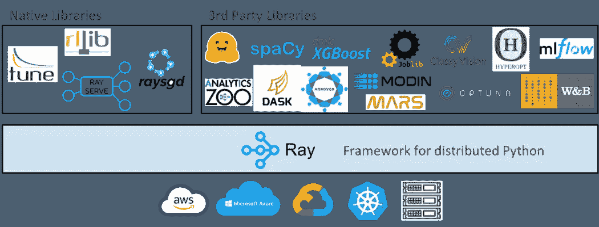

虽然本教程探索了 Ray 如何简化普通 Python 代码的并行化，但需要注意的是，Ray 及其生态系统也简化了对 [python 代码](https://www.anyscale.com/blog/parallelizing-python-code)以及现有库(如 [scikit-learn](https://medium.com/distributed-computing-with-ray/how-to-speed-up-scikit-learn-model-training-aaf17e2d1e1) 、 [XGBoost](https://www.anyscale.com/blog/distributed-xgboost-training-with-ray) 、 [LightGBM](https://www.anyscale.com/blog/introducing-distributed-lightgbm-training-with-ray) 、 [PyTorch](https://medium.com/pytorch/getting-started-with-distributed-machine-learning-with-pytorch-and-ray-fd83c98fdead) 等)的并行化。迈克尔·加拉尼克拍摄的图片。

# 如何开始使用 Ray

## 将 Python 函数转换为远程函数(Ray 任务)

可以通过 pip 安装 Ray。

```
pip install 'ray[default]'
```

让我们通过创建一个光线任务来开始我们的光线之旅。这可以通过用`@ray.remote`修饰一个普通的 Python 函数来实现。这将创建一个任务，可以跨笔记本电脑的 CPU 内核(或 Ray cluster)进行调度。

考虑下面两个生成斐波纳契数列的函数(整数数列的特征是前两个数字之后的每个数字都是前两个数字之和)。第一个是普通的 python 函数，第二个是 Ray 任务。

```
**import** os
**import** time
**import** ray

# Normal Python
**def** **fibonacci_local**(sequence_size):
    fibonacci = []
    **for** i **in** range(0, sequence_size):
        **if** i < 2:
            fibonacci.append(i)
            **continue**
        fibonacci.append(fibonacci[i-1]+fibonacci[i-2])
    **return** sequence_size

# Ray task
@ray.remote
**def** **fibonacci_distributed**(sequence_size):
    fibonacci = []
    **for** i **in** range(0, sequence_size):
        **if** i < 2:
            fibonacci.append(i)
            **continue**
        fibonacci.append(fibonacci[i-1]+fibonacci[i-2])
    **return** sequence_size
```

关于这两个函数，有一些事情需要注意。首先，除了`fibonacci_distributed`函数上的`@ray.remote`装饰器之外，它们是相同的。

第二个要注意的是小的返回值。它们返回的不是斐波那契数列本身，而是数列的大小，它是一个整数。这一点很重要，因为它可能会通过将分布式函数设计为需要或返回大量数据(参数)来降低其价值。工程师通常称之为分布式函数的输入/输出(IO)。

## 比较本地与远程性能

本节中的函数将允许我们比较本地和并行生成多个长 Fibonacci 序列需要多长时间。值得注意的是，下面的两个函数都利用了返回系统中 CPU 数量的`os.cpu_count()`。

```
os.cpu_count()
```

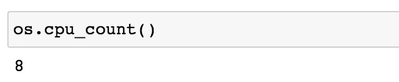

本教程中使用的机器有八个 CPU，这意味着下面的每个函数将生成 8 个斐波那契数列。

```
# Normal Python
**def** **run_local**(sequence_size):
    start_time = time.time()
    results = [fibonacci_local(sequence_size) **for** _ **in** range(os.cpu_count())]
    duration = time.time() - start_time
    print('Sequence size: {}, Local execution time: {}'.format(sequence_size, duration))

# Ray
**def** **run_remote**(sequence_size):
    # Starting Ray
    ray.init()
    start_time = time.time()
    results = ray.get([fibonacci_distributed.remote(sequence_size) **for** _ **in** range(os.cpu_count())])
    duration = time.time() - start_time
    print('Sequence size: {}, Remote execution time: {}'.format(sequence_size, duration))
```

在了解`run_local`和`run_remote`的代码如何工作之前，让我们运行这两个函数，看看在本地和远程生成多个 100000 的斐波那契数列需要多长时间。

```
run_local(100000)
run_remote(100000)
```

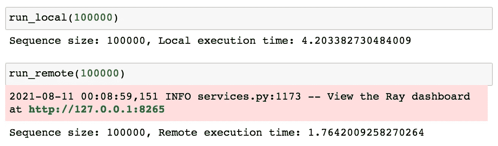

`run_remote`功能在多个 CPU 上并行执行计算，从而缩短了处理时间(1.76 秒对 4.20 秒)。

## 射线 API

为了更好地理解为什么`run_remote`更快，让我们简要回顾一下代码，并解释一下 Ray API 是如何工作的。

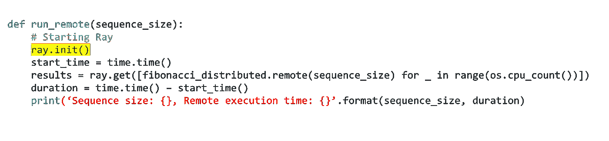

`ray.init()`命令启动所有相关的光线进程。默认情况下，Ray 为每个 CPU 内核创建一个工作进程。如果您想在一个集群上运行 Ray，您需要传递一个类似于`ray.init(address='insertAddressHere')`的集群地址。

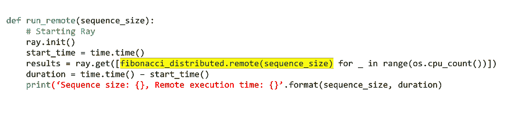

```
fibonacci_distributed.remote(100000)
```

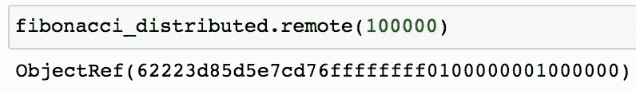

调用`fibonacci_distributed.remote(sequence_size)`立即返回一个未来，而不是函数的返回值。实际的功能执行将在后台进行。因为它立即返回，所以每个函数调用可以并行执行。这使得生成多个 100000 长的斐波那契数列花费的时间更少。

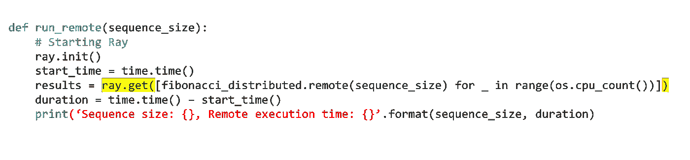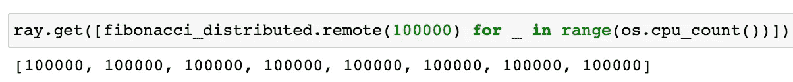

`ray.get`当任务完成时，从任务中检索结果值。

最后，需要注意的是，当调用`ray.init()`的进程终止时，Ray 运行时也会终止。注意，如果你尝试运行`ray.init()`不止一次，你可能会得到一个 RuntimeError(也许你不小心调用了 ray.init 两次？).这可以通过使用`ray.shutdown()`解决

```
# To explicitly stop or restart Ray, use the shutdown API
ray.shutdown()
```

## 射线仪表板

在您调用了`ray.init`函数之后，Ray 附带了一个可以在 http://127.0.0.1:8265 上找到的仪表板。

在[和](https://docs.ray.io/en/master/ray-dashboard.html#ray-dashboard)其他功能中，仪表盘可以让您:

*   了解光线内存利用率并调试内存错误。
*   查看每个参与者的资源使用情况、执行的任务、日志等。
*   查看集群指标。
*   杀死演员和侧写你的射线工作。
*   一目了然地查看错误和异常。
*   在单个窗格中查看多台计算机的日志。
*   参见[射线调](https://docs.ray.io/en/master/tune/index.html)工作岗位和试用信息。

下面的仪表板显示了运行`run_remote(200000)`后每个节点和每个工作人员的资源利用率。注意仪表板如何显示在每个工人中运行的函数 fibonacci_distributed。在分布式函数运行时观察它们是一个好主意。这样，如果您看到一个工人在做所有的工作，那么您可能没有正确地使用 ray.get 函数。此外，如果您看到您的总 CPU 利用率接近 100%，您可能做得太多了。

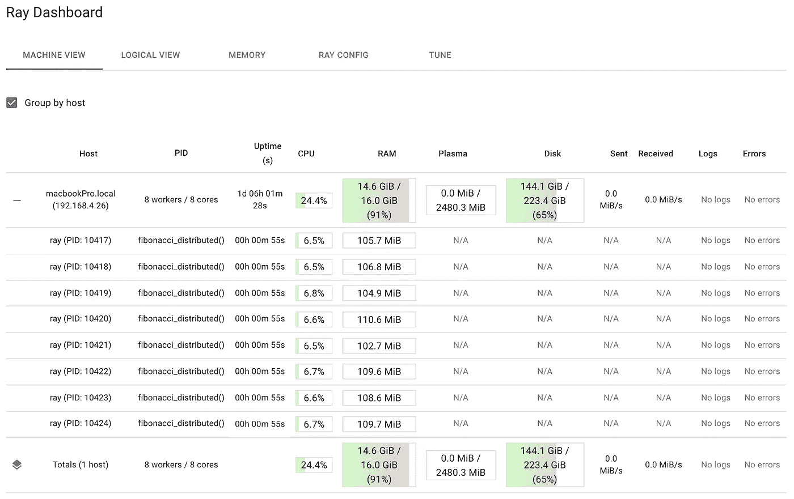

# 分布式计算中的权衡

本教程使用斐波那契数列，因为它们提供了几个调整计算和 IO 的选项。您可以通过增加和减少序列大小来改变每个函数调用所需的计算量。序列越大，生成序列所需的计算就越多，而序列越小，所需的计算就越少。如果你分配的计算量太小，那么 Ray 的开销将支配总的处理时间，并且你不会从分配我们的函数中得到任何价值。

分配功能时，IO 也是必不可少的。如果您修改这些函数来返回它们计算的序列，IO 将随着序列大小的增加而增加。在某种程度上，传输数据所需的时间将支配完成对分布式函数的多次调用所需的总时间。如果您将功能分布在一个集群上，这一点很重要。这需要使用网络，网络调用比本教程中使用的进程间通信开销更大。

因此，建议您尝试使用分布式斐波那契函数和局部斐波那契函数。尝试确定从远程功能中获益所需的最小序列大小。一旦你搞清楚了计算，试着看看 IO 对整体性能会有什么影响。无论您使用什么工具，分布式架构在不需要移动大量数据的情况下工作得最好。

幸运的是，Ray 的一个主要优点是能够远程维护整个对象。这有助于缓解 IO 问题。接下来让我们来看看。

# 作为参与者的远程对象

就像 Ray 将 Python 函数作为任务翻译到分布式设置一样，Ray 将 Python 类作为参与者翻译到分布式设置。Ray 提供了 actors，允许您并行化一个类的实例。就代码而言，您需要添加到 Python 类中的只是一个`@ray.remote`装饰器，使它成为一个参与者。当您创建该类的一个实例时，Ray 会创建一个新的 actor，它是一个在集群中运行并保存对象副本的进程。

因为它们是远程对象，所以它们可以保存数据，并且它们的方法可以操作这些数据。这有助于减少进程间的通信。如果您发现自己编写了太多返回数据的任务，而这些数据又被发送到其他任务，那么可以考虑使用 actor。

现在让我们看看下面的演员。

```
**from** collections **import** namedtuple
**import** csv
**import** tarfile
**import** time

**import** ray

@ray.remote
**class** **GSODActor**():

    **def** **__init__**(self, year, high_temp):
        self.high_temp = float(high_temp)
        self.high_temp_count = None
        self.rows = []
        self.stations = None
        self.year = year

    **def** **get_row_count**(self):
        **return** len(self.rows)

    **def** **get_high_temp_count**(self):
        **if** self.high_temp_count **is** None:
            filtered = [l **for** l **in** self.rows **if** float(l.TEMP) >= self.high_temp]
            self.high_temp_count = len(filtered)
        **return** self.high_temp_count

    **def** **get_station_count**(self):
        **return** len(self.stations)

    **def** **get_stations**(self):
        **return** self.stations

    **def** **get_high_temp_count**(self, stations):
        filtered_rows = [l **for** l **in** self.rows **if** float(l.TEMP) >= self.high_temp **and** l.STATION **in** stations]
        **return** len(filtered_rows)

    **def** **load_data**(self):
        file_name = self.year + '.tar.gz'
        row = namedtuple('Row', ('STATION', 'DATE', 'LATITUDE', 'LONGITUDE', 'ELEVATION', 'NAME', 'TEMP', 'TEMP_ATTRIBUTES', 'DEWP',
                                 'DEWP_ATTRIBUTES', 'SLP', 'SLP_ATTRIBUTES', 'STP', 'STP_ATTRIBUTES', 'VISIB', 'VISIB_ATTRIBUTES',
                                 'WDSP', 'WDSP_ATTRIBUTES', 'MXSPD', 
                                 'GUST', 'MAX', 'MAX_ATTRIBUTES', 'MIN', 'MIN_ATTRIBUTES', 'PRCP',
                                 'PRCP_ATTRIBUTES', 'SNDP', 'FRSHTT'))

        tar = tarfile.open(file_name, 'r:gz')
        **for** member **in** tar.getmembers():
            member_handle = tar.extractfile(member)
            byte_data = member_handle.read()
            decoded_string = byte_data.decode()
            lines = decoded_string.splitlines()
            reader = csv.reader(lines, delimiter=',')

            # Get all the rows in the member. Skip the header.
            _ = next(reader)
            file_rows = [row(*l) **for** l **in** reader]
            self.rows += file_rows

        self.stations = {l.STATION **for** l **in** self.rows}
```

上面的代码可用于加载和操作公共数据集中的数据，该数据集称为全球地表日摘要(GSOD)。该数据集由美国国家海洋和大气管理局(NOAA)管理，可以在他们的[网站](https://www.ncei.noaa.gov/data/global-summary-of-the-day/archive/)上免费获取。NOAA 目前维护着全世界 9，000 多个站点的数据，GSOD 数据集包含这些站点的每日汇总信息。从 1929 年到 2020 年，每年都有一个 gzip 文件。本教程只需要下载 [1980](https://www.ncei.noaa.gov/data/global-summary-of-the-day/archive/1980.tar.gz) 和 [2020](https://www.ncei.noaa.gov/data/global-summary-of-the-day/archive/2020.tar.gz) 的文件。

这个 actor 实验的目标是计算 1980 年和 2020 年有多少读数是 100 度或更高，并确定 2020 年是否比 1980 年有更多的极端温度。为了实现公平的比较，应该只考虑在 1980 年和 2020 年都存在的站。这个实验的逻辑是这样的:

*   加载 1980 年的数据。
*   加载 2020 年数据。
*   获取 1980 年存在的电台列表。
*   获取 2020 年存在的站点列表。
*   确定站点的交叉点。
*   获取 1980 年期间站点交叉点 100 度或更大的读数。
*   获取 2020 年期间站点交叉点 100 度或更大的读数。
*   打印结果。

问题是这个逻辑完全是顺序的；一件事只会接二连三地发生。有了 Ray，很多这种逻辑可以并行完成。

下表显示了一个更具并行性的逻辑。

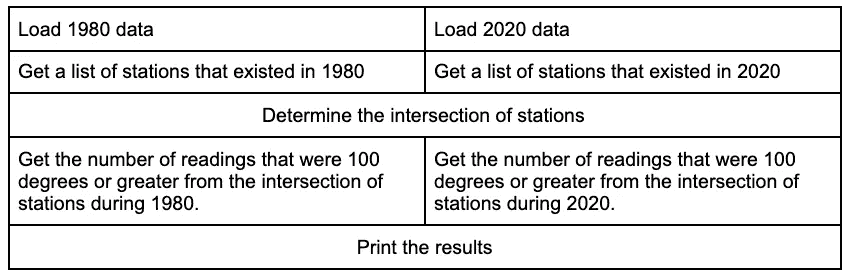

以这种方式写出逻辑是一种很好的方式，可以确保以并行的方式执行所有的事情。下面的代码实现了这个逻辑。

```
# Code assumes you have the 1980.tar.gz and 2020.tar.gz files in your current working directory.
**def** **compare_years**(year1, year2, high_temp):

    """if you know that you need fewer than the default number 
of workers, you can modify the num_cpus parameter"""
    ray.init(num_cpus=2)

    # Create actor processes
    gsod_y1 = GSODActor.remote(year1, high_temp)
    gsod_y2 = GSODActor.remote(year2, high_temp)

    ray.get([gsod_y1.load_data.remote(), gsod_y2.load_data.remote()])

    y1_stations, y2_stations = ray.get([gsod_y1.get_stations.remote(),
               	                    gsod_y2.get_stations.remote()])

    intersection = set.intersection(y1_stations, y2_stations)

    y1_count, y2_count = ray.get([gsod_y1.get_high_temp_count.remote(intersection),
                                  gsod_y2.get_high_temp_count.remote(intersection)])

    print('Number of stations in common: {}'.format(len(intersection)))
    print('{} - High temp count for common stations: {}'.format(year1, y1_count))
    print('{} - High temp count for common stations: {}'.format(year2, y2_count))

#Running the code below will output which year had more extreme temperatures
compare_years('1980', '2020', 100)
```

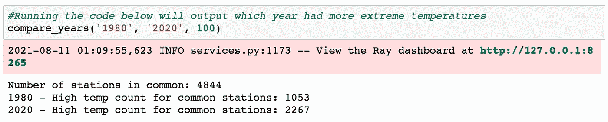

关于上面的代码，有几件重要的事情需要提及。首先，将`@ray.remote` decorator 放在类级别使得所有的类方法都可以被远程调用。第二，上面的代码利用了两个 actor 进程(`gsod_y1`和`gsod_y2`)，它们可以并行执行方法(尽管每个 actor 一次只能执行一个方法)。这使得能够同时加载和处理 1980 年和 2020 年的数据。

# 结论

Ray 是一个快速、简单的分布式执行框架，可以轻松扩展您的应用并利用最先进的机器学习库。本教程展示了如何使用 Ray 轻松地获取现有的顺序运行的 Python 代码，并通过最少的代码更改将其转换为分布式应用程序。虽然这里的实验都是在同一台机器上进行的， [Ray 还可以让你轻松地在每一个主要的云提供商上扩展你的 Python 代码](/how-to-scale-python-on-every-major-cloud-provider-5e5df3e88274)。如果你有兴趣了解更多关于 Ray 的信息，请在 GitHub 上查看 [Ray 项目，在 twitter](https://github.com/ray-project/ray) 上关注 [@raydistributed，并注册](https://twitter.com/raydistributed) [Ray 简讯](https://anyscale.us5.list-manage.com/subscribe?u=524b25758d03ad7ec4f64105f&id=d94e960a03)。

*原载于* [*Anyscale 的博客*](https://www.anyscale.com/blog/writing-your-first-distributed-python-application-with-ray) *。*